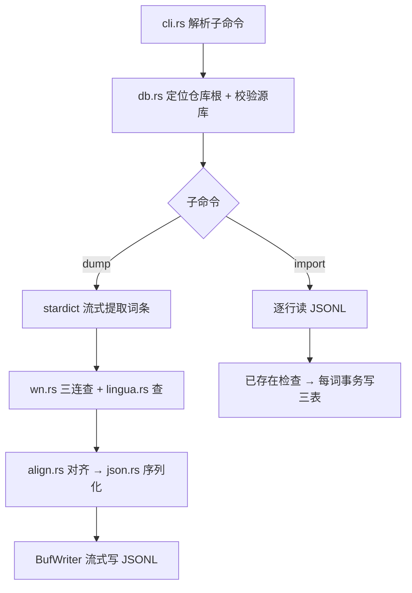

# ETL 词典导入生成器（Rust）设计

日期：2026-08-10
状态：已批准（用户确认修订版设计，含"删掉 WORDS 环境变量"）

## 1. 背景与目标

现有 `impl/app/flutter/temp_docs/import_stardict_words.sh`（bash + Python 内嵌）从 `ref/` 下三个 SQLite 词典库提取词条，生成 `import_words.sql`。其 Python 部分在 `--all` 全量模式下把 340 万 stardict 词条全部载入内存（字典 ~1.5GB），内存占用不可接受。

目标：用 Rust 重写，产出**中间数据文件（JSONL）**而非 SQL；内存常驻 **< 100MB**（流式处理）；删除 bash 脚本。

## 2. 需求

- **两个子命令**：`dump`（产出 JSONL）+ `import`（JSONL → contexta.db）
- **参数重新设计**：子命令化，删除 `WORDS` 环境变量（以 `--words` 覆盖）
- **输出为中间数据**：JSONL 每行一个完整单词对象，流式写盘
- **例句硬约束**：所有候选例句（lingua 中英对 + wn synset）必须包含目标词原形（`\b` 词边界 + 忽略大小写），不含的丢弃
- **样例保留**：每词最多 `--max-samples`（默认 10）条例句，跨义项分配，sense 0 优先中英对照
- **保守幂等**：import 时目标库已存在该词（`spelling_normalized` 匹配）→ 跳过，不删除、不覆盖

## 3. 架构

模块划分（`impl/etl/src/`）：

| 模块 | 职责 |
|---|---|
| `main.rs` | 入口：解析子命令并分发 |
| `cli.rs` | 子命令/参数解析（手写，不引 clap） |
| `db.rs` | 路径定位（仓库根上溯）、连接打开、目标库已存在词集合 |
| `stardict.rs` | stardict 词条流式提取（游标）与按词查询 |
| `wn.rs` | wn 三连查：senses / synset 例句 / IPA（prepared statement 复用） |
| `lingua.rs` | lingua 词查询（30 词整表 HashMap） |
| `align.rs` | 纯函数：义项对齐、词性归一化、例句分配（可单测） |
| `json.rs` | JSONL schema 定义与序列化 |
| `import.rs` | JSONL → 三表（word / word_sense / example_sentence） |
| `preview.rs` | 预览前 40 行（重读文件头） |

依赖：`rusqlite`（bundled）+ `regex` + `serde` / `serde_json`。

## 4. 数据流



## 5. 数据形态

### JSONL 行（每行一个完整单词对象）

```json
{"spelling_normalized":"ephemeral","spelling_display":"ephemeral","phonetic_ipa":"ɛˈfɛ.mə.ɹəl",
 "senses":[{"order_index":0,"part_of_speech":"adj.","chinese_meaning":"朝生暮死的…","english_definition":"lasting a very short time"},
           {"order_index":1,"part_of_speech":"n.","chinese_meaning":"暂时的","english_definition":"anything short-lived,…"}],
 "examples":[{"sense_idx":0,"order_index":1,"sentence_en":"the ephemeral joys of childhood","sentence_zh":"","is_primary":true}]}
```

- `examples[].sense_idx` 引用 `senses[i]`（import 时解析成 word_sense_id）
- `order_index` 义项内从 1 递增
- `is_primary`：sense 0 取中英对照例句为 1，其余为 0
- 字段与 drift 表 `word` / `word_sense` / `example_sentence` 对应（`spelling_normalized` / `spelling_display` / `phonetic_ipa`；`order_index` / `part_of_speech` / `chinese_meaning` / `english_definition`；`sentence_en` / `sentence_zh` / `is_primary`）

### 提取语义（与 bash 一致，唯一变化 = 输出格式）

- **词集合**：`--all` = stardict 全部词条（流式游标）；`--words`/`sample` 查 stardict 索引
- **义项对齐**：wn senses（entry_rank 序）为事实主，stardict.translation 按块 1:1 映射（块不足用块 0 兜底 → lingua.def_cn → 「（无中文释义）」）
- **词性归一化**：wn entries.pos（`a`/`j`→`adj.`、`n`→`n.`、`v`→`v.`，多缩写取前段），回退 stardict
- **音标**：wn IPA 优先，stardict.phonetic 回退，再空 NULL
- **例句硬约束（新）**：所有候选一律过含词过滤器，不过即弃
- **样例分配（新）**：每词 ≤ `--max-samples`（默认 10）条，跨义项——sense 0 优先 1 条中英对照（`is_primary=1`），其余 wn 含词例句按义项顺序补齐到上限，`order_index` 义项内从 1 递增

## 6. 内存策略（<100MB）

| 数据 | 策略 |
|---|---|
| stardict（851MB / 340 万行） | 流式游标逐行处理即弃，不物化 |
| wn（139MB / 23 万 forms） | 不预载，3 条 prepared statement 按词查（走 form_index） |
| lingua（30 行） | 整表 HashMap（可忽略） |
| 目标库已存在词 | 整表 HashSet（当前 ~15 行） |
| 输出 | BufWriter 逐块写盘；stderr 每 10k 词进度 |

## 7. import 语义

- rusqlite 直连目标库（不启 `journal_mode` 变更）
- 逐行读 JSONL；`spelling_normalized` 已存在 → 跳过
- 每词一个事务：word → word_sense → example_sentence
- 结束打印摘要（导入 N / 跳过 M / 失败 K）；行失败只回滚该词

## 8. CLI 一览

```bash
cargo run -- dump                       # 默认 3 词 → import_words.jsonl
cargo run -- dump --words "serendipity ephemeral"
cargo run -- dump --all                 # 全量 340 万词（流式）
cargo run -- dump --all --limit 1000    # 前 N 词
cargo run -- sample                     # 默认 3 个精选词，快速检查
cargo run -- sample --words "apple banana"
cargo run -- import <file>              # JSONL → contexta.db
cargo run -- import <file> --target-db <路径>
```

| 命令 | 参数 | 说明 |
|---|---|---|
| `dump` | `--all` / `--words "…"` / `--limit N` / `--max-samples N`（默认 10）/ `--output <路径>` | 生成 JSONL（默认 `temp_docs/import_words.jsonl`） |
| `sample` | 同 dump | 小规模测试版：默认 3 个精选词（serendipity ephemeral resilience） |
| `import` | `<文件>` + `--target-db <路径>`（默认 `assets/contexta.db`） | JSONL → 三表，保守幂等 |

## 9. 删除内容

- 删除 `temp_docs/import_stardict_words.sh`
- 删除旧产物 `temp_docs/import_words.sql`（gitignored，一并清理）
- 同步更新主题文档 `impl/app/flutter/docs/import_stardict_words.md`（改为描述 Rust 版 JSONL dump + import 流程）

## 10. 非目标

- 不做 `--apply`（由 `import` 命令承担）
- 不引 clap / tokio
- 不生成 SQL 文件
