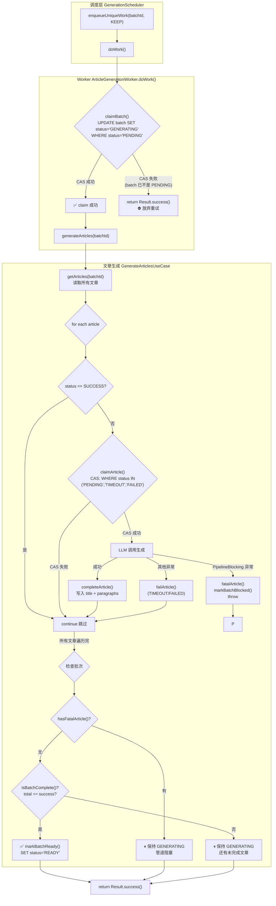
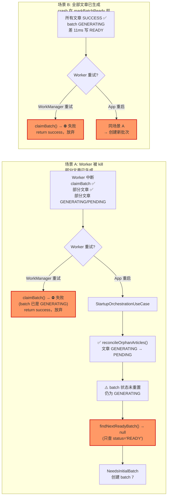

# 文章生成流程图

## 整体流程

## 中断场景分析

## 缺口总结

| 中断位置 | 文章状态 | 批次状态 | 恢复结果 |
|---------|----------|---------|---------|
| claim 后，生成中 | 部分 SUCCESS，部分 GENERATING | GENERATING | ⛔ 批次被废弃，文章白生成 |
| 全部生成完，未 markBatchReady | 全 SUCCESS | GENERATING | ⛔ 差一步 READY，批次被废弃 |

**当前逻辑不能解决中断重入**，原因是：

1. **claimBatch CAS 太严格** — 重试时 batch 已是 GENERATING，直接 return success 放弃
2. **reconcileOrphanArticles() 只重置文章** — 批次状态没重置回 PENDING
3. **生成逻辑没有"断点续传"** — 不支持已有的文章就不再生成了
