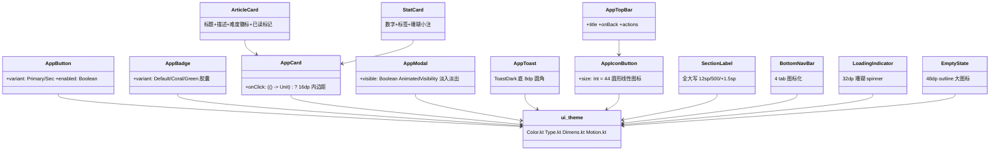
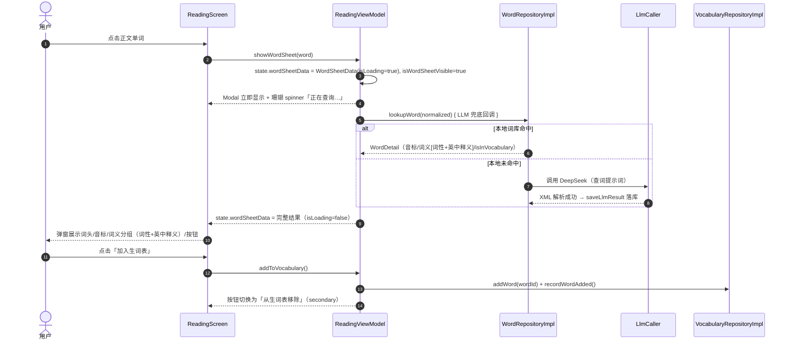
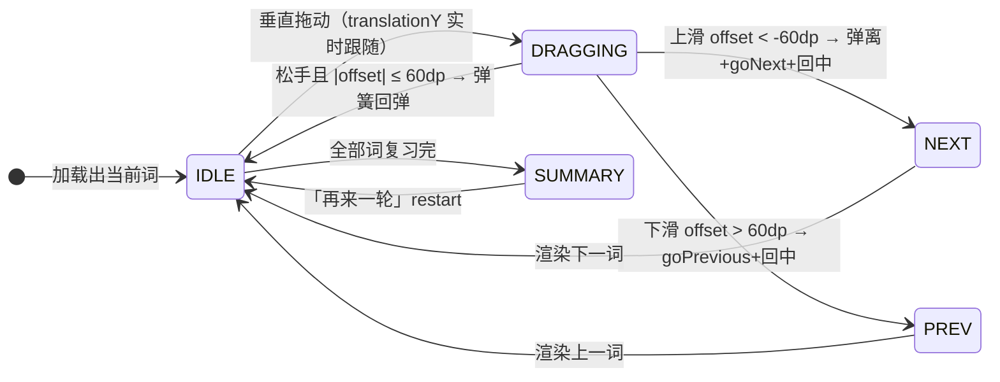

# UI 设计系统

> 主题文档：Contexta 的视觉语言与组件规范——设计 token、组件库、页面交互规范。
> 最后同步于：2026-08-01
> 设计来源：lingua 原型（warm-canvas editorial 风格，2026-07 UI 重构对齐）；**所有值以当前代码为准**（代码是系统真实完整的知识，本文档帮助人理解系统）。

---

## 一、主题概述

**设计语言定位**：**warm-canvas editorial**（暖色画布 · 编辑排版风）。暖米色画布底、珊瑚色单点强调、衬线标题 + 无衬线正文、克制留白——整体气质接近印刷刊物而非扁平化 App。

**核心答案**：全部视觉呈现由 `ui/theme/` 下四组 token（`Color.kt` / `Type.kt` / `Dimens.kt` / `Motion.kt`）+ `ui/components/` 下 9 个组件文件（13 个 composable）+ 7 个页面组合而成。页面只消费 token 与组件，不直接写死颜色/字号（个别页面级微调除外）。

**关键决策**：

1. **无深色模式**：`ContextaTheme` 只定义 `lightColorScheme`，不使用 `isSystemInDarkTheme`（与原型一致）。
2. **不打包字体文件**：Serif / Sans 均用系统字体族（`FontFamily.Serif` / `FontFamily.SansSerif`），依靠系统 fallback 链渲染 IPA 音标（详见 3.3）。
3. **层次靠色块深浅，不用阴影**：卡片底色（SurfaceCard）深于画布（Background）一级，1px Hairline 描边区分边界；阴影稀少。
4. **业务功能边界**：重构起初不引入业务功能；2026-08 已按需求补上「收藏文章」——阅读页顶栏星标收藏/取消 + 学习统计 tab 收藏列表（数据模型 `article.is_favorited`，详见 [收藏文章.md](收藏文章.md)）。功能新增时同步更新本决策。
5. **图标全站 outline 化**：引入 `material-icons-extended`，emoji 图标全部替换为 `Icons.Outlined` 线性图标；少数符号（✓ ✗ ← ▾ ℹ 🔥）仍作为**文字字符**保留在按钮文案与标签中。

---

## 二、设计语言（视觉原则）

| 原则 | 说明 | 落地方式 |
|------|------|---------|
| 暖色画布 | 全站底色为暖米色 `#FAF9F5`，任何卡片/弹窗都比画布深一级 | `Background` / `SurfaceSoft` / `SurfaceCard` / `SurfaceStrong` 四级色阶 |
| 珊瑚单点强调 | 珊瑚色只用于**可操作/当前态**：按钮、链接、进度条、选中态、音标 | `Primary` + `OnPrimary` |
| 衬线标题 400 不加粗 | display 级 serif 恒为 **weight 400，绝不加粗**（原型铁律），负字距；headline 级为 serif 500 | `displayLarge` / `displayMedium`（400）· `headlineLarge` / `headlineMedium`（500） |
| 无衬线正文 | 正文与标签用 sans，正文 400、标签 500 | `body*` / `title*` / `label*` |
| 克制留白 | 4dp 基数间距；卡片内边距 16dp；页面水平留白 20dp | `Spacing` / `Page` |
| 无阴影分层 | 层次由色块深浅承担，阴影极少（原型 `shadow(4.dp)` alpha≈0.04 级） | 代码中未使用 elevation 阴影 |
| 触控目标 ≥44dp | 返回按钮、图标按钮、stepper 均为 44dp；正文内辅助图标（发音）允许 36dp | 字面量 44.dp / 36.dp（`Page.MinTouchTarget` 为预留常量，未引用） |

---

## 三、设计 Token（数据线）

### 3.1 颜色（`ui/theme/Color.kt`）

全部 token 按分组列出（Compose token / 色值 / 用途）：

| 分组 | Compose Token | 色值 | 用途 |
|------|--------------|------|------|
| 品牌 | `Primary` | `#CC785C` | 珊瑚强调：主按钮、链接、进度条、选中态、音标 |
| 品牌 | `PrimaryPressed` | `#A9583E` | 按压态（深一档珊瑚） |
| 品牌 | `PrimaryDisabled` | `#E6DFD8` | 禁用态（与 Hairline 同值） |
| 画布与表面 | `Background` | `#FAF9F5` | 页面画布（暖米色） |
| 画布与表面 | `SurfaceSoft` | `#F5F0E8` | 提示块、例句块、分区底 |
| 画布与表面 | `SurfaceCard` | `#EFE9DE` | 卡片底（比画布深一级） |
| 画布与表面 | `SurfaceStrong` | `#E8E0D2` | 选中态底（radio-card 选中） |
| 画布与表面 | `Hairline` | `#E6DFD8` | 1px 边框、分隔线 |
| 画布与表面 | `HairlineSoft` | `#EBE6DF` | 极淡分隔线 |
| 文字 | `Ink` | `#141413` | 标题 + 主文字（暖近黑） |
| 文字 | `BodyStrong` | `#252523` | 强调段落（当前未直接使用） |
| 文字 | `BodyText` | `#3D3D3A` | 正文 |
| 文字 | `Muted` | `#6C6A64` | 次要文字 |
| 文字 | `MutedSoft` | `#8E8B82` | 说明、版权、返回按钮 |
| 文字 | `OnPrimary` | `#FFFFFF` | 主按钮文字（Primary 上的反色） |
| 语义 | `Amber` | `#E8A55A` | 收藏/书签态专用（已用于收藏文章星标） |
| 语义 | `Teal` | `#5DB8A6` | 次要强调（当前未直接使用） |
| 语义 | `Success` | `#5DB872` | 成功、已学会、认识标记 |
| 语义 | `Warning` | `#D4A017` | 警告（极少用） |
| 语义 | `Error` | `#C64545` | 错误 |
| 深色面 | `ToastDark` | `#181715` | Toast 深色背景 |
| 遮罩 | `Scrim` | `0x59231815` | `rgba(24,23,21,0.35)`，Modal 全屏遮罩 |

**Material3 映射**（`ui/theme/Theme.kt` 的 `ContextaLightColorScheme`，组件可直接用 `MaterialTheme.colorScheme.*`）：

| M3 槽位 | Token | M3 槽位 | Token |
|--------|-------|--------|-------|
| `primary` | Primary | `background` | Background |
| `onPrimary` | OnPrimary | `onBackground` | Ink |
| `primaryContainer` | SurfaceStrong | `surface` | SurfaceCard |
| `onPrimaryContainer` | Ink | `onSurface` | Ink |
| `secondary` | BodyText | `surfaceVariant` | SurfaceSoft |
| `onSecondary` | OnPrimary | `onSurfaceVariant` | BodyText |
| `secondaryContainer` | SurfaceSoft | `outline` | Hairline |
| `onSecondaryContainer` | Ink | `outlineVariant` | HairlineSoft |
| `tertiary` | MutedSoft | `error` | Error |
| `onTertiary` | OnPrimary | `onError` | OnPrimary |

**旧别名已删除**：重构前存在 `Accent` / `Surface` / `Foreground` / `Meta` 等旧色名别名（Task 15 已删），代码中不再出现，也不得再引用——颜色一律以本表 token 为准。

### 3.2 字体阶梯（`ui/theme/Type.kt`）

`ContextaTypography` 完整阶梯（Compose 键 / 字号 / 字重 / 行高 / 字距 / 字体族 / 用途）：

| Compose 键 | 字号 | 字重 | 行高 | 字距 | 字体族 | 用途 |
|-----------|------|------|------|------|--------|------|
| `displayLarge` | 36sp | 400 | 41sp | -0.5sp | Serif | 页面大标题（Onboarding logo） |
| `displayMedium` | 28sp | 400 | 34sp | -0.3sp | Serif | 页面标题（AppTopBar、Home 问候语、Onboarding 步骤标题、**Reading 正文顶部文章标题**） |
| `headlineLarge` | 22sp | 500 | 29sp | 0 | Serif | 卡片大标题（复习完成、AddWord 单词详情） |
| `headlineMedium` | 18sp | 500 | 25sp | 0 | Serif | 卡片标题（ArticleCard、StatCard 数字、Settings 弹窗标题） |
| `headlineSmall` | 16sp | 500 | 22sp | 0 | Sans | 列表标签、Stepper 数值 |
| `titleLarge` | 18sp | 500 | 25sp | 0 | Sans | 屏幕标题位（阶梯保留，当前页面未直接引用） |
| `titleMedium` | 16sp | 500 | 22sp | 0 | Sans | 列表项/标签（设置行、InlineTabs、DayGroup、radio-card） |
| `titleSmall` | 14sp | 500 | 20sp | 0 | Sans | 按钮文字（AppButton）、BottomNav 标签、语法卡片标题 |
| `bodyLarge` | 16sp | 400 | 25sp | 0 | Sans | 正文；**阅读正文特例**：`lineHeight = 27sp`（约 1.7 倍行高） |
| `bodyMedium` | 14sp | 400 | 22sp | 0 | Sans | 辅助正文（Toast、设置行描述、例句） |
| `bodySmall` | 13sp | 400 | 18sp | 0 | Sans | 说明、小字 |
| `labelLarge` | 14sp | 500 | 20sp | 0 | Sans | 弹窗按钮文字（Settings 弹窗）、AddWord 词性标签 |
| `labelMedium` | 13sp | 500 | 18sp | 0 | Sans | 徽标、语速胶囊、进度计数 |
| `labelSmall` | 12sp | 500 | 17sp | +1.5sp | Sans | 全大写分组标签（SectionLabel）、「已读」标记 |
| `PhoneticStyle`（独立常量） | 14sp | 400 | 22sp | 0 | 默认（无衬线 fallback） | 音标 IPA，颜色 `Primary`（珊瑚） |

**字体族策略**：`DisplayFontFamily = FontFamily.Serif`（展示/标题），`BodyFontFamily = FontFamily.SansSerif`（正文/标签）。不打包任何字体文件，全部走系统字体。展示级 serif 恒为 weight 400（原型铁律：**display serif 绝不加粗**）；页面内如需更强层级，用字号而非字重表达。

### 3.3 音标样式 PhoneticStyle 与等宽字体决策记录

`PhoneticStyle` 是独立于阶梯之外的 `TextStyle`：**默认无衬线（sans-serif）+ Primary 珊瑚色**，14sp / 400 / 行高 22sp。页面使用时按场景微调字号（复习卡片 15sp、查词弹窗与字母网格 13sp）。

> **决策记录：为什么不用等宽字体（Monospace）？**
> 原型与重构初期设计采用 Monospace 音标。2026-07 真机验证发现：部分厂商 ROM（如小米 HyperOS）的系统**等宽字体链缺少 IPA 字形块**，音标渲染为乱码/豆腐块。因不打包字体文件的约束，改为**依赖系统默认无衬线字体的 fallback 链**补齐 IPA 字形（与重构前行为一致），并把珊瑚色作为音标的品牌色保留下来。此决策在 `Type.kt` 中留有代码注释备查。

### 3.4 间距 / 圆角 / 页面 / 动效（`ui/theme/Dimens.kt`、`ui/theme/Motion.kt`）

**Spacing（4dp 基数）**：

| Token | 值 | 典型用途 |
|-------|-----|---------|
| `Spacing.Xxs` | 4dp | 微间距 |
| `Spacing.Xs` | 8dp | 元素间小间距 |
| `Spacing.Sm` | 12dp | 块内间距 |
| `Spacing.Md` | 16dp | 卡片内边距、页面元素间距 |
| `Spacing.Lg` | 24dp | 区块间距、Modal 内边距 |
| `Spacing.Xl` | 32dp | 大区块间距 |
| `Spacing.Xxl` | 48dp | 页面级留白 |

**Radius**：

| Token | 值 | 用途 |
|-------|-----|------|
| `Radius.Sm` | 8dp | 按钮、输入框、例句块、字母/音标网格格 |
| `Radius.Md` | 12dp | 卡片、复习单词卡 |
| `Radius.Lg` | 16dp | Modal 面板、Stepper 圆形按钮、Onboarding 选项卡 |
| `Radius.Pill` | 999dp | 徽章、胶囊（语速、译文模式、Streak） |

**Page（页面布局常量）**：

| Token | 值 | 用途 |
|-------|-----|------|
| `Page.HorizontalPadding` | 20dp | 预留——页面实际用字面量 20.dp |
| `Page.BottomPadding` | 96dp | 预留，当前未使用 |
| `Page.MinTouchTarget` | 44dp | 预留——实际触控目标为字面量 44.dp（辅助图标 36.dp） |

**Motion**：

| Token | 值 | 用途 |
|-------|-----|------|
| `Motion.FastMs` | 150ms | 预留常量——当前动画代码为字面量，未绑定（见下方「使用情况」） |
| `Motion.BaseMs` | 200ms | 预留常量——当前动画代码为字面量，未绑定 |
| `Motion.SlowMs` | 300ms | 预留常量——Modal 淡入淡出实际走 AnimatedVisibility 默认 fadeIn/fadeOut（tween 300ms），未绑定 |

> **使用情况**：以上四组尺寸/动效常量中，**`Radius` 被组件实际引用**（AppButton / AppBadge / AppCard / AppModal 的 `Radius.*`、VocabularyScreen 卡片）；**`Spacing` / `Page` / `Motion` 为预留常量，当前 `ui/` 代码未引用**——页面与组件均使用字面量（如 `16.dp`、`44.dp`、`20.dp`、滑动切卡 `tween(150)`）。Spacing 表「典型用途」列为设计意图，标注口径与 §3.2 `titleLarge` 一致。

---

## 四、组件库（`ui/components/`）

### 4.1 组件总览与依赖

9 个组件文件、13 个 composable：`AppButton`（含 `AppIconButton`）、`AppBadge`、`AppCard`、`AppModal`（含 `AppToast`）、`AppTopBar`（含 `SectionLabel`）、`ArticleCard`、`StatCard`、`BottomNavBar`、`LoadingIndicator`（含 `EmptyState`）。

依赖规则：**组件只依赖 `ui/theme` 的 token，组件之间除组合（ArticleCard/StatCard 基于 AppCard）与 AppTopBar 复用 AppIconButton 外互不依赖**；页面只消费组件与 token。

### 4.2 基础组件详规

| 组件 | 签名要点 | 视觉规格 |
|------|---------|---------|
| `AppButton` | `(text, onClick, modifier, variant = Primary, enabled = true)` | Primary = 珊瑚实心 + OnPrimary 文字；Secondary = SurfaceCard 底 + Ink 文字；禁用 = `PrimaryDisabled.copy(alpha = 0.4f)` 底 + `Ink.copy(alpha = 0.4f)` 文字；`Radius.Sm` 8dp 圆角；内边距 h20 v12（约 44dp 高）；文字 `titleSmall`。**按压反馈未实现**——代码只有 clickable + 背景/文字色切换，无 scale 动画（原型设计稿有 scale(0.98)，重构未落地） |
| `AppIconButton` | `(icon, contentDescription, onClick, modifier, size = 44, tint = onSurface)` | Material3 IconButton 包装，圆形触控目标 `size.dp`；默认 44dp，正文内辅助发音钮允许 36dp |
| `AppBadge` | `(text, variant = Default)` | `Radius.Pill` 胶囊；Default = SurfaceSoft 底 + Muted 字、Coral = Primary 底 + OnPrimary 字、Green = Success 底 + OnPrimary 字；文字 `labelMedium`；内边距 h8 v2 |
| `AppCard` | `(modifier, onClick = null, content: ColumnScope)` | SurfaceCard 底 + `Radius.Md` 12dp 圆角 + 16dp 内边距；`onClick != null` 时整卡可点 |
| `AppModal` | `(visible, onDismiss, modifier, alignment = Center, content)` | **无 `if(visible)` 守卫**——用 `AnimatedVisibility(visible)` 自带淡入淡出（fadeIn/fadeOut，默认 tween 300ms）；全屏 Scrim 遮罩（`Scrim`）点击即 onDismiss；Background 底、24dp 内边距；**内层 Column 消费点击**（`indication = null` 的 clickable），防点击面板空白区穿透触发关闭。**`alignment = Center`（默认，参考页弹窗）**：`widthIn(max = 360dp)` + 四角 `Radius.Lg` 16dp 圆角；**`alignment = BottomCenter`（底部弹层，查词弹窗）**：全宽 + 仅上两角 `Radius.Lg` 16dp 圆角（下角直角贴底）+ `heightIn(max = 75% 屏高)` |
| `AppToast` | `(text, modifier)` | ToastDark（`#181715`）底 + Background 色文字 + 8dp 圆角；内边距 h16 v10；文字 `bodyMedium`（预留组件，当前未接线——Reading 页仍用 Material3 Snackbar 原生样式） |
| `AppTopBar` | `(title, onBack = null, modifier, actions)` | Background 底、内边距 h12 v6；有 onBack 时左侧 44dp 返回钮（`ArrowBack`，tint MutedSoft）；标题 `displayMedium` 28sp serif 单行；右侧 `actions` 槽位 |
| `SectionLabel` | `(title, modifier)` | `title.uppercase()` + `labelSmall`（12sp/500/+1.5sp 字距）全大写 + MutedSoft 色；上下内边距 20dp/6dp |
| `LoadingIndicator` | `(message = "加载中…", modifier)` | 居中 32dp `CircularProgressIndicator`（Primary 珊瑚、strokeWidth 3dp）+ `bodyMedium` 文字 |
| `EmptyState` | `(icon = Inbox, message = "暂无内容", subMessage = "", modifier)` | 居中 48dp 线性图标（`colorScheme.outline` 色）+ `titleMedium` 标题 + 可选 `bodySmall` 副文案；32dp 内边距 |
| `BottomNavBar` | `(selectedTab: BottomNavTab, onTabSelected, modifier)` | 4 tab 图标化：Home（首页）/ Vocabulary（生词）/ Reference（参考）/ Settings（设置），图标 `Icons.Outlined.Home / MenuBook / AutoStories / Settings` 24dp；顶部 1dp Hairline 分隔线；surface 底、min 高 44dp；**选中 = Primary 珊瑚、未选中 = Muted**；标签 `titleSmall` |

**BottomNavTab 与路由**：`BottomNavTab` 枚举携带 route（对应 `Screen` 定义）与 label、icon，四个 tab 正好覆盖 Home / Vocabulary / Reference / Settings 四个一级路由；Reading / AddWord / Onboarding 为全屏页不在底栏。

### 4.3 组合组件

| 组件 | 构成 | 规格 |
|------|------|------|
| `ArticleCard` | 基于 AppCard | 标题 `headlineMedium`（serif 18sp）单行省略；描述 `bodyMedium` Muted 两行省略；难度徽标 `AppBadge`（**CET4 → Coral、CET6 → Green、其他 → Default**）+ 分类 `bodySmall` Muted；已读时右侧「✓ 已读」`labelSmall` MutedSoft |
| `StatCard` | 基于 AppCard | 居中数字 `headlineMedium`（serif 18sp）+ 标签 `bodySmall` onSurfaceVariant + 可选珊瑚小注 `labelSmall` Primary（如连续天数副文案） |

---

## 五、页面交互规范（业务线）

### 5.1 导航骨架

`NavGraph.kt`：`onboarding → home → reading/{articleId} → vocabulary → add_word → reference → settings`。四个一级页面（Home / Vocabulary / Reference / Settings）由 `BottomNavBar` 切换；Reading（全屏沉浸）、AddWord（返回键）不在底栏；Onboarding 完成后跳 Home 并清栈。

### 5.2 Reading 阅读页（`ui/reading/ReadingScreen.kt`）

布局自上而下：**滚动进度条 → 顶栏 → 正文（标题 + 段落 + 标记已读）→ 底部播放条**，查词弹窗悬浮其上。

1. **滚动进度条**：顶部 3dp 高、Primary 珊瑚、宽度 = `scrollFraction`（`derivedStateOf` 计算 `scrollValue / maxValue`），随滚动线性增宽。
2. **顶栏**：44dp 返回（MutedSoft）+ 已读只读标记「✓ 已读」（labelMedium MutedSoft，仅已读后显示；未读时此处空白）+ **收藏星标**（36dp：已收藏 `Icons.Filled.Star` Amber、未收藏 `Icons.Outlined.StarBorder` MutedSoft；点击 `toggleFavorite()` 收藏/取消，见 [收藏文章.md](收藏文章.md)）+ 最右**译文模式胶囊**（SurfaceCard 底 + 模式名 + ▾）。**标题不在顶栏**——在正文顶部（见 4）。发音/语速不在顶栏——在底部播放条（见 5）。
3. **译文模式（胶囊循环，顶栏最右）**：点击 `cycleTranslationMode()` 沿 `FULL → DIM → BLURRED → HIDDEN` 循环并持久化到设置。**4 种模式渲染差异**：
   - FULL：直接显示中文译文（bodyMedium MutedSoft）
   - DIM：`graphicsLayer(alpha = 0.55f)` 淡化
   - BLURRED：`blur(4dp)` 模糊，点击段落揭示，**10 秒后自动重新模糊**
   - HIDDEN：不渲染译文
4. **正文**（跟随滚动）：文章标题置顶——`displayMedium`（serif 28sp）Ink 色，下方 Hairline 1dp 分割线与正文区分；正文 16sp（bodyLarge）+ `lineHeight 27sp`（约 1.7 倍）；分词用 `LinkAnnotation.Clickable`（BasicText），点击词 → 查词 Modal；**生词高亮**：已在生词表的词加 `background = 0x2ECC785C`（珊瑚 18% 透明度底）。**正文末尾「标记已读」**（secondary 全宽，未读时显示）：点击 `markAsRead()` 置已读，按钮消失、顶栏出现「✓ 已读」；已读后正文末尾无按钮。**段落级内联播放按钮**：每段英文末尾 ` `（不换行空格）后跟 18dp 小图标，通过 `appendInlineContent` → `InlineTextContent(Placeholder(18.sp, 18.sp, Center))` 渲染在文本流内、随文本换行。默认 `VolumeUp` + `MutedSoft`（灰），该段播放中 `Stop` + `Primary`（珊瑚无背景）；点击 `playParagraph(index)`：空闲 → 朗读该段、置 `speakingParagraphIndex = index`；同段再点 → `ttsEngine.stop()` 停止（端到端：旧 utterance 的迟到回调被 `currentUtteranceId` 过滤不误清新状态）。
5. **底部播放条**（**固定底栏，始终可见**——位于滚动正文 `weight(1f)` 容器下方，不随正文滚动；音乐播放器样式）：圆形 44dp Primary 播放按钮（`PlayArrow` ▶ / `Stop` ■ 按状态切换）+「朗读全文 / 正在朗读…」文字（bodyMedium Medium，播放中变 Primary）+ **语速胶囊**（0.5x/1x 切换，激活 = Primary 底 OnPrimary 字，未激活 = SurfaceSoft 底 MutedSoft 字，6dp 圆角）。点击 `toggleFullArticlePlayback()`：空闲 → 朗读全文、置 `isSpeakingFullArticle = true`；播放中 → `ttsEngine.stop()` 复位。**播放状态复位**（基于 `currentUtteranceId` 校验）：TTS 自然播完 / 手动停止 / 段落或单词朗读打断时，`setOnSpeakingFinished` 回调携带 `utteranceId`；仅当 `utteranceId == currentUtteranceId` 时清空 `isSpeakingFullArticle` 和 `speakingParagraphIndex`——旧 utterance 的迟到回调（快速切换播放时）被过滤不误清。
6. **查词弹窗**（底部全宽 AppModal，`alignment = BottomCenter`）：右上 32dp X 关闭 → 词头 26sp serif + 发音钮 36dp 同行（词头左、发音钮右）→ 音标 13sp 珊瑚独占一行（无 maxLines，长音标自然折行）→ 加载态（20dp 珊瑚 spinner + 「正在查询…」）→ **词义分组**：按词性分组（组序 = 义项首次出现序，语境匹配义项优先；同词性义项合并为一组），每组 = 词性标签 `labelMedium` 珊瑚（仅组首显示一次）+ 英文解释 `bodySmall` Ink + 中文解释 `bodySmall` MutedSoft；内容超 75% 屏高时释义区滚动、按钮固定底部 → 全宽按钮：未加入 = 「加入生词表」（primary），已加入 = 「从生词表移除」（secondary）。**无例句、无独立中文释义行**（中文已在词义分组内）。
7. **阅读计时**：进入未读文章即启动 120s 纯计时（15s tick 累计 + 达标 `tryMarkReadCompleted`），与 4 种译文模式、手动标记已读互不影响。

查词交互时序：

### 5.3 Reference 基础参考页（`ui/reference/ReferenceScreen.kt`）

1. **InlineTabs**：字母表 / 音标 / 语法 三栏等宽（各 `weight(1f)`），**下划线式**——选中 tab `titleMedium` Medium 字重 + Primary 色 + 底部 2dp Primary 下划线；未选中 Normal 字重 + MutedSoft 无下划线。
2. **字母表（26 个）**：4 列网格（每行 4 格，末行空白格补齐），格子 SurfaceCard 底 + 8dp 圆角 + `titleMedium` 字符 + 13sp 珊瑚音标。
3. **音标（48 个，8 分类分组展示，数据不变）**：单元音(12) / 双元音(8) / 爆破音(6) / 摩擦音(10) / 破擦音(6) / 鼻辅音(3) / 舌侧音(1) / 半元音(2)；组标题 `SectionHeader` = 3dp 珊瑚竖条 + `titleSmall` SemiBold 珊瑚；组内 3 列网格（15sp 珊瑚音标 + 例词 + 全拼）。
4. **语法**：可折叠主题分组（时态 6 / 词形变化 6 / 功能词 5 / 句式 6，共 23 条，数据在 `ui/reference/GrammarData.kt`），组头 = 3dp 珊瑚竖条 + 组名（`titleSmall` SemiBold 珊瑚）+ 计数 + ▸/▾ 折叠指示，点击展开/收起（不互斥），首组默认展开；语法点卡片三部分——① 名称（Primary `titleSmall` SemiBold）② 解析（英文规则 Muted `bodySmall` + 中文说明 BodyText `bodySmall`）③ 例句（2dp 主色竖条引文 + 英文 Ink `bodySmall` + 中文 Muted `labelSmall`，**不可点击不发音**）。页顶无标题栏（AppTopBar 已移除）。
5. **字母/音标弹窗**（居中 AppModal）：**56sp serif 大字可点击**（`displayLarge.copy(fontSize = 56.sp)`，点击经顶层函数 `ownSoundFor(cell)`——字母格读字母名 `A`、音标格读自身拟音）——拟音由 `phonemeSoundMap` 提供（TTS 无法直接朗读 IPA，48 个音标各配一个可读文本，如 /iː/→`ee`、/b/→`buh`；映射缺失兜底读例词）+ 读音行——字母格子显示珊瑚音标（`PhoneticStyle` 15sp）、音标格子显示分类名（bodyMedium Muted）+ **例词行**：单词 `headlineSmall` Medium 珊瑚色**可点击发音**，中文释义拆下行 `labelSmall` Muted + 全宽「发音」按钮（经顶层函数 `speakTextFor(cell)` 生成文本——**字母格先读字母名再读例词**，如「A. Apple」（句号产生 TTS 自然停顿）；音标格仍只读例词）。

### 5.4 Vocabulary 生词复习页（`ui/vocabulary/VocabularyScreen.kt`）

1. **顶栏**：「生词复习」/「复习总结」切换；右侧「N 个词」计数 + 录入入口（`Add` 珊瑚图标 → AddWord）。
2. **进度点**：左侧「N / M」计数（labelMedium MutedSoft）+ 圆点行——**当前位 = 16dp 宽珊瑚 pill（6dp 高），已完成 = 6dp Muted 40% 透明度圆点，未到 = 6dp Hairline 圆点**；点数多时可横向滚动。
3. **五段式单词卡**（SurfaceCard 底、`Radius.Md`、24dp 内边距、内部可纵向滚动）：
   ① 单词 30sp serif（`headlineLarge.copy(30sp)`）+ 音标 15sp 珊瑚 + 发音钮 36dp
   ② 中文释义 `headlineMedium` + 英文释义列表 `bodyMedium` BodyText
   ③ 例句块：SurfaceSoft 底 8dp 圆角，英文 Ink + 中文 `bodySmall` Muted
   ④ 掌握进度：已认识 `reviewStreak`/`masteryThreshold` 次（`labelMedium` MutedSoft）
   ⑤ （卡片外底部）操作按钮：「✗ 不认识」secondary + 「✓ 认识了」primary（各 `weight(1f)`）
4. **上下滑动切卡**：整卡垂直拖动跟踪 `translationY`（`detectDragGestures` + `Animatable`）；**松手判定**——上滑超过 60dp 阈值 → 先弹离（tween 150ms 至 1.5 倍偏移）再 `goNext()` 并回中；下滑超过 60dp → `goPrevious()`；未达阈值 → `spring`（DampingRatioMediumBouncy）回弹。上滑 = 下一词，下滑 = 上一词。

5. **总结页**：`Celebration` 56dp Success 图标 + 「复习完成！」`headlineLarge` + AppCard 内两行统计（「复习单词」「新标记认识」，数字 `headlineMedium` 珊瑚）+ 全宽「再来一轮」。

### 5.5 Home 首页（`ui/home/HomeScreen.kt`）

1. **头部**：问候语 `displayMedium` 28sp serif + 日期 `bodyMedium` Muted + **Streak 胶囊**（SurfaceSoft 底 pill + `LocalFireDepartment` 16dp 珊瑚图标 + 「连续 N 天」`labelMedium` 珊瑚）。
2. **文章列表**：DayGroup 按日期分组——日期行 `titleMedium` + `ExpandMore`/`ExpandLess` 20dp Muted 图标折叠（默认展开，`AnimatedVisibility` 平滑收展）；组内文章用 `ArticleCard` 纵向 8dp 间隔。
3. **三态**：加载 = LoadingIndicator；生成中 = EmptyState（Settings 图标 + 「文章生成中」）；空 = EmptyState（MenuBook 图标 + 「暂无文章」）。

### 5.6 Settings 设置页（`ui/settings/SettingsScreen.kt`）

1. **InlineTabs 双 tab**：学习设置 / 学习统计 两栏等宽（各 `weight(1f)`），下划线式——选中 tab `titleMedium` Medium 字重 + Primary 色 + 底部 2dp Primary 下划线；未选中 Normal 字重 + MutedSoft 无下划线。页顶无标题栏（AppTopBar 已移除），无「关于」区块。
2. **Picker 行**（英文水平、译文默认模式）：`titleMedium` 标题 + `bodySmall` Muted 描述 + 当前值 + `ChevronRight` 20dp MutedSoft，点击弹 AlertDialog。
3. **Stepper 行**（每日文章数量、单词掌握阈值）：44dp 圆形 −/+ 按钮（SurfaceCard 底、16dp 圆角，禁用时 `SurfaceSoft.copy(alpha=0.3f)`）+ 数值 `headlineSmall` SemiBold。
4. **Toggle 行**（自动朗读）：Material3 Switch 定制——选中轨道 Primary / 拇指 OnPrimary，未选中轨道 SurfaceSoft / 拇指 Ink。
5. **统计区**（学习统计 tab）：StatCard 2×2（阅读文章 / 添加单词 / 累计学习天数 / 当前连续学习）+ **收藏的文章**区块：观察 `observeFavoritedArticles()`（收藏时间倒序），**两步式**——点击文章名行（`titleMedium` 单行省略 + `ExpandMore`/`ExpandLess` 20dp MutedSoft）展开 → 出现「打开」（`labelLarge` SemiBold Primary，`align(End)`）→ 点击经 `onArticleClick` 进阅读页；空态为普通文字提示「暂无收藏文章 / 在阅读文章时点击顶栏星标收藏」（不用 EmptyState 组件——其在滚动列中 `fillMaxSize` 布局异常）。
6. **弹窗三件套**（Material3 AlertDialog，`containerColor = SurfaceCard`、标题 Ink）：Picker（RadioButton 选中 Primary / 未选中 MutedSoft）、Info（「知道了」珊瑚按钮）、Confirm（「确认修改」珊瑚 / 「取消」Muted）。

### 5.7 AddWord 手动录入页（`ui/addword/AddWordScreen.kt`）

1. **输入卡**（AppCard）：标题「输入英文单词」`headlineMedium` + `OutlinedTextField`（8dp 圆角，**聚焦边框 Primary、未聚焦 Hairline**、容器 Background、placeholder MutedSoft「例如：serendipity」）+ 全宽「生成释义并加入生词库」按钮（`input 非空 && 非提交中` 才可用）+ 提示小字「本地词库没有该词时，将调用 AI 生成音标、释义与例句」。
2. **错误态**：校验失败 → `Error` 色文案；提交失败 → AppCard 错误卡（文案 + 全宽「重试」）；提交中 → LoadingIndicator（阶段消息）。
3. **结果卡**：加入状态徽标（`CheckCircle` Success 图标 + 「已加入生词库」Success 文字，或「•」Muted + 「该词已在生词库中」BodyText）+ 单词详情卡（22sp serif 词 + 珊瑚音标 + SenseBlock 列表——SurfaceSoft 底 10dp 圆角，词性 `labelLarge` 珊瑚 + 中文义 `titleSmall` SemiBold + 英文释义 `bodySmall` Muted + 例句对 `bodySmall`）+「再录一个」（primary）/「返回生词本」（secondary）。

### 5.8 Onboarding 引导页（`ui/onboarding/OnboardingScreen.kt`）

1. **布局**：Contexta logo `displayLarge` 36sp serif + 副标语 → 步骤内容 → 进度点 → 底部导航按钮。
2. **3 步流程**：① 英文水平（初级/中级/高级）② 每日篇数（1/3/5）③ 确认卡（SurfaceCard 底 12dp 圆角 + MenuBook 珊瑚图标 + 设置摘要）。
3. **radio-card 选项**：**选中 = 2dp Primary 边框 + SurfaceStrong 底**，未选中 = Hairline 边框 + SurfaceCard 底；28dp 线性图标（School / AutoStories / WorkspacePremium，选中珊瑚、未选中 MutedSoft）+ 22dp 圆形单选指示（选中内嵌 12dp 珊瑚实心）。
4. **ProgressDots**：8dp 高胶囊点——**激活 = 24dp 宽 Primary pill，完成 = Primary 40% 透明圆点，未到 = Hairline 圆点**。
5. **底部按钮**：「上一步」OutlinedButton（Ink 字）；「下一步/开始学习」primary Button（8dp 圆角，`containerColor = Primary`；**未选禁用**：`PrimaryDisabled.copy(alpha=0.5f)` 底 + MutedSoft 字）。已完成后自动跳 Home（`isAlreadyOnboarded()` 检查）。

---

## 六、状态与错误处理线

| 场景 | 表现 |
|------|------|
| 页面加载 | `LoadingIndicator`（32dp 珊瑚 spinner + 文案），AddWord 提交中带阶段消息 |
| 空数据 | `EmptyState`（48dp outline 图标 + 标题 + 可选副文案）：首页无文章/生成中、生词表为空、Reading 文章未找到（ErrorOutline 图标）；学习统计收藏列表为空 = 普通文字提示（滚动列中 EmptyState 布局异常） |
| 查词失败 | 查词弹窗降级展示：仅有词头，无释义，「加入生词表」按钮保留（降级路径 wordId 为空，点击无响应）；LLM 解析失败走 `Log.w` 静默兜底 |
| TTS 不可用 | Snackbar 提示「语音引擎未安装，请在系统设置中开启「文字转语音」功能」+ 自动拉起系统 TTS 设置页（`openTtsSettings`） |
| 表单校验 | AddWord 输入非法 → Error 色文案；Onboarding 未选 → 按钮禁用态（不是错误文案） |
| 状态反馈 | 已读标记（阅读页/文章卡「✓ 已读」）、加入生词表即时切换按钮态、复习总结页统计、Snackbar（阅读页 TTS 错误） |

---

## 七、与 lingua 原型的对齐与取舍

| 原型要点 | 采纳情况 | 落地/取舍说明 |
|---------|---------|--------------|
| warm-canvas 配色、珊瑚强调 | ✅ 全部采纳 | 色值对齐原型 `index.css`（见 3.1） |
| serif 400 展示标题 + 负字距 | ✅ 采纳 | Type.kt 阶梯，display 恒 400 不加粗 |
| 线性 outline 图标 | ✅ 采纳 | material-icons-extended；少量文字符号（✓ ✗ ← ▾ ℹ 🔥）保留为文案字符 |
| 音标 Monospace | ❌ 未采纳 | HyperOS 等宽字体链缺 IPA 字形 → 默认无衬线 fallback（决策记录见 3.3） |
| 查词 BottomSheet | ❌ 改为底部全宽弹层 | 全宽 AppModal（`alignment = BottomCenter`）+ 仅上角 16dp 圆角 + 75% 屏高上限 + Scrim + X 关闭 |
| 译文模式眼睛 popover | ❌ 未采纳 | 保留现有胶囊条循环切换（模式可见性最好、改动最小） |
| 阅读计时「120s 且滚动 >80%」 | ❌ 未采纳 | 保留纯 120s 计时（既有逻辑不变） |
| 收藏文章 | ✅ 已实现 | 阅读页顶栏星标收藏/取消（Amber），学习统计 tab 收藏列表（两步展开→打开），数据模型 `article.is_favorited`，见 [收藏文章.md](收藏文章.md) |
| Home 今日阅读卡 | ❌ 不加 | 避免为此新增数据查询 |
| 复习卡片内按钮 | ❌ 未采纳 | 保留底部「✗ 不认识 / ✓ 认识了」双按钮，样式对齐 AppButton |

---

## 八、文档与代码对照

| 内容 | 代码位置 |
|------|---------|
| 颜色 token | `ui/theme/Color.kt`、`ui/theme/Theme.kt`（M3 映射） |
| 字体阶梯 + PhoneticStyle | `ui/theme/Type.kt` |
| 间距/圆角/页面/动效 | `ui/theme/Dimens.kt`、`ui/theme/Motion.kt` |
| 组件库 | `ui/components/`（12 个文件） |
| 页面交互 | `ui/reading|reference|vocabulary|home|settings|addword|onboarding/` |
| 导航 | `navigation/NavGraph.kt`、`navigation/Screen.kt` |
