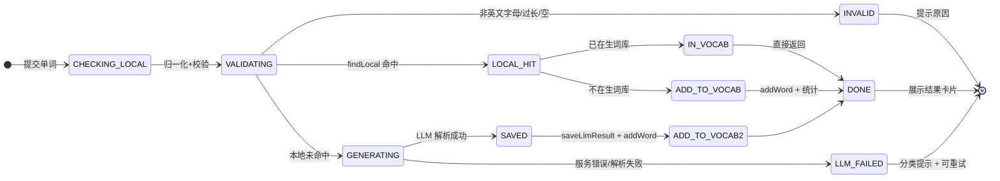
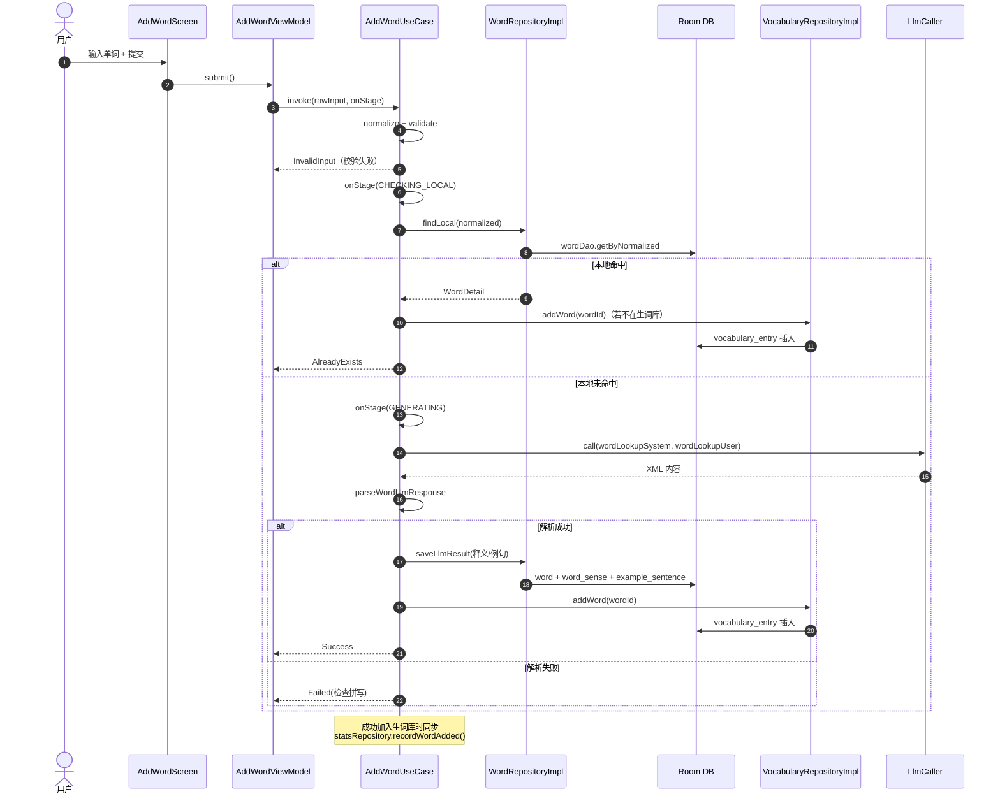
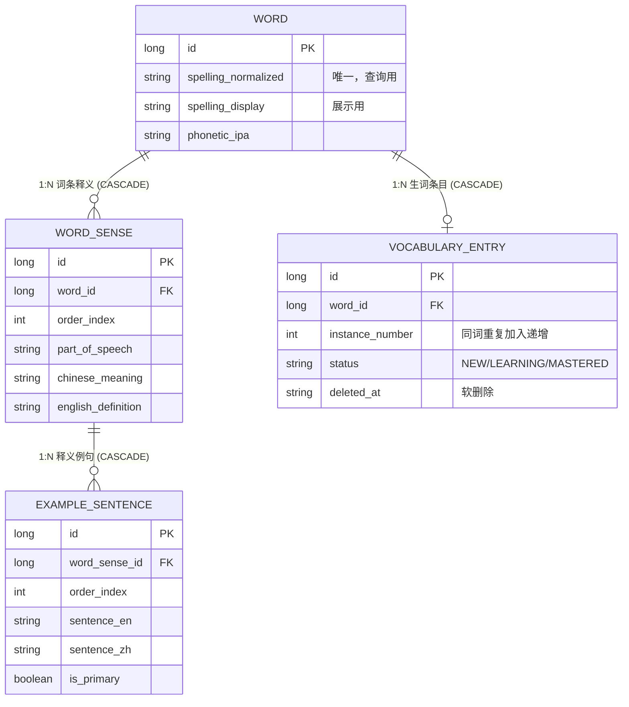

# 手动录入单词

> 主题文档：用户手动录入英文单词，加入词库与生词库；本地无词典，由 LLM 生成音标/释义/例句。
> 最后同步于：2026-08-01

---

## 一、主题概述

**要解决的问题**：用户读文章时发现的生词来自阅读查词，但有些词用户主动想学（如课程词汇、日常遇到的词），需要一条「主动录入」的路径。

**核心答案**：生词本页右上角「➕」→ 录入页输入英文单词 → 先查本地词库（LRU + Room，**不调 LLM**）→ 命中则复用已有释义；未命中则调用 LLM 生成（复用阅读页同一套查词提示词与解析器）→ 写入词库 + 加入生词库 → 展示结果卡片。

**关键设计**：
1. **本地优先，LLM 兜底**：本地词库检查不触发 LLM，避免重复付费与等待；仅新词才调用 LLM。
2. **零 schema 变更**：完全复用 `word` / `word_sense` / `example_sentence` / `vocabulary_entry` 四张表与 `WordRepository.saveLlmResult`、`VocabularyRepository.addWord` 两个既有写入路径。
3. **与阅读查词共用 LLM 契约**：同一系统提示词、用户提示词、XML 解析器，保证两种入口产出的数据形态完全一致。

---

## 二、业务线：录入流程

### 2.1 参与者

| 角色 | 类 | 职责 |
|------|-----|------|
| 入口 | `VocabularyScreen`（生词本头部「➕」） | 导航到录入页 |
| UI | `AddWordScreen` / `AddWordViewModel` | 输入、提交、阶段进度、结果展示 |
| 业务 | `AddWordUseCase` | 校验 → 本地查 → LLM 生成 → 入库 → 加生词库 → 统计 |
| 数据 | `WordRepository.findLocal` / `saveLlmResult` | 本地查询与 LLM 结果持久化 |
| 数据 | `VocabularyRepository.addWord` | 加入生词库（含 instance 递增） |
| 外部 | `LlmClient` | DeepSeek 调用（复用 `LlmCaller` 重试/超时/错误分类） |

### 2.2 状态机（UML 状态图）

录入动作一次提交的状态流：

### 2.3 校验规则

| 规则 | 说明 |
|------|------|
| 非空 | `normalize` 后为空白 → 拒绝 |
| 字符集 | 仅允许 `[A-Za-z]` 开头 + 字母/空格/连字符/撇号（支持 `ice cream`、`can't` 等） |
| 长度 | ≤ 50 字符 |
| 含字母 | 至少一个英文字母（防纯符号输入） |

`normalize` 复用 `WordRepository.normalize`（trim + lowercase + 去除首尾标点），保证与阅读查词同一套拼写归一化。

---

## 三、技术线：执行链与 LLM 复用

### 3.1 时序图

### 3.2 LLM 契约复用

| 项 | 值 | 说明 |
|----|----|------|
| 系统提示词 | `buildWordLookupSystemPrompt()` | 从 `prompts/word_lookup_system.txt` 加载，含内置兜底 |
| 用户提示词 | `buildWordLookupUserPrompt(word)` | 与阅读页查词完全一致 |
| 解析器 | `parseWordLlmResponse(content)` | 输出 `<spelling>/<phonetic>/<sense>/<example>` XML，失败返回 null |
| 错误分类 | `LlmErrorClassifier`（经 `LlmCaller`） | Recoverable 重试 3 次；LlmFatal / PipelineBlocking 直接抛出 |

**为什么复用而非新建提示词**：两种入口产出的是同一张 `word_sense` 表的数据。若提示词分叉，阅读查词与手动录入会对同一单词产生不同结构的数据，增加解析与展示复杂度。

### 3.3 与阅读查词的差异

| 维度 | 阅读查词（`lookupWord`） | 手动录入（`AddWordUseCase`） |
|------|-------------------------|------------------------------|
| 本地检查 | `lookupWord` 内部完成（命中直接返回） | `findLocal` 独立调用，**明确区分命中/未命中** |
| 未命中行为 | LLM 兜底并入库 | LLM 兜底并入库 + **加入生词库** |
| 已命中行为 | 仅展示 | 可顺手加入生词库 |
| 触发方 | 点击文章内单词 | 用户主动录入 |

---

## 四、数据线：复用的表与关系

### 4.1 ER 图（UML）

### 4.2 规则标注

| 条目 | 说明 | 规则引用 |
|------|------|---------|
| 录入**不新增表** | 复用 4 张既有表，写入路径 `saveLlmResult` + `addWord` | `db:REL` |
| `word.spelling_normalized` 唯一索引 | 同词不重复入库；`INSERT IGNORE` 后回查已有 ID | `db:INDEX` / `db:PK` |
| 生词条目重复加入 | `instance_number` 递增，形成多条生词记录 | `db:TYPE`（关系实体） |
| 词库命中的词再入生词库 | 只加 `vocabulary_entry`，不重复插 `word` | `db:NF`（避免冗余） |
| 统计 | 成功加入生词库时 `recordWordAdded()`，与阅读页加词一致 | — |

---

## 五、错误处理线

| 场景 | 用户提示 | 映射来源 |
|------|---------|---------|
| 输入非法 | 「只能输入英文字母、空格、连字符和撇号」等 | `AddWordUseCase.validate` |
| LLM 服务级错误 | 「AI 服务暂不可用（…），请稍后重试」 | `LlmFatalException` |
| 网络重试耗尽 | 「网络不稳定，AI 多次重试后仍未成功」 | `LlmRecoverableExhaustedException` |
| 结构性阻塞 | 「系统暂时无法生成单词信息，请稍后重试」 | `PipelineBlockingException` |
| LLM 返回无法解析 | 「AI 未能识别该单词的释义，请检查拼写后重试」 | `parseWordLlmResponse == null` |
| 其他异常 | 「录入失败，请稍后重试」 | 兜底 catch |

错误后输入保留，可直接点「重试」再次提交；LLM 只在**本地未命中**时调用，重复提交不浪费 token。

---

## 六、关键设计决策清单

| # | 决策 | 理由 |
|---|------|------|
| 1 | 新增 `WordRepository.findLocal`（仅缓存+DB，不调 LLM） | 复用 `lookupWord` 会隐式触发 LLM 兜底，无法表达「命中即复用、不重复生成」 |
| 2 | 复用阅读查词提示词/解析器 | 同一数据契约，两种入口产出结构一致 |
| 3 | 录入页为独立路由 `add_word`（非底部 tab） | 聚焦单一任务；底部导航仅保留 4 个主 tab |
| 4 | 入口放生词本头部「➕」 | 语义最贴近「加入生词库」，用户路径最短 |
| 5 | 错误三分类复用文章生成管道体系 | 与全系统错误处理一致，运维/排查同语言 |
