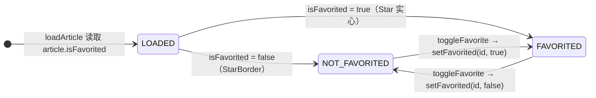
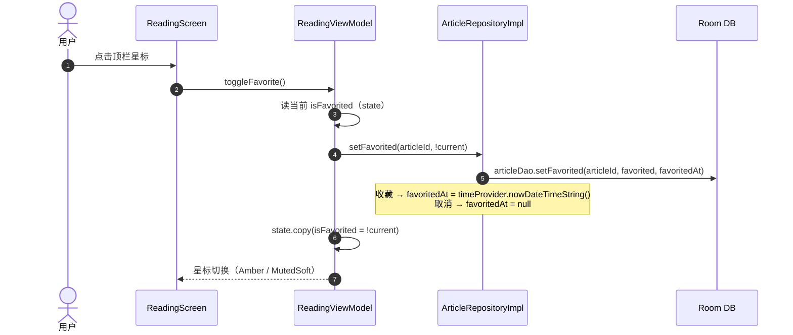
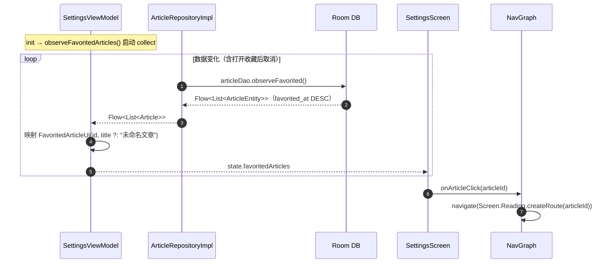
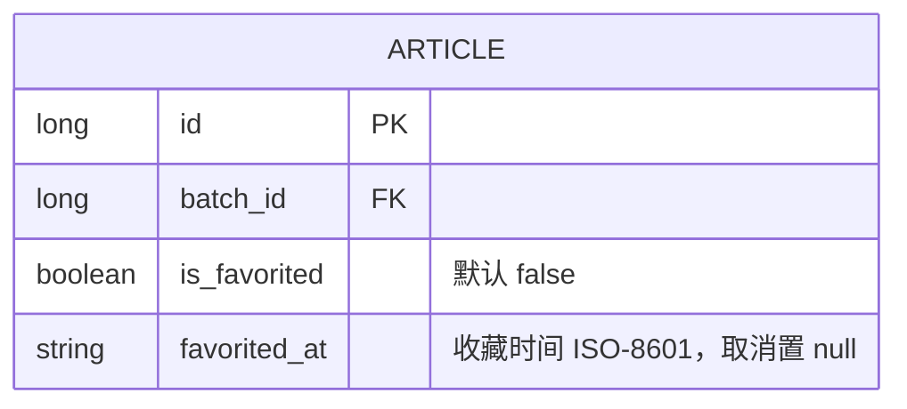

# 收藏文章

> 主题文档：用户在阅读页收藏/取消收藏文章，收藏列表在学习统计（设置→学习统计 tab）中两步式打开。
> 最后同步于：2026-08-01

---

## 一、主题概述

**要解决的问题**：读过的文章想留存方便回头复习，但没有「收藏」能力——需要一条把文章"钉住"的路径，并在统计页集中访问。

**核心答案**：`article` 表加两列 `is_favorited` + `favorited_at`（文章是长期实体，收藏是其生命周期属性，单用户本地 App 无需单独关系表）。**收藏入口只在阅读页顶栏星标**（首页卡片不加）；收藏列表在「设置 → 学习统计」tab 展示，**两步式**——点击文章名展开 → 出现「打开」→ 进入阅读页。

**关键设计**：
1. **入口单一**：阅读页顶栏星标（已收藏 `Icons.Filled.Star` Amber / 未收藏 `Icons.Outlined.StarBorder` MutedSoft，36dp）。阅读是"认识文章"的自然时机，首页卡片不加，避免卡片点击与收藏点击的嵌套冲突。
2. **数据落 `article` 表**：两列即可表达，无需新表；`observeFavorited()` 按 `favorited_at DESC` 排序，最新收藏在前。
3. **DB v1→v2 破坏性重建**：开发期 `fallbackToDestructiveMigration`，加列 = 递增 version 触发重建（既有策略，见 [ARCHITECTURE.md](ARCHITECTURE.md)）。

---

## 二、业务线：收藏与回顾流程

### 2.1 参与者

| 角色 | 类 | 职责 |
|------|-----|------|
| 收藏入口 | `ReadingScreen`（顶栏 `ReadingAppBar` 星标） | 点按收藏/取消 |
| UI | `ReadingViewModel` | 读文章时同步 `isFavorited` 态；`toggleFavorite()` 切换并持久化 |
| 回顾入口 | `SettingsScreen`（学习统计 tab） | 收藏列表两步式展开 → 打开 |
| UI | `SettingsViewModel` | 观察 `observeFavoritedArticles()` 汇入 `SettingsUiState.favoritedArticles` |
| 导航 | `NavGraph.kt` | `SettingsScreen(onArticleClick) → Reading` |
| 数据 | `ArticleRepository.observeFavoritedArticles` / `setFavorited` | 查询与写库 |

### 2.2 收藏状态机（UML 状态图）

阅读页星标一次点按的状态流：

### 2.3 学习统计回顾交互

1. 收藏列表从 `observeFavoritedArticles()` 实时观察（Room flow 自动重发）。
2. **两步式**：点文章名行 → 展开（`ExpandMore`→`ExpandLess`）→ 出现「打开」→ 点击经 `onArticleClick(articleId)` 进阅读页。
3. 空态为普通文字提示「暂无收藏文章 / 在阅读文章时点击顶栏星标收藏」（不用 `EmptyState` 组件——其在滚动列中 `fillMaxSize` 布局异常）。

---

## 三、技术线：调用链

### 3.1 收藏（阅读页）时序图

### 3.2 收藏列表（学习统计）时序图

### 3.3 关键调用点

| 层 | 文件 | 方法 |
|----|------|------|
| DAO | `ArticleDao` | `observeFavorited()` / `setFavorited(articleId, favorited, favoritedAt)` |
| 领域模型 | `Article` | `isFavorited` / `favoritedAt`（带默认值，既有调用点不受影响） |
| Repository 接口 | `ArticleRepository` | `observeFavoritedArticles(): Flow<List<Article>>` / `suspend setFavorited(id, favorited)` |
| 实现 | `ArticleRepositoryImpl` | 两个方法 + `ArticleEntity.toModel()` 映射补字段 |
| Reading VM | `ReadingViewModel` | `loadArticle` 读 `isFavorited`；`toggleFavorite()` 持久化 + 本地更新 |
| Settings VM | `SettingsViewModel` | `observeFavoritedArticles()` collector 写入 `SettingsUiState` |

**`loadSettings()` 为何改用 `copy()` 写回**：`SettingsViewModel.init` 同时跑 `loadSettings()`（整体替换 `SettingsUiState(...)`）与收藏 collector（`copy` 写 `favoritedArticles`）。若 `loadSettings` 仍整体替换，会冲掉已 collect 的收藏列表——改为 `copy()` 后两个写线程互不覆盖。

---

## 四、数据线：article 表新增列

### 4.1 ER 图（UML，局部）

### 4.2 规则标注

| 条目 | 说明 | 规则引用 |
|------|------|---------|
| 不加新表 | 收藏是文章属性，单用户本地 App 用两列表达最简 | `db:REL` / `db:NF` |
| `is_favorited` 布尔命名 | 符合 `is_xxx` 约定 | `db:NAME` |
| 不建索引 | 低频查询、开发期小表；只给高频查询列建索引 | `db:INDEX` |
| 时间用 ISO-8601 字符串 | 与全库一致（`TimeProvider.nowDateTimeString()`）；同设备时区下字典序 = 时间序 | — |
| DB v1→v2 | 开发期 `fallbackToDestructiveMigration` 重建，不写 Migration | `db:MIGRATION` |

---

## 五、错误处理线

| 场景 | 表现 |
|------|------|
| 文章标题为空 | 列表回退显示「未命名文章」（`ArticleEntity.title` 可空，生成失败时为空） |
| 收藏列表为空 | 空态普通文字提示 |
| 打开失败 | 复用 Reading 页既有错误态（`state.error` → `EmptyState`「文章未找到」） |
| DB 变更 | v1→v2 破坏性重建清空开发数据（既定策略） |

---

## 六、关键设计决策清单

| # | 决策 | 理由 |
|---|------|------|
| 1 | 收藏入口只在阅读页顶栏，首页卡片不加 | 阅读是认识文章的自然时机；首页卡片加星标引入嵌套点击与卡片高度膨胀 |
| 2 | 数据落 `article` 表两列而非新关系表 | 单用户本地 App 无多用户/多标签需求，最简；`is_xxx` 布尔符合命名规范 |
| 3 | 收藏列表合并进 `SettingsUiState`，不另开 StateFlow | 页面单一 state 源；需把 `loadSettings()` 改为 `copy()` 写回避免竞态 |
| 4 | 星标 36dp（非默认 44dp） | 顶栏辅助图标；44dp 会撑高顶栏（设计系统允许正文辅助图标 36dp） |
| 5 | 列表两步式（展开→打开） | 满足「点开文章名再点开文章」的交互预期；单行 `titleMedium` 省略号不换行 |
