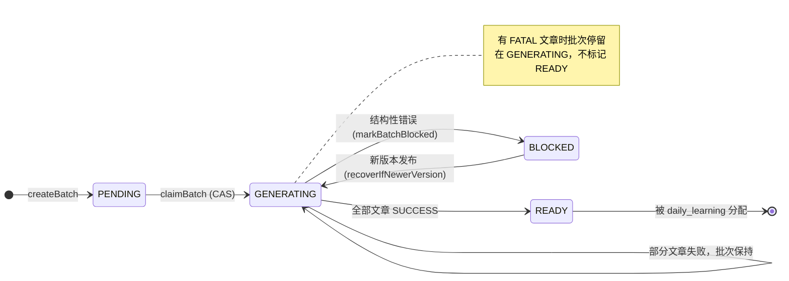
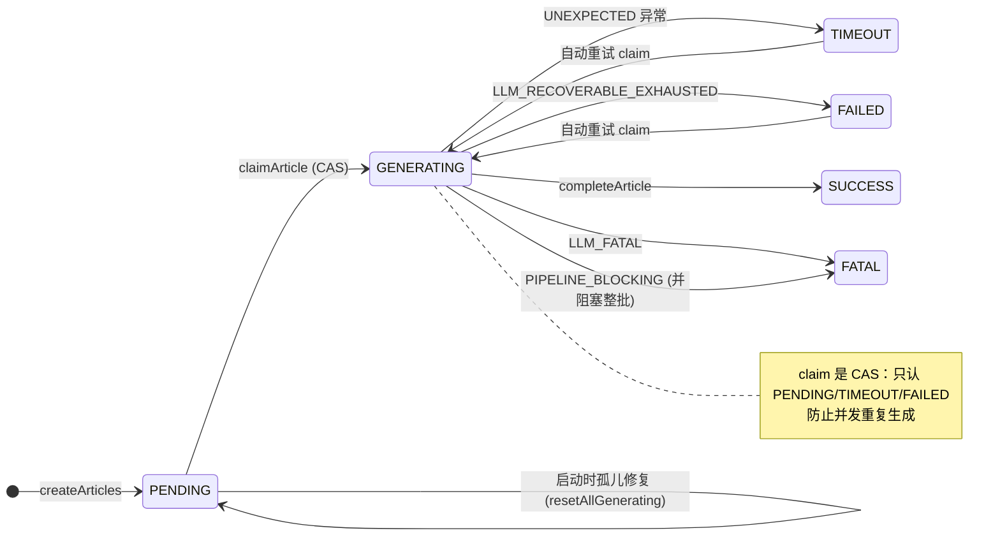
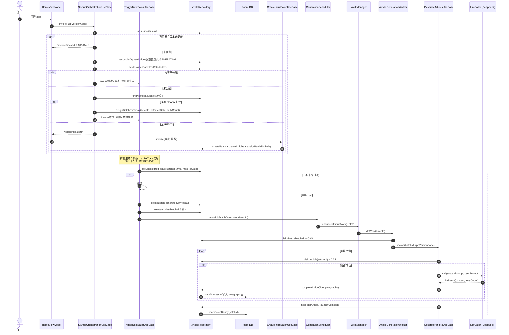
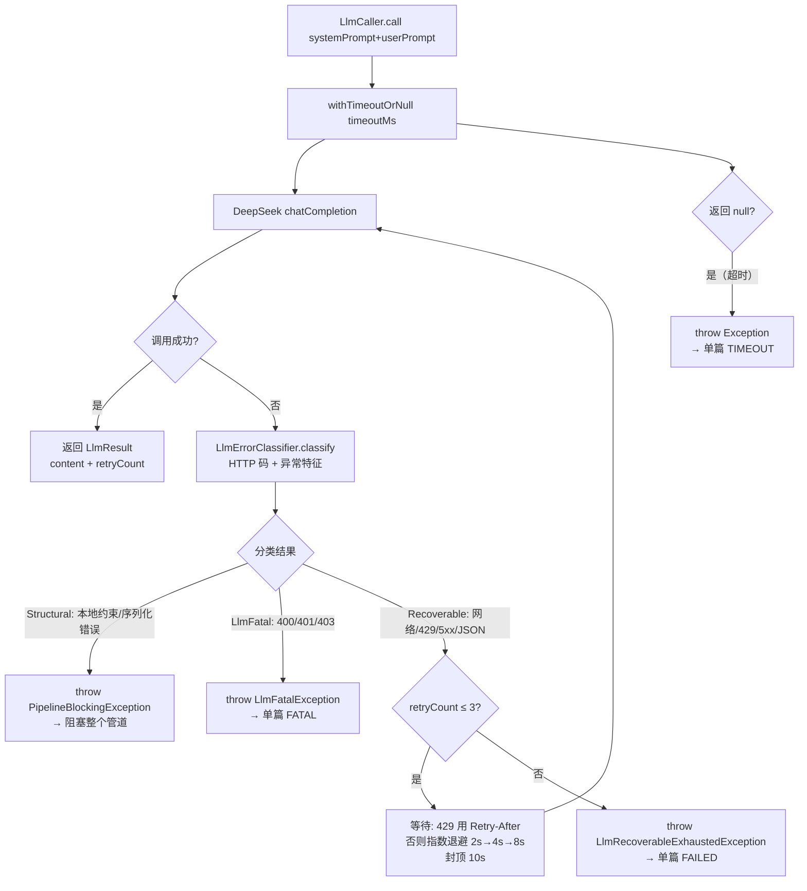
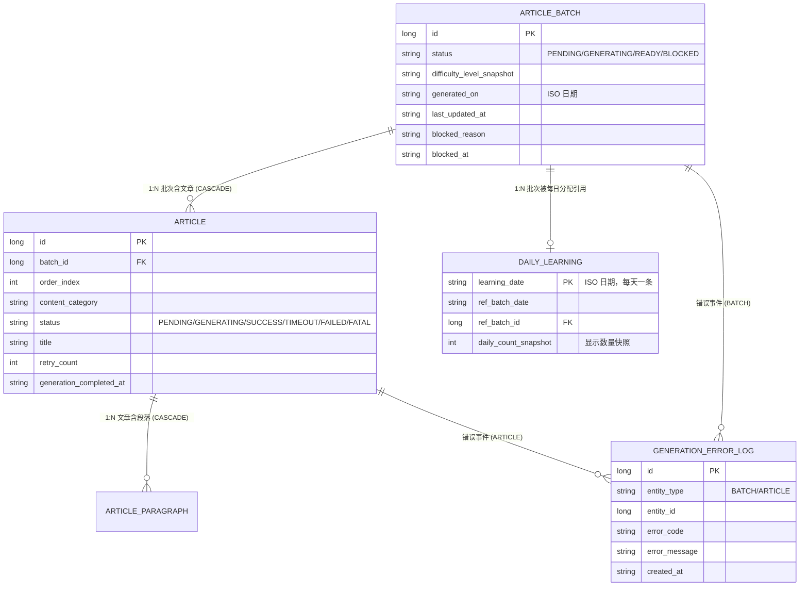

# 文章生成

> 主题文档：文章生成管道 —— 从「用户打开 app」到「文章可读」的全过程。
> 最后同步于：2026-07-31

---

## 一、主题概述

文章生成管道回答一个问题：**用户每天要读的文章从哪里来？**

核心答案：**前置生成** —— 用户今天读的批次是昨天（甚至更早）生成的；系统时刻保证「明天也有 READY 批次可分配」。用户永远只消费 `READY` 批次，生成动作发生在后台，与阅读完全解耦。

两条贯穿全管道的关键设计：

1. **生成数量与显示数量分离**：每批固定生成 5 篇文章（`MAX_ARTICLES_PER_BATCH`），用户选择的每日篇数（1~5）只写入 `daily_learning.daily_count_snapshot`，控制**显示**数量，不影响生成。
2. **状态与事件分离**：实体的 `status` 只表达"现在在哪一步"；错误详情是事件，追加进 `generation_error_log` 流水账（详见第五章）。

---

## 二、业务线：管道的生命周期

### 2.1 参与者

| 角色 | 类 | 职责 |
|------|-----|------|
| 启动编排 | `StartupOrchestrationUseCase` | app 每次打开的入口：检查阻塞、修孤儿、分配今日批次、按需触发前置生成 |
| 初始批次 | `CreateInitialBatchUseCase` | 无任何可用批次时（首次使用）：创建批次并立即分配给今天 |
| 种子激活 | `ActivateSeedBatchUseCase` | onboarding 完成时：把安装时写入的种子 READY 批次立即分配给今天，避免首页闪烁 |
| 前置生成 | `TriggerNextBatchUseCase` | 确保「已分配批次之后」还有未分配的 READY 批次；没有则创建并调度生成 |
| 生成执行 | `ArticleGenerationWorker` → `GenerateArticlesUseCase` | 后台逐篇调 LLM 生成文章 |
| 调度 | `GenerationScheduler` | WorkManager 封装：uniqueWork + KEEP 防重复 |
| 数据 | `ArticleRepository` / DAO | 批次、文章、分配记录的读写 |

### 2.2 触发入口与业务流转

```
┌─ 触发 1：每次启动 ──────────────┐
│ StartupOrchestrationUseCase    │──→ 有 READY 批次？──→ 分配今天 + 前置生成
│                                │──→ 无 → NeedsInitialBatch ──→ CreateInitialBatch
└────────────────────────────────┘
┌─ 触发 2：onboarding 完成 ───────┐
│ ActivateSeedBatchUseCase       │──→ 分配种子批次给今天（+ 前置生成）
└────────────────────────────────┘
┌─ 触发 3：前置生成 ──────────────┐
│ TriggerNextBatchUseCase        │──→ 已分配日期之后无 READY？──→ 创建新批 + 调度 Worker
└────────────────────────────────┘
```

`TriggerNextBatchUseCase` 的决策链（防重复生成的关键）：

1. 查 `daily_learning` 的最大 `ref_batch_date`（今天之前）→ `maxRefDate`
2. 查是否存在 `generated_on > maxRefDate` 且未分配的 READY 批次 → 有则跳过（已有未来可用批次）
3. 查今天是否已为该难度创建过批次（`getBatchByDifficultyAndDate`）→ 有则跳过（每天每难度只生成一批）
4. 都没有 → `createBatch` + `createArticles`（5 篇，轮换题材）+ 调度 Worker

### 2.3 状态机（UML 状态图）

**批次状态机**（`article_batch.status`）：



**文章状态机**（`article.status`）：



---

## 三、技术线：一次生成的技术执行链

### 3.1 完整时序（UML 时序图）

以「启动时发现无今日分配，但有 READY 批次」的正常路径为例：



**NeedsInitialBatch 分支差异**：`CreateInitialBatchUseCase` 创建的批次会**立即分配**给今天的 `daily_learning`（首页显示"生成中"），随后由 `HomeViewModel` 直接调度 Worker，不经 `TriggerNextBatchUseCase` 的去重检查。

### 3.2 并发保护：两层 CAS

生成可能被重复触发（启动、onboarding、前置生成），两层 CAS 保证同一批次/文章只被一个 Worker 处理：

| 层 | SQL 条件 | 效果 |
|----|---------|------|
| 批次抢占 `claimBatch` | `UPDATE ... SET status='GENERATING' WHERE id=? AND status='PENDING'` | 影响行数 0 → 已被抢占/终态，Worker 直接返回 |
| 文章抢占 `claimArticle` | `UPDATE ... SET status='GENERATING' WHERE id=? AND status IN ('PENDING','TIMEOUT','FAILED')` | 失败/超时的文章可在下次 Worker 重试时重新抢占 |

启动时 `reconcileOrphanArticles` 执行三重修复：

1. 把卡在 `GENERATING` 的文章重置回 `PENDING`
2. 把 `TIMEOUT`/`FAILED` 的文章重置回 `PENDING`（`resetAllTimedOutAndFailed`）
3. 把卡在 `GENERATING` 状态的批次重置回 `PENDING`（`resetAllGeneratingBatches`）

修复完毕后，从修复前的快照（`getGeneratingBatches`）中取出卡死的批次 ID，重新 enqueue Worker。由于 claim 是 CAS，即使批次仍被处理，Worker 重跑也不会重复生成。

### 3.3 LLM 调用与重试（活动图）

`LlmCaller` 封装 120s 超时 + 最多 3 次重试，错误经 `LlmErrorClassifier` 三分类：



> **关键设计**：使用 `withTimeoutOrNull` 而非 `withTimeout`。`withTimeout` 的超时抛 `TimeoutCancellationException`（继承 `CancellationException`），会**取消父协程**，导致同批次后续文章无法继续生成。`withTimeoutOrNull` 返回 null，由调用方主动抛普通 `Exception`，不污染协程。

**LLM 请求参数**：

| 参数 | 值 | 说明 |
|------|-----|------|
| `model` | deepseek-v4-flash | 当前使用的模型 |
| `max_tokens` | 16384 | 容纳长文章（600 英文词 + 中文翻译 + reasoning 中间输出） |
| `temperature` | 0.7 | 平衡创意与稳定性 |
| `stream` | false | 非流式，等待完整响应 |

**OkHttp 网络超时**：

| 超时 | 值 | 说明 |
|------|-----|------|
| `connectTimeout` | 30s | 建立连接 |
| `readTimeout` | **120s** | 等待完整响应（匹配 LLM 生成耗时） |
| `writeTimeout` | 30s | 发送请求体 |

> `readTimeout` 从 30s 调整为 120s：LLM 生成长文章（300-600 词 + 中文翻译）经常需要 30-60 秒，30s 会导致 OkHttp 提前中断 → 触发重试风暴。120s 与协程超时一致，消除不必要的重试。

> 为什么 429 要尊重 `Retry-After`：避免限流状态下的无效重试风暴；系统同时把该值封顶 30s。

### 3.4 Worker 与 WorkManager 策略

| 策略 | 配置 | 作用 |
|------|------|------|
| uniqueWork + KEEP | `enqueueUniqueWork("article_generation_batch_{id}", KEEP, ...)` | 同一批次已在队列/运行中时丢弃新请求，防重复 |
| 指数退避 | `BackoffPolicy.EXPONENTIAL, 30s` | Worker 级失败重试的间隔 |
| runAttempt 控制 | `runAttemptCount < 2 → Result.retry()` | 兜底重试 2 次后放弃 |
| 异常映射 | `PipelineBlockingException → Result.failure()`；其他 → retry | 结构性错误不浪费重试 |

---

## 四、数据线：表与关系

### 4.1 ER 图（UML）



### 4.2 关系与规则标注

| 条目 | 说明 | 规则引用 |
|------|------|---------|
| `ArticleBatch → Article` 1:N | 外键 `batch_id` 在「多」方，`ON DELETE CASCADE` | `db:REL` |
| `Article → ArticleParagraph` 1:N | 外键 `article_id`，`ON DELETE CASCADE` | `db:REL` |
| `DailyLearning.learning_date` 业务主键 | 保证每天最多一条学习记录 | `db:PK` |
| `daily_learning.daily_count_snapshot` | 快照用户当天的显示篇数，历史不随设置变更失真 | `db:TYPE`（流水账快照） |
| `generation_error_log` 追加式 | 流水账：`retry_count`、`created_at` 是事件快照 | `db:TYPE`（流水账） |
| 时间字段 | 全部 ISO 8601 字符串（手机时区），经 `TimeProvider` | — |

---

## 五、错误处理线：状态、事件与错误码

### 5.1 三层状态职责矩阵

生成管道有三个粒度的状态，各司其职，**互不重复**：

| 层级 | 存储位置 | 职责 | 语义 | 何时写入 |
|------|---------|------|------|---------|
| **全局** | `generation_pipeline_status`（单例） | 管道是否整体阻塞 | 「LLM 服务还可用吗？」 | 仅结构性阻塞时（`markBatchBlocked`）；新版本发布后自动恢复（`recoverIfNewerVersion`） |
| **批次** | `article_batch.status` | 一个批次的生命周期 | 「这一天的一组文章生成到哪了？」 | PENDING → GENERATING → READY / BLOCKED |
| **文章** | `article.status` | 单篇文章生命周期 | 「这篇文章生成到哪了？」 | PENDING → GENERATING → SUCCESS / TIMEOUT / FAILED / FATAL |

**关键原则**：
- 状态字段（status）属于实体，**只表达"现在在哪一步"**，不承载错误详情
- 空 `generation_pipeline_status` = 管道从未阻塞过 = 正常
- `article_batch.blocked_reason` / `blocked_at` 是批次状态的一部分（批次被阻塞的原因），保留在实体表

### 5.2 错误流水账（generation_error_log）

**设计动机**：错误详情原本覆盖式存储在 `article` / `article_batch` 表（error_code / error_message / error_help），第二次错误会覆盖第一次，历史不可追溯。重构后状态与事件分离。

**表结构**：

| 字段 | 类型 | 说明 |
|------|------|------|
| `id` | Long 自增 | 主键 |
| `entity_type` | String | `"BATCH"` / `"ARTICLE"` |
| `entity_id` | Long | 对应实体 ID |
| `error_code` | String | 错误码 |
| `error_message` | String | 错误消息 |
| `error_help` | String? | 帮助信息 |
| `retry_count` | Int | **快照**：错误发生时的重试次数（db:TYPE 流水账规则） |
| `created_at` | String | 事件时间（ISO 8601 带 offset，手机时区） |

索引：`(entity_type, entity_id)`、`(created_at)`。

**写入路径**：

| 时机 | entity_type | 触发方 |
|------|------------|--------|
| 文章生成失败/超时 | ARTICLE | `failArticle`（GenerateArticlesUseCase 的 catch 分支） |
| 文章致命错误 | ARTICLE | `fatalArticle` |
| 管道结构性阻塞 | BATCH | `markBatchBlocked`（同时写 pipeline_status 全局开关） |

**读取路径**：
- **首页错误展示**：`observeArticleErrors` —— LEFT JOIN article 投影当前状态（用于 UI 判断 canRetry），每篇实体取最新一条
- **错误历史排查**：`getByEntity(entityType, entityId)` —— 某实体的全部错误事件，按时间倒序

### 5.3 与 pipeline_status 的关系

```
pipeline_status     红绿灯   → 当前状态："现在是否阻塞"（最多一行）
generation_error_log 事故记录 → 历史事件："发生过什么错误"（每次一条，追加）
article.status       当前车道 → 实体状态："这篇文章在哪一步"
```

**状态表管"现在"，事件表管"过去"**，两者职责不同，缺一不可：
- 状态表可 O(1) 判断当前是否阻塞（每次生成前检查）
- 事件表可追溯历史（排查"这周发生了什么错误、重试了几次"）
- `blocked_app_version_code`（版本自动恢复依据）是状态属性，无法用事件表表达

### 5.4 错误码约定

GenerateArticlesUseCase 的 catch 分支统一写入错误码：

| 错误码 | 对应异常 | 文章状态 |
|--------|---------|---------|
| `LLM_FATAL` | `LlmFatalException` | FATAL |
| `LLM_RECOVERABLE_EXHAUSTED` | `LlmRecoverableExhaustedException` | FAILED |
| `PIPELINE_BLOCKING` | `PipelineBlockingException` | FATAL + 批次 BLOCKED |
| `UNEXPECTED` | 其他 `Exception` | TIMEOUT |
| `STRUCTURAL_PIPELINE_BLOCKED` | —（批次级，`markBatchBlocked` 写入） | 批次 BLOCKED |

**管道阻塞与恢复**：结构性错误 → `markBatchBlocked` 写入 `pipeline_status.is_blocked = 1`（记录阻塞时的 `blocked_app_version_code`）→ 后续启动时 `recoverIfNewerVersion` 发现版本号已更新 → 解除阻塞 + 重置孤儿文章。**用户不需要手动干预，升级 app 即自动恢复。**

---

## 六、飞书告警通知

### 6.1 通知时机

生成管道通过飞书机器人 Webhook 向开发者发送三种卡片通知：

| 通知类型 | 触发条件 | 飞书卡片颜色 | 去重策略 |
|---------|---------|------------|---------|
| **批次完成** 🟢 | 批次所有文章 SUCCESS → `markBatchReady` | 绿色 | 不去重，每批次一条 |
| **文章失败** 🟡 | 单篇 TIMEOUT / FAILED | 橙色 | 同 batch + 同 errorCode，5 分钟内去重 |
| **管道阻塞** 🔴 | `LlmFatalException` / `PipelineBlockingException` | 红色 | 同 batch + 同 errorCode，5 分钟内去重 |

### 6.2 架构

```
GenerateArticlesUseCase
    ├── catch 分支 ──→ alertSender.sendArticleFailure("TIMEOUT")
    │                  alertSender.sendLlmFatalError()
    │                  alertSender.sendStructuralError()
    └── 成功路径 ──→ alertSender.sendBatchReady(batchId, articleCount)
                         │
                         ▼
                  FeishuAlertSender
                         │
                         ▼
                  飞书 Webhook API（HMAC-SHA256 签名）
```

### 6.3 签名与时钟偏差

飞书 Webhook 使用 HMAC-SHA256 签名：`sign = Base64(HMAC-SHA256(key=timestamp+"\n"+secret, data=""))`。

关键实现细节：
- **时间戳 -30s 缓冲**：设备时钟可能快于飞书服务器，未来时间戳会被拒（code 19021），发送时 `timestamp = nowMillis/1000 - 30`
- **卡片 JSON 用 `JSONArray`**：Android `org.json.JSONObject.put("elements", listOf(...))` 会把列表序列化为字符串而非数组，必须用 `JSONArray().apply { put(...) }` 手动构建

---
## 七、关键设计决策清单

| # | 决策 | 理由 |
|---|------|------|
| 1 | **前置生成**：时刻保证 maxRefDate 之后有 READY 批次 | 阅读体验无等待；生成失败不影响当天阅读 |
| 2 | **每批固定 5 篇**，显示数量走 `daily_count_snapshot` | 生成与显示解耦，改设置不触发重新生成 |
| 3 | **每天每难度只生成一批**（`getBatchByDifficultyAndDate` 防重） | 避免设置频繁改动导致生成风暴 |
| 4 | **两层 CAS 抢占**（批次 + 文章） | 多触发源（启动/onboarding/前置生成）并发安全 |
| 5 | **uniqueWork + KEEP** | WorkManager 层防重复队列 |
| 6 | **状态与事件分离**（generation_error_log 流水账） | 错误历史可追溯；状态表保持单行语义 |
| 7 | **错误三分类**（Recoverable / LlmFatal / Structural） | 可恢复的退避重试、致命的中止单篇、结构性的阻塞全管道并留恢复机制 |
| 8 | **孤儿文章启动修复** | 进程被杀/断电后卡死的 GENERATING 文章自动归位 |
| 9 | **种子数据**：安装时写入 3 个历史 READY 批次（2026-03-29） | 首次使用立即可读，不等 LLM 生成 |
| 10 | **落库时间统一 ISO 8601 字符串（手机时区）** | 人类可读、可跨时区比较；经 `TimeProvider` 注入便于测试 |
| 11 | **飞书 Webhook 告警** | 批次完成/文章失败/管道阻塞推送飞书卡片；HMAC-SHA256 签名；时间戳 -30s 防时钟偏差 |
| 12 | **`withTimeoutOrNull` 替代 `withTimeout`** | 避免 `CancellationException` 取消父协程导致同批次后续文章无法生成 |
| 13 | **OkHttp `readTimeout` 120s** | 匹配 LLM 生成耗时（30-60s），解决 30s 读超时导致的不必要重试风暴 |
| 14 | **`max_tokens = 16384`** | 容纳长文章 + 中文翻译 + reasoning 中间输出，避免响应截断 |
