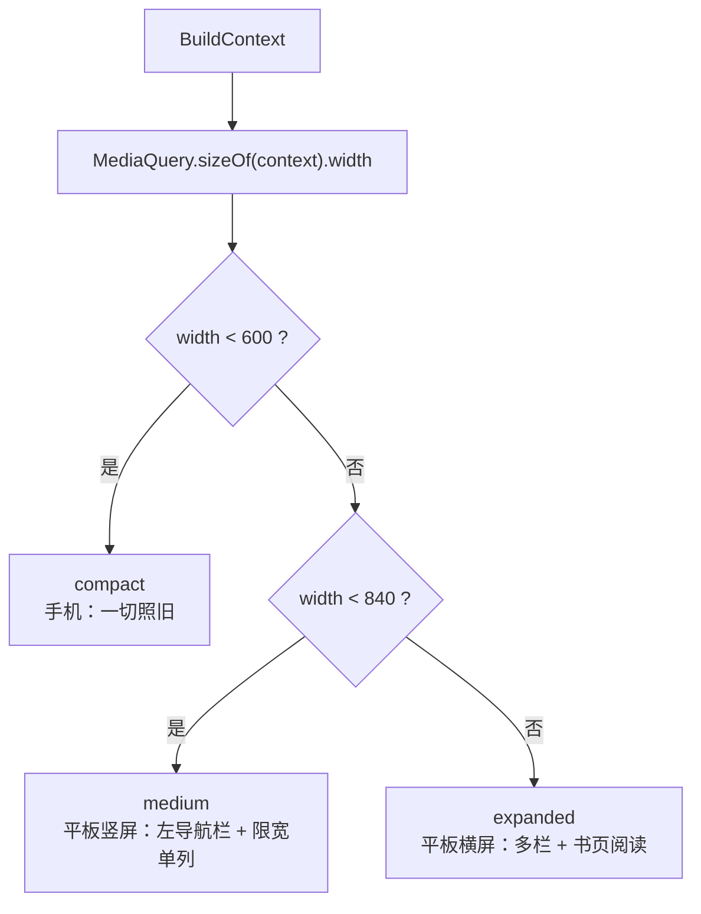

# 大屏自适应布局（窗口宽度档位）

## 主题定位

本文描述 App 如何按**窗口宽度**切换布局形态：手机一律维持既有单列界面，平板横屏获得左导航栏 + 多栏内容 + 书页式阅读。覆盖档位判定、各档位的页面形态、以及「手机零变化」这一硬约束的实现方式。

不描述阅读页内部的书页分页机制（见 [reading-spread.md](reading-spread.md)），也不描述方向锁定（见 [app-orientation.md](app-orientation.md)）。

## 业务功能线

### 三个档位

| 档位 | 宽度 | 典型设备 | 界面形态 |
|------|------|---------|---------|
| `compact` | < 600dp | 手机（竖屏锁定，恒为此档） | **与改造前完全一致**：底部导航栏、单列铺满、无书页模式 |
| `medium` | 600–839dp | 平板竖屏（实测 813dp） | 左侧 `NavigationRail` 替代底部栏；内容列限宽 640dp 居中；列表仍单列 |
| `expanded` | ≥ 840dp | 平板横屏（实测 1219dp） | `NavigationRail` + 多栏内容 + **阅读页书页模式**（左右两屏翻页） |

### 各页面在宽屏下的形态

| 页面 | medium | expanded | 实现 |
|------|--------|----------|------|
| 导航骨架 | 左 `NavigationRail` | 左 `NavigationRail` | `AppShell`，`context.usesNavRail` |
| 首页 | 单列限宽 | 同一天文章卡片 **2 列**（`Wrap`，卡片等宽） | `home_screen.dart` `_DayGroup`，`context.isExpandedLayout` |
| 参考页 | 列数不变 | 字母表 4→**8 列**、音标 3→**6 列** | `reference_screen.dart`，`context.isExpandedLayout` |
| 设置 | 限宽 640 居中 | 同左 | `ContentWidth` |
| 生词本（闪卡复习流） | 复习卡限宽 640 居中 | 同左 | `ContentWidth` |
| 阅读页 | 单列滚动（现状） | **书页模式** | `reading_screen.dart` `_isSpreadMode` |
| AddWord / Login / Onboarding | 内容限宽 640 | 同左 | `ContentWidth` |
| 底部弹层（`AppModal`，如查词） | 限宽 560、四角圆角 | 同左 | `context.usesNavRail` |

> **生词本**是闪卡复习流（一次一词 + 左右滑动切词），不是列表——大屏下只做「居中限宽」，不做「列表 + 详情并排」。后者是新增产品能力，不在布局适配范围内。

### 手机零变化（硬约束）

`compact` 与 `medium` 走的是**改造前原有的渲染路径**：

- 阅读页：`_buildList(state)` 是原有 `NotificationListener + ListView` 整块**逐字符搬移**（除缩进与结尾符号外无差异），只有宽度 ≥ 840dp 才走书页分支
- 其余页面：限宽容器在窄屏下 `ConstrainedBox(maxWidth:)` 不生效（子内容本就窄于阈值），列数在非 expanded 档位取原值
- 既有 20 条阅读页测试与全部页面测试未修改且全绿，作为回归闸

> 唯一的例外：设置页的限宽在默认测试窗口（800dp，属 `medium`）下会生效，属**有意的行为变更**；真机手机宽度（< 600dp）不受影响。

## 技术实现线

### 档位判定



`lib/core/layout/window_size.dart`：

| 成员 | 语义 |
|------|------|
| `enum WindowSize { compact, medium, expanded }` | 三个档位 |
| `windowSizeFor(double width)` | 纯函数，边界为半开区间：`< 600` / `[600, 840)` / `≥ 840` |
| `kMediumWidthBreakpoint = 600` | 与 Android 的 `sw600dp` 大屏线同源 |
| `kExpandedWidthBreakpoint = 840` | 书页模式与多栏的启用宽度 |
| `context.windowSize` | 从 `MediaQuery` 取宽并判定 |
| `context.isExpandedLayout` | 仅 expanded 为真（书页 / 多栏 / 列数翻倍） |
| `context.usesNavRail` | compact 以外为真（左导航栏 / 弹窗限宽） |

**两个扩展的阈值不同是刻意的**：`isExpandedLayout` 管「内容要不要分栏」，`usesNavRail` 管「导航骨架要不要换形」——平板竖屏（813dp）内容仍单列，但导航已经该换成侧栏。

### 为什么用窗口宽度而非设备类型

- 与 Android 16 大屏行为同源（系统按 `sw600dp` 决定是否忽略 App 的方向声明，见 [app-orientation.md](app-orientation.md)）——系统按宽度判定，App 也按宽度判定，两者不会打架
- 自动覆盖分屏、折叠屏展开/折叠、桌面模式：这些场景下「设备类型」不变而「可用宽度」变了，只有宽度判定能正确响应
- 不需要 `device_info_plus` 之类的依赖

**不用 Riverpod provider 持有档位**：宽度是环境事实而非应用状态，`MediaQuery` 天然驱动重建；引入 provider 会多一层失效面，且旋转/resize 时需要手动桥接。

### 内容限宽容器

`lib/core/layout/content_width.dart`：

```dart
ContentWidth({required Widget child, double maxWidth = 640})
// = Center(child: ConstrainedBox(constraints: BoxConstraints(maxWidth: maxWidth), child: child))
```

窄屏下 `maxWidth` 大于可用宽 → 约束不生效，布局与改造前一致；宽屏下内容居中、单行长度保持可读。

## 错误处理与边界

| 场景 | 行为 |
|------|------|
| 窗口宽度恰在断点 | 半开区间：600 属 medium、840 属 expanded；`.9` 边界有测试钉住 |
| 旋转 / 分屏导致的实时宽度变化 | `MediaQuery` 变化即重建，档位随之切换（书页模式会重新分页） |
| 平板竖屏（813dp） | 归 medium：有左导航栏，但阅读页仍是单列滚动——不启用书页 |
| 平板横屏但窗口被分屏压到 < 840 | 回落单列；书页模式不启用 |
| 弹窗在 compact | 手机行为不变（底部全宽、下两角直角） |

## 测试覆盖

| 层 | 测试文件 | 覆盖点 |
|----|----------|--------|
| 档位判定 | `test/core/layout/window_size_test.dart` | 599.9/600/813/839.9/840/1219 边界；`usesNavRail` 在 compact 为假 |
| 限宽容器 | `test/core/layout/content_width_test.dart` | 窄屏不改变布局；宽屏子内容限宽 640 |
| 导航骨架 | `test/core/navigation/app_router_test.dart` | ≥600dp 出 `NavigationRail` 且无底部栏；手机 360dp 保留底部栏；不显示导航的页面（生词本）两档都无导航。**原有底栏用例已显式钉到手机视口**（此前断言与宽度无关，现在必须声明档位） |
| 首页 | `test/ui/home/home_test.dart` | expanded 同日卡片同行（顶边对齐、左起递增）；手机仍上下单列 |
| 参考页 | `test/ui/reference/reference_screen_test.dart` | expanded 一行 8 格；手机仍 4 格 |
| 设置 / 生词本 / 表单页 | 各自 `test/ui/...` | 宽屏限宽与居中 |
| 弹窗 | `test/core/components/components_test.dart` | 宽屏底部弹层宽 560 且贴底居中；手机仍全宽 |
| 阅读页分档 | `test/ui/reading/reading_screen_spread_test.dart` | 1219dp 出书页（有 `PageView` 无 `ListView`）；360dp 与 813dp 竖屏仍单列 |

## 已知缺口

- 真机验证未完成（截至 2026-09-17）：书页实际观感、翻页手感、pad 竖屏回落单列的实际可用性均未上真机确认
- 未做「两列设置项」：设置项是自上而下的语义列表，拆两列会打断阅读顺序，收益不抵复杂度
