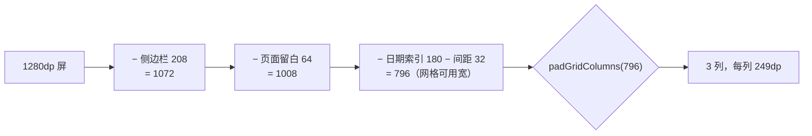
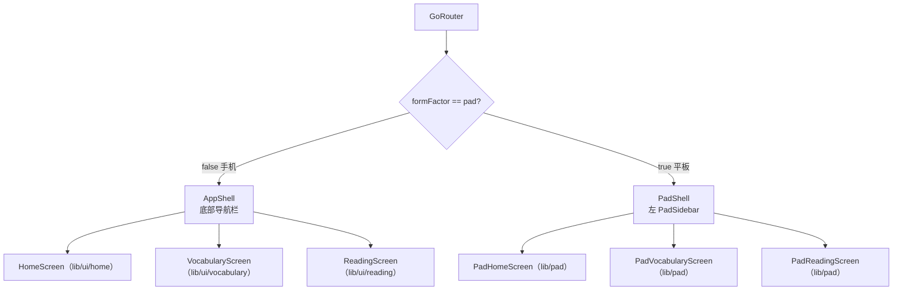

# 手机 / 平板：两棵并列的界面树

## 主题定位

本文描述 App 如何按**设备形态**分出两套并列的界面：手机走 `lib/ui/`（竖屏、单列、底部导航），平板走 `lib/pad/`（横屏、侧边栏 + 宽内容区、封面式网格首页）。覆盖分叉点、形态判定、平板首页与阅读页的重设计，以及「手机界面零改动」这条硬约束的实现与验证方式。

不描述方向锁定本身——见 [app-orientation.md](app-orientation.md)；不描述平板阅读页的书页分页与沉浸式工具栏——见 [reading-spread.md](reading-spread.md)。

> **为什么不是「同一界面内做宽度适配」**：那条路线在本分支上实现过又被放弃——它要求手机界面承担大量 `if (宽)` 分支，而手机侧渲染结果必须逐像素不变，两边目标互相拉扯。现在的模型是：**两棵树各自按自己的形态设计，互不影响**，在启动时二选一。
>
> **为什么不是「按窗口宽度实时切换」**：形态判定曾在路由 builder 里按 `MediaQuery` 的窗口宽度反复推断。问题有三：① 方向已锁死，窗口尺寸不会变，反复推断是白算；② 平板被 letterbox / 分屏压窄时会误判成手机，整棵树跟着换掉；③ "这台设备走哪棵树"变成随帧变化的值，难以推理。现在形态在 `main()` 里**判定一次**，是整棵树里唯一不可变的常量。

## 业务功能线

### 一次判定，两棵树

App 启动后按**设备**（不是当前窗口宽）分派：最短边 ≥ 600dp 即平板。

| 设备 | 界面树 | 导航 | 首页 | 生词本 | 阅读页 |
|------|--------|------|------|--------|--------|
| 手机（最短边 < 600dp） | `lib/ui/` | 底部导航栏 | 单列卡片流 | 闪卡复习流 | 单列滚动 |
| 平板（最短边 ≥ 600dp） | `lib/pad/` | 左侧常驻侧边栏 | **Hero + 日期目录 + 封面网格** | 宽屏复习流 | 沉浸式书页两屏 |

### 平板首页（2026-09-18 重设计）

**要解决的问题**：改造前的平板首页是「手机卡片流 + 一个窄 `NavigationRail`」——横屏多出来的宽度只被用来"多塞几张卡"，没有任何一件**只有横屏才成立**的事。平板的横屏范式应该是"一眼看全"，而不是"一列往下翻"。

重设计做三件事，每一件都是**手机竖屏做不到**的：

| # | 能力 | 做法 | 为什么手机做不到 |
|---|------|------|-----------------|
| 1 | **首页就能决定读哪篇** | 「继续阅读」Hero 卡：真实英文开头段 + 元信息 + 入口，全宽 | 手机宽度放不下开头段与元信息并排 |
| 2 | **把"滚动找日期"换成"索引选日期"** | 常驻左栏日期目录，每行带 `3/5` 进度，点选筛选右栏 | 手机只能把日期作为分组标题夹在卡片流里 |
| 3 | **靠色块扫视，而不是逐行读标题** | 封面式卡片：卡片上半是难度色调的整块 + 分类名 | 手机一列一张，扫视无意义 |

布局（本机 1280×800dp 横屏，内容区宽 1072dp）：

```text
┌──────────┬──────────────────────────────────────────────────────────┐
│          │  2026年9月18日 星期五                        🔥 连续 1 天  │
│ Contexta ├──────────────────────────────────────────────────────────┤
│          │ ┌───────────────────────────────┬────────────────────┐  │
│ ▣ 首页   │ │ 继续阅读                       │                    │  │
│          │ │ Social Media Does More Harm…   │   ┌────────────┐   │  │
│ ◈ 生词   │ │ Many people believe social…    │   │ 继续阅读 → │   │  │
│          │ │ [CET6] ARGUMENTATIVE 已读1分钟 │   └────────────┘   │  │
│ ◇ 参考   │ └───────────────────────────────┴────────────────────┘  │
│          │ ┌─阅读记录──┐ ┌──────────────────────────────────────┐  │
│ ⚙ 设置   │ │ 8月11日 2/3│ │ 2026年8月11日  3 篇 · 已读 2          │  │
│          │ │ 8月10日 3/3│ │ ┌────────────┐┌────────────┐┌────────┐│  │
│          │ │ 8月9日  1/3│ │ │▓▓ 封面 ▓▓▓▓││▓▓ 封面 ▓▓▓▓││▓▓ 封面 ││  │
│          │ │ 8月7日  0/3│ │ ├────────────┤├────────────┤├────────┤│  │
│          │ │ …          │ │ │ 标题        ││ 标题        ││ 标题    ││  │
│          │ │            │ │ │ [CET6] 已读 ││ [CET6]     ││ [CET6] ││  │
│          │ │            │ │ └────────────┘└────────────┘└────────┘│  │
│          │ └───────────┘ └──────────────────────────────────────┘  │
└──────────┴──────────────────────────────────────────────────────────┘
```

**宽度账**（1280dp 屏）：



**列数不写死设备尺寸**：由可用宽度与最小卡宽推导（`padGridColumns`），分屏、折叠、桌面模式都能得到不溢出的列数；上限 4 列，避免超宽窗口下卡片窄到退化回手机形态。`dateIndexWidth = 180` 是算出来的——再宽一格，右侧网格就从 3 列掉到 2 列。

### 平板侧边栏（同期重设计）

改造前用 `NavigationRail`：窄、图标在上文字在下、没有身份。那是"把手机底栏竖过来"的观感，不是平板范式。重设计为**自绘侧边栏**（`PadSidebar`）：

| 维度 | 改造前 `NavigationRail` | 改造后 `PadSidebar` |
|------|------------------------|---------------------|
| 宽度 | 80dp（图标 + 下方小字） | **208dp**（图标 + 文字横排） |
| 顶部 | 空 | `Contexta` 字标 |
| 条目 | 图标 + 居中标签 | 整行可点，选中态 = 表面色块 + 左侧珊瑚竖条 |
| 底部 | 空 | 产品定位短句 |
| 底色 | 与页面同色 | `surfaceSoft`（侧边栏与内容区分层） |

参照对象是微信读书 / Gmail 平板的做法。选中态用了**两个信号**（色块 + 竖条），色觉障碍下仍可辨。

### 手机零改动（硬约束）

> 约束来源：用户明确要求「这次更改不能修改关于手机的界面、不能影响手机的功能」「手机端和平板端一定是不同的源代码，启动时通过设备类型判断走哪个界面」。

落实方式：

1. **不复用手机页面组件**。平板首页、卡片、封面、日期目录、侧边栏、阅读页工具栏都是 `lib/pad/` 下的自有实现，不引用 `ArticleCard`、`AppCard`、`LoadingIndicator`、`EmptyState`、`NavigationRail` 等手机侧或框架组件——改平板不会经共享组件波及手机。
2. **平板专属的代码全部收拢到 `lib/pad/`**。原先寄居在 `lib/ui/reading/pagination/` 的分页三件套（`article_paginator` / `reading_block` / `spread_reader`）**只有平板用**，本次一并迁入 `lib/pad/reading/`（`spread_reader` 同时重写为 `pad_spread_reader`）。`lib/ui/` 下不再有任何平板专属文件。
3. **不修改手机显示路径上的文件**。`lib/ui/**`（除共享数据层）、`lib/core/components/**`、`ios/` 相对 `main` 零修改。
4. **共享的只有两类，且都是"共用比复制更正确"的东西**：
   - **数据层**：`homeControllerProvider`（文章加载 / 分页 / 日期分组状态机）。复制一份 300 行的分页状态机只会造成双份漂移。
   - **文本渲染原语**：`reading_widgets.dart`（`ReadingTitle` / `ReadingParagraph`）、`word_spans.dart`。这两处是**度量与渲染同源的正确性关键**，复制会立刻导致分页错位（详见 [reading-spread.md](reading-spread.md)）。

   > 共用它们**不会**让手机外观改变：这是纯函数式的 span 构建与文本渲染，输出只取决于入参。

## 技术实现线

### 设备判定

`lib/core/platform/device_form_factor.dart`：

```dart
enum DeviceFormFactor { phone, pad }

const double kPadShortestSideThreshold = 600;

/// 纯函数：由**显示屏**的物理尺寸与像素比判定形态
DeviceFormFactor formFactorForDisplay({
  required Size physicalSize,
  required double devicePixelRatio,
}) { ... }

/// 启动解析，必须在 runApp 之前 await
Future<DeviceFormFactor> resolveStartupFormFactor({Duration timeout}) async { ... }
```

按**最短边**而非宽度判定：横竖屏都算平板，与 Android 的 `sw600dp` 大屏线同源（系统判断「这台设备算不算平板」用的就是这个）。

判定源必须是**显示屏**（`view.display.size`）而不是窗口（`view.physicalSize`）——理由与踩坑记录见 [app-orientation.md](app-orientation.md#设备判定必须读显示屏不能读窗口)。

两台设备的取值（模拟器实测）：

| 设备 | 显示屏 | 逻辑尺寸 | 最短边 | `DeviceFormFactor` |
|------|--------|---------|--------|-------------------|
| 手机（Pixel，1080×1920 @2.625） | 1080×1920 | 411×731dp | 411dp | phone |
| 平板（Pixel Tablet，2560×1600 @2） | 2560×1600 | 1280×800dp | 800dp | pad |

### 形态注入与路由分叉

形态经 Riverpod 注入，**没有默认值**——忘了注入会立刻抛 `StateError`，而不是悄悄按某个形态跑起来：

```dart
// main.dart
final formFactor = await resolveStartupFormFactor();
await applyOrientationPolicy(formFactor);
runApp(ProviderScope(
  overrides: [formFactorProvider.overrideWithValue(formFactor)],
  child: const MainApp(),
));
```

```dart
// di/providers.dart
final routerProvider = Provider<GoRouter>((ref) => buildRouter(
  formFactor: ref.read(formFactorProvider),
  authService: ...,
  isOnboarded: ...,
));
```

分叉点只有一个：`lib/core/navigation/app_router.dart`。`buildRouter` 收下形态，在闭包里算出 `isPad`，各 builder 据此二选一：



> 形态是**不可变常量**：它不随窗口变化，所以路由不需要因为尺寸变化而重建。代价是平板被分屏压到 600dp 以下时不再自动回落手机界面——但那本来就是错的行为（形态是设备的属性，不是窗口的）。

### 平板首页组成

| 文件 | 职责 |
|------|------|
| `lib/pad/pad_home_screen.dart` | 页面装配：头部 + 两栏（日期目录 + 滚动区） |
| `lib/pad/pad_continue_card.dart` | Hero 卡「继续阅读」：真实开头段 + 元信息 + 入口 |
| `lib/pad/pad_date_index.dart` | 左栏日期目录：日期 + `3/5` 进度，点选筛选 |
| `lib/pad/pad_article_grid.dart` | 封面式网格：按宽度推导列数，逐行等高 |
| `lib/pad/pad_article_card.dart` | 封面式卡片：`PadCover`（难度色调整块）+ 标题 + 元信息 |
| `lib/pad/pad_providers.dart` | `padArticleDetailProvider`：Hero 卡取单篇详情（含段落） |
| `lib/pad/pad_layout.dart` | 平板布局常量（宽度、留白、列数上限、栏高） |

**Hero 卡的开头段从哪来**：首页列表查询（`watchByBatch`）只查 `article` 表、不带段落，而 Hero 卡要显示真实正文。`padArticleDetailProvider` 为"当前推荐的那一篇"单独取一次详情——一篇的额外查询，不把它并进首页批量查询（那会加重**手机侧**的数据路径，而手机界面根本不用这段文字）。

**网格为什么不用 `Wrap`**：`Wrap` 的子项各按自身内容取高，同一行里标题两行的卡片会比标题一行的高出一截，**封面色块高度参差不齐**——而封面块正是这个网格的扫视锚点，错位会毁掉"按色块定位"的效果。改用显式分行 + `IntrinsicHeight` 把整行拉到最高卡片的高度。

**封面块不是装饰**：它的颜色编码难度（CET4 青 / CET6 珊瑚 / 专八 琥珀），与卡内难度徽标同色（同一个纯函数 `difficultyAccent`），两处互相印证；已读文章的封面降到 6% 不透明度，网格里一眼分得出读过的。

### 尺寸令牌

平板布局常量集中在 `lib/pad/pad_layout.dart`，**只被 `lib/pad/` 消费**：

| 常量 | 值 | 说明 |
|------|----|------|
| `sidebarWidth` | 208 | 侧边栏宽度 |
| `pagePadding` | 32 | 内容区左右留白（32 是"不贴边"与"保住 3 列"的平衡点） |
| `dateIndexWidth` | 180 | 日期目录列宽（再宽就掉列） |
| `cardMinWidth` | 240 | 卡片最小可用宽 |
| `cardCoverHeight` | 110 | 封面块高度 |
| `gridMaxColumns` | 4 | 列数上限 |
| `spreadMaxWidth` / `spreadGutter` | 1180 / 56 | 阅读页书页宽与中缝 |
| `pagePillRowHeight` / `chromeTopBarHeight` / `chromeBottomBarHeight` | 56 / 56 / 56 | 阅读页工具栏几何 |

## 数据模型线

平板首页不引入新的数据模型，消费的是手机首页同一份 `HomeUiState`：

```mermaid
classDiagram
    class HomeUiState {
        +String dateLabel
        +int streak
        +List~ArticleGroupUi~ articleGroups
        +bool isLoading
        +bool isGenerating
        +bool hasMore
        +Set~String~ collapsedDates
    }
    class ArticleGroupUi {
        +String dateLabel
        +List~ArticleItemUi~ articles
    }
    class ArticleItemUi {
        +int id
        +String? title
        +String description
        +String difficultyLabel
        +String categoryLabel
        +bool isReadCompleted
        +int accumulatedReadSeconds
    }
    class PadArticleCardData {
        +int id
        +String? title
        +String difficultyLabel
        +String categoryLabel
        +bool isReadCompleted
    }
    class Article {
        +List~ArticleParagraph~ paragraphs
        +int accumulatedReadSeconds
    }
    HomeUiState "1" --> "* ArticleGroupUi
    ArticleGroupUi "1" --> "* ArticleItemUi
    ArticleItemUi ..> PadArticleCardData : PadArticleGrid 映射
    ArticleItemUi ..> Article : padArticleDetailProvider（Hero 取开头段）
```

`accumulatedReadSeconds` 是本次为平板首页新增的字段（Hero 卡显示「已读 N 分钟」）——**手机侧不消费**，属加法改动，手机渲染不变。

`PadArticleCardData` 是 `lib/pad/` 自有类型，不由手机侧的 `ArticleCardData` 改名而来——两边各自演化，互不牵连。

## 错误处理与边界

| 场景 | 行为 |
|------|------|
| 窗口宽度恰在断点 | 与断点无关：形态只看设备，600dp 起算平板 |
| 平板被分屏压到 < 600dp 最短边 | **仍是平板**，界面树不切换（形态是设备属性） |
| 极窄窗口（< 2×最小卡宽） | 1 列，卡片占满可用宽，不溢出 |
| 超宽窗口 | 封顶 4 列 |
| 末行不足列数 | 右侧补空占位，卡片宽度与满行一致 |
| 标题超长 | 完整换行；同行其它卡片被拉平到同高 |
| 标题为空 | 回落分类名（不出现空标题卡） |
| 选中的日期在数据变化后消失 | 回落到最新一天，不显示空网格 |
| 全部文章已读 | Hero 卡标题改「今日推荐」，取该组第一篇 |
| 显示屏尺寸为 0 | 轮询 2s 后回落手机（见 [app-orientation.md](app-orientation.md)） |
| `formFactorProvider` 未注入 | 取值即抛 `StateError` |

## 已知缺口

- **平板只覆盖一部分页面**：首页 / 生词本 / 阅读页有平板版。其余页面的现状（2026-09-18 模拟器实测）：
  - **参考页**：本来就是随宽度铺开的字母/音标网格，横屏下是 4 列，**可用**，不必重做；
  - **设置页**：仍是手机列表拉宽——标签在最左、控件在最右，相距约 900dp，扫视困难。**最需要平板版**（平板范式应是限宽内容列或「分区导航 + 限宽设置」两栏）；
  - **加词页 / 登录页 / 引导页**：表单类，现状居中尚可，但未做平板版。
  补齐这些属于后续工作。
- **`PadPageScaffold` 之类"限宽内容列"的平板页面骨架尚未抽出**：设置/加词/登录/引导四个表单类页面都需要同一种骨架，做平板版时应先抽它，避免四份各写一遍。
- **`ContentWidth` / `WindowSize` 已无人使用**：`lib/core/layout/content_width.dart` 与 `window_size.dart` 里的 `WindowSize` 枚举 / `windowSizeFor` 是被放弃的「界面内宽度适配」路线的遗留物，当前只有测试引用——留待清理。`AppPage.horizontalPadding` 也只剩手机侧在用。
- **`PROPERTY_COMPAT_ALLOW_RESTRICTED_RESIZABILITY` 是临时豁免**：targetSdk 37 起失效，届时平板方向方案需重做。
- **平板首页未做真机验证**：截至 2026-09-18 仅在 Pixel Tablet 模拟器（2560×1600 @2）上确认；真机（小米平板）未上机。

## 测试覆盖

| 层 | 测试文件 | 覆盖点 |
|----|----------|--------|
| 形态判定 | `test/core/platform/device_form_factor_test.dart` | 断点两侧；平板竖屏仍是 pad；尺寸 0 / 像素比 0 的兜底；启动解析读的是 display；provider 未注入抛错 |
| 平板首页网格 | `test/pad/pad_article_grid_test.dart` | 796dp → 3 列；列数随宽度单调不减；超宽封顶 4 列；7 篇排 3×3（同行顶边对齐、第 4 篇换行回首列）；同行等高；末行卡片宽度与满行一致；点击回传 id；**长标题无 `maxLines`／无省略号**且确实折行；标题缺失回落分类名；**每张卡都有封面块且同排封面等高**；**已读封面褪色** |
| 路由分叉 | `test/core/navigation/app_router_test.dart` | 同一个路由在两个形态下命中**不同**组件且互不串门（pad → `PadHomeScreen` / `PadSidebar` / `PadVocabularyScreen` / `PadReadingScreen`；phone → `HomeScreen` / `BottomNavBar` / `VocabularyScreen` / `ReadingScreen`） |
| 手机回归 | `test/widget_test.dart`、`test/ui/**` | 全部手机侧测试未修改，作为「pad 改动没碰手机路径」的闸门 |

> 网格测试必须先给画布真机尺寸（`tester.view.physicalSize = 2560×1600 @2x`）：默认测试画布只有 800×600，会把它下面的 `SizedBox(width: 796)` 压回 800，列数随之改变——这是踩过的测试环境陷阱，已写进测试注释。
