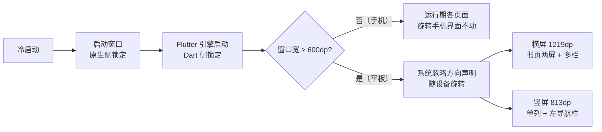
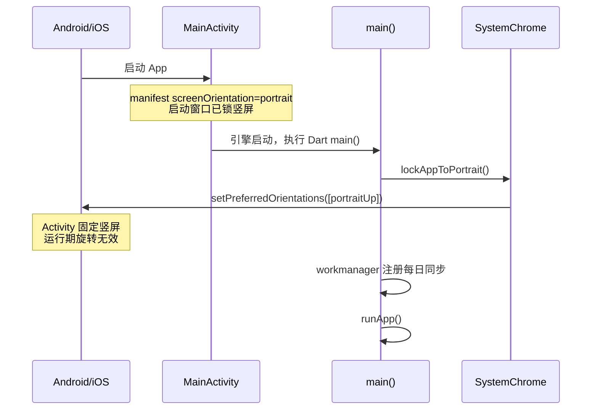

# App 方向策略（手机竖屏锁定 / 平板横屏适配）

## 主题定位

手机端 App 全局不允许切横屏——用户旋转手机时界面保持竖屏。属于全局平台行为保障，与阅读页屏幕常亮（[reading-screen-wake.md](reading-screen-wake.md)）同类，区别是作用域为整个 App 而非单个页面。

**手机锁定理由**：整棵 UI 树按竖屏单列布局设计（阅读页段落流、查词弹窗、统计卡片、底部导航），手机窄屏下横屏只会得到拉伸错位的界面；也不存在需要横屏的场景（无横屏视频、无大图查看），因此不提供按页面放开横屏的入口。

**平板不锁的理由**：Android 16 起，targetSdk ≥ 36 的 App 在 `sw ≥ 600dp` 的大屏上方向声明被系统**忽略**——锁也锁不住（见下文「实测行为」）。与其对抗，不如适配：平板横屏正是书页式两屏阅读的理想形态（宽 1219dp 可容两栏各约 530dp 正文），竖屏则回落单列。布局档位判定见 [adaptive-layout.md](adaptive-layout.md)，书页模式见 [reading-spread.md](reading-spread.md)。

## 业务功能线

手机上三个时刻都不允许横屏：

1. **冷启动**：闪屏到首帧全程竖屏（含 Flutter 引擎启动前的启动窗口）；
2. **运行期**：旋转手机不触发界面旋转；
3. **任何页面**：阅读页、生词本、设置、参考页一视同仁，无例外。

平板上相反——**不锁**，横屏即是首选形态（书页两屏），竖屏回落单列。

## 技术实现线

两层锁定，各自覆盖对方够不着的窗口：

| 层 | 位置 | 覆盖窗口 |
|----|------|---------|
| 原生侧 | `android/app/src/main/AndroidManifest.xml`：`MainActivity` 上 `android:screenOrientation="portrait"` `ios/Runner/Info.plist`：`UISupportedInterfaceOrientations` 只留 `UIInterfaceOrientationPortrait` | Flutter 引擎启动前的启动窗口（闪屏期，Dart 代码尚未运行） |
| Dart 侧 | `lib/core/platform/app_orientation.dart` 的 `lockAppToPortrait()`，由 `lib/main.dart` 在 `runApp` 前 `await` | 引擎启动后的运行期旋转 |

**只传 `portraitUp` 的原因**：Flutter 框架把方向列表映射为 Android 的 `screenOrientation` 组合——单 `portraitUp` → `portrait`（固定竖屏，与系统「自动旋转」开关无关）；`portraitUp + portraitDown` → `userPortrait`（倒竖屏是否生效取决于系统开关状态）。选固定竖屏，行为不依赖设备设置。

### 大屏实测行为（Android 16）

上面两层锁定在 **`sw ≥ 600dp` 的大屏上都会失效**：

| 项 | 实测结论 |
|----|---------|
| 触发条件 | App `targetSdkVersion = 36`（本项目即是）＋ 设备 `smallest width ≥ 600dp`（实测 pad = 813dp） |
| 被忽略的声明 | `android:screenOrientation`（manifest）与 `setRequestedOrientation()`（Dart 侧 `SystemChrome` 走的就是它）**两者都被忽略** |
| 界面表现 | **不 letterbox**，App 铺满整个显示区，随设备物理朝向旋转 |
| 手机 | `sw < 600dp`，锁定**照常生效**，行为与改造前一致 |
| 依据 | Android 官方 behavior-changes-16：*"For apps targeting Android 16 … orientation, resizability, and aspect ratio constraints are ignored on large screens by default"*；临时豁免 `PROPERTY_COMPAT_ALLOW_RESTRICTED_RESIZABILITY` 在 targetSdk 37 将被移除，故不采用 |

**因此本项目不改 manifest、不改 Dart 锁定**——在平板上请求横屏同样会被忽略（「强制横屏」做不到），正确做法是让布局适应两种朝向。这也是本项目采用「按窗口宽度分档」而非「按设备类型」判定的原因之一（见 [adaptive-layout.md](adaptive-layout.md)）。

**副作用（已知缺口）**：pre-Android-16 的平板（manifest 锁仍生效）会一直停在竖屏、进不了书页模式。目标设备是 Android 16，暂不处理；将来若要支持，需把 manifest 改为 `fullSensor` 并接受手机闪屏期可能短暂横屏。

**iPad**：`UISupportedInterfaceOrientations~ipad` 保持四方向不变（iPadOS 多任务要求 App 支持全部方向）；但布局档位是按窗口宽度算的，iPad 横屏同样会进入书页模式，与 Android 平板一致。

## 测试覆盖

> 这些断言描述的是**手机路径**，全部保持有效：Dart 侧仍只请求 `portraitUp`，manifest 仍声明 `portrait`——在大屏上它们会被系统忽略，但手机（`sw < 600dp`）上照常生效。

`test/core/platform/app_orientation_test.dart`：

- **Dart 侧**：mock `SystemChannels.platform` 捕获 `SystemChrome.setPreferredOrientations` 调用，断言参数只含 `DeviceOrientation.portraitUp`（不含任何横屏方向）。
- **原生侧**：直接读 `AndroidManifest.xml` / `Info.plist` 断言竖屏声明存在、横屏声明不存在——`android/`、`ios/` 被 `analysis_options.yaml` 排除在 analyzer 之外，读文件是唯一能守住这两处的自动化手段。
