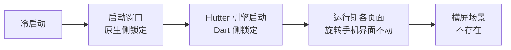
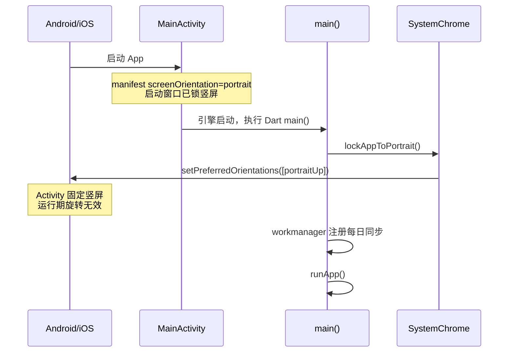

# App 全局竖屏锁定

## 主题定位

手机端 App 全局不允许切横屏——用户旋转手机时界面保持竖屏。属于全局平台行为保障，与阅读页屏幕常亮（[reading-screen-wake.md](reading-screen-wake.md)）同类，区别是作用域为整个 App 而非单个页面。

锁定理由：整棵 UI 树按竖屏单列布局设计（阅读页段落流、查词弹窗、统计卡片、底部导航均无横屏适配），横屏只会得到拉伸错位的界面；也不存在需要横屏的场景（无横屏视频、无大图查看），因此不提供按页面放开横屏的入口。

## 业务功能线

三个时刻都不允许横屏：

1. **冷启动**：闪屏到首帧全程竖屏（含 Flutter 引擎启动前的启动窗口）；
2. **运行期**：旋转手机不触发界面旋转；
3. **任何页面**：阅读页、生词本、设置、参考页一视同仁，无例外。

## 技术实现线

两层锁定，各自覆盖对方够不着的窗口：

| 层 | 位置 | 覆盖窗口 |
|----|------|---------|
| 原生侧 | `android/app/src/main/AndroidManifest.xml`：`MainActivity` 上 `android:screenOrientation="portrait"` `ios/Runner/Info.plist`：`UISupportedInterfaceOrientations` 只留 `UIInterfaceOrientationPortrait` | Flutter 引擎启动前的启动窗口（闪屏期，Dart 代码尚未运行） |
| Dart 侧 | `lib/core/platform/app_orientation.dart` 的 `lockAppToPortrait()`，由 `lib/main.dart` 在 `runApp` 前 `await` | 引擎启动后的运行期旋转 |

**只传 `portraitUp` 的原因**：Flutter 框架把方向列表映射为 Android 的 `screenOrientation` 组合——单 `portraitUp` → `portrait`（固定竖屏，与系统「自动旋转」开关无关）；`portraitUp + portraitDown` → `userPortrait`（倒竖屏是否生效取决于系统开关状态）。选固定竖屏，行为不依赖设备设置。

**已知边界**：

- Android 16 起，大屏设备（宽度 ≥ 600dp）上应用声明的屏幕方向可能被系统忽略（系统改为 letterbox 处理，见 Flutter `SystemChrome` 文档注释引用的 Android 16 行为变更）。本 App 面向手机（< 600dp），不受影响。
- iPad 的 `UISupportedInterfaceOrientations~ipad` 保持四方向不变：iPad 属平板，且 iPadOS 多任务要求 App 支持全部方向。将来若要连 iPad 一起锁，改这一项。

## 测试覆盖

`test/core/platform/app_orientation_test.dart`：

- **Dart 侧**：mock `SystemChannels.platform` 捕获 `SystemChrome.setPreferredOrientations` 调用，断言参数只含 `DeviceOrientation.portraitUp`（不含任何横屏方向）。
- **原生侧**：直接读 `AndroidManifest.xml` / `Info.plist` 断言竖屏声明存在、横屏声明不存在——`android/`、`ios/` 被 `analysis_options.yaml` 排除在 analyzer 之外，读文件是唯一能守住这两处的自动化手段。
