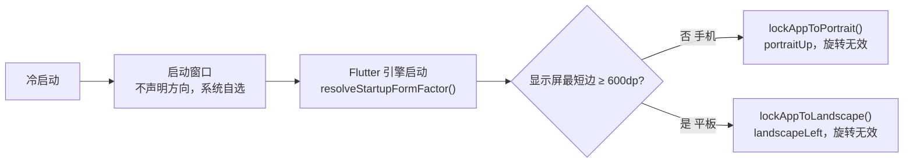
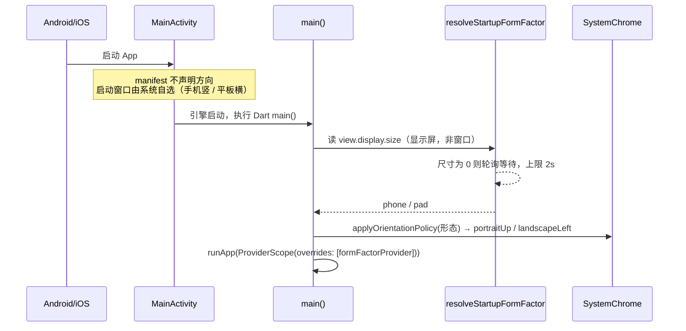
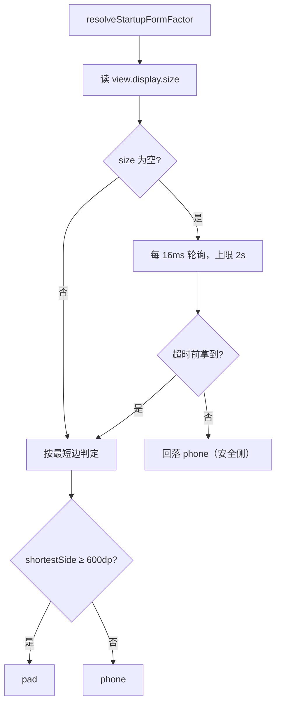
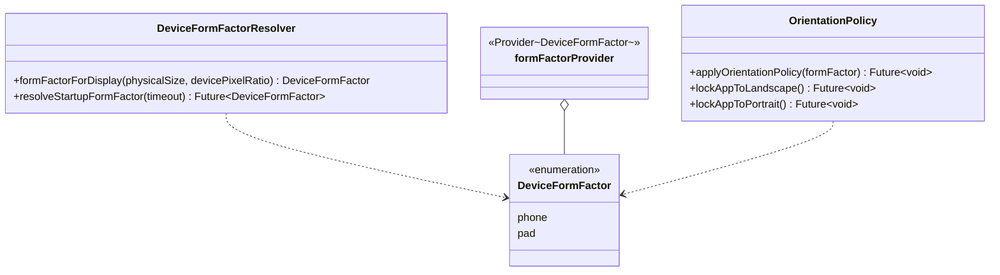

# App 方向策略（手机固定竖屏 / 平板固定横屏）

## 主题定位

两个方向决策，作用于整个 App。方向由**设备形态**（[device-form-factor.md](adaptive-layout.md#设备判定)）唯一决定，形态在启动时判定一次：

| 设备 | 方向 | 请求 | 安卓映射 | 翻转 |
|------|------|------|---------|------|
| 手机（最短边 < 600dp） | 固定竖屏 | `[portraitUp]` | `portrait` | 不允许 |
| 平板（最短边 ≥ 600dp） | 固定横屏 | `[landscapeLeft]` | `landscape` | 不允许 |

属于全局平台行为保障，与阅读页屏幕常亮（[reading-screen-wake.md](reading-screen-wake.md)）同类，区别是作用域为整个 App。

**两者都锁死的理由**：

- **手机**：整棵界面树（`lib/ui/`）按竖屏单列布局设计（阅读页段落流、查词弹窗、统计卡片、底部导航），旋转到横屏只会得到拉伸错位的界面；也不存在需要横屏的场景（无横屏视频、无大图查看）。行为与改造前完全一致。
- **平板**：整棵界面树（`lib/pad/`）按横屏「侧边栏 + 宽内容区」的单向布局设计（见 [adaptive-layout.md](adaptive-layout.md)）。横屏是唯一形态；翻转 180° 会让侧边栏跑到右手侧，与设计不符，故只请求**一个**横屏方向。

不描述界面树如何按形态分叉——见 [adaptive-layout.md](adaptive-layout.md)。

## 业务功能线



三个时刻的行为：

1. **冷启动**：manifest **不声明** `screenOrientation`，启动窗口（闪屏期）由系统按设备自然方向显示；
2. **引擎启动后**：`main()` 在 `runApp` **之前** 解析形态并请求方向，覆盖运行期旋转；
3. **任何页面**：阅读页、生词本、设置、参考页一视同仁，无按页面放开的例外。

### 「不翻转」是怎么做到的

Flutter 把方向列表映射为安卓的 `screenOrientation` 组合，**列表长度决定松紧**：

| 请求列表 | 安卓取值 | 效果 |
|---------|---------|------|
| `[portraitUp]` | `portrait` | 固定竖屏，不可翻转 |
| `[portraitUp, portraitDown]` | `userPortrait` | 允许倒竖屏，取决于系统自动旋转开关 |
| `[landscapeLeft]` | `landscape` | **固定横屏，不可翻转** |
| `[landscapeLeft, landscapeRight]` | `userLandscape` | 两个横屏方向都允许，**可 180° 翻转** |
| 四方向 | `fullUser` | 完全跟随设备 |

所以两档都只传**单元素列表**。

> 已知代价：平板用户把设备反向拿时，界面相对用户是倒的。这是「不允许翻转」的直接后果，不做运行时补救。

## 技术实现线

### 分层

| 层 | 位置 | 覆盖窗口 |
|----|------|---------|
| 原生侧 | `android/app/src/main/AndroidManifest.xml`：**声明弹性窗口豁免**（见下节），但**不声明** `screenOrientation`<br/>`ios/Runner/Info.plist`：`UISupportedInterfaceOrientations` 只留 `UIInterfaceOrientationPortrait` | Flutter 引擎启动前的启动窗口（闪屏期） |
| Dart 侧 | `lib/core/platform/device_form_factor.dart` 的 `resolveStartupFormFactor()` → `lib/core/platform/app_orientation.dart` 的 `applyOrientationPolicy(formFactor)`，由 `lib/main.dart` 在 `runApp` 前 `await` | 引擎启动后的运行期旋转 |



### 为什么 manifest 不声明方向

manifest 是静态的，一台设备一套声明，无法表达「手机竖屏、平板横屏」。三种做法里选了第三种：

| 做法 | 手机闪屏 | 平板闪屏 | 结论 |
|------|---------|---------|------|
| 声明 `portrait` | 竖屏 ✓ | **竖屏 letterbox，进横屏前闪黑边** ✗ | 平板体验受损 |
| 声明 `landscape` | **横屏闪一下** ✗ | 横屏 ✓ | 手机体验受损 |
| **不声明** | 系统按设备自然方向（手机竖）✓ | 系统按设备自然方向（平板横）✓ | **采用** |

代价：手机横持冷启动时，闪屏可能短暂横屏（Dart 锁在引擎启动后立即生效）。实测该窗口极短，可接受。

### 设备判定：必须读**显示屏**，不能读窗口

`resolveStartupFormFactor()` 的判定源是 `view.display.size`（物理显示屏），**不是** `view.physicalSize`（当前窗口）。

> **这是 2026-09-18 平板实测踩到的坑**：改造前用 `view.physicalSize` 判定，在 `runApp` 之前该值常常还是 `Size.zero`（引擎尚未推来首帧的 viewport 指标），代码于是走了「尺寸未就绪 → 回落竖屏」的安全分支——**平板被锁成竖屏**，界面被 letterbox 成 600×800dp 竖条，右侧半屏全黑，首页网格塌成 1 列。日志里连 `[PROBE]` 都没打出来，正是走了那个提前 return 的分支。

改造后的解析策略：



**超时兜底选手机**：误判成平板会让手机锁横屏（整机不可用），误判成手机只是让平板晚一帧进横屏（可恢复）。两害相权取轻。

**窗口尺寸与形态判定解耦**：平板即使被分屏、被 letterbox、被折叠，判定结果都不变——形态是**设备**的属性，不是**窗口**的属性。这也让「平板被分屏压到 600dp 以下」不再引发界面树切换（详见 [adaptive-layout.md](adaptive-layout.md)）。

### Android 16 大屏：必须声明弹性窗口豁免

Android 16（API 36）起，`sw ≥ 600dp` 的大屏默认**忽略** App 的方向限制：系统把 App 当成可自由缩放，`setRequestedOrientation` 与 manifest 的 `screenOrientation` 一律不生效。

实测证据（Pixel Tablet 模拟器 / Android 16 / targetSdk 36）：

```
$ adb shell dumpsys window displays | grep ignoreOrientation
mSetIgnoreOrientationRequest=true
mHasSetIgnoreOrientationRequest=true ignoreOrientationRequest=true
```

**解法**：在 `MainActivity` 上声明兼容性豁免，系统恢复「尊重方向声明」的兼容模式：

```xml
<property
    android:name="android.window.PROPERTY_COMPAT_ALLOW_RESTRICTED_RESIZABILITY"
    android:value="true" />
```

> ⚠️ 官方标注这是**临时豁免**，targetSdk 37 起失效——届时需重新评估平板方向方案（可能的替代：不锁方向，改为界面自适应任意朝向）。
>
> 另一条实测数据（小米平板 HyperOS / Android 16）：该 ROM **未启用**系统的忽略行为，运行时请求有效。也就是说「忽略」是 ROM 相关的，豁免声明在两种 ROM 上都不吃亏。

### 尺寸未就绪（0×0）时的兜底

| 场景 | 行为 |
|------|------|
| 显示屏尺寸为 0（引擎刚起，指标未到） | 轮询等待；超时后回落**手机竖屏** |
| 已出尺寸但恰好等于断点 | 600dp 起算平板（半开区间上界含） |

## 错误处理线

| 场景 | 行为 |
|------|------|
| 启动时显示屏尺寸迟迟为 0 | 轮询 2s 后回落手机竖屏（安全侧），不永久挂起 |
| 像素比非法（0 或负） | `formFactorForDisplay` 回落手机，不做除零 |
| 平板被分屏压到最短边 < 600dp | 形态仍是平板（启动时判定一次，与窗口无关），界面树不切换 |
| ROM 忽略运行时方向请求且未声明豁免 | 方向锁不住，界面仍按设备形态渲染（内容正确、朝向可能不符） |
| `formFactorProvider` 未注入 | **取值即抛 `StateError`**，不静默给默认值 |

## 数据模型线



`formFactorForDisplay` 是**纯函数**（物理尺寸 + 像素比 → 形态），可离线单测；`resolveStartupFormFactor` 只负责「拿到显示屏尺寸」这件脏活。判定与执行分开，各自可测。

## 测试覆盖

| 层 | 测试文件 | 覆盖点 |
|----|----------|--------|
| 形态判定（纯函数） | `test/core/platform/device_form_factor_test.dart` | 手机 360×780dp → phone；平板横屏 1280×800dp → pad；平板竖屏 800×1280dp → **仍 pad**（按最短边）；断点 600dp/599dp 两侧；尺寸 0 → phone；像素比 0 → phone（不除零）；**平板被 letterbox 成竖条也判得对**（判定源是显示屏） |
| 启动解析 | 同上 | `view.display.size` 就绪 → 立即判定（并证明读的是 display 而非 physicalSize）；显示屏 0 → 等超时后回落 phone（用 `tester.runAsync` 走真实时钟——FakeAsync 里 `Future.delayed` 永不到期） |
| 方向执行 | `test/core/platform/app_orientation_test.dart` | `applyOrientationPolicy(phone/pad)` 各自只传**一个**方向元素——钉住「不翻转」；`lockAppToPortrait` / `lockAppToLandscape` 的底层调用 |
| 原生声明 | 同上（直接读文件——`android/`、`ios/` 被 analyzer 排除，读文件是唯一能守住这两处的自动化手段） | manifest 含 `PROPERTY_COMPAT_ALLOW_RESTRICTED_RESIZABILITY`；manifest **不含** `android:screenOrientation`（设备相关，不能写死）；`Info.plist` 的 iPhone 支持方向只剩竖屏 |

> 手机闪屏期的表现由「Info.plist 只剩竖屏 + 形态判定 phone」两条断言共同守住——这就是「手机显示不被影响」的自动化闸门之一。
