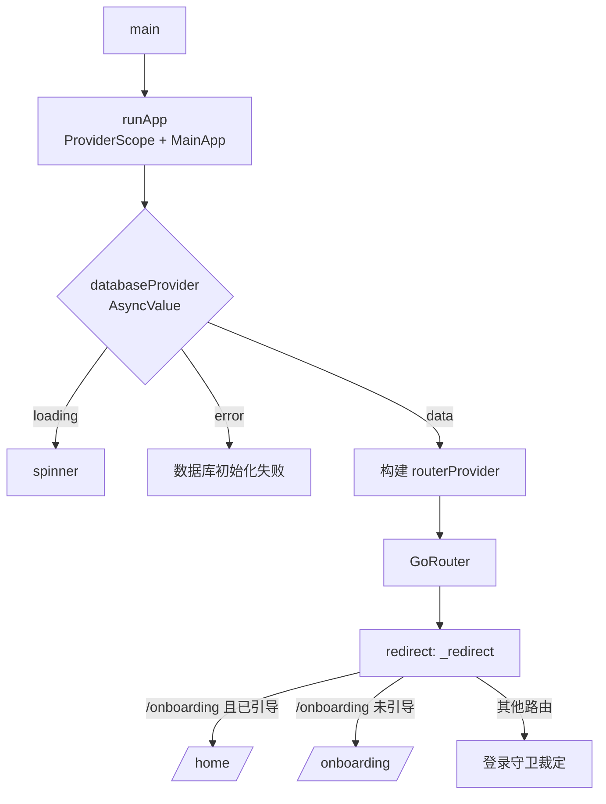
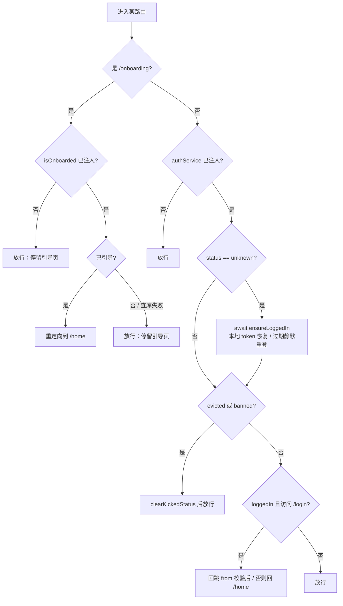
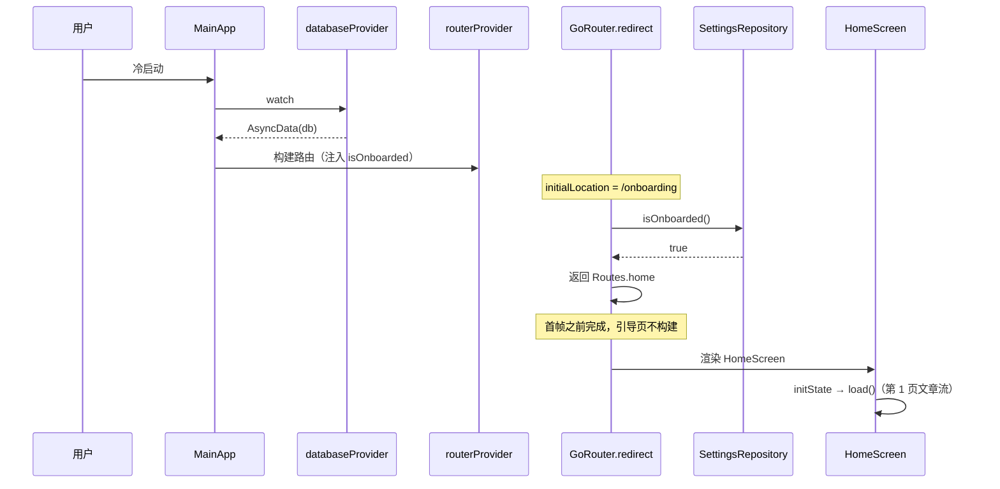

# 启动落点与路由守卫

## 主题定位

App 冷启动时**第一帧落在哪个页面**，以及此后每次导航的重定向裁定。涉及两条彼此独立、但在 `/onboarding` 这个位置上有先后关系的规则：

1. **启动落点**：已完成引导的用户直接落首页，引导页一帧都不渲染；未完成的落在引导页。
2. **登录守卫**：未登录**不**拦截本地浏览；已登录访问登录页回跳。

路由表本身（`/home`、`/reading/:articleId`、底栏四个一级页……）见 `lib/core/navigation/routes.dart`，不在本主题展开。

## 业务功能线

### 冷启动

| 用户状态 | 首帧落点 |
|---------|---------|
| 已完成引导（无论是否登录） | 首页 `/home` |
| 未完成引导 | 引导页 `/onboarding` |
| 读取引导状态失败 | 引导页 `/onboarding`（保守：宁可让用户看到向导，也不误跳进空首页） |

**「已完成引导的用户不该看到引导页」是硬要求**。曾经的实现把跳过动作放在 `OnboardingScreen` 的 `initState` → post-frame 回调里做异步查库，再 `context.go('/home')`——查库必然晚于首帧，于是每次冷启动都会闪一下引导页。现在由路由重定向在首帧之前决定落点。

### 登录

- **未登录可浏览所有本地路由**（阅读 / 词汇 / 参考 / 设置本地均可用）。唯一需要登录的是同步与远程查词，二者各自有降级；首页顶部有一条「未登录 + 登录」横幅作为入口（服务端已配置时才显示）。
- **被踢下线 / 封禁**：清为 `loggedOut` 后放行，不强制跳登录页，也不打断当前浏览。
- **已登录访问 `/login`**：回跳到 `from` 查询参数指定的来源页（校验：非空、以 `/` 开头、且不是 `/login`，防手工构造无限重定向循环），没有合法 `from` 就回首页。

## 技术实现线

### 两道关卡



**第一道：数据库门禁（`MainApp`）**。`lib/main.dart` 用 `ref.watch(databaseProvider).when(...)` 把整棵路由树挡在 DB 就绪之后。这不是可有可无的谨慎——`routerProvider` → `settingsRepositoryProvider` / `articleRepositoryProvider` 等一批 provider 都直接 `requireValue` 取库，DB 未就绪就构建路由树会抛 `StateError`（`AsyncLoading` 竞态，时好时坏）。

**推论**：路由树一旦被构建，DB 必然已就绪。因此 `OnboardingScreen` 不再自己等库（改造前它 `watch(databaseProvider)` 并在未就绪时渲染 spinner——那是第二道重复的门禁，且会让脱离 `MainApp` 的 widget 测试永久卡在 spinner 上，现已移除）。

**第二道：路由重定向（`_redirect`）**。

```dart
Future<String?> _redirect(
  AuthService? auth,
  Future<bool> Function()? isOnboarded,
  GoRouterState state,
) async {
  if (state.matchedLocation == Routes.onboarding) {
    if (isOnboarded == null) return null;
    return await _isOnboarded(isOnboarded) ? Routes.home : null;
  }
  if (auth == null) return null;
  // …登录守卫
}
```

`isOnboarded` / `authService` 为 null 表示「本地模式 / 测试不启用」对应的那条规则，直接放行。



### 顺序为什么重要

`/onboarding` 的已引导判定**先于**登录守卫，且这条分支**不触发 `ensureLoggedIn`**——首次引导先于登录，引导期间不该碰网络。用户完成引导后 `context.go('/home')`，此时才走登录守卫的 `ensureLoggedIn`。

### 重定向为什么能消除闪现

go_router 在把 `RouteMatchList` 实例化成 Widget 之前先跑 `redirect`，且 `redirect` 可以是异步的（本实现就是 `async`）。冷启动时 `initialLocation = /onboarding` 的这一次重定向会在首帧之前完成，因此已引导用户的首帧就是 `/home`，引导页一次都不构建。

### 状态变更如何触发重估

`GoRouter.refreshListenable` 接的是 `_AuthRefreshListenable`——把 `AuthService`（riverpod `StateNotifier`，非 Flutter `Listenable`）桥接成 `ChangeNotifier`。登录 / 登出 / 被踢时立即重估重定向，无需手动导航。

注意：go_router 17 的 refresh 重定向对 **push** 进入的 `/login` 不生效，push 场景的回跳由 `LoginScreen._navigateAfterLogin` 显式导航（目标与守卫分支一致）。

## 数据模型线

`isOnboarded` 的真相来源是 `user_settings.is_onboarded`（单例行 `id=1`）：

| 状态 | 取值 | 产生者 |
|------|------|--------|
| 从未引导 | 列不存在 / `false` | 空库 |
| 引导完成 | `true` | `OnboardingController.completeOnboarding` → `SettingsRepository.completeOnboarding` |

`routerProvider` 注入的是 `SettingsRepository.isOnboarded` 这个方法本身（`Future<bool> Function()`），不是某个快照值——重定向每次都现查，用户完成引导后不会读到过期的 `false`。



## 错误处理线

- **读取引导状态失败**（DB 未就绪 / 损坏）：`_isOnboarded` 捕获异常，`debugPrint` 记录后按「未引导」处理——留在引导页。既不让异常抛进重定向中断导航，也不误跳进空首页。
- **`ensureLoggedIn` 失败**（无本地 token / 过期且重登失败）：`AuthService` 内部落态为 `loggedOut`，守卫放行，本地浏览不受影响。
- **`databaseProvider` 失败**：`MainApp` 的 `error` 分支渲染「数据库初始化失败：$e」，路由树根本不构建。

## 测试覆盖

`test/core/navigation/app_router_test.dart`：

- **启动落点**：`buildRouter(isOnboarded: () async => true)` → `OnboardingScreen` findsNothing、`HomeScreen` findsOneWidget、栈为 `['/home']`；`false` → 落在引导页。这两条正是「已引导用户闪向导页」的防回归测试。
- **底栏显隐 / tab 切换 / 返回栈清理**：与改造前一致。
- 该套件用 `AppDatabase.forTesting(NativeDatabase.memory())` 顶掉 `databaseProvider`（首页启动编排链会 `requireValue` 取库），并用 `_TtsStub` 顶掉 `ttsEngineProvider`（真实 TTS 工厂在测试环境会残留 Timer）。

`test/widget_test.dart` 是启动冒烟测试：真实 `MainApp` + 真实路由表，断言落在 `OnboardingScreen`。

`test/ui/onboarding/onboarding_test.dart` 覆盖引导页自身的 3 步流程（UI 用例不再需要 DB override——引导页已不读 `databaseProvider`）。
