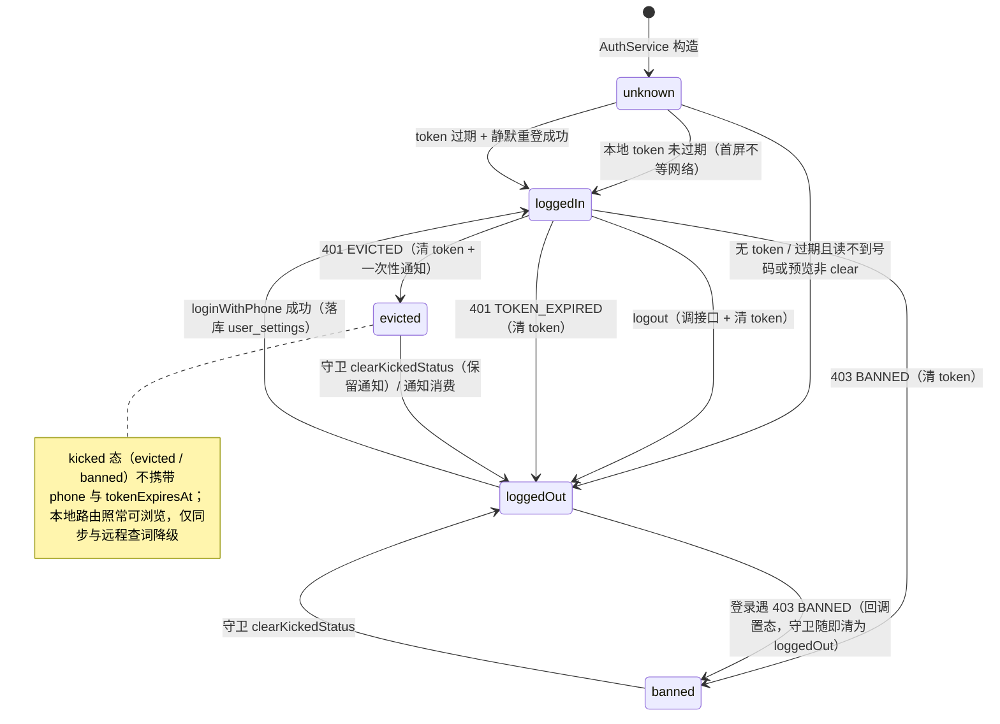
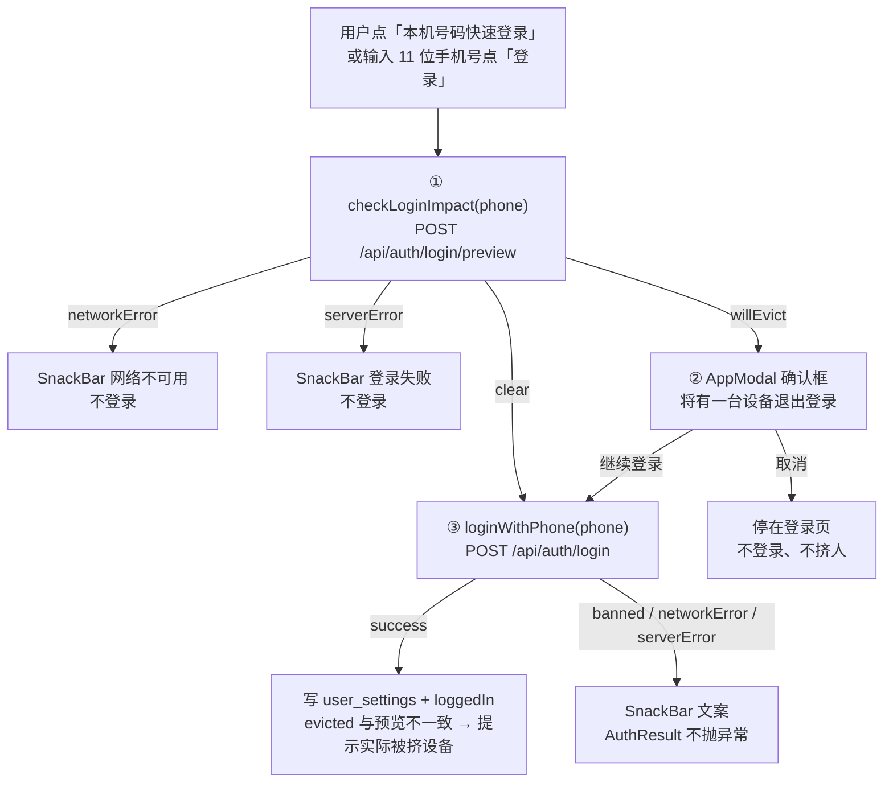
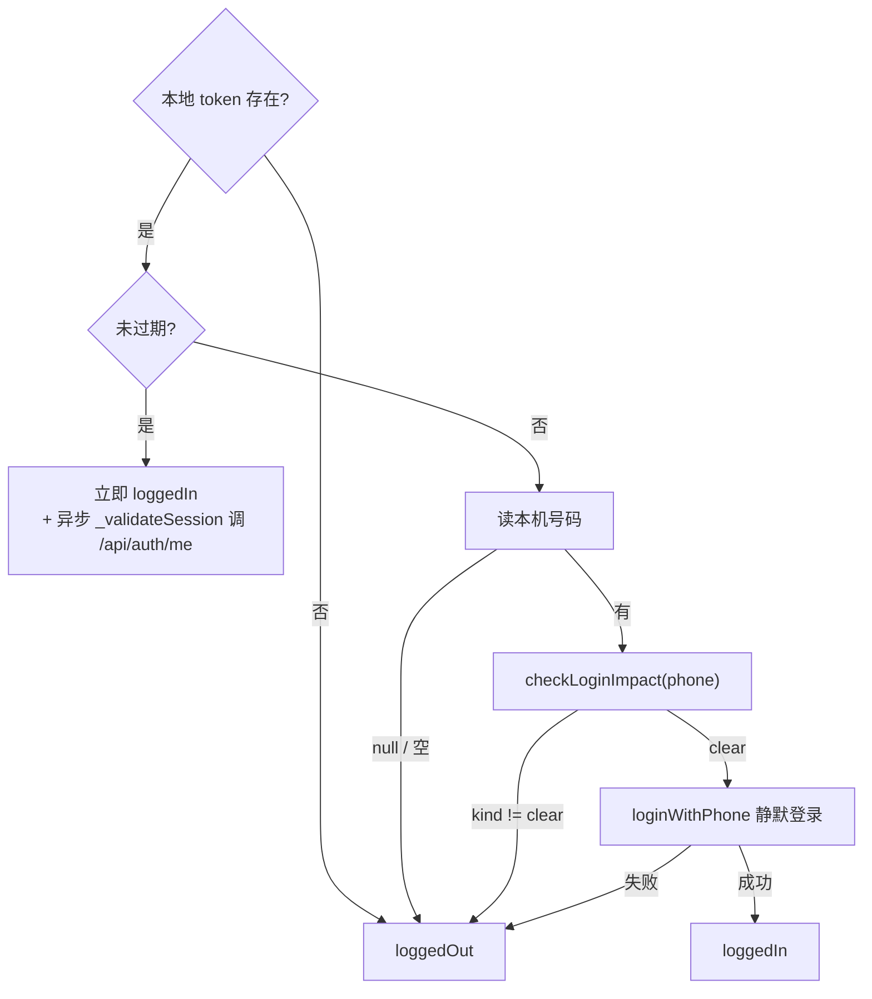
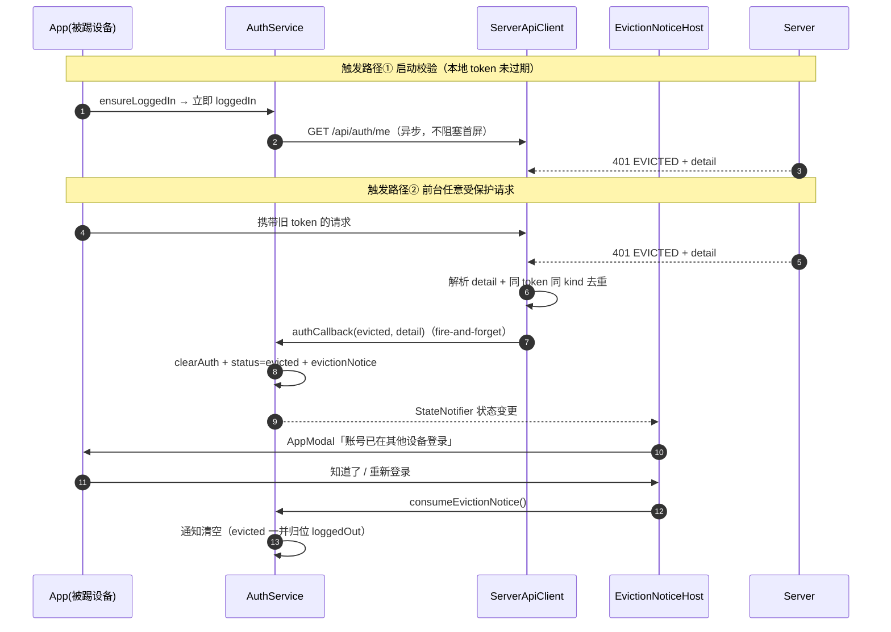
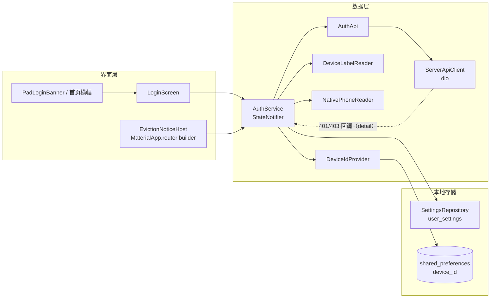
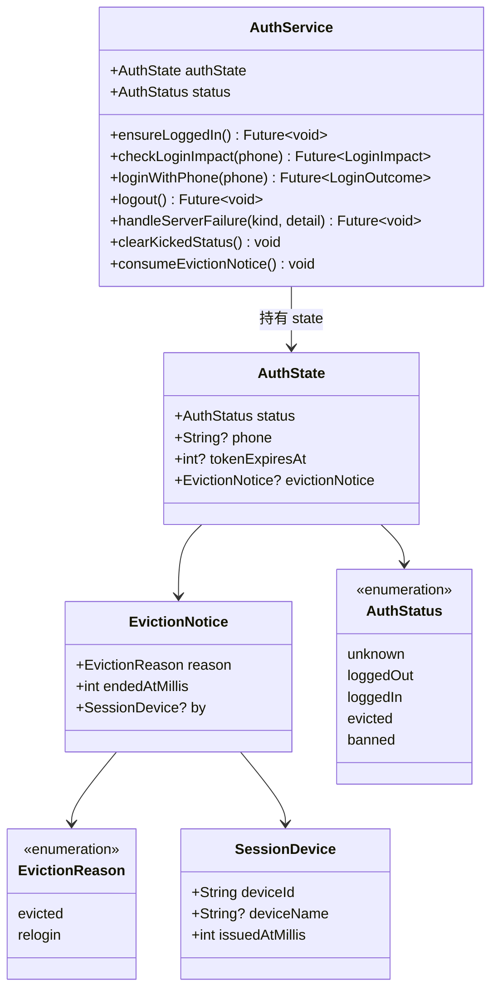
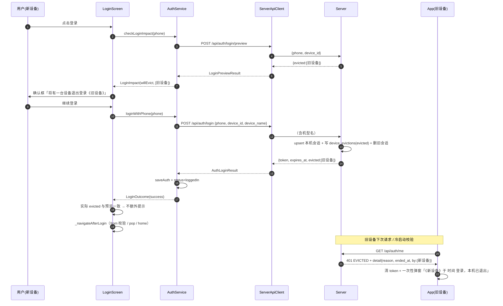

# 登录态与多设备会话

## 主题定位

本文覆盖 App 的**登录态状态机**（unknown / loggedOut / loggedIn / evicted / banned）、**凭据与设备标识**（token 落库、device_id 生成、机型名读取）、**登录三段式**（预览 → 确认 → 登录）、**静默重登守卫**、**多设备会话**（服务端 2 台上限、挤下线账本、401 `EVICTED` 的 `detail`）与**被踢提示**（两条触发路径、一次性消费）。

不在本文展开：

- 启动落点与路由重定向的顺序（`/onboarding` 先于登录守卫）见 [app-startup-routing.md](app-startup-routing.md)；
- 服务端认证实现（`resolveAuthUser` / 账本 / 端点契约）见 `impl/server/docs/architecture.md` §6、§7、§10；
- 服务端两端登录（`/api/admin/login`）不在 App 范围内。

## 业务功能线

### 登录态状态机

`AuthStatus`（`lib/data/auth/auth_service.dart`）五个取值，触发条件与守卫行为：

| 状态 | 含义 | 进入路径 | 守卫行为 |
|------|------|---------|---------|
| `unknown` | 尚未初始化（`AuthService` 构造初值） | App 首次构建 | 路由守卫 `await ensureLoggedIn()` 探测本地 token 后再裁定 |
| `loggedOut` | 未登录 | 无 token / token 已清理 / 静默重登失败 / 主动登出 / 401 TOKEN_EXPIRED / 被踢状态被守卫清收 | 放行全部本地路由；首页横幅 / 平板状态带提供登录入口 |
| `loggedIn` | 已登录（本地 token 有效或登录成功） | 本地 token 未过期（首屏不等网络）；或静默重登成功 | 访问 `/login` → 回跳 `from`（校验后）/ 首页 |
| `evicted` | 被服务端踢下线（token 被吊销） | 401 `EVICTED` 回调（含启动校验） | `clearKickedStatus()` 清为 `loggedOut` 后放行，**保留**待展示通知 |
| `banned` | 账号被封禁 | 403 `BANNED` 认证回调（受保护请求，或登录请求本身） | 同上（无通知；登录页另以 `AuthResult.banned` 提示「账号已被封禁，无法登录」） |

状态机由 `AuthService`（riverpod `StateNotifier<AuthState>`）持有，`AuthState` 含 `status` / `phone` / `tokenExpiresAt` / `evictionNotice`。

### 登录三段式（登录页）

手机与平板**共用同一个 `LoginScreen`**（手机首页横幅 push、平板 `PadLoginBanner` push → `Routes.login`），确认框只有一份实现：

1. **预览**（`①`）：`AuthService.checkLoginImpact(phone)` → `AuthApi.previewLogin`，把 `LoginPreviewResult.evicted` 归为 `LoginImpactKind`：空 → `clear`；非空 → `willEvict`（携带被挤设备列表）；`ServerApiException.errorCode == 'NETWORK'` → `networkError`；其余异常 → `serverError`。
2. **确认**（`②`）：`willEvict` 时弹 `AppModal`——标题「将有一台设备退出登录」；正文「继续登录会把《机型 · 短码》（该设备 MM-dd HH:mm 登录）挤下线。」；按钮 `[取消]` / `[继续登录]`。取消用 `Completer<bool>` 收口，**不调用登录接口、不挤人**。
3. **登录**（`③`）：`loginWithPhone(phone)` 读 `deviceId` + `deviceLabel` → `POST /api/auth/login`；成功 `saveAuth`（`server_phone` / `server_token` / `server_token_expires_at`）+ `loggedIn`，返回 `LoginOutcome`（含**本次实际**被挤设备）。预览与实际的差异（并发下"预览为空却挤了人"或挤的不是同一台）→ SnackBar「已将《…》挤下线」。

**fail-closed**：预览任何非 `clear` 结果都**不登录**（网络失败、服务端错误、会挤人未确认）——宁可让用户重试，也不在未知影响下挤掉别的设备。

**平台差异**：`NativePhoneReader.supportsLine1Number` 为 `Platform.isAndroid`；iOS 不显示「本机号码快速登录」按钮，直接进手动输入（`^1\d{10}$` 校验）；Android 读不到号码（无权限 / Android 26+ 运营商限制）时点按钮展开手动输入。

### 静默重登守卫（token 过期后）

`_doEnsureLoggedIn` 的 token 过期分支**先预览、后登录**，任一步不满足即置 `loggedOut`：

- **会挤人 / 网络失败 → 不自动登**（置 `loggedOut`，转手动登录）：静默路径没有用户确认，不存在"无人确认就踢人"的场景；用户手动登录时才会看到确认框。
- **单飞保护**：`_inflightEnsure` 让并发调用（路由守卫 + 页面同时触发）复用同一 in-flight `Future`，避免双调登录接口双写 token。

### 多设备会话（服务端规则与 App 展示）

服务端每 phone 至多 **2 台**活跃会话（`MAX_ACTIVE_DEVICES = 2`），第 3 台登录挤掉 `(issued_at DESC, id DESC)` 最旧的一台。完整链路（预览 / 登录 / 账本 / 401 detail）见 `impl/server/docs/architecture.md` §6，App 侧要点：

- **预览与登录共用同一判定**：`previewEvictions` 与 `login` 都走 `pickEvicted`，所以"预览会挤谁"与"登录实际挤谁"在无并发时一致；
- **设备展示口径统一**：`deviceLabel(deviceName, deviceId)` = `机型 · 短码`（短码 = `device_id` 末 4 位；`deviceName` 为空 → `未知设备 · 短码`）。服务端只存原始机型名，展示串由客户端拼；
- **时间展示统一**：`formatNoticeTime(millis)` = `MM-dd HH:mm`（本地时区）；
- **被挤设备的 401 `EVICTED` 带 `detail`**：`{reason, ended_at, by:{device_id, device_name, issued_at}}`；`reason='relogin'` 时 `by` = 本机（自己重登挤掉了自己的旧会话）。主动登出 / 老数据无记录 → 无 `detail`，客户端降级通用文案。

### 被踢提示（受影响的设备）

两条触发路径，汇聚到同一份状态（`AuthState.evictionNotice`）与同一份 UI（`EvictionNoticeHost`）：

1. **启动校验**：`ensureLoggedIn` 本地 token 未过期 → **先置 `loggedIn`（首屏不等网络）** → 异步 `_validateSession()` 调 `GET /api/auth/me`；401 EVICTED 经 `ServerApiClient` 认证回调收尾；**网络失败 → 保持 `loggedIn`（离线不误报）**。
2. **前台 401**：任一请求（含登录请求）拿到 401 `EVICTED` / 403 `BANNED` → `ServerApiClient` 解析 `detail` → 认证回调 → `handleServerFailure(kind, detail)`。

- **一次性消费**：通知只弹一次——`EvictionNoticeHost` 展示后由用户动作（`[知道了]` / `[重新登录]`）或点遮罩调 `consumeEvictionNotice()` 清空；路由守卫的 `clearKickedStatus()` **只清状态、保留通知**（否则守卫先于页面执行会把提示吞掉）。`ServerApiClient` 另有**同 token 同 kind 只回调一次**的去重（token 变化即重置）。
- **文案分两种**：`reason='evicted'` → 「账号已在其他设备登录」+「《新设备》于 MM-dd HH:mm 登录，本机已退出登录。」；`reason='relogin'` → 「本机已重新登录」+「本机登录状态于 MM-dd HH:mm 失效（本机重新登录）。」；无 `detail`（`by == null`）→ 「登录状态已失效，请重新登录。」——**不编造设备**。
- **不误报**：离线（`NETWORK`）不触发认证回调，启动校验失败静默保持登录态；只有服务端明确回 401/403 才提示。
- **已知取舍（接受）**：通知**仅内存持有**（`AuthState`，App 本地库无表变更）。若进程在被踢与展示之间被杀，提示丢失——token 已清，下次启动按未登录处理，不会出现错误文案，但用户看不到原因。详见下文「已知取舍」。

## 技术实现线

### 组件与依赖

| 组件 | 文件 | 职责 |
|------|------|------|
| `AuthService` | `lib/data/auth/auth_service.dart` | 登录态状态机；`ensureLoggedIn` / `checkLoginImpact` / `loginWithPhone` / `logout` / `handleServerFailure` / `clearKickedStatus` / `consumeEvictionNotice` |
| `AuthApi` | `lib/data/remote/auth_api.dart` | 服务端认证契约：login / preview / logout / me；`expires_at` 秒 → 毫秒 |
| `ServerApiClient` | `lib/data/remote/server_api_client.dart` | envelope 解包、Bearer 注入、error_code → `ServerApiException`、认证失败回调（含 `detail`） |
| `SessionDevice` / `deviceLabel` | `lib/data/remote/dto/session_device_dto.dart` | 会话设备 DTO（login `evicted` / preview / 401 `detail.by` 共用）与展示名 |
| `DeviceIdProvider` | `lib/data/auth/device_id_provider.dart` | `device_id` 生成与持久化 |
| `DeviceLabelReader` | `lib/data/auth/device_label_reader.dart` | 机型名读取（`contexta/native` → `getDeviceLabel`） |
| `NativePhoneReader` | `lib/data/auth/native_phone_reader.dart` | 本机号码读取（`getLine1Number`）与平台能力判定 |
| `LoginScreen` | `lib/ui/auth/login_screen.dart` | 三段式登录 + 确认框 |
| `EvictionNoticeHost` | `lib/ui/auth/eviction_notice_host.dart` | 被踢提示宿主（挂在 `MaterialApp.router` 的 `builder:`，覆盖两棵树与全部路由） |
| 接线 | `lib/di/providers.dart` | `authServiceProvider` 构造时把 `serverApiClientProvider` 的 `setAuthCallback` 接到 `handleServerFailure` |

`AuthService` 的依赖全部可注入（`SettingsRepository` / `ServerApiClient` / `deviceId` / `readPhone` / `readDeviceLabel` 回调），测试用 fake 替换，不碰真实网络与原生通道。

静态类型关系（`lib/data/auth/auth_service.dart` + `session_device_dto.dart`）：

### 凭据与设备标识

**token 落库**（`SettingsRepository.saveAuth` / `clearAuth`，`user_settings` 单例行 `id=1`）：

| 列 | 内容 |
|---|---|
| `server_phone` | 登录手机号（账号） |
| `server_token` | App JWT（30 天，服务端 `APP_TOKEN_TTL_SECS`） |
| `server_token_expires_at` | 过期时刻，Unix **毫秒**（服务端 `expires_at` 为秒，`AuthApi` 解析时 ×1000） |

`ServerApiClient` 的拦截器**每次请求**从 `user_settings` 现读 token 附加 `Authorization: Bearer`，返回 null 时不附加——登录 / 登出 / 被踢清 token 后无需重建客户端。

**`device_id`**（`DeviceIdProvider`）：`shared_preferences` 键 `device_id`，首次生成后固定——生成规则 = `DateTime.now().microsecondsSinceEpoch` 的 16 位 hex（左补零）+ 16 位随机 hex = **32 位 hex**（不引 uuid 包）。服务端以 `UNIQUE(phone, device_id)` 认设备，重装 App 会生成新 id（视为新设备）。

**机型名 `device_name`**（`DeviceLabelReader`）：MethodChannel `contexta/native` 的 `getDeviceLabel`，任何异常（`PlatformException` / `MissingPluginException`）→ `null`；服务端与 UI 均按「未知设备」降级，**不阻断登录**。原生实现见附录。

### 服务端 API 契约（App 侧解析）

| 端点 | 请求 | 响应（`data`） | App 解析 |
|------|------|---------------|---------|
| `POST /api/auth/login/preview` | `{phone, device_id}` | `{evicted:[{device_id, device_name, issued_at, last_active_at}]}` | `LoginPreviewResult`（只取 `device_id`/`device_name`/`issued_at`） |
| `POST /api/auth/login` | `{phone, device_id, device_name?, code?}`（空值不发送） | `{token, expires_at, evicted:[…]}` | `AuthLoginResult`（`expires_at` 秒 → 毫秒；`evicted` 空列表兜底） |
| `POST /api/auth/logout` | `{device_id}` | `{}` | 忽略（失败也继续本地登出） |
| `GET /api/auth/me` | — | `{phone}` | 启动校验（只关心成功 / 401） |
| 401 `EVICTED` | — | `error_body.detail` | `EvictionNotice`（缺失 / 畸形 → 通用通知） |

错误统一经 `ServerApiClient` → `ServerApiException{errorCode, message, statusCode, detail}`；`detail` 仅在响应体 `detail` 是 JSON 对象时携带（当前仅 EVICTED）。认证类错误额外触发回调（`AuthFailureKind`：`tokenExpired` / `evicted` / `banned`）。

### 被踢提示宿主（挂载点与导航）

`EvictionNoticeHost` 挂在 `MainApp` 的 `MaterialApp.router(builder:)` —— 位于 Router **之上**，因此覆盖手机 / 平板两棵树与全部路由（含全屏阅读页与登录页）；服务端未配置（`serverConfiguredProvider == false`）时直接透传 `child`。

导航注意：宿主在 `builder:` 中，`GoRouter.of(context)` / `context.push` 找不到 `InheritedGoRouter`（实测抛「No GoRouter found in context」），故「重新登录」按钮走 `routerProvider` 持有的 `GoRouter` 实例 push `Routes.login`。

### 通知的组装（`_noticeFromDetail`）

服务端 `detail.reason === 'relogin'` → `EvictionReason.relogin`，否则 `EvictionReason.evicted`；`ended_at` 非数值或 `by` 非对象 → 通用通知（`endedAtMillis` 取当前时间、`by = null`）；形状通过但 `SessionDevice.fromJson` 抛错（字段缺失 / 类型不符，脏数据或老服务端）→ 同样回退通用通知。**该函数绝不抛**——401 回调是 fire-and-forget（`ServerApiClient` 的 `void` 回调字段接不住 rejected Future），一旦抛出就是「token 已清但状态未置」的残局（且该 kind 已进去重集合不会再通知）。

## 数据模型线

| 数据 | 位置 | 生命周期 |
|------|------|---------|
| 登录凭据（phone / token / expires_at） | `user_settings`（drift，单例行 `id=1`） | 持久；登录写入、登出 / 被踢 / 封禁清除 |
| `device_id` | `shared_preferences` 键 `device_id` | 持久；首次生成后固定 |
| 登录态（`AuthStatus` + `EvictionNotice`） | `AuthService` 内存（riverpod） | 进程生命周期；**不落库** |
| 被踢通知 | `AuthState.evictionNotice`（内存） | 一次性——UI 消费即清；进程被杀即丢失 |
| 服务端会话 | `device_sessions`（服务端 SQLite） | 每 phone ≤ 2 行；被挤 / 登出删除 |
| 挤下线账本 | `device_evictions`（服务端 SQLite） | 流水账，只增不改（见 server architecture §3.2） |

**App 本地无表变更**：多设备登录提示不新增 drift 表 / 列（仅 `user_settings` 既有的 3 个 `server_*` 列；列缺失由 `database.dart` 的 `selfHealServerAuthColumns` 开发期自愈补列兜底）。

## 错误处理线

| 场景 | 行为 |
|------|------|
| 预览网络失败 / 超时 | `LoginImpact.networkError` → SnackBar「网络不可用，请检查网络后重试」；**不登录**（fail-closed） |
| 预览其他错误（400 / 5xx / 畸形） | `LoginImpact.serverError` → SnackBar「登录失败，请稍后重试」；**不登录** |
| 服务端为旧版本（无 `POST /api/auth/login/preview`，404 → `UNKNOWN`） | 同上：`serverError` →「登录失败，请稍后重试」；**不登录**（fail-closed）。**无降级路径**——须先升级服务端（部署顺序见 server `config-and-deploy.md` §5.2） |
| 预览会挤人 + 用户取消 | 停在登录页，不调登录接口、不挤人 |
| 登录 403 `BANNED` | `AuthResult.banned` → SnackBar「账号已被封禁，无法登录」；同时 403 认证回调置 `banned`（守卫随即清为 `loggedOut`，本地浏览不受影响） |
| 登录网络失败 / 其他错误 | `AuthResult.networkError` / `serverError` → 对应 SnackBar；方法不抛异常 |
| 登录成功但实际 `evicted` ≠ 预览 | SnackBar「已将《机型 · 短码》挤下线」（并发差异） |
| 静默重登：会挤人 / 预览失败 / 读不到号码 | 置 `loggedOut`，转手动登录（不自动挤人） |
| 启动校验网络失败 | 保持 `loggedIn`（离线不误报） |
| 401 `EVICTED` 无 `detail`（主动登出 / 老数据） | 通用通知「登录状态已失效，请重新登录。」（`by = null`） |
| 401 `EVICTED` `detail` 缺失字段 / 类型不符 | 回退通用通知，不抛（`_noticeFromDetail` 内 try/catch） |
| 401 `TOKEN_EXPIRED` | 清 token → `loggedOut`（无通知，登录页可正常重登） |
| 403 `BANNED` 回调 | 清 token → `banned`；守卫清为 `loggedOut` 放行 |
| 被踢设备离线 | 保持登录态；下次联网请求或冷启动校验时提示 |
| 服务端未配置（`SERVER_BASE_URL` 空） | 登录页按钮禁用 + 提示「服务端未配置，当前为本地模式」；路由不做登录拦截；`EvictionNoticeHost` 透传 child |
| 旧版本 App 不传 `device_name` | 服务端存 NULL → 展示「未知设备 · 短码」，各设备重新登录后补齐 |
| 旧库无 `device_name` 列 | 服务端 `ensureServerSchema` 幂等补列，重启自愈（App 无感） |

## 时序图：登录确认（踢人方）

## 已知取舍

| 取舍 | 说明 |
|------|------|
| **通知仅内存、进程被杀即丢** | 被踢提示不落库（App 无表变更）。被踢与展示之间进程被杀 → 提示丢失；token 已清，下次启动按未登录处理（不会误报，只是看不到原因）。服务端账本仍在，可查。 |
| **预览是公开接口** | 知道手机号者可查询该号的设备名与登录时间。当前账号模型本就是"手机号免密登录"（知道手机号即可登录并拿到全部数据），未新增暴露类别；`code` 字段保留给未来验证码升级。 |
| **登录硬依赖服务端预览端点** | 登录三步的第一步是 `POST /api/auth/login/preview`，且 preview 非 `clear` 一律不登录（fail-closed）。**旧服务端 + 新 App = 登录不可用**（preview 404 → `serverError`，无降级路径）——部署必须服务端先于 / 随 App 一起升级（见 server `config-and-deploy.md` §5.2）；反向（新服务端 + 旧 App）兼容。 |
| **静默重登不自动挤人** | 会挤人即放弃自动重登（转手动），代价是"token 过期 + 新设备已占满 2 台"时用户需手动操作一次；收益是**不存在无人确认就踢人的路径**。 |
| **无机型名的旧会话只能显示短码** | 存量会话 `device_name` 为 NULL → 「未知设备 · 短码」；各设备重新登录后自然补齐，不做历史回填。 |
| **封禁无独立提示** | 被踢有一次性弹窗（有账本可解释"谁在何时"），封禁只在登录时由 403 BANNED 文案承载（守卫直接清为 loggedOut 放行）。 |

## 附录：原生方法（MethodChannel `contexta/native`）

| 方法 | 平台 | 实现 | 失败 / 降级 |
|------|------|------|------------|
| `getLine1Number` | 仅 Android（`MainActivity.kt`） | `telephonyManager.line1Number` | 无 `READ_PHONE_STATE` 权限 / `SecurityException` / Android 26+ 运营商不提供号码 → `null`，登录页展开手动输入；iOS 侧频道无该方法（`supportsLine1Number=false`，直接手动输入） |
| `getDeviceLabel` | Android | `Build.MANUFACTURER`（首字母大写）+ `Build.MODEL`；机型号已含厂商名（如 `Xiaomi 2201123G`）则不重复拼接 | 返回非空字符串；通道异常在 Dart 侧兜 `null` |
| `getDeviceLabel` | iOS（`AppDelegate.swift`） | `utsname.machine`（如 `iPhone15,2`）查营销名映射表（iPhone/iPad 常见机型）；未收录机型返回 machine 原码 | 同上 |

## 测试覆盖

| 文件 | 覆盖 |
|------|------|
| `test/data/auth/device_id_provider_test.dart` | device_id 生成 32 位 hex、持久化后固定 |
| `test/data/auth/device_label_reader_test.dart` | 频道 mock：Android 名 / iOS 名 / 异常回退 null |
| `test/data/auth/auth_service_test.dart` | 启动恢复（无 token / 有效 token / 过期静默重登 / 单飞）；登录成功落库；BANNED / 网络 / 其他错误；`handleServerFailure` 三态与通知消费一次；`clearKickedStatus` 保留通知；**待展示通知期间 401 TOKEN_EXPIRED 不吞通知**；`detail.reason=relogin`；`detail.by` 畸形回退；启动校验被踢 / 网络失败不误报；预览/静默重登守卫 |
| `test/ui/auth/login_screen_test.dart` | 确认框渲染与取消（不调 login）、确认后登录、并发差异提示 |
| `test/ui/auth/eviction_notice_host_test.dart` | 两棵树都能弹、文案含设备名与时间、消费后不再弹 |
| 服务端 `tests/auth.test.ts` / `tests/db.test.ts` | preview / login evicted / 账本三态 / detail / 幂等补列（见 server 文档） |
