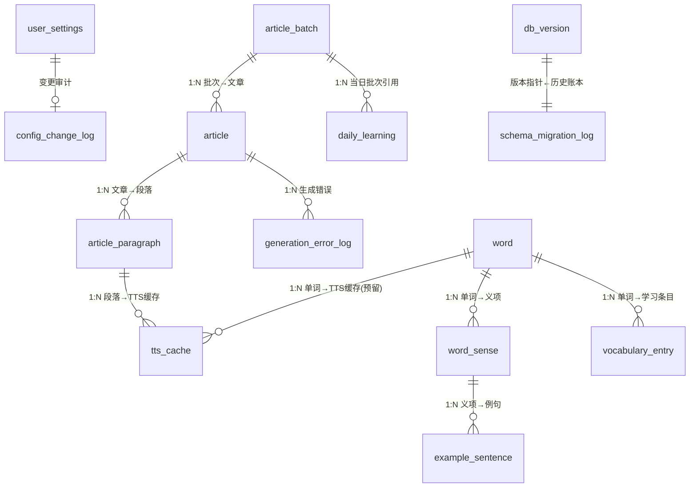
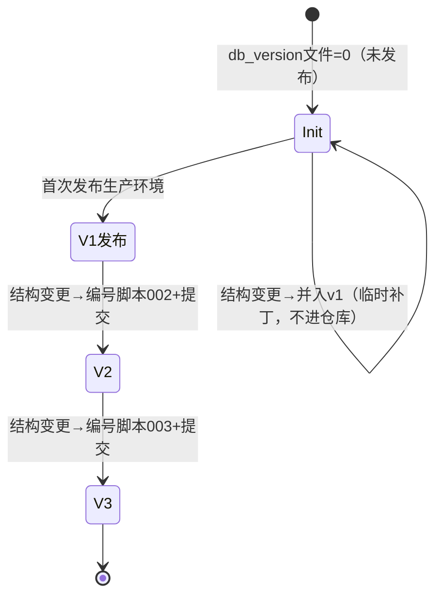
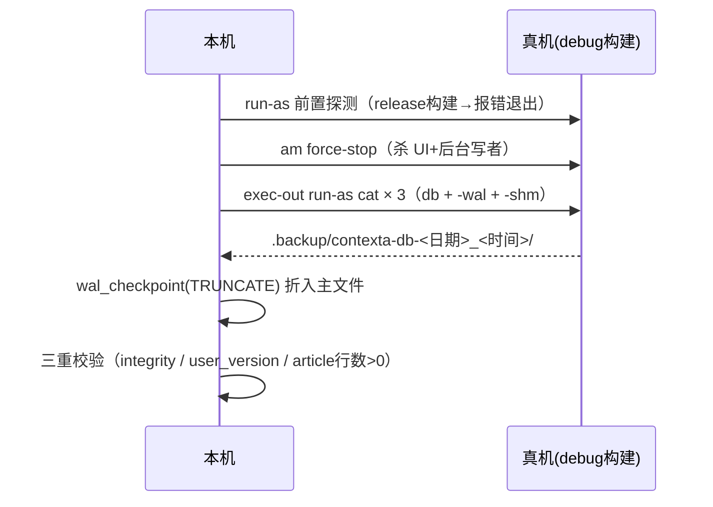

# 数据库结构与版本管理

本文档描述 Contexta 的 SQLite 数据库（drift）全貌：17 张业务表的静态结构、版本模型、迁移流程与部署纪律。代码是系统的真实知识，本文档帮助人类理解系统如何保证「数据永不丢失、结构永远最新」。

## 一、业务数据线：17 张表的静态结构

### ER 图（表间关系）



### 表清单（对照 Room 遗留 schema，逐列一致）

| 表 | 类型 | 主键 | 关键列 | 外键 |
|---|---|---|---|---|
| `user_settings` | 长期实体（1:1） | `id`（无自增） | `is_onboarded`、`difficulty_level`、`daily_article_count`、`translation_display_mode`、`tts_speed`、`mastery_threshold_n`、`auto_play_audio` | — |
| `config_change_log` | 流水账 | `id` 自增 | `field_name`、`old_value`、`new_value`、`created_at` | — |
| `schema_migration_log` | 流水账 | `id` 自增 | `from_version`、`to_version`、`description`、`created_at` | — |
| `generation_pipeline_status` | 流水账（单行） | `id`（无自增） | `is_blocked`、`blocked_reason`、`blocked_at`、`blocked_app_version_code` | — |
| `daily_learning_log` | 流水账 | `id` 自增 | `log_date`、`articles_read`、`words_added`、`seconds_spent` | — |
| `learning_stats_summary` | 长期实体（单行） | `id`（无自增） | 累计阅读/生词/掌握/天数/连续天数/最长连续/`last_active_date` | — |
| `daily_learning` | 流水账 | `learning_date`（TEXT，联合） | `ref_batch_date`、`ref_batch_id`、`daily_count_snapshot` | `ref_batch_id` → `article_batch.id` CASCADE |
| `article_batch` | 长期实体 | `id` 自增 | `status`、`difficulty_level_snapshot`、`generated_on`（UNIQUE 联合）、`last_updated_at`、`blocked_reason`、`blocked_at`、`ready_notified_at` | — |
| `article` | 长期实体 | `id` 自增 | `batch_id`、`order_index`、`content_category`、`title`、`status`、生成/阅读时间线、`retry_count`、`max_retries`、`next_retry_at` | `batch_id` → `article_batch.id` CASCADE |
| `article_paragraph` | 长期实体 | `id` 自增 | `article_id`、`order_index`（UNIQUE 联合）、`english_text`、`chinese_translation` | `article_id` → `article.id` CASCADE |
| `generation_error_log` | 流水账 | `id` 自增 | `entity_type`、`entity_id`、`error_code`、`error_message`、`error_help`、`retry_count`、`created_at`、`notified_at` | — |
| `word` | 长期实体 | `id` 自增 | `spelling_normalized`（UNIQUE）、`spelling_display`、`phonetic_ipa` | — |
| `word_sense` | 长期实体 | `id` 自增 | `word_id`、`order_index`、`part_of_speech`、`chinese_meaning`、`english_definition` | `word_id` → `word.id` CASCADE |
| `example_sentence` | 长期实体 | `id` 自增 | `word_sense_id`、`order_index`、`sentence_en`、`sentence_zh`、`is_primary` | `word_sense_id` → `word_sense.id` CASCADE |
| `vocabulary_entry` | 关系实体 | `id` 自增 | `word_id`、`instance_number`、`status`（NEW/LEARNING/MASTERED）、`correct_review_streak`、`mastered_at`、`deleted_at`、`deleted_reason` | `word_id` → `word.id` CASCADE |
| `tts_cache` | 流水账 | `id` 自增 | `article_paragraph_id`（可空）、`word_id`（可空）、`speed`、`file_path`、`file_size`、`created_at`、`last_accessed_at`（索引，FIFO 淘汰） | `article_paragraph_id` → `article_paragraph.id` CASCADE |
| `db_version` | 版本指针（单行） | `id`（无自增） | `version`、`updated_at` | — |

> 2 张 Room 遗留内部表（`android_metadata`、`room_master_table`）随旧版 App 升级留存，业务代码不读写，迁移脚本也不删除。

### 关键规则（db:NF / db:PK / db:INDEX）

- **无 DEFAULT 子句**：默认值由应用代码填充（对照 Room 逐列一致）；唯一例外是测试夹具中 `tts_speed` 的临时补丁默认值。
- **AUTOINCREMENT 纪律**：自增主键 → `AUTOINCREMENT`；单行/业务主键（`user_settings`、`generation_pipeline_status`、`learning_stats_summary`、`daily_learning`、`db_version`）→ 裸 `INTEGER PRIMARY KEY` 无自增。
- **索引按需**：外键单列索引、`(difficulty_level_snapshot, generated_on)` UNIQUE、`(article_id, order_index)` UNIQUE、`tts_cache_last_accessed_at_index` 等，全部对照 Room 自动命名规则逐条一致（schema_*_test.dart 逐列断言）。

## 二、版本管理线：db_version 指针 + 仓库文件

### 角色分工（互不推导）

| 载体 | 位置 | 内容 | 职责 |
|---|---|---|---|
| `tool/db_version` 文件 | 仓库 | `0` | **生产已发布版本**（0 = 从未发布生产环境） |
| `db_version` 表（单例行 id=1） | 库内 | `version` | **已应用编号脚本的最高目标版本**（无脚本则 1） |
| `schema_migration_log` 表 | 库内 | 每行一次迁移 | 迁移历史账本（`SchemaMigrationLogDao.getCurrentVersion()` 读取 MAX(to_version)） |

### 版本不变量（硬校验）

```
库内 db_version.version ≤ tool/db_version 文件值 + 1
```

库内版本领先发布声明（如文件=0 而库内=2）→ `migrate_db.sh` 报错中止。`db_version`（当前指针）与 `schema_migration_log`（历史账本）职责分离，互不推导。

### 打开自愈（drift beforeOpen）

```sql
CREATE TABLE IF NOT EXISTS db_version (id INTEGER NOT NULL PRIMARY KEY, version INTEGER NOT NULL, updated_at INTEGER NOT NULL);
INSERT OR IGNORE INTO db_version (id, version, updated_at) VALUES (1, 1, <毫秒>);
```

只保证「表 + 单例行存在」，版本推进只由 `migrate_db.sh` / 发布后 `onUpgrade` 管理。drift 2.34.3 中 migration（onCreate/onUpgrade）先于 `beforeOpen` 运行，旧库/新库均安全。

### 阶段语义



- **0→1 = init 阶段**：不写编号迁移脚本；init 由 drift `createAll` + asset 预置库承载。结构变更时生成临时补丁脚本（`/tmp`，不提交），仅用于备份真机库 / 升级结构时，用完即弃。
- **1→2→3 = 编号迁移**：每次结构变更递增版本，写 `tool/migrations/NNN-*.sql`（NNN = 目标版本，从 002 起；001 不存在）并提交；drift `onUpgrade` 在发布后镜像同一批变更（双写纪律）。

## 三、迁移流程线：工具链

### 工具职责

| 工具 | 职责 |
|---|---|
| `tool/backup_db.sh` | 真机库备份（部署/升级前**永远第一步**） |
| `tool/migrate_db.sh <db路径> [--check]` | 就地升级任意库副本（幂等） |
| `tool/migrations/NNN-*.sql` | 编号迁移脚本（发布后） |

### backup_db.sh 时序（WAL 三件套纪律）



缺 `-wal` 则数据停留在最近 checkpoint；主文件 0 字节时 sqlite3 会当成全新空库（integrity 假通过）——所以先 `[ -s ]` 守卫再校验。

### migrate_db.sh 三段结构

```mermaid
flowchart TD
    A[前置: integrity_check + 读 tool/db_version] --> B{db_version 表/行存在?}
    B -- 否 --> C[补表 + INSERT OR IGNORE 行=1]
    B -- 是 --> D
    C --> D{硬校验: 库内 ≤ 文件值+1?}
    D -- 超限 --> E[报错中止]
    D -- 正常 --> F[编号脚本 runner: 逐个应用 (cur, target]]
    F --> G[每个库先存 .bak-v$cur 保留现场]
    G --> H[校验 + 打印 db_version]
```

- 编号脚本契约：单文件自包含事务（`BEGIN IMMEDIATE` … `COMMIT`），以 `INSERT INTO schema_migration_log` + `UPDATE db_version` 收尾；`sqlite3 -bail` 非零立即中止（事务内自动回滚）。
- `--check` 只打印差异（缺表/缺行/待应用脚本），不修改。

### 部署流程（防卸载硬闸）

1. **备份先行**：`tool/backup_db.sh`；
2. `tool/migrate_db.sh <备份副本> --check` → 实跑 → 校验 `SELECT version FROM db_version`；
3. **签名核对**：`apksigner verify --print-certs app-debug.apk | grep SHA-256` vs `dumpsys package | grep signatures`（小写去冒号比对）；设备无包跳过；不一致 → **中止，绝不自动卸载**；
4. **versionCode 核对**：dumpsys 的 versionCode > APK → 中止（降级也触发卸载路径）；
5. `adb install -r`（**禁 flutter install / flutter run 覆盖真机**）；
6. 结构变更时推库：force-stop → push `/data/local/tmp` → chmod 666 → run-as **先删设备端 -wal/-shm 再** cp 主文件 → 拉回验证；
7. `adb shell monkey -p com.ak.contexta 1` 启动验证。

## 四、错误处理线

| 故障 | 检测 | 处置 |
|---|---|---|
| run-as 不可用（release 构建） | 备份脚本前置探测 | 报错退出，提示部署 debug 构建 |
| 拉取空文件（0 字节） | `[ -s ]` 守卫 | 中止备份，保留现场 |
| 备份损坏 | `integrity_check` ≠ ok | 中止，改查上次备份 |
| article 行数为 0 | 备份校验 | 中止（备份疑似异常） |
| 库内版本超限 | migrate 硬校验 | 报错，人工核对 db_version 文件 |
| 编号脚本失败 | `sqlite3 -bail` | 事务回滚，`.bak-v$cur` 保留现场 |
| 设备端残留 WAL | 推库前 run-as `rm -f` | 侧车帧污染新库，必须删 |
| asset 侧车残留 | 刷新后 `rm -f` | git 漏掉 -wal → 静默丢数据 |

## 五、测试验证线

- `test/data/local/schema_base_tables_test.dart` / `schema_article_tables_test.dart` / `schema_word_tables_test.dart`：逐列断言（列名/类型/notnull/pk/无 DEFAULT）、外键级联、索引名与唯一性、注册表精确集合（17 张）。
- `test/data/local/legacy_db_compat_test.dart`：Room 遗留库 fixture 兼容（临时补丁升级到 v1 后提交），断言 17 表、db_version 行=1、schema_migration_log 仍 0 行。
- `test/fixtures/legacy/contexta.db`：Room 遗留 fixture（已就地升级到 v1，含 tts_cache 表 + tts_speed 列）。
