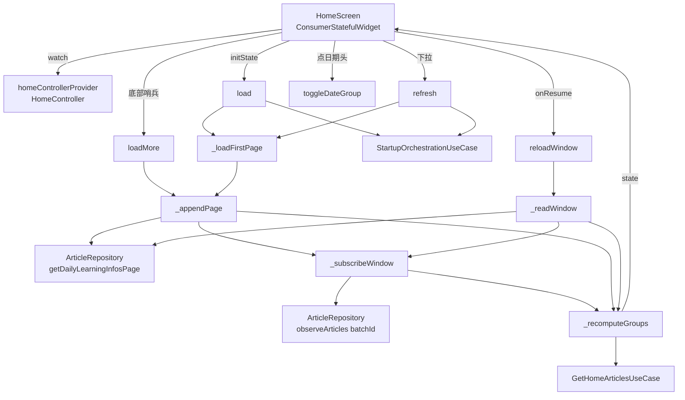
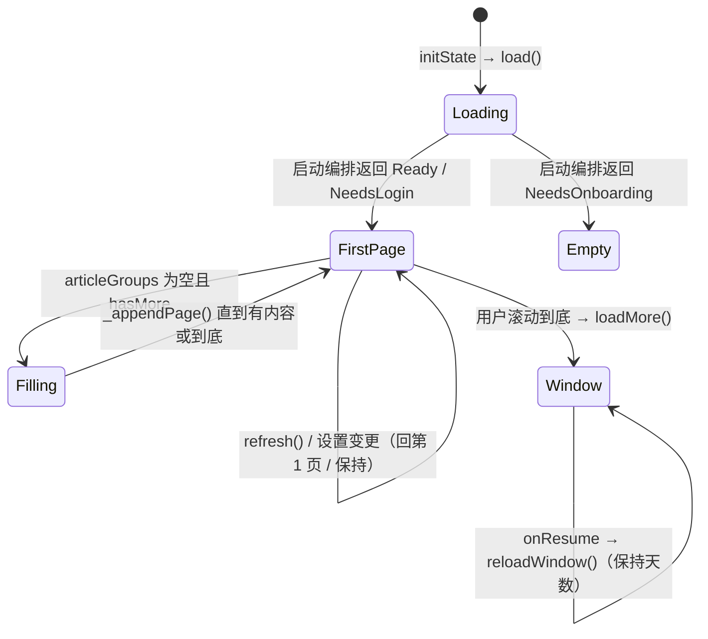
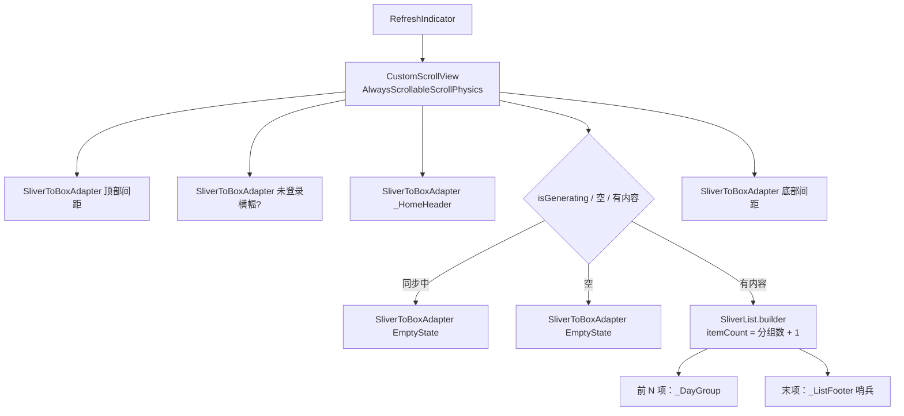

# 首页文章流

## 主题定位

首页（Home）按「日期分组」展示每日阅读文章，是整个 App 的主入口。本主题描述这条列表的**取数、分页、分组、折叠与空态**逻辑——数据全部来自本地 SQLite，不涉及网络（同步链路见 `startup-orchestration` 相关代码与 `database-schema.md`）。

两个关键约束：

- **首屏成本与历史长度解耦**：用户读到第 100 天时，冷启动不该比第 1 天慢。因此首屏只读一页（3 天）`daily_learning`，并且只为这 3 个批次建立文章流订阅，往下滚一页追加一页。
- **列表按需构建**：首帧只构建视口附近的卡片，不把整段历史一次性铺成 Widget 树。

## 业务功能线

### 首屏

打开 App 落在首页后：

1. 顶部是日期头（`2026年9月11日 星期五`），连续学习天数 > 0 时右侧显示 `连续 N 天` 胶囊；
2. 下面是按日期分组的文章卡片，**首屏只加载最近 3 天**；
3. 服务端已配置且未登录时，最上方多一条「未登录 + 登录入口」横幅（本地模式不显示）。

### 滑动加载

滚到列表底部时自动取下一页（再 3 天），无需点击。底部始终有一行提示：

| 情形 | 文案 |
|------|------|
| 正在取下一页 | `加载中…`（带小 spinner） |
| 还有更早的记录，但暂未触发 | `上拉加载更多` |
| 已经取完所有历史 | `没有更多文章了` |

哨兵是「滚到才出现」的：提示文案只有用户真的滑到底部才看得到。

### 折叠日期

点击日期头可折叠 / 展开该日文章；箭头指向「点下去会发生什么」（收起时朝下、展开时朝上）。

### 空态与「同步中」

| 状态 | 界面 |
|------|------|
| 一条阅读记录都没有（从未分配过） | `暂无文章` + `暂时没有文章，下拉刷新试试`（可下拉刷新） |
| 有记录，但今天已分配而今天的文章还没同步下来 | `文章同步中` + 同步说明（即使昨天有文章也显示这条，避免今天静默缺失） |
| 有可展示的文章 | 正常分组列表 |

### 回到前台

App 从后台回到前台会重新读库（后台同步 worker 用独立数据库连接写入，UI 侧的 drift 订阅收不到通知），**但保留用户已经滚到的页数**——不会把滚到第 5 页的用户打回第 1 页。

## 技术实现线

### 调用链



### 取数：keyset 分页

`ArticleRepository.getDailyLearningInfosPage({beforeDate, limit})` 按 `learning_date` 降序取记录：

- `beforeDate == null` → 从最新一条开始；
- `beforeDate != null` → 只取**严格早于**该日期的记录（游标当天不重复返回）。

DAO 层 `DailyLearningDao.getBefore` 直接落到 SQL（`learning_date < ?`，`ORDER BY learning_date DESC LIMIT ?`）。`learning_date` 是 ISO 日期文本（`yyyy-MM-dd`），SQLite 的 TEXT 字典序比较与日期序一致，因此不需要额外的类型转换。

**「还有更多」的判定**：调用方传 `limit = pageSize + 1`，取回后多出一条即表示还有下一页，然后裁掉多余那条。这样省掉一次 `COUNT(*)` 查询。

### 窗口模型

控制器只持有一个**窗口**（不是全量历史）：

| 字段 | 含义 |
|------|------|
| `_historyReads` | 已加载的阅读记录，`learning_date` 降序（最新在前） |
| `_hasMore` | 是否还有更早的记录未加载 |
| `_latestArticles` | `batchId → 该批次最新文章列表`（流的缓存，不随分页清空） |
| `_batchSubs` | `batchId → 文章流订阅` |
| `state.collapsedDates` | 已折叠的日期分组标签集合 |

分页动作与窗口的关系：

| 动作 | 触发 | 窗口变化 |
|------|------|---------|
| `load()` | `initState` | 重置为第 1 页（3 天）+ 跑启动编排 |
| `refresh()` | 下拉刷新 | 重置为第 1 页 + 重跑启动编排 |
| `loadMore()` | 底部哨兵 / 滚动到底 | 以窗口末条日期为游标**追加**一页 |
| `reloadWindow()` | `AppLifecycleListener.onResume` | **保持当前天数**重读（窗口不缩水） |
| `observeSettingsForRefresh` | `user_settings` 变更 | **保持当前天数**重读（难度/篇数变了要重算分组） |



### 订阅策略

只订阅窗口内批次的文章流。`_subscribeWindow({required bool resubscribeAll})`：

- `resubscribeAll = false`（滚动加载下一页）：只为**新进窗口**的批次建订阅，已订阅的不动——避免整列重建导致闪空；
- `resubscribeAll = true`（回前台 / 设置变更）：连已订阅批次一起重建——后台 worker 用独立连接写库，旧订阅收不到变更，必须重新 `watch` 才能读到最新数据；
- 掉出窗口的批次：退订并丢弃 `_latestArticles` 缓存。

### 分组与过滤

`GetHomeArticlesUseCase(articles, userDifficulty, displayLimit)`：

1. 取 `status != pending` 的文章；
2. 按 `categoryToDifficulty(contentCategory) == userDifficulty` 过滤；一个都不匹配时退回**全部**非 pending 文章（领域规则：不足时返回全部已生成文章）；
3. 按 `orderIndex` 升序，取前 `displayLimit` 条。

`displayLimit` 来自 `daily_learning.daily_count_snapshot`（分配当时抓拍的设置），不是当前 `user_settings.daily_article_count`——改篇数设置不影响已有阅读记录。

分组标签由 `_dateLabelFor` 生成：今天 / 昨天 / `2026年8月1日`。

### 列表构建



**哨兵为什么必须是 `SliverList` 的一项**：`CustomScrollView(slivers: [...])` 里的 widget 是首帧**立即构建**的，与滚动位置无关。若把 `_ListFooter` 做成独立的 `SliverToBoxAdapter`，它的 `initState` 在首帧就会跑，于是第一帧就触发 `loadMore`，一路把整段历史全部拉完——分页等于白做（此坑在开发中实际踩到过，由 `滑到底部哨兵自动补下一页` 测试兜住）。放进 `SliverList.builder` 的末项后，它只在滚到视口附近时才被构建，语义才对。

`_ListFooter` 在 `initState` 里用 post-frame 回调触发 `onLoadMore`：不能在 build 期间改状态（`loadMore` 会同步置 `isLoadingMore`）。它的 `key` 带页数（`home-footer-<分组数>`），所以新一页渲染出来后若哨兵仍在视口内，新实例会再续一页——顺带解决「首屏内容不满一屏」：此时哨兵一开始就可见，会自动取到填满为止。

## 状态机与判定细节

`HomeUiState` 的关键字段：

| 字段 | 含义 |
|------|------|
| `isLoading` | 首次加载中（true 时整页显示 LoadingIndicator） |
| `articleGroups` | 已加载窗口内可展示的分组 |
| `hasMore` | 还有更早的记录未加载（底部提示依据） |
| `isLoadingMore` | 正在取下一页 |
| `isGenerating` | 显示「文章同步中」替代列表 |
| `collapsedDates` | 已折叠的日期标签 |

`_recomputeGroups` 的两个判定：

**`todayRead`**：窗口按日期降序且不含未来日期，因此「今天有记录」等价于**窗口首条日期 == 今天**。改造前是对全量历史做 `any(== today)`，分页后只看窗口，二者等价。

**`isGenerating`**：

```
isGenerating = 窗口非空 && (todayPending || 窗口内没有任何可展示分组)
todayPending = todayRead && 今天这一组没有展示出来
```

`窗口非空` 这个前置条件是有意的：一条阅读记录都没有（从未分配过）说明「还没有该读的东西」，落 `暂无文章`；有记录却一条都展示不出来，才是「同步还没完成」，落 `文章同步中`。少了这个条件会让全新用户在空库时看到「同步中」。

## 错误处理线

- **分页查询异常**：`getDailyLearningInfosPage` 抛错会沿 `load` / `loadMore` 冒泡（当前无 catch）。本地 SQLite 读失败属数据损坏级别，不做静默降级。
- **批次行缺失**：仓储层遇到 `ref_batch_id` 指向的批次查不到时跳过该条（`daily_learning.ref_batch_id` 有 `ON DELETE CASCADE` + `foreign_keys=ON`，正常不会发生，属防御）。
- **文章流为空**：某批次流发出空列表 → 该分组不进入 `articleGroups`（`shown.isEmpty → continue`），而不是渲染一个空分组。
- **折叠态与 `SliverList` 回收**：折叠态存在 `HomeUiState` 而非 `_DayGroup` 的 `State`——`SliverList` 会 dispose 滑出缓存区的子项，留在 `State` 里的折叠态一滚就丢。

## 测试覆盖

`test/ui/home/home_test.dart`：

- **controller**：分页（首屏恰好请求一页 `(null, 4)`）、`loadMore` 用窗口末条日期作游标且到底后不再请求、`reloadWindow` 不截断窗口、`toggleDateGroup` 折叠往返、首屏分组全空时自动补页；
- **UI**：折叠点击后文章卡片消失（对应「点了没反应」的回归）、底部三态文案、滑到底部哨兵自动补下一页、空态与同步中两套文案、下拉刷新接线。

`test/data/repository/repositories_test.dart` 覆盖 `getDailyLearningInfosPage` 的 keyset 语义（降序、游标严格早于、到底返回空页）；`test/data/local/daos/settings_daos_test.dart` 覆盖 `getBefore` 的 SQL 层截断与游标。

`test/core/navigation/app_router_test.dart` 用 `AppDatabase.forTesting(NativeDatabase.memory())` 顶掉 `databaseProvider`——首页的启动编排链（`startupOrchestrationUseCase → syncArticlesUseCase`）会直接 `requireValue` 取库。
