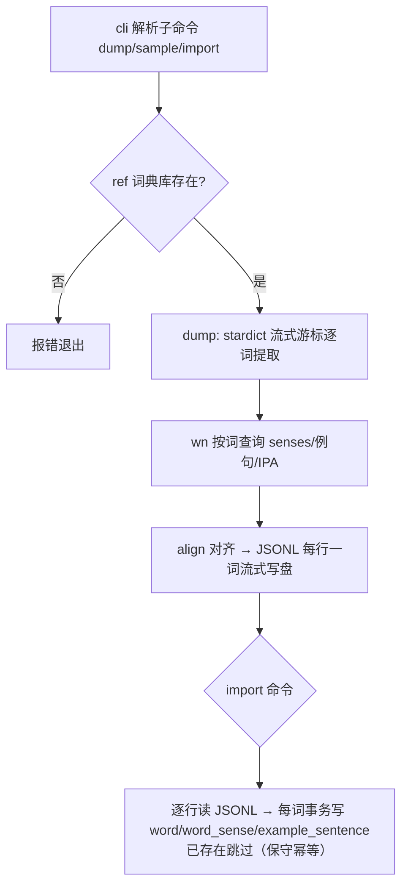
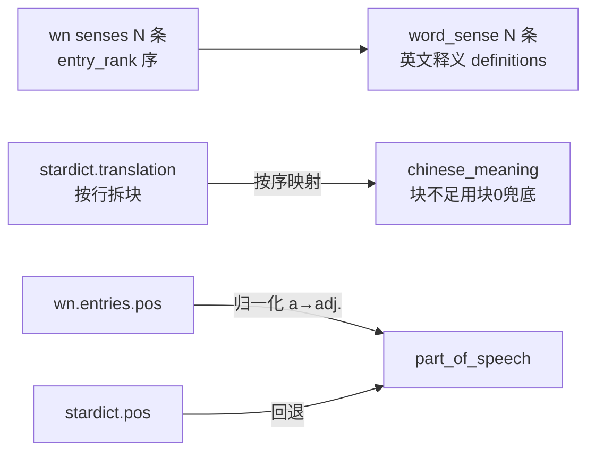

# 多源词典导入生成器运行逻辑

生成器：`impl/etl`（Rust，`cargo run --`）
产物：`impl/etl/tmp/import_words.jsonl`（中间数据，不直接写库；tmp 目录 gitignore）
导入：`etl import <file> --target-db <path>`（JSONL → app 库三表）

## 1. 整体流程



- dump 默认不写库，仅产出 `import_words.jsonl`（默认 `temp_docs/`）
- `sample` = 精选词模式的 dump（默认 serendipity / ephemeral / resilience），快速检查
- `import` 才写目标库（默认 `assets/contexta.db`）

## 2. 数据源与字段映射

两个只读源库（`impl/etl/ref/`），全部只 SELECT 不修改：

| 源 | 提供字段 | 目标表 |
|---|---|---|
| `stardict.db` | 词形 `word`、音标 `phonetic`（回退）、中文释义 `translation`（按块）、词性 `pos`（回退） | word / word_sense |
| `wn.db` | 义项 `senses`（词性 + 英文释义 `definitions`）、例句 `synset_examples`（en）、音标 `pronunciations`（IPA，优先） | word_sense / example_sentence |

## 3. 关键查询（wn.db，按词形找义项）

```sql
-- 义项：senses → forms(entry) → entries(pos) + definitions(by synset)
SELECT e.pos, d.definition
FROM senses se
JOIN forms f ON f.entry_rowid = se.entry_rowid
JOIN entries e ON e.rowid = se.entry_rowid
LEFT JOIN definitions d ON d.synset_rowid = se.synset_rowid
WHERE f.form = ? ORDER BY se.entry_rank, se.synset_rank;

-- 例句：synset_examples（definitions 是 NULL 的按 synset 关联）
SELECT DISTINCT ex.example FROM synset_examples ex
JOIN senses se ON se.synset_rowid = ex.synset_rowid
JOIN forms f ON f.entry_rowid = se.entry_rowid
WHERE f.form = ?;

-- 音标：IPA 裸值（phonemic=1，notation 恒空），优先于 stardict.phonetic
SELECT value FROM pronunciations p
JOIN forms f ON f.rowid = p.form_rowid
WHERE f.form = ? AND p.phonemic = 1
ORDER BY p.variety = 'en-US' DESC, p.rowid LIMIT 1;
```

## 4. 义项对齐策略

wn 的 sense 是**事实主**，stardict 提供中文翻译，按顺序 1:1 对齐：



- **词性**：wn `entries.pos`（`a`→`adj.`、`j`→`adj.`、`n`→`n.`、`v`→`v.`，多缩写 `vt./vi.` 取前段），回退 stardict
- **音标**：wn IPA 优先，stardict.phonetic 回退
- **中文释义**：stardict.translation 按块；`[医]/[化]` 标注块继承首块词性；块不足用块 0 兜底；再空填「（无中文释义）」

## 5. 例句分配

每个义项 1 条 → `example_sentence`，分配规则：

```
sense[0]（主义项）→ wn 例句（is_primary = 1）
其余 sense[i]  → wn synset 例句（is_primary = 0）
               └─ wn 例句不足时，该义项无例句
```

- `is_primary`：义项 0 为 1，其余为 0
- `order_index`：义项内从 1 递增（义项间独立）

**例句质量过滤（硬约束，必须含目标词）**：wn.synset_examples 挂在**词义集合**上，例句不保证含目标词（如 ephemeral 的例句 "a passing fancy" 含 passing 而非 ephemeral，全量统计仅 36.4% 含原形）。生成器只采纳**含目标词原形**的例句（词边界 `\b` + 忽略大小写，预编译正则），不含则该义项无例句。

## 6. 中间数据形态（JSONL，每行一词）

```json
{"spelling_normalized":"ephemeral","spelling_display":"ephemeral","phonetic_ipa":"ɛˈfɛ.mə.ɹəl",
 "senses":[{"order_index":0,"part_of_speech":"adj.","chinese_meaning":"朝生暮死的, 短命的, 短暂的","english_definition":"lasting a very short time"},
           {"order_index":1,"part_of_speech":"n.","chinese_meaning":"暂时的","english_definition":"anything short-lived, as an insect that lives only for a day in its winged form"}],
 "examples":[{"sense_idx":0,"order_index":1,"sentence_en":"the ephemeral joys of childhood","sentence_zh":"","is_primary":true}]}
```

- `examples[].sense_idx` 引用 `senses[].order_index`（import 时解析成 word_sense_id）
- 字段与 drift 表 `word` / `word_sense` / `example_sentence` 一一对应
- 每词最多 `--max-samples`（默认 10）条例句，跨义项分配，义项 0 优先（is_primary=true）

## 7. 参数与用法

| 命令 | 参数 | 说明 |
|---|---|---|
| `dump` | （无） | 默认 3 个精选词 → `import_words.jsonl`，不写库 |
| `dump` | `--words "a b c"` | 指定单词（空格分隔） |
| `dump` | `--all` | 全量（stardict 全部词条，340 万，流式） |
| `dump` | `--all --limit N` | 全量模式取前 N 词（测试用） |
| `dump` | `--max-samples N` | 每词例句上限（默认 10） |
| `dump` | `--output <路径>` | 覆盖输出文件 |
| `sample` | 同 dump | 精选词模式，默认 serendipity / ephemeral / resilience |
| `import` | `<file.jsonl>` | 导入到默认 `assets/contexta.db` |
| `import` | `--target-db <路径>` | 指定目标库 |

**执行语义**：每个单词独立事务；目标库已存在的词跳过不覆盖；一词失败只回滚该词，不影响其他词。

**保守幂等**（不删除、不覆盖）：
- dump 时：目标库已存在该词（`spelling_normalized` 匹配）→ 跳过该词
- import 时：`spelling_normalized` 已在库 → 跳过；`INSERT` 兜底唯一约束冲突
- 重复导入同文件：已导入的词跳过，未导入的补插 → 不产生重复数据

## 8. 内存策略（流式，<100MB）

| 数据 | 策略 |
|---|---|
| stardict（851MB / 340 万行） | 流式游标逐行处理即弃，不物化 |
| wn（139MB / 23 万 forms） | 不预载，prepared statement 按词查（走 form_index） |
| 目标库已存在词 | 整表 HashSet（当前 ~15 行） |
| 输出 | BufWriter 逐块写盘；stderr 每 10k 词进度 |

实测：`--all --limit 200000` 峰值内存 **15MB**。

## 9. 局限与取舍

- **例句缺口**：wn 无例句的义项（如 serendipity / resilience）会缺失
- **中文例句缺失**：wn 例句仅英文（`sentence_zh` 为空）；原 lingua.db 中英对照数据源已废弃
- **音标格式**：wn 的 IPA 是含音节点标记（如 `ˌsɛ.ɹən.ˈdɪ.pɪ.ti`），与 app 现有 `ˈprɛmɪsɪz` 风格一致
- **专业标注**：`[医]` 等块并入同义项（词性继承），不单独成义项
- **不更新已导入词**：保守策略下，词典数据更新后需手动删除旧词再重导
