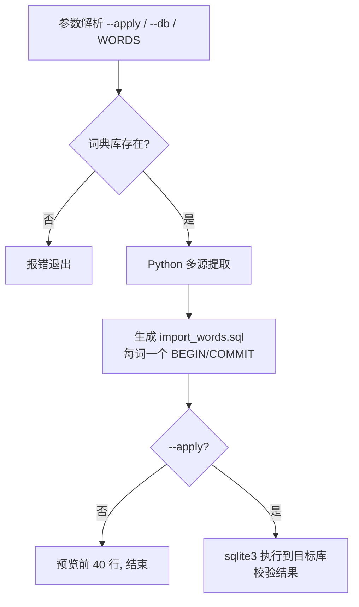
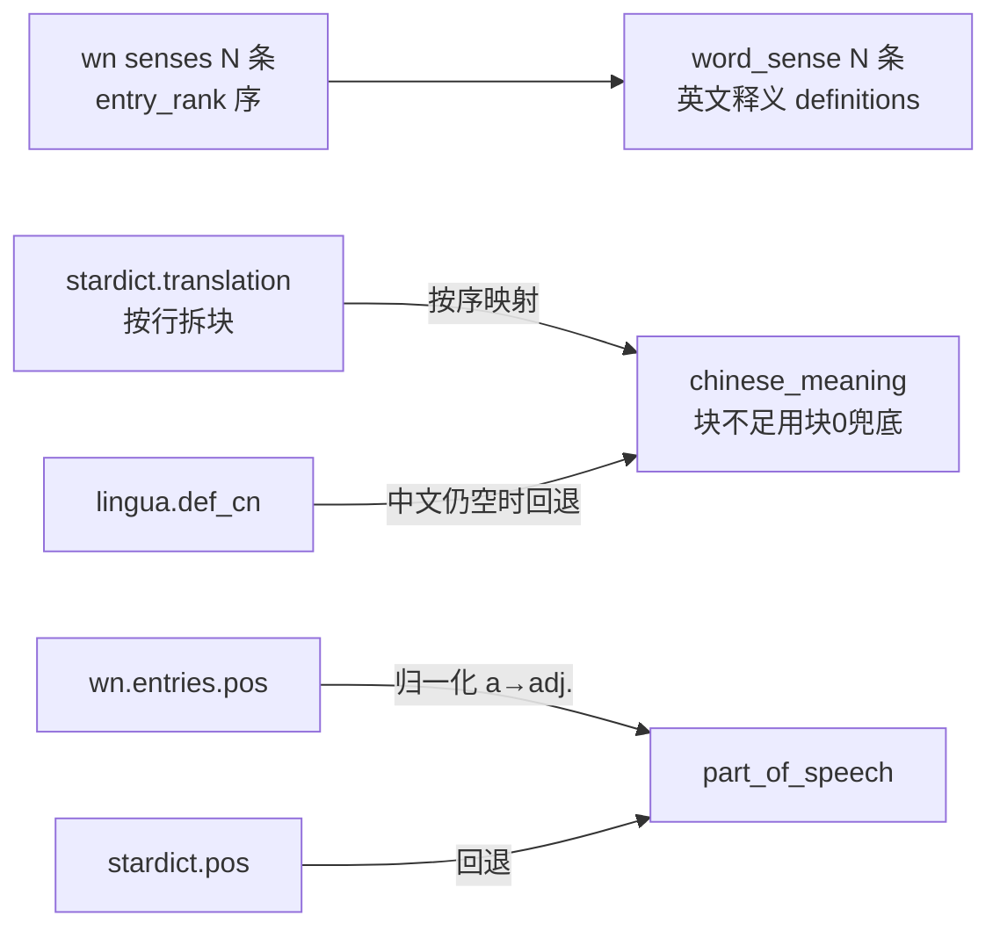

# 多源词典导入生成器运行逻辑

生成器：`temp_docs/import_stardict_words.sh`
产物：`temp_docs/import_words.sql`（只生成 SQL，不写库）

## 1. 整体流程



- 默认不写库，仅产出 `import_words.sql`
- `--apply` 才执行到目标库（默认 `assets/contexta.db`）
- `WORDS="a b c"` 环境变量覆盖默认单词

## 2. 数据源与字段映射

三个只读源库（`ref/`），全部只 SELECT 不修改：

| 源 | 提供字段 | 目标表 |
|---|---|---|
| `stardict.db` | 词形 `word`、音标 `phonetic`（回退）、中文释义 `translation`（按块） | word / word_sense |
| `wn.db` | 义项 `senses`（词性 + 英文释义 `definitions`）、例句 `synset_examples`（en）、音标 `pronunciations`（IPA，优先） | word_sense / example_sentence |
| `lingua.db` | 中文释义 `def_cn`（回退）、对照例句 `example_en`/`example_cn`（中英一对） | example_sentence |

## 3. 关键查询（wn.db，按词形找义项）

```sql
-- 义项：senses → forms(entry) → entries(pos) + definitions(by synset)
SELECT e.pos, d.definition
FROM senses se
JOIN forms f ON f.entry_rowid = se.entry_rowid
JOIN entries e ON e.rowid = se.entry_rowid
LEFT JOIN definitions d ON d.synset_rowid = se.synset_rowid
WHERE f.form = ? ORDER BY se.entry_rank, se.synset_rank;

-- 例句：synset_examples（definitions 是 NULL 的按 synset 关联）
SELECT DISTINCT ex.example FROM synset_examples ex
JOIN senses se ON se.synset_rowid = ex.synset_rowid
JOIN forms f ON f.entry_rowid = se.entry_rowid
WHERE f.form = ?;

-- 音标：IPA 裸值（phonemic=1，notation 恒空），优先于 stardict.phonetic
SELECT value FROM pronunciations p
JOIN forms f ON f.rowid = p.form_rowid
WHERE f.form = ? AND p.phonemic = 1
ORDER BY p.variety = 'en-US' DESC, p.rowid LIMIT 1;
```

## 4. 义项对齐策略

wn 的 sense 是**事实主**，stardict 提供中文翻译，按顺序 1:1 对齐：



- **词性**：wn `entries.pos`（`a`→`adj.`、`j`→`adj.`、`n`→`n.`、`v`→`v.`，多缩写 `vt./vi.` 取前段），回退 stardict
- **音标**：wn IPA 优先，stardict.phonetic 回退
- **中文释义**：stardict.translation 按块；`[医]/[化]` 标注块继承首块词性；块不足用块 0 兜底；仍空回退 lingua.def_cn；再空填「（无中文释义）」

## 5. 例句分配

每个义项 1 条 → `example_sentence`，分配规则：

```
sense[0]（主义项）→ lingua 对照例句（en+cn，中英都有）
其余 sense[i]  → wn synset 例句（仅 en，中文为空）
               └─ wn 例句不足时，该义项无例句
```

- `is_primary`：义项 0 为 1，其余为 0
- `order_index`：例句在义项内从 1 递增（义项间独立）

**例句质量过滤**（必须含目标词）：wn.synset_examples 挂在**词义集合**上，例句不保证含目标词（如 ephemeral 的例句 "a passing fancy" 含 passing 而非 ephemeral，全量统计仅 36.4% 含原形）。生成器只采纳**含目标词原形**的例句（词边界 `\b` + 忽略大小写），不含则该义项无例句。

## 6. 生成的 SQL 结构（每词一组，每词一个事务）

```sql
-- ════ 单词 A ════
BEGIN;
-- 组 1：插入 word（OR IGNORE 防重）
INSERT OR IGNORE INTO word (...) VALUES (normalized, display, phonetic);
-- 组 2：插入义项（s 子查询携带 order_index，按词形 JOIN 到 word 行取 id）
INSERT INTO word_sense (...) SELECT w.id, s.order_index, ...
FROM word w JOIN (...) s ON w.spelling_normalized = 'word_a';
-- 组 3：插入例句（e 子查询携带 sense_idx，按 order_index 关联回义项）
INSERT INTO example_sentence (...) SELECT s.id, e.order_index, ...
FROM word_sense s JOIN (...) e ON e.sense_idx = s.order_index
  AND s.word_id IN (SELECT w.id FROM word w WHERE w.spelling_normalized = 'word_a');
COMMIT;

-- ════ 单词 B（同上结构，独立事务）════
BEGIN; ... COMMIT;
```

**保守幂等**（不删除、不覆盖）：
- 生成时：目标库已存在该词（`spelling_normalized` 匹配）→ 整组**跳过**，输出 `-- ⏭️ 已存在，跳过`
- 执行时：`INSERT OR IGNORE` 兜底唯一约束冲突
- 重复执行同文件：已导入的词跳过，未导入的补插 → 不产生重复数据

**别名纪律**（修复过的坑）：JOIN 子查询列必须显式别名（`s.order_index`、`e.sense_idx`），且 JOIN 条件引用主表列（`w.spelling_normalized`）时，主表必须为**真实表**（`FROM word w JOIN (...)`）而非子查询，否则 `ambiguous column name` / `no such column` 报错。

## 7. 参数与用法

| 参数 | 默认 | 说明 |
|---|---|---|
| （无） | 3 词 | 生成 `import_words.sql`，不写库 |
| `--all` | — | 全量生成（stardict 全部词条，340 万） |
| `--apply` | — | 生成后直接执行到目标库 |
| `--db <路径>` | `assets/contexta.db` | 指定目标库（配合 `--apply`） |
| `WORDS="..."` | 环境变量 | 覆盖要导入的单词（空格分隔） |

手动执行方式：`sqlite3 assets/contexta.db < temp_docs/import_words.sql`

**执行语义**：每个单词独立事务（`BEGIN`/`COMMIT`）；目标库已存在的词跳过不覆盖；一词失败只回滚该词，不影响其他词。

## 8. 局限与取舍

- **例句缺口**：wn 无例句的义项（如 serendipity）会缺失；stardict 本身无例句字段
- **中文例句稀缺**：仅当 lingua.db 有该词才出现中英对照（3 词中仅 resilience）
- **音标格式**：wn 的 IPA 是含音节点标记（如 `ˌsɛ.ɹən.ˈdɪ.pɪ.ti`），与 app 现有 `ˈprɛmɪsɪz` 风格一致
- **专业标注**：`[医]` 等块并入同义项（词性继承），不单独成义项
- **不更新已导入词**：保守策略下，词典数据更新后需手动删除旧词再重导
