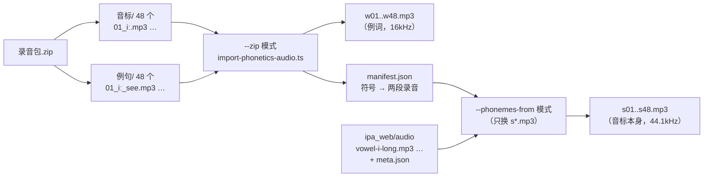
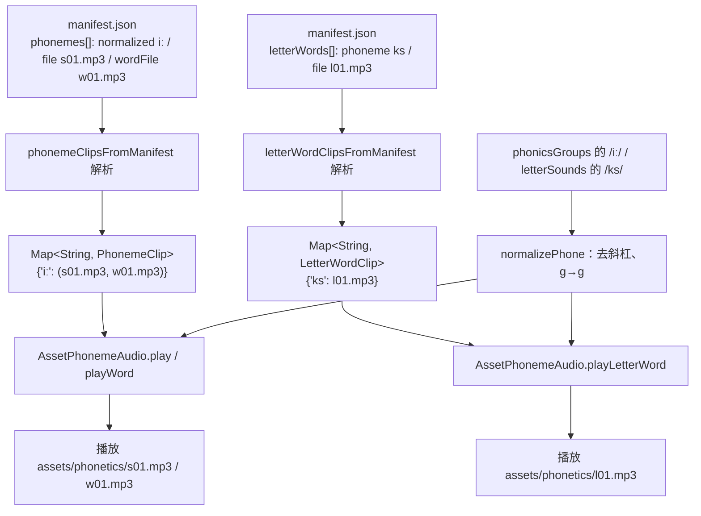
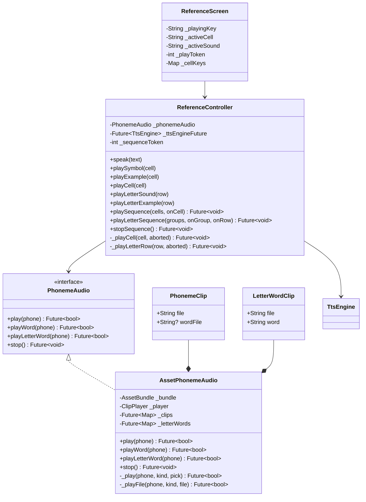
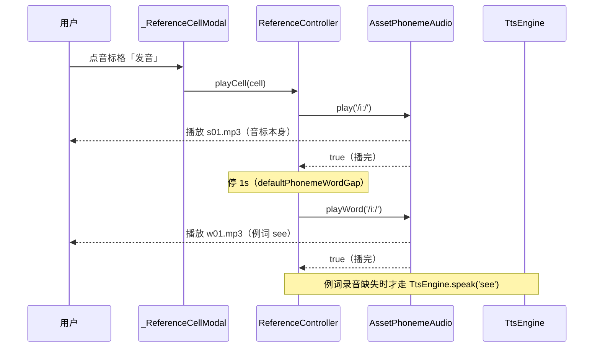
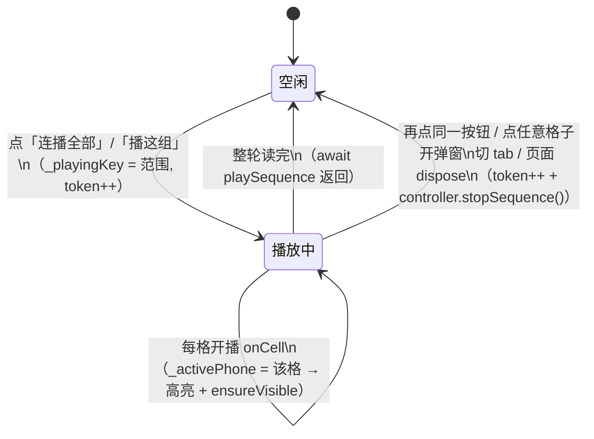

# 音标录音（参考页音标发音）

## 主题定位

参考页 48 个国际音标**本身**及其**例词**的发音——随安装包分发的真人录音，不经过 TTS。本主题覆盖素材来源与产出、符号到文件的映射、播放链路（单格点播与连播）、与 TTS 的分工、失效兜底五条线。

字母表「常见读音」那些行**复用的就是本主题这 48 个录音**（按符号查同一份 manifest）——字母表那块功能见 [reference-alphabet.md](reference-alphabet.md)；字母名与组合音例词走 TTS，见 [tts-engine.md](tts-engine.md)。

## 业务功能线

参考页「音标」tab 下列 8 组 48 个音标（`phonicsGroups`）。用户点开任一格子出现弹窗，弹窗里三个发音入口：

| 入口 | 音标格（音标 tab） | 字母读音行（字母表弹层） |
|------|--------|--------|
| ① 点符号 | **放录音**（该音标本身） | **放录音**（该读音本身）；组合音没录音时读例词 |
| ② 点例词 | **放录音**（该例词，see） | **放录音**（音标库例词，或字母读音行自己的那批） |
| ③ 「发音」/ 连播 | **音标录音 → 停 1s → 例词录音** | 连播里同款两段（弹层本身没有「发音」按钮） |

两边的录音都取自同一套随包资产（字母表那条线见 [reference-alphabet.md](reference-alphabet.md)）；录音缺了才回退 TTS 读例词（IPA 原文绝不进 TTS）。字母表弹层里**不再有**字母名与字母表例词（`Apple`）的入口——字母名只在连播里由 TTS 报一次。

**连播**（对着整张表听）：音标 tab 顶部一个「连播全部 48 个」，每个分组标题右侧一个「播这组」——点一下从该范围第一个音标开始自动往下读：

- 格内：音标录音 → 停 1s → 例词录音（与点「发音」完全同款）
- 格与格（同组）：例词读完 → **再停 1s** → 下一格（`rowIndex > 0` 时才停，最后一格不空等）
- **组与组：停 1s**（`defaultGroupGap`），换组听得出来

**节奏由录音长度决定**：整轮 = Σ(音标 + 例词) + 48 次「格内停 1s」+ 40 次「格间停 1s」+ 7 次「组间停 1s」。
2026-09-21 换 `ipa_web` 音标后，音标段平均 1.02s（旧包 0.32s）、例词段 0.52s，
故整轮约 **2.9 分钟**、约 **3.6s/格**（旧包约 1.6 分钟 / 1.8s/格；2026-09-22 加格间那
一拍之前是 2.2 分钟）。变长主要来自新录音本身更长 + 首尾静音未裁（换包时明确选择
「原样转码」）+ 每格之间那一拍——若日后觉得拖沓，先考虑裁掉 ~0.3s 前导 /
~0.22s 尾部静音，而不是改停顿时长。

播放中当前格珊瑚描边高亮并自动滚到可见；再点同一个按钮即停。见「连播状态机」。

**为什么音标不用 TTS**：TTS 引擎读不出 IPA 符号。早先的替代方案是给每个音标配一段「拟音英文拼写」（`/ɪ/` → "it"、`/dz/` → "ads"）送进 TTS——拟音本身不像英文词时又会被音素器逐字母拼读，得靠离线核验逐个挑锚词，48 个音标全靠人工调参，且终究不是那个音。改用真人录音后这条链路整个消失。

**例词为什么也换成录音**（2026-09-21）：例词原本送 TTS 读，但同一格里的音标是真人录音、例词是合成音，交叉听是两把嗓子；且参考页是「对着表一个个听」的场景，读音要经得起跟读。录音包里自带 48 个例词录音（同一播音员），于是例词也改放录音，TTS 只负责字母名与兜底。

**表格里的例词跟着录音走**：`phonicsGroups` 的 `example` 必须与录音包里的词一致（如 `/uː/` 是 blue 而不是 moon）——录音不会迁就表格，表里写 blue 才能听到 blue。这一致性由测试守门（见「测试覆盖」）。

## 技术实现线

### 素材来源与产出（导入脚本）

素材有两个来源，由 `impl/server/tool/import-phonetics-audio.ts` 的两个模式分别导入
`impl/app/flutter/assets/phonetics/`：



**`--zip` 模式**（整套导入，含例词）：

- 包内文件名 = `<序号>_<符号>[_<例词>].mp3`，序号 01–48（音标与例词两目录序号一一对应，脚本按序号配对，缺一方就报错退出）。
- 落盘改成**纯 ASCII 序号**（`s` = symbol、`w` = word）：macOS 大小写不敏感 + Unicode 有 NFC/NFD 差异，含 IPA 的文件名容易与清单对不上——**符号与文件的对应只认 manifest**。

**`--phonemes-from` 模式**（只换 48 个音标本身，例词与清单映射一字不动）：

```
bun run tool/import-phonetics-audio.ts --phonemes-from <ipa_web 目录>
```

- 源为音标站 `ipa_web`（音频取自 [resetsix/english-ipa](https://github.com/resetsix/english-ipa)），其 `meta.json` 给出 `symbols[].symbol` → `audio` 的对应。
- **按符号替换，不按位置**：App 的 `phonicsGroups` 顺序（… ɑː ɒ ɔː ʊ uː ʌ ɜː ə …）与 manifest 顺序（… ʌ ɜː ə uː ʊ ɔː ɒ ɑː …）**不同**，按序号对位会整体错位、发音张冠李戴。替换只改每个符号自己 `file` 槽里的内容（`iː` 写 `s01.mp3`、`r` 写 `s46.mp3`……），所以 manifest 与 `w*.mp3` 完全不动。
- 覆盖先校验后写入：源里缺任何一个符号整体退出（码 1），不留半新半旧的包。
- 脚本按 `reference_data.dart` 的 `phonicsGroups` 正则读出 App 需要的 48 个符号做覆盖率比对（不在脚本里重复维护清单）。

**音频规格**（音标与例词**不同码率**，是有意的）：

| 素材 | 规格 | 理由 |
|------|------|------|
| `s*.mp3`（音标） | 44.1kHz 单声道 96kbps | 不降到 16kHz：/s/ /ʃ/ /f/ /θ/ 的能量集中在 4kHz 以上，降到 16k 会先把它们磨钝——而换这一包图的就是读音准。48 个约 590KB |
| `w*.mp3`（例词） | 16kHz 单声道 40kbps | 沿用人工录音包原样 |
| `l*.mp3`（字母读音行的站点例词，3 个） | 24kHz 单声道 64kbps | 不走本主题的导入脚本，由 App 自带的 KittenTTS 预生成——见 [reference-alphabet.md](reference-alphabet.md)「素材来源」 |

三套合计约 920KB。相对 `assets/` 总量（66MB：TTS 模型 43MB + 库 23MB）可忽略，所以音标那边选了保真而非省体积。

**源文件是 ADTS AAC 却挂着 `.mp3` 扩展名**——这是换包路上最深的一个坑，两处会静默出错：

1. **CoreAudio 按扩展名挑解析器**，`.mp3` 一律打不开：`afinfo` 报 `AudioFileOpenURL failed`，直接喂 `afconvert` 报 `Couldn't open input file`。解决办法是**先复制成 `.aac` 再解码**——脚本里 `transcodePhoneme` 每次都无条件改名，不依赖探测。
2. **`afconvert` 会「静默截断」**：对挂 `.mp3` 名的 ADTS 它**退出码 0、stderr 空**，却只写出 0.057s 的碎片（0.95s 的源 → 5KB wav）。所以光判退出码不够——脚本编码后回读产物验时长，短于 0.2s 就报错退出。这类漏进去在 App 里表现成「点了没声」，排查成本极高。

同理，**这包音频也不能原样进 App**（App 侧同样打不开 `.mp3` 名的 ADTS），必须转码后再落盘。

- 完整性由测试守门：`reference_data_test` 断言 manifest 覆盖 `phonicsGroups` 全部 48 个符号、每个符号都有例词录音、例词与表格一致、每个文件真实存在且非空。

### 符号到文件的映射



归一化 `normalizePhone`（`lib/domain/audio/phoneme_audio.dart`，纯函数）两侧都过一遍：

- 去包裹斜杠：数据侧是 `/iː/`，清单侧是 `iː`
- `ɡ`(U+0261) → `g`(U+0067)：App 的 `phonicsGroups` 用前者、录音包文件名用后者，同一音素
- 去空白

### 类结构



- `PhonemeClip`：一个音标的两段录音（`file` 必有、`wordFile` 可缺）。清单里没有 `wordFile` 就是 null——该例词回退 TTS。
- `AssetPhonemeAudio`：首次播放时懒加载 manifest（`rootBundle.loadString`）并缓存两张表；`play` / `playWord` 共用 `_play`（按符号取 clip → 选段 → 播 → 等播完），`playLetterWord` 查 `letterWords` 那张表后走同一个 `_playFile`。
- 两个方法都**返回播放结束**（非「开始播放」），`ReferenceController` 靠它把后续段落排到前一段之后。
- asset 路径 = `<assetDir>/<file>`，`assetDir` 缺省 `phonetics`——`AssetSource` 自带 `assets/` 前缀，故对应 `assets/phonetics/s01.mp3`。

### 与 TTS 的分工



字母表的读音行另走 `playLetterSound` / `playLetterExample` / `playLetterSequence`（复用的正是本主题的录音），见 [reference-alphabet.md](reference-alphabet.md)；字母名只在连播里由 TTS 报一次（控制器的 `playSymbol` / `playExample` / `playCell` 仍留着字母格分支——按「字母名 → 停一拍 → 例词」两段 TTS 读，但目前参考页的字母表没有入口调它们）。三个入口的对照见「业务功能线」的表格。

两条约束（2026-09-20 明确、2026-09-21 扩展到例词录音）：

- **送进 TTS 的只有例词本身**——不带音标、不带注脚、不拼句；音标格发 TTS 的地方只有两处兜底（`playExample` 与 `playSymbol` 各一），控制器测试对文本做精确断言。
- **音标录音播完到例词之间停 `defaultPhonemeWordGap`（1s）**，否则两段黏成一句。音标录音没放成（符号不在库/播放失败）时不白等这一秒，直接读例词。

音色方面，参考页固定 `bella`，不跟随设置页的全局音色（理由见 [tts-engine.md](tts-engine.md)）。

### 连播状态机

连播的输入是**按组切开的格子**（`List<List<ReferenceCellData>>`）：「连播全部」传 8 个组，「播这组」传单个组——组间那 1s 由结构决定，不靠比对格子上的字段猜组边界。控制器只管顺序与打断，「谁在播、播到哪、怎么停」全在页面状态里：



打断的三条规则：

- **立即静音**：`stopSequence()` 先 `_phonemeAudio.stop()` 掐声，再让循环退出——「停止」之后不会再有声音。
- **当前格不补读**：`_playCell` 在「音标录音之后」「例词之前」各查一次令牌，被打断就 return——不会出现「停止后过一会儿冒出一句例词」。
- **迟到回调丢弃**：页面用 `_playToken` 判断，停止后迟到的 `onCell` 不再改高亮、不再滚动（否则画面会被已经作废的那一轮拽走）。

顺带的边界：被 `stop()` 掐掉的那次 `play()` 等播完会走到 5s 超时（平台不上报完成），日志里留一行「完成事件未上报」——**不影响判定**，那一轮已被令牌作废。

## 数据模型线

无数据库实体。两份静态资产：

| 资产 | 内容 |
|------|------|
| `assets/phonetics/s01.mp3` … `s48.mp3` | 48 个音标本身的录音（44.1kHz 单声道，源 `ipa_web`） |
| `assets/phonetics/w01.mp3` … `w48.mp3` | 48 个例词录音（16kHz 单声道，源人工录音包） |
| `assets/phonetics/manifest.json` | `phonemes[]`：`symbol` / `normalized`(查表键) / `keyword`(例词) / `file` / `wordFile`；另带 `source` 记两个来源的出处与转码规格 |

`manifest.json` 只承载**符号 → 文件**的对应，不含音频参数；两套录音码率不同对播放无影响（`audioplayers` 逐文件解码）。`source` 是给未来换素材的人看的出处账（哪个文件来自哪一包、什么规格），不参与播放。

`pubspec.yaml` 声明 `assets/phonetics/`（整个目录，含 manifest）。

## 错误处理与边界

| 场景 | 处理 |
|------|------|
| 符号不在录音库 | `play` 返回 false → 兜底 TTS 读**例词**（IPA 原文绝不进 TTS） |
| 清单里没有 `wordFile`（或为空串） | `playWord` 返回 false → 该例词回退 TTS |
| 清单里没有 `letterWords` 段 / 该符号不在其中 | `playLetterWord` 返回 false → 该例词回退 TTS（旧版 manifest 不会崩） |
| manifest.json 缺失 / JSON 损坏 | `phonemeClipsFromManifest` 返回空表 → 全部走例词兜底，参考页不崩 |
| mp3 播放**启动**失败（平台侧异常） | `play` / `playWord` 捕获后返回 false，同上兜底；不打断页面交互 |
| `onPlayerComplete` 不上报 | 5s 超时放行——**只影响与后续段落的间隔，不改判定**：已启动的播放不会因此被当成失败。2026-09-20 真机上「音标点了却念出例词」就是违反这条：等播完写错（`.timeout(..., onTimeout: () {})` 类型不合法，`onPlayerComplete` 是 `Stream<AudioEvent>`），运行时每次抛 → 被 catch 成播放失败 → 录音与例词 TTS 叠着响。`test/data/audio/asset_phoneme_audio_test.dart` 的「平台不上报播放完成」用例就是这条的回归测试 |
| manifest 与 `phonicsGroups` 漂移 | `reference_data_test` 直接红（覆盖 + 例词一致 + 文件存在三重断言） |
| 换录音包后旧素材残留 | `reference_data_test` 断言目录里没有 `v*.mp3` / `c*.mp3`（旧素材命名），免得白白增大包体 |
| 连播中途停止 | 掐声 + 本格不补读 + 迟到回调丢弃（见「连播状态机」）；再点同一按钮 / 开弹窗 / 切 tab / 离开页面都算停止 |
| 连播时切走页面 | `dispose` 里 `stopSequence()`：否则整张表会在后台继续读下去。控制器在 `initState` 取一次引用——`dispose` 里不能再碰 `ref`（riverpod 抛「Cannot use "ref" after the widget was disposed」，测试里实测踩到过） |

## 测试覆盖

| 测试 | 覆盖 |
|------|------|
| `test/domain/audio/phoneme_audio_test.dart` | `normalizePhone`（斜杠 / 空白 / ɡ↔g）、manifest 解析（音标 + 例词两段、`wordFile` 缺失或空串 → null、坏 JSON → 空表、缺字段条目跳过） |
| `test/ui/reference/reference_data_test.dart` | manifest 覆盖全部 48 个音标且都有例词录音；录音里的 `keyword` 与 `phonicsGroups` 的 `example` 逐条一致；每个文件真实存在且 > 512B；无旧素材残留；字母读音行同符号取到同一例词（见 [reference-alphabet.md](reference-alphabet.md)） |
| `test/ui/reference/reference_controller_test.dart` | 音标格发音走录音（TTS 不发声）、音标录音缺失兜底读例词、发音按钮「音标录音 → 停 1s → 例词录音」、例词录音缺失才回退 TTS、音标录音没放成不白等、例词点击放例词录音、音色固定 bella、字母格三个入口的两段 TTS（字母名 → 停一拍 → 例词）；连播：按序读完并逐格回调、格内「音标→例词」留一拍、**格子之间也留一拍**、组间那一拍只停一次、单组不等组间那拍、空表直接结束、中途停止「掐声 + 本格不补读」、单格点播不受停止影响；字母读音行与字母连播见 [reference-alphabet.md](reference-alphabet.md) |
| `test/ui/reference/reference_screen_test.dart` | 接线：音标大字点击放录音、例词点击放例词录音、发音按钮两段录音（`tts.spoken` 为空）；连播：顶部按钮开播即高亮第一格 / 停止后高亮清除且不再出声、分组按钮只播该组并自动复位、播放中开弹窗即停；字母表相关见 [reference-alphabet.md](reference-alphabet.md) |
| `test/data/audio/asset_phoneme_audio_test.dart` | 命中 / 未命中、`playWord` 取 `wordFile` 那一段、`playLetterWord` 取 `letterWords` 那一段（同一个 `/z/` 两套例词不串）、启动失败、平台不上报播放完成 |
