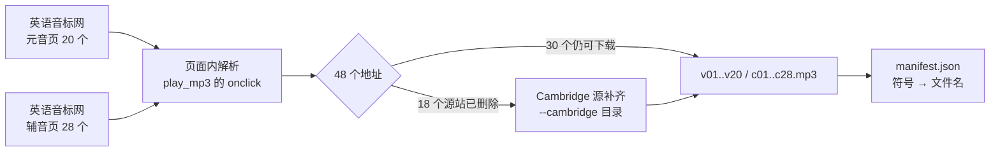
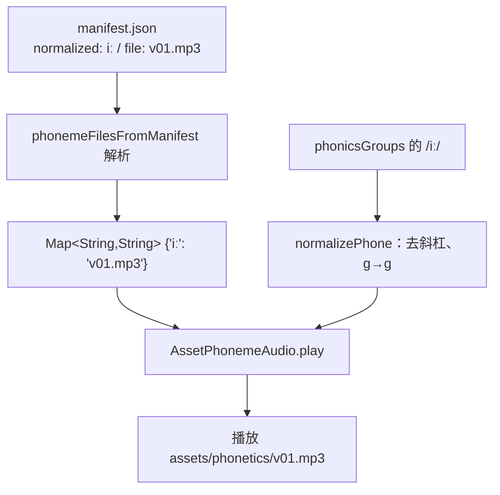
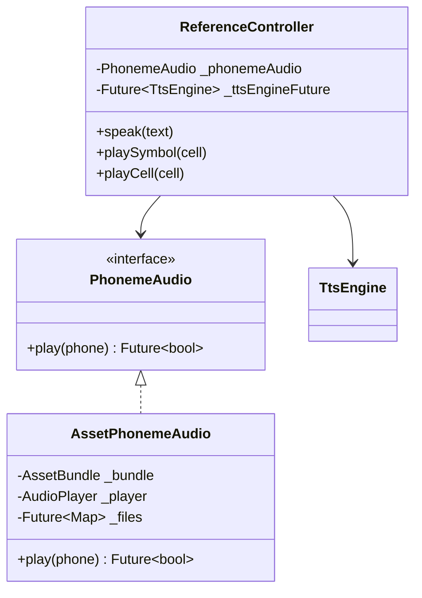
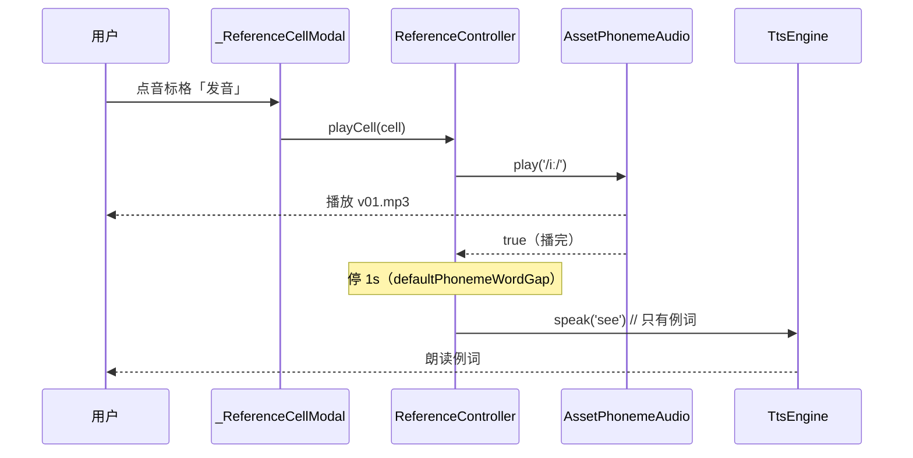

# 音标录音（参考页音标发音）

## 主题定位

参考页 48 个国际音标**本身**的发音——随安装包分发的真人录音，不经过 TTS。本主题覆盖素材来源与产出、符号到文件的映射、播放链路、与 TTS 的分工、失效兜底五条线。

例词发音仍走 TTS，那部分见 [tts-engine.md](tts-engine.md)。

## 业务功能线

参考页「音标」tab 下列 8 组 48 个音标（`phonicsGroups`）。用户点开任一格子出现弹窗，弹窗里三个发音入口：

| 入口 | 字母格 | 音标格 |
|------|--------|--------|
| ① 点符号大字 | TTS 读字母名（"A"） | **放录音**（该音标本身） |
| ② 点例词大字 | TTS 读例词（Apple） | TTS 读例词（see） |
| ③ 点「发音」按钮 | TTS 一段读完「A. Apple」 | **先放录音、再 TTS 读例词** |

**为什么音标不用 TTS**：TTS 引擎读不出 IPA 符号。早先的替代方案是给每个音标配一段「拟音英文拼写」（`/ɪ/` → "it"、`/dz/` → "ads"）送进 TTS——拟音本身不像英文词时又会被音素器逐字母拼读，得靠离线核验逐个挑锚词，48 个音标全靠人工调参，且终究不是那个音。改用真人录音后这条链路整个消失：音标发音 = 一段 mp3，TTS 只负责真词（例词、字母名）。

## 技术实现线

### 素材来源与产出（抓取脚本）

录音由 `impl/server/tool/fetch-phonetics-yyb.ts` 抓取，产出到 `impl/app/flutter/assets/phonetics/`：

- 源站 48 个地址里 **18 个是死链**（文件名以非 ASCII 字符开头的那些，站长已删文件、页面还挂着链接）。这 18 个由 Cambridge 录音补齐，`manifest.json` 的 `source` 字段逐条标明 `yyb` / `cambridge`。
- 落盘文件名用序号（`v01`–`v20`、`c01`–`c28`，序号 = 源站页面顺序），**符号与文件的对应只认 manifest**——不用 IPA 当文件名（macOS 大小写不敏感 + Unicode 归一化差异会让文件名与清单对不上）。
- 完整性由测试守门：`reference_data_test` 断言 manifest 覆盖 `phonicsGroups` 全部 48 个符号、且每个文件真实存在且非空。

### 符号到文件的映射

归一化 `normalizePhone`（`lib/domain/audio/phoneme_audio.dart`，纯函数）两侧都过一遍：

- 去包裹斜杠：数据侧是 `/iː/`，清单侧是 `iː`
- `ɡ`(U+0261) → `g`(U+0067)：App 的 `phonicsGroups` 用前者、源站清单用后者，同一音素
- 去空白

### 类结构

- `AssetPhonemeAudio`：首次播放时懒加载 manifest（`rootBundle.loadString`）并缓存映射；播完等 `onPlayerComplete` 再返回（供「先音标后例词」连读排序）。
- `play` **返回播放结束**（非「开始播放」）：`ReferenceController.playCell` 靠它把 TTS 排到录音之后。
- asset 路径 = `<assetDir>/<file>`，`assetDir` 缺省 `phonetics`——`AssetSource` 自带 `assets/` 前缀，故对应 `assets/phonetics/v01.mp3`。

### 与 TTS 的分工

字母格走另一条分支：`playCell` → `speakTextFor(cell)` = `'A. Apple'` 一段 TTS，不碰录音库。

两条约束（2026-09-20 明确）：

- **送进 TTS 的只有例词本身**——不带音标、不带注脚、不拼句。音标格发 TTS 的地方只有 `speak(cell.example)` 一处，控制器测试对文本做精确断言。
- **录音播完到例词之间停 `defaultPhonemeWordGap`（1s）**，否则两段黏成一句。录音没放成（符号不在库/播放失败）时不白等这一秒，直接读例词。

音色方面，参考页固定 `bella`，不跟随设置页的全局音色（理由见 [tts-engine.md](tts-engine.md)）。

## 数据模型线

无数据库实体。两份静态资产：

| 资产 | 内容 |
|------|------|
| `assets/phonetics/v01.mp3` … `c28.mp3` | 48 个录音，共约 1.1MB |
| `assets/phonetics/manifest.json` | `phonemes[]`：`symbol`(源站写法) / `normalized`(查表键) / `keyword` / `table` / `file` / `source` / `src` / `page` |

`pubspec.yaml` 声明 `assets/phonetics/`（整个目录，含 manifest）。

## 错误处理与边界

| 场景 | 处理 |
|------|------|
| 符号不在录音库 | `play` 返回 false → 兜底 TTS 读**例词**（IPA 原文绝不进 TTS） |
| manifest.json 缺失 / JSON 损坏 | `phonemeFilesFromManifest` 返回空表 → 全部走例词兜底，参考页不崩 |
| mp3 播放**启动**失败（平台侧异常） | `play` 捕获后返回 false，同上兜底；不打断页面交互 |
| `onPlayerComplete` 不上报 | 5s 超时放行——**只影响与后续 TTS 的间隔，不改判定**：已启动的播放不会因此被当成失败。2026-09-20 真机上「音标点了却念出例词」就是违反这条：等播完写错（`.timeout(..., onTimeout: () {})` 类型不合法，`onPlayerComplete` 是 `Stream<AudioEvent>`），运行时每次抛 → 被 catch 成播放失败 → 录音与例词 TTS 叠着响。`test/data/audio/asset_phoneme_audio_test.dart` 的「平台不上报播放完成」用例就是这条的回归测试 |
| manifest 与 `phonicsGroups` 漂移 | `reference_data_test` 直接红（覆盖 + 文件存在双重断言） |

## 测试覆盖

| 测试 | 覆盖 |
|------|------|
| `test/domain/audio/phoneme_audio_test.dart` | `normalizePhone`（斜杠 / 空白 / ɡ↔g）、manifest 解析（normalized 缺失退回 symbol、坏 JSON → 空表、缺字段条目跳过） |
| `test/ui/reference/reference_data_test.dart` | manifest 覆盖全部 48 个音标；每个文件真实存在且 > 512B；`speakTextFor` 音标格只返回例词 |
| `test/ui/reference/reference_controller_test.dart` | 音标格发音走录音（TTS 不发声）、录音缺失兜底读例词、发音按钮「先录音 → 停 1s → 只有例词进 TTS」、录音没放成不白等、音色固定 bella、字母格不受影响 |
| `test/ui/reference/reference_screen_test.dart` | 接线：音标大字点击放录音（`tts.spoken` 为空）、发音按钮录音 + 例词 |
