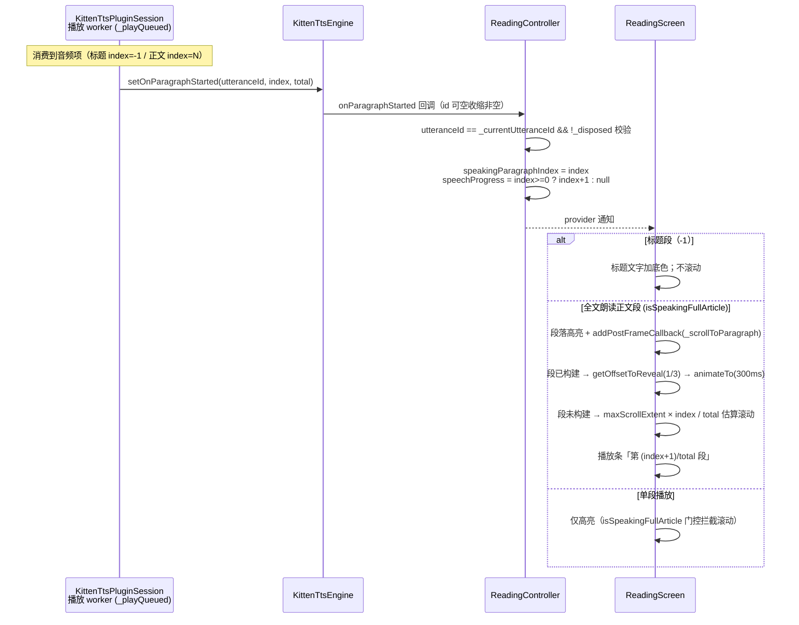

# 朗读段落高亮与自动滚动

## 主题定位

本文档描述「全文朗读 / 单段朗读时，当前朗读段落英文正文加底色高亮，全文朗读时文章自动滚动使当前段落保持在视口上部 1/3 附近」的实现。覆盖从 TTS 播放层到阅读页 UI 的完整调用链、状态语义与边界行为。

## 业务功能线

| 场景 | 高亮 | 滚动 |
|------|------|------|
| 全文朗读（KittenTTS）：标题段 | 标题文字高亮（-1 哨兵，与正文同色） | 不滚动 |
| 全文朗读：正文第 N 段 | 该段英文正文有底色 | 段顶部对齐视口 (视口高−段高)/3 处 |
| 全文朗读：用户手滚中段落切换 | 高亮正常 | 跳过本次，下一次切换恢复跟随 |
| 全文朗读：段落超出懒构建范围（大幅跳转后） | 高亮暂不可见 | 按估算位置滚动，下一切换精确对齐 |
| 单段播放（点段内播放钮） | 该段有底色 | 不滚动 |
| 停止 / 自然结束 | 底色消失（状态清空） | — |
| 系统 TTS 兜底（拼接朗读） | 无（无段落边界信息） | 不滚动 |

- **高亮样式**：仅英文正文文字底色 `Color(0x2ECC785C)`（与生词高亮同色，生词 span 保持原样自然融合）；译文区域不染色；**标题段同样以该色为文字底色**。段落内联播放钮图标（volume_up / stop）沿用 `isSpeaking` 语义驱动，全文朗读中当前段的内联钮同样显示 Stop（点击即停止整篇朗读）。
- **标题可点击查词**：文章标题由 `_TitleText` 渲染，与正文段落共用 `_clickableWordSpans` 分词——单词可点击查词（`showWordSheet`）、生词标珊瑚色、朗读时整段加底色，与正文段落行为一致。（查词弹窗的数据链路与词形解析标注见 [word-lookup.md](word-lookup.md)。）
- **播放条进度**：显示「第 N/M 段」，数据源为**播放 worker 发声前上报**的段落位置（`speakingParagraphIndex+1 / 正文总段数`），与高亮同源、与真实发声同步；标题段发声时无段号，显示「正在朗读…」。⚠️ 历史实现曾用生成进度（`setOnProgress`）驱动播放条——生成超前于发声（生成 13 段时播放才到第 4 段），表现为进度数字超前乱跳、首段"一闪而过"；已改为播放位置驱动，生成进度仅保留日志观测。
- **滚动目标**：段落顶部对齐 ListView 视口（视口高 − 段高）/3 处 —— Flutter 3.44 `getOffsetToReveal` 的 alignment 作用于剩余空间（`leadingScrollOffset − (viewportExtent − objectExtent) × alignment`）。首段目标 offset 为负被 clamp 到 0（列表顶部无法再上滚，天然幂等）。

## 技术实现线

### 段落播放上报链路（核心缺口与解法）

全文朗读采用双 worker 流水线：生成 worker（`_generateFullArticle`）推入播放队列，播放 worker（`_playQueued`）顺序消费。原有 `setOnProgress(done/total)` 反映**生成**进度，超前于真实发声，不能作为「正在朗读哪段」的依据。本次在播放 worker 消费到任意音频项、`_playWav`/`_playFileSource` 播放**前**上报「段落开始播放」，与真实发声同步；**标题段同样上报，段落索引用 `kTitleParagraphIndex`（-1）哨兵**，正文从 0 起。

### 分层职责

| 层 | 文件 | 职责 |
|----|------|------|
| 会话层 | `lib/data/tts/kitten_tts_session.dart` | `_QueuedAudio.paragraphIndex`（正文携带索引，标题为 null）；`_playQueued` 播放前上报，标题用 `kTitleParagraphIndex`（-1）；`total` 由 `speakFullArticle` 传入（正文段数） |
| 引擎层 | `lib/data/tts/kitten_tts_engine.dart` | `setOnParagraphStarted` 透传（session 契约 id 非空，收缩安全）；未注册回调时 debugPrint 日志兜底 |
| 接口层 | `lib/domain/tts/tts_engine.dart` | `setOnParagraphStarted(void Function(String? id, int index, int total)?)`；`SystemTtsEngine` 空实现（拼接朗读无段落边界） |
| 控制器 | `lib/ui/reading/reading_controller.dart` | `_onTtsReady` 中注册；id 校验过滤迟到旧事件；更新 `speakingParagraphIndex` 与 `speechProgress`/`speechTotalParagraphs`（播放进度，标题段置 null）；`setOnProgress`（生成进度）仅日志，不再驱动 UI |
| 视图层 | `lib/ui/reading/reading_screen.dart` | 标题（`_TitleText`，分词可点击查词）与段落（`_ReadingParagraph`）共用 `_clickableWordSpans` 构造高亮 span（单词可点 + 生词珊瑚色 + 朗读底色）；`ref.listen` 驱动滚动（-1 早退不滚动）；播放条「第 N/M 段」文案 |

### ReadingScreen 滚动细节

- **段落 key**：`GlobalObjectKey('reading-para-$index')` 按 index 缓存实例（`_paragraphKeys` map + putIfAbsent）——GlobalObjectKey 按 `identical(value)` 判等，每次新建插值字符串永远无法命中。
- **手滚检测**：`NotificationListener<ScrollStartNotification>` 包住 ListView，`dragDetails != null` 才置 `_userScrolling = true`（程序滚动 animateTo 的 ScrollStartNotification 无 dragDetails，不误判）。
- **跳过语义**：`_scrollToParagraph` 最先检查 `_userScrolling`——命中则清标志并 return（跳过本次），下一次切换恢复跟随。
- **懒构建兜底**：段落在 viewport + cacheExtent 之外时 `currentContext` 为 null，按 `maxScrollExtent × index / total` 估算滚动（近似即可，滚动后段即构建，下一切换走精确路径）。估算受 SliverList 对未构建尾部按均值估算 maxScrollExtent 的影响，漂移 ~18px 量级，下一切换自愈。
- **触发时机**：`ref.listen` 监听 `speakingParagraphIndex` 变化（null 早退），读 `isSpeakingFullArticle` 门控，滚动放 `addPostFrameCallback`（构建期后执行）。

## 数据模型线

`ReadingUiState.speakingParagraphIndex: int?` 语义（注释同步）：

- `null` = 未在朗读任何段落（停止后、系统 TTS 兜底、初始）
- `-1`（`kTitleParagraphIndex`）= 标题段正在发声（全文朗读读标题时）
- `N` = 正文第 N 段正在发声（单段播放与全文朗读共用）
- 停止 / 自然结束：现有 `setOnSpeakingFinished` 清空该字段
- 全文朗读重新开始：置 null → 回调从标题（-1）重新上报

`speechProgress: double?` / `speechTotalParagraphs: int?` = 播放条进度（播放位置而非生成位置）：

- 由 `setOnParagraphStarted` 驱动：正文段发声时 `speechProgress = index + 1`（1-based 段号）、`speechTotalParagraphs = total`；标题段（-1）与未播放时均为 `null`（播放条显示「正在朗读…」）
- 停止 / 自然结束：`setOnSpeakingFinished` 一并清空

## 错误处理与边界

| 场景 | 行为 |
|------|------|
| 迟到旧 utterance 回调 | 控制器 id 校验（`utteranceId == _currentUtteranceId`）过滤；会话层另有 `_currentUtteranceId == utteranceId` 守卫 |
| 播放中停止 / 被新播放打断 | `_stopCurrent()` → finish(oldId) → 控制器清空索引与进度 |
| 标题段（-1）滚动 | 视图层 `ref.listen` 对 `next < 0` 早退——标题在列表顶部本就可见，不触发滚动 |
| 缓存文件被删导致上报无声段 | 上报在 `file.exists()` 检查前——尽力而为，属 spec 预设语义 |
| 段落 renderObj / controller / viewport 为 null | 各级守卫早退，降级为不滚动（不抛错） |
| 用户零距离拖拽 | 误置 `_userScrolling`（跳过一次切换）——首段 clamp 场景无可见影响，可接受 |
| `_userScrolling` 停止时未清 | 下次播放首次切换被跳过（段 0 本就 clamp），无可见影响，符合 skip-one 语义 |

## 测试覆盖

| 层 | 测试文件 | 覆盖点 |
|----|----------|--------|
| 引擎透传 | `kitten_tts_engine_test.dart` | 回调三元组 (id, index, total) 透传 |
| 控制器 | `reading_controller_test.dart` | 全文朗读逐段更新、停止清空、桩捕获闭包断言（删除注册行即 RED） |
| UI 高亮 | `reading_screen_test.dart` | 播放加底色 / 停止消失（按 WidgetSpan 定位段落 RichText）；标题朗读高亮（-1 上报）+ 不滚动；标题单词点击 → 查词弹窗 loading（`_TitleText` 分词可点击） |
| UI 滚动 | `reading_screen_test.dart` | 段 2 对齐 (视口−段高)/3；段 0 clamp 不动；单段不滚动（滚动后内联播段 2，删门控即 RED）；手滚跳过一次下次恢复；未构建段估算滚动 |

已知缺口：`KittenTtsPluginSession`（会话层）不可自动化测试（kit.KittenTTS / AudioPlayer 具体类不可注入），上报时机（发声前、标题 -1、缓存命中路径）由真机验证覆盖——2026-08-10 真机日志验证：生成进度（`setOnProgress`）超前发声约 9 段、播放条曾以生成进度驱动导致首段进度"一闪而过"，已改为播放位置驱动并新增会话层取证日志（`_playWav` START/DONE、`onPlayerComplete`、`FINISH`、`_stopCurrent`）。
