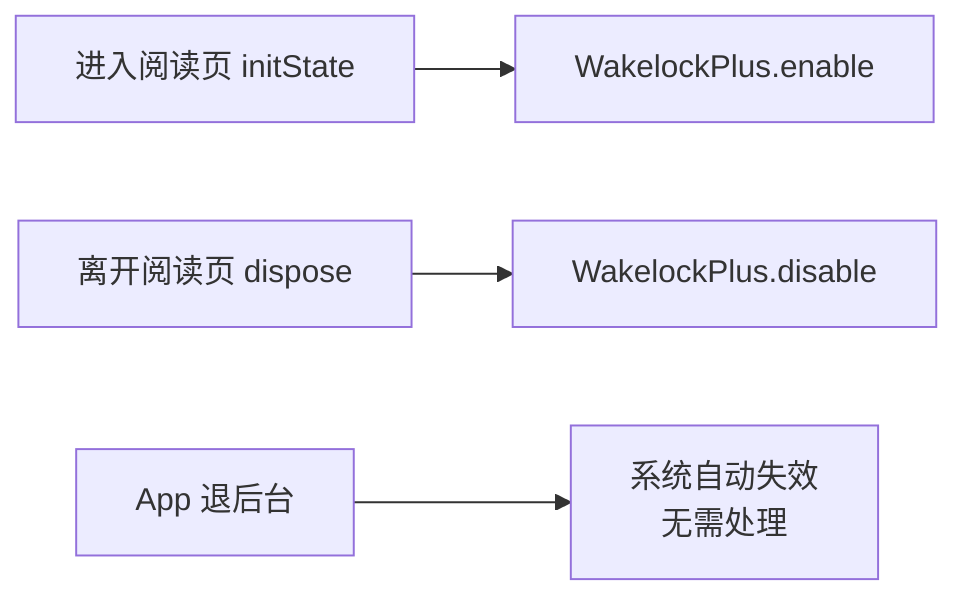

# 阅读页屏幕常亮

## 主题定位

阅读页期间阻止系统自动熄屏/变暗（用户阅读长文时屏幕不应因系统休眠设置突然变暗）。属于阅读体验保障，与朗读/查词等阅读页行为并列。

## 业务功能线

用户进入阅读页 → 屏幕保持常亮（不随系统屏幕超时变暗）；离开阅读页 → 恢复系统默认。后台时 Android 系统自动使常亮失效（`FLAG_KEEP_SCREEN_ON` 仅前台有效），无需额外处理。

## 技术实现线

- 依赖：`wakelock_plus`（社区标准跨平台方案，Android 走 `FLAG_KEEP_SCREEN_ON`）。
- 挂点：`ReadingScreen`（`lib/ui/reading/reading_screen.dart`）是 ConsumerStatefulWidget，路由 push 进入 → `initState` 开启；pop/路由替换 → `dispose` 关闭。常亮范围 = 阅读页整个生命周期（含查词弹窗等页面内交互）。
- 调用：`WakelockPlus.enable()` / `WakelockPlus.disable()`，无状态维护（页面生命周期即状态）。

## 测试覆盖

- `test/ui/reading/reading_screen_test.dart`「屏幕常亮」组：替换 `WakelockPlusPlatformInterface.instance` 为记录型 fake（绕开 pigeon MethodChannel），断言进入页面 toggle(true)、退出页面 toggle(false)。
