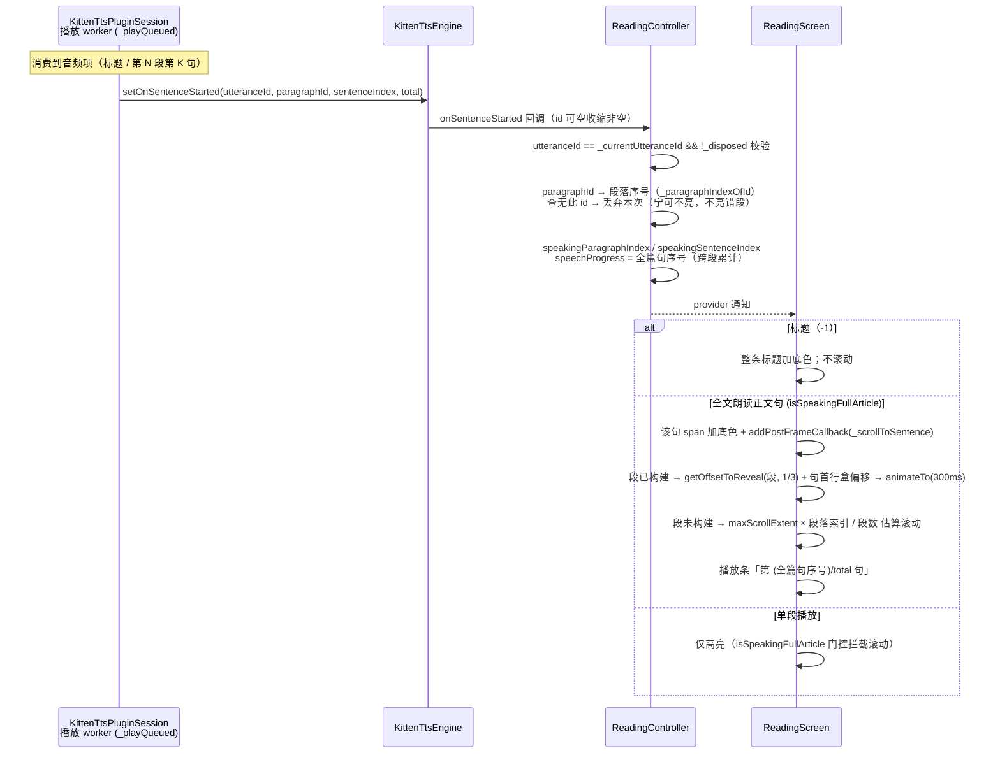

# 朗读句子高亮与自动滚动

## 主题定位

本文描述阅读页的**句子级朗读**：全文朗读 / 单段朗读都以句子为最小单元——切分、TTS 生成、音频缓存、播放位置上报、正文高亮、自动滚动全部按句对齐。覆盖句子切分规则、从播放层到阅读页 UI 的完整调用链、状态语义与边界行为。

调度单元是 `SentenceUnit = (paragraphId, sentenceIndex, text)`——**段落身份用 id**（缓存键要的是稳定身份）；界面位置用**段落序号**（0 起）。两种坐标在 `ReadingController` 边界换算（见「句子级播放上报链路」）。标题是单个独立单元（哨兵 `kTitleParagraphIndex = -1`，句序号恒 0），不参与缓存。

## 业务功能线

| 场景 | 高亮 | 滚动 |
|------|------|------|
| 全文朗读（KittenTTS）：标题 | 整条标题文字加底色 | 不滚动（标题在列表顶部） |
| 全文朗读：正文第 N 段第 K 句 | 该句英文正文有底色（含句末标点） | 该句首行对齐视口 (视口高−段高)/3 处 |
| 全文朗读：用户手滚中句子切换 | 高亮正常 | 跳过本次，下一次切换恢复跟随 |
| 全文朗读：段落超出懒构建范围 | 高亮暂不可见 | 按段估算位置滚动，下一切换精确对齐 |
| 单段播放（点段内播放钮） | 段内逐句推进，同一时刻只有一句带底色 | 不滚动（读者已在看该段） |
| 系统 TTS 兜底（拼接朗读） | 整段底色（无句边界信息，退化为段落高亮） | 不滚动 |
| 停止 / 自然结束 | 底色消失（状态清空） | — |
| **平板横屏（书页模式）：句子落在别的页** | 高亮正常 | **自动翻到该跨页**（见下节） |
| **平板横屏：读者刚手动翻页**（拖拽或点页边） | 高亮正常 | 跳过一次，下一次切换恢复跟随 |

- **高亮样式**：仅英文正文文字底色 `Color(0x2ECC785C)`（与生词高亮同色，生词 span 保持珊瑚色自然融合）；译文区域不染色；句间空白不染色。
- **标题可点击查词**：文章标题由 `ReadingTitle` 渲染，与正文段落共用 `buildWordSpans` 分词——单词可点击查词（`showWordSheet`）、生词标珊瑚色、朗读时整条标题加底色，与正文段落行为一致。（查词弹窗的数据链路与词形解析标注见 [word-lookup.md](word-lookup.md)。）

### 书页模式下的跟随（自动翻页）

平板（设备形态为 pad）的阅读页走书页模式，滚动跟随换成翻页跟随：句子所在**段落→页→跨页**（`paginated.pageOf(paragraphIndex) ~/ 2`）纯查表，然后 `animateToPage`。

- 「手翻跳过一次」与手机同款语义，但**拖拽与页边点击都算手动翻页**（`PadSpreadReader.onUserTurn` 上报）——页边点击若不登记，读者点一次就会被朗读在数秒内拽回去
- 程序化翻页（朗读自己翻的页）不登记，否则会自我抑制
- 同跨页内的句子切换 `animateToPage` 为无害 no-op
- 分页粒度决定：**同页内的句子切换不翻页**（页内无需移动），单段高于整页时完全不跟随（该页可竖向滚动，自动滚动未实现）

完整机制见 [reading-spread.md](reading-spread.md)。
- **播放条进度**：显示「第 N/M 句」，数据源为**播放 worker 发声前上报**的句子位置（N = 全篇句序号，跨段累计 1-based；M = 正文总句数），与高亮同源、与真实发声同步；标题发声时无句号，显示「正在朗读…」。⚠️ 历史实现曾用生成进度（`setOnProgress`）驱动播放条——生成超前于发声（生成 13 段时播放才到第 4 段），表现为进度数字超前乱跳、首段"一闪而过"；已改为播放位置驱动，生成进度仅保留日志观测。
- **滚动目标**：句子首行对齐 ListView 视口 (视口高 − 段高)/3 处，再叠加句首行在段内的 y 偏移（同段第 2 句起逐行下移）。首句目标 offset 常为负，被 clamp 到 0（列表顶部无法再上滚，天然幂等）。

### 句子切分规则（`findSentenceRanges`）

切分**偏保守**：漏切（两句并作一句）只损失高亮粒度，误切（一句拆两半）会把读音切断——歧义处一律不切。

| 输入 | 行为 | 理由 |
|------|------|------|
| `One. Two! Three?` / `Wait... What?!` | 切（终止符 `.` `!` `?` `…`，连续终止符算一个边界） | 常规句末 |
| `He said "Stop." Then…` | 切，句末收尾引号/括号归前句 | 引号收尾属本句 |
| `"Stop!" she shouted.` | 不切（终止符后接小写） | 对话标签，属同一句 |
| `Mr. Smith` / `U.S.` / `e.g.` / `J. K. Rowling` | 不切（缩写表 + 单字母 + 点） | 缩写不是句末 |
| `3.14 dollars` | 不切（数字.数字） | 小数点 |
| `(about 9 p.m.) We went home.` | 切（收尾符含右括号 → 括号闭合即句末，跳过缩写判定） | 句点在括号内 |
| 文末无标点 / 空段落 | 整段一句 / 无句子（不可朗读） | 兜底 |

区间为 half-open `(start, end)`，含句末标点与收尾引号、不含首尾空白；`text.substring(start, end)` 即朗读文本，与下发 TTS 的文本同源。

## 技术实现线

### 句子级播放上报链路

全文朗读采用双 worker 流水线：生成 worker（`_generateFullArticle`）按句推入播放队列，播放 worker（`_playQueued`）顺序消费。播放 worker 在每句 `_playWav`/`_playFileSource` 播放**前**上报「句子开始播放」，与真实发声同步；**标题上报 `kTitleParagraphIndex`（-1）哨兵**，正文段上报**段落 id**（`SentenceUnit.paragraphId` = `article_paragraph.id`，全局自增——**不是段落序号**），句序号段内从 0 起，`total` = 正文总句数（标题不计入）。

> **id → 序号换算是链路的一环，不是可选优化**（2026-09-18 修的 bug）：引擎只有 id（它按收到的朗读单元原样回传），而界面一律拿 `speakingParagraphIndex` 与 0 起的段落序号比对。少了 `ReadingController._paragraphIndexOfId` 这一步，逐句高亮、自动翻页、播放条「第 N/M 句」会**一起失效**——真机表现为"朗读时句子不亮"，且测试夹具里段落 id 默认 0（恰好等于序号）会让这个 bug 隐形。

单段播放（`speakSentences`）走同一套上报：段内逐句发声前上报，高亮随句推进。

### 分层职责

| 层 | 文件 | 职责 |
|----|------|------|
| 切分 | `lib/ui/reading/sentence_extractor.dart` | 纯函数 `findSentenceRanges` / `splitSentences`；不依赖 Flutter，独立可测 |
| 会话层 | `lib/data/tts/kitten_tts_session.dart` | `SentenceUnit`（段落 id + 段内句序号 + 文本）为调度粒度；`_QueuedAudio.paragraphIndex/sentenceIndex`；`_playQueued` / `_speakSentencesSequential` 发声前上报，标题用 `kTitleParagraphIndex`；句子级缓存读写（`lookupSentence` / `writeSentence`） |
| 引擎层 | `lib/data/tts/kitten_tts_engine.dart` | `speakFullArticle(sentences:)` / `speakSentences` / `pregenerateSentences`；`setOnSentenceStarted` 透传（session 契约 id 非空，收缩安全），未注册回调时 debugPrint 日志兜底 |
| 接口层 | `lib/domain/tts/tts_engine.dart` | `SentenceUnit` typedef、`kTitleParagraphIndex` 哨兵、`setOnSentenceStarted(void Function(String? id, int paragraphId, int sentenceIndex, int total)?)`；`SystemTtsEngine` 空实现（拼接朗读无句子边界） |
| 控制器 | `lib/ui/reading/reading_controller.dart` | 加载文章时按段切句（`sentencesByParagraph`）；`_onTtsReady` 注册回调；id 校验过滤迟到旧事件；**`_paragraphIndexOfId` 把上报的段落 id 换算成序号**；更新朗读位置与播放进度（`_globalSentenceNumber` 把 `(段, 句)` 映射为全篇句序号）；播放结束预生成剩余句子缓存 |
| 视图层（手机） | `lib/ui/reading/reading_screen.dart` | `ref.listen` 驱动跟随（-1 早退）；播放条「第 N/M 句」文案；单列滚动 + 按句滚动定位 |
| 视图层（平板） | `lib/pad/pad_reading_screen.dart` | 同一套 `ref.listen` 跟随逻辑，动作换成 `animateToPage`（书页翻页）；工具栏按需唤出（见 [reading-spread.md](reading-spread.md)） |
| 渲染单元 | `lib/ui/reading/reading_widgets.dart` | 标题（`ReadingTitle`）与段落（`ReadingParagraph`）——手机单列与平板书页**共用同一份**渲染单元 |
| span 构建 | `lib/ui/reading/word_spans.dart` | `buildWordSpans`（单词可点 + 生词珊瑚色 + 朗读句底色）；`recognizerFor: null` 时不带手势，供分页测量复用 |

### ReadingScreen 滚动细节（单列路径）

- **段落 key**：`GlobalObjectKey('reading-para-$index')` 按 index 缓存实例（`_paragraphKeys` map + putIfAbsent）——GlobalObjectKey 按 `identical(value)` 判等，每次新建插值字符串永远无法命中。
- **正文 key**：`GlobalObjectKey('reading-para-text-$index')` 挂在段落英文正文 RichText 上，用于取 `RenderParagraph` 求句子盒（句内偏移需要文字布局坐标）。
- **句内偏移**：`getBoxesForSelection(句子区间).first.top − getBoxesForSelection(首字符).first.top`。用「减首行盒顶」而非绝对盒顶：文字盒默认按 tight 高度测量，盒顶比行盒顶低数像素（行高 leading），做差可抵消该常量，得到真实换行偏移（首句恒为 0，与段落级对齐等价）。
- **手滚检测**：`NotificationListener<ScrollStartNotification>` 包住 ListView，`dragDetails != null` 才置 `_userScrolling = true`（程序滚动 animateTo 的 ScrollStartNotification 无 dragDetails，不误判）。
- **跳过语义**：`_scrollToSentence` 最先检查 `_userScrolling`——命中则清标志并 return（跳过本次），下一次切换恢复跟随。
- **懒构建兜底**：段落在 viewport + cacheExtent 之外时 `currentContext` 为 null，按 `maxScrollExtent × 段落索引 / 段数` 估算滚动（近似即可，滚动后段即构建，下一切换走精确路径）。估算受 SliverList 对未构建尾部按均值估算 maxScrollExtent 的影响，漂移 ~18px 量级，下一切换自愈。
- **触发时机**：`ref.listen` 监听 `(speakingParagraphIndex, speakingSentenceIndex)` 记录（record 结构相等，句切换即触发），读 `isSpeakingFullArticle` 门控，滚动放 `addPostFrameCallback`（构建期后执行）。

## 数据模型线

`ArticleSentence`（控制器内定义，切分产物）：

| 字段 | 含义 |
|------|------|
| `paragraphIndex` | 全文段落索引（0 起；标题不计入） |
| `indexInParagraph` | 段内句序号（0 起） |
| `start` / `end` | 段内字符区间（half-open，含句末标点，不含首尾空白） |
| `text` | 句子原文（= `englishText.substring(start, end)`，朗读文本） |

`ReadingUiState` 朗读相关字段语义：

- `sentencesByParagraph: List<List<ArticleSentence>>`——下标 = 段落索引；朗读调度（展平为 `SentenceUnit`）与按句高亮共用同一份切分，保证「读的句」与「亮的句」永不漂移。
- `speakingParagraphIndex: int?`——`null` = 未在朗读任何单元（停止后、系统 TTS 兜底、初始）；`-1`（`kTitleParagraphIndex`）= 标题；`N` = 正文第 N 段（单段播放与全文朗读共用）。
- `speakingSentenceIndex: int?`——段内句序号；`null` = 无句级信息（系统 TTS 兜底 / 首句上报前，此时整段高亮）。
- `speechProgress: double?` / `speechTotalSentences: int?` = 播放条进度（播放位置而非生成位置）：正文句发声时 `speechProgress` = 全篇句序号（跨段累计 1-based）、`speechTotalSentences` = total；标题与未播放时为 `null`（播放条显示「正在朗读…」）。
- 停止 / 自然结束：`setOnSpeakingFinished` 一并清空上述四项。
- 朗读位置字段用 `_unset` 哨兵 copy：未传参的 `copyWith`（如译文揭示计时器）不会误清高亮位置，清空须显式传 `null`。

音频缓存（`tts_cache`）：**句子级**，键 = `article_paragraph_id + sentence_index + speed + voice_id`，文件名 `p_<段id>_s<句序号>_<语速>_<音色>.wav`；同一句不同音色/语速各存一份，FIFO 50MB 淘汰（见 [tts-engine.md](tts-engine.md)）。

## 错误处理与边界

| 场景 | 行为 |
|------|------|
| 迟到旧 utterance 回调 | 控制器 id 校验（`utteranceId == _currentUtteranceId`）过滤；会话层另有 `_currentUtteranceId == utteranceId` 守卫 |
| 播放中停止 / 被新播放打断 | `_stopCurrent()` → finish(oldId) → 控制器清空朗读位置与进度 |
| 标题（-1）滚动 | 视图层 `ref.listen` 对 `paragraphIndex < 0` 早退——标题在列表顶部本就可见，不触发滚动 |
| 空段落（无句子） | 不参与全文朗读（展平时无单元）；单段播放直接返回（无可朗读内容） |
| 系统 TTS 兜底 | 无句边界 → `speakingSentenceIndex` 保持 null → 整段高亮（与句子级改造前行为一致） |
| 句子区间越界（段文本变化等） | 视图层取句失败时退化为整段高亮；控制器 `_globalSentenceNumber` 越界返回 null（不显示句号） |
| 缓存文件被删导致上报无声句 | 上报在 `file.exists()` 检查前——尽力而为，属 spec 预设语义 |
| 段落 renderObj / RenderParagraph / 盒子 / viewport 为 null | 各级守卫早退，降级为段落级对齐或不滚动（不抛错） |
| 用户零距离拖拽 | 误置 `_userScrolling`（跳过一次切换）——首句 clamp 场景无可见影响，可接受 |

## 测试覆盖

| 层 | 测试文件 | 覆盖点 |
|----|----------|--------|
| 切分 | `test/ui/reading/sentence_extraction_test.dart` | 终止符 / 收尾引号 / 对话标签 / 缩写 / 首字母 / 小数 / 连续终止符 / 无标点 / 空白与换行 / 区间重建 |
| 引擎透传 | `test/data/tts/kitten_tts_engine_test.dart` | 回调四元组 (id, paragraphId, sentenceIndex, total) 透传；句子单元与 voice 透传 |
| 控制器 | `test/ui/reading/reading_controller_test.dart` | 加载即切句（区间 + 文本）；句子回调逐句更新高亮与进度；**上报段落 id 时换算成序号**（夹具 id 500/501/727/731，非 0 起）；**未知 id 不写入状态**；跨段全篇句序号累计；迟到旧回调过滤；KittenTTS 路径按句下发（段 id + 句序号 + 文本，全文 / 单段两条） |
| 缓存 | `test/data/tts/tts_cache_manager_test.dart` | 同句不同音色互不串音；同段不同句各自缓存；同键去重；文件丢失视为需生成 |
| 数据库 | `test/data/local/schema_base_tables_test.dart`、`database_patch_columns_test.dart` | `tts_cache` 10 列（含 `sentence_index`）；旧库补列同时清空旧段落级缓存行 |
| UI 高亮 | `test/ui/reading/reading_screen_test.dart` | 段落播放加底色 / 停止消失；**只高亮当前句**（句切换底色迁移）；标题朗读高亮（-1 上报）+ 不滚动 |
| UI 滚动 | `test/ui/reading/reading_screen_test.dart` | 段 2 首句对齐 (视口−段高)/3；段 0 clamp 不动；**句内偏移**（句 1 首行对齐 1/3 线）；单段不滚动（删门控即 RED）；手滚跳过一次下次恢复；未构建段估算滚动 |
| 书页跟随 | `test/pad/reading/pad_spread_reader_test.dart` | 程序化翻页不登记为用户翻页；拖动中页码实时更新且不重建书页（页面级跟随逻辑在 `PadReadingScreen` 内，随书页渲染测试一并覆盖） |
| 书页渲染 | `test/pad/reading/pad_spread_reader_test.dart` | 页边点击登记为用户翻页；页边点击区不吞横滑；拖动中页码实时更新 |

已知缺口：`KittenTtsPluginSession`（会话层）不可自动化测试（kit.KittenTTS / AudioPlayer 具体类不可注入），句子级上报时机（发声前、标题 -1、缓存命中路径）由真机验证覆盖——2026-08-10 真机日志验证：生成进度（`setOnProgress`）超前发声约 9 段、播放条曾以生成进度驱动导致首段进度"一闪而过"，已改为播放位置驱动并新增会话层取证日志（`_playWav` START/DONE、`onPlayerComplete`、`FINISH`、`_stopCurrent`）。
