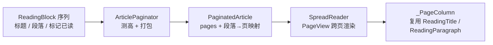
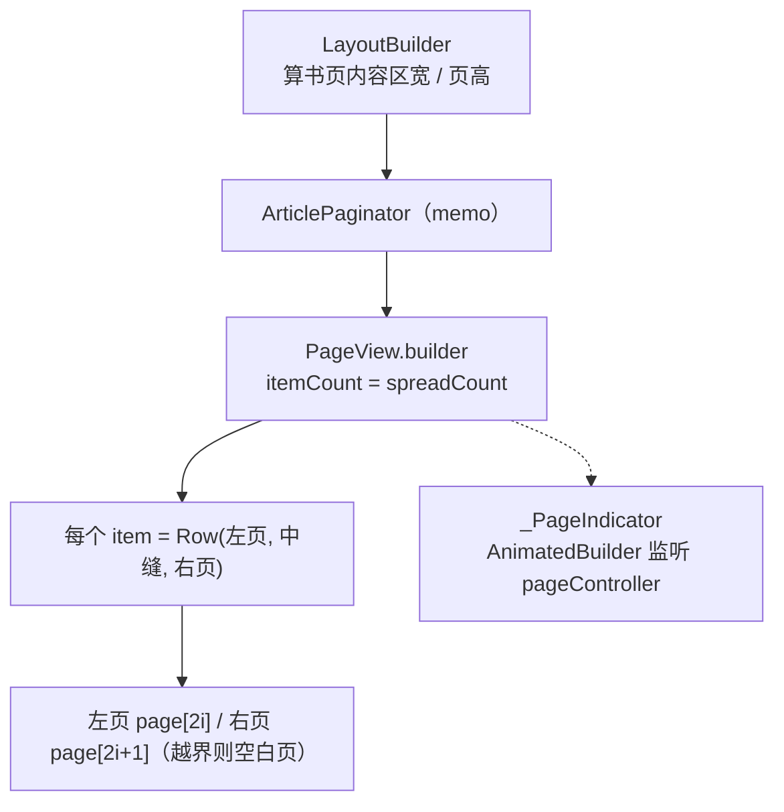
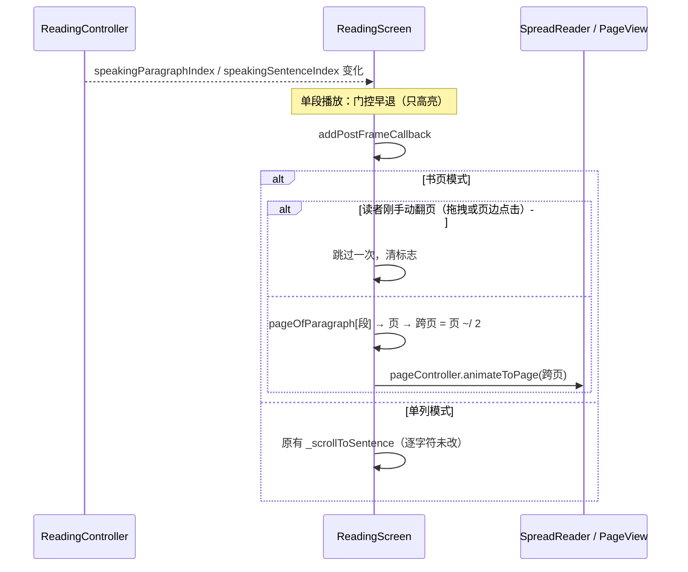
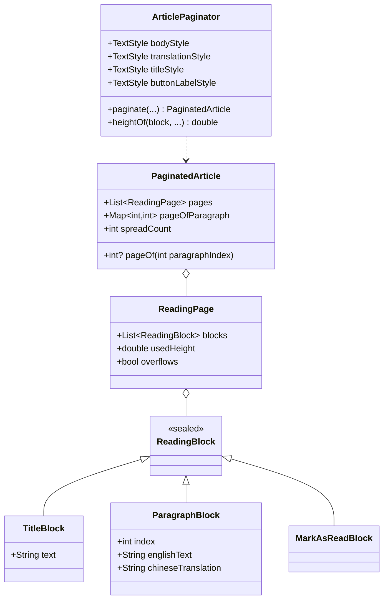

# 书页式阅读（平板横屏左右两屏）

## 主题定位

本文描述平板横屏（窗口宽 ≥ 840dp）下阅读页的**书页模式**：文章被切成一页页，一次并排显示相邻两页（左页 / 右页），整屏翻页。

不描述单列滚动阅读（手机与平板竖屏走该路径，见 [reading-sentence-highlight.md](reading-sentence-highlight.md)），也不描述档位判定本身（见 [adaptive-layout.md](adaptive-layout.md)）。

**为什么这个模式只出现在平板横屏**：手机竖屏一行放不下两页；平板竖屏（813dp）宽度不足 840dp 阈值；只有平板横屏（实测 1219×813dp）能容纳两栏各约 530dp 的正文——约 59 字符/行，接近纸书阅读宽度。

## 业务功能线

| 场景 | 行为 |
|------|------|
| 进入阅读页（宽 ≥ 840dp） | 第 1 跨页：左页 = 第 1 页（标题 + 开头段落），右页 = 第 2 页 |
| 翻页 | ① 水平拖动（`PageView` 原生手势）② 点击正文列**以外**的左右页边空白区 |
| 页码 | 底部居中 `右页页号 / 总页数`（左页恒为奇数页） |
| 顶部进度条 | 已翻过的页占比 = `右页页号 / 总页数` |
| 点击单词 | 查词弹窗（与手机一致）——页边点击区在正文列之外，不遮挡文字 |
| 译文模式切换 / 模糊段揭示 | 重新分页；**保持当前跨页序号不变**（不跳回第 1 页） |
| 全文朗读跟随 | 句子落在别的页 → 自动翻到该跨页；读者刚手动翻过页 → 跳过一次 |
| 单段播放 | 只高亮，不翻页（与手机一致） |
| 总页数为奇数 | 最后一跨页右页留空（保持书页观感） |
| 点「标记已读」 | 该块排在最后一页页尾（已读后不再产生该块） |

### 页边点击的安全边界

页边点击区宽度 = `(可用宽 − 书页内容区宽) / 2`。**窄于 24dp 时不启用**（退化为仅横滑翻页），避免误触；正文内点击永远留给查词。

## 技术实现线

### 三件套



| 文件 | 职责 |
|------|------|
| `lib/ui/reading/pagination/reading_block.dart` | 块模型：`sealed ReadingBlock` + `TitleBlock` / `ParagraphBlock` / `MarkAsReadBlock` |
| `lib/ui/reading/pagination/article_paginator.dart` | 分页引擎：`TextPainter` 测高 + 按页高打包 + 段落→页映射 |
| `lib/ui/reading/pagination/spread_reader.dart` | 书页渲染：`PageView`（一个 item = 一个跨页）+ 页边点击 + 页码 |
| `lib/ui/reading/reading_widgets.dart` | 共享渲染单元：`ReadingTitle` / `ReadingParagraph`（手机与书页共用同一份） |
| `lib/ui/reading/word_spans.dart` | `buildWordSpans`：分词 span 构建（渲染与测量共用） |

### 分页只在段落边界切

**依据**：本 App 文章段落很短（75 篇统计：均 108 字符、最大 441、每篇 3–21 段）。在段落边界分页，最坏只损失一点页尾空白，却省掉了把段落劈成两半带来的三类复杂度：span 切片、译文归属、句子高亮跨页。

### 块高测量（与渲染同源是硬要求）

| 块 | 测量构成 |
|----|---------|
| `TitleBlock` | 标题文字高（`RichText` 渲染 → 用 `bodyTextScaler`）+ `kTitleGapBelow`(16) + `kTitleDividerHeight`(1) + `kTitleGapAfterDivider`(24) |
| `ParagraphBlock` | 英文正文高（含段尾两个 `WidgetSpan` 占位：4dp 空隙 + 18×18 内联播放钮）+ `kParagraphGap`(4) + 译文高（非隐藏时）+ `kParagraphGap`(4) |
| `MarkAsReadBlock` | `kMarkAsReadTopGap`(24) + 按钮文字高（`AppButton` 用 `Text` 渲染 → 用 `labelTextScaler`）+ 上下各 `kButtonVerticalPadding`(12) |

间距常量与 `AppSpacing` token 绑定（`kTitleGapBelow = AppSpacing.md` 等），**渲染层必须 import 这些常量而不是重打字面量**——两份真源必然漂移。

#### 两个 textScaler（易错点）

同一个段落里，英文正文与译文由**两类不同的渲染器**绘制，对系统字体缩放的响应不同：

| 内容 | 渲染器 | 是否读 `MediaQuery` 字体缩放 | 测量用参数 |
|------|--------|---------------------------|-----------|
| 英文正文、标题 | 裸 `RichText` | **否**（`textScaler` 默认 `TextScaler.noScaling`） | `bodyTextScaler`（调用方传 `noScaling`） |
| 译文、`AppButton` 文字 | `Text` | **是** | `labelTextScaler`（调用方传 `MediaQuery.textScalerOf(context)`） |

传错会让测量与渲染分叉：测量偏小 → 真实内容溢出页底；测量偏大 → 页尾留白过多。

#### 段落末尾的 WidgetSpan 占位

`TextPainter` 测量含 `WidgetSpan` 的 span 树时**必须**先 `setPlaceholderDimensions([...])`（`Size(4,0)` 与 `Size(18,18)`），否则测量高度少一个图标。

### 打包算法

```
pages = []; current = []; used = 0
for block in blocks:
    h = 测高(block)
    if current 非空 and used + h > pageHeight:  flush()      // 页满换页
    current.add(block); used += h
    if used > pageHeight:                        // 单块自身超过整页
        overflows = true; flush()                // 独占一页，该页允许竖向滚动
flush() if current 非空
if pages 为空: pages = [一个空页]                 // 永不返回 0 页
```

- 单块超过整页高时该页 `overflows = true`，渲染层把它包进 `SingleChildScrollView` 兜底（按现有数据仅 3/75 篇有 >400 字符的段落，属罕见分支，但行为确定）
- `pageOfParagraph` 在打包后一次性建立：段落序号 → 页序号（重复段落序号为 last-wins）

### 复排时机与 memo

分页是纯 CPU 工作（每篇约 10 段），但阅读页**每次句子切换都会重建**，若每次重排会拖慢朗读。故按 memo 键缓存：

```
Object.hash(identityHashCode(paragraphs), title, translationMode, isReadCompleted,
            pageWidth, pageHeight, bodyTextScaler, labelTextScaler)
```

**句子高亮变化不在键里**——高亮只改 `backgroundColor`，不影响文字度量，因此朗读全程只分页一次。译文模式、已读状态、窗口尺寸、字体缩放变化才会重排。

### 渲染与交互



| 常量 | 值 | 含义 |
|------|----|------|
| `kSpreadGutter` | 40 | 中缝宽（含中心 1px 竖线） |
| `kSpreadMaxWidth` | 1100 | 书页内容区最大宽（超宽屏居中留白） |
| `kPageTopPadding` / `kPageBottomPadding` | 12 / 8 | 页内上下留白（对照手机 ListView 首尾） |
| `kPageIndicatorHeight` | 28 | 页码行高度（定值——阅读页算页高时必须减掉它） |
| `kEdgeTapMinWidth` | 24 | 页边点击区最小宽 |

**页高口径（易错点）**：阅读页在 `LayoutBuilder` 里算的可用高，包含了 `SpreadReader` 底部那行页码；分页必须用 `可用高 − kPageIndicatorHeight − kPageTopPadding − kPageBottomPadding`，否则分页器以为页面更高、页尾溢出。

**滚动不重建书页**：页码指示器自己 `AnimatedBuilder` 监听 `pageController`，滚动每帧只重建一个 `Text`——若改为整组件 `setState`，每帧都会重建全部段落，而每个段落的每个单词每帧都会新建一个 `TapGestureRecognizer`（只在 dispose 释放）。

### 朗读自动翻页



「手动翻页」由 `SpreadReader.onUserTurn` 上报，**拖拽与页边点击都算**（点击若不登记，读者点一次就会被朗读在数秒内拽回去）；程序化翻页（朗读自己翻的页）不登记，否则会自我抑制。

## 数据模型线



`spreadCount = (pages.length + 1) ~/ 2`（2 页 = 1 跨页，向上取整）。

## 错误处理与边界

| 场景 | 行为 |
|------|------|
| 单块超过整页高 | 独占一页并标记 `overflows`，该页渲染为可竖向滚动 |
| 块序列为空 | 产出 **1 个空页**（永不 0 页，避免 `spreadCount` 为 0 时 `PageView` 报错） |
| 总页数为奇数 | 右页渲染空白页，不拉伸左页 |
| 首帧（尚未分页） | 进度条取 `_lastPaginated?.… ?? 0`，不崩 |
| 分页完成晚于进度条构建 | 分页后若比例变化，补一帧 `setState`（自限：下一帧 memo 命中即不再触发） |
| `turnToPageOfParagraph` 目标页不存在 | 查表失败直接返回 |
| `pageController` 无 clients | 直接返回（不 assert） |
| 段落索引重复 | `pageOfParagraph` 为 last-wins（生产数据由 `.indexed` 生成，不会重复） |
| 同跨页内的句子切换 | `animateToPage` 同页为无害 no-op |

## 测试覆盖

| 层 | 测试文件 | 覆盖点 |
|----|----------|--------|
| 分页引擎 | `test/ui/reading/pagination/article_paginator_test.dart` | 页高足够全落一页 / 不足按块换页 / 段落→页映射 / 空列表产出 1 空页 / 超大块独占页且标记 overflows / 译文隐藏更矮 / `spreadCount` 取整 / 标题块含分隔线与间距 / 页宽影响行数 / 两个 textScaler 各自生效（变异测试验证过：任一处接反都会红） |
| 书页渲染 | `test/ui/reading/pagination/spread_reader_test.dart` | 首跨页只渲染前两页 / 页码 `右 / 总` / 页边点击翻页且**登记为用户翻页** / 页边不吞横滑 / 拖动中页码实时更新且不重建书页 / 程序化翻页不登记为用户翻页 / 奇数页右页留空 / **分页契约在屏幕上成立**（页被填满时末块底边不越页底、无 RenderFlex 溢出） |
| 阅读页接入 | `test/ui/reading/reading_screen_spread_test.dart` | 1219dp 出书页、360dp 与 813dp 竖屏仍单列 / 翻遍全部跨页每段都出现（不丢块）/ 进度条随跨页推进 / 朗读跨页自动翻页 / 用户刚手动翻页跳过一次（拖拽与页边点击各一条）/ 单段播放不翻页 |
| 手机回归 | `test/ui/reading/reading_screen_test.dart` | 原有 20 条测试**未修改**，作为「书页改动没碰手机路径」的闸门 |

## 已知缺口

- **真机未验证**（截至 2026-09-17）：书页实际观感、翻页手感、页边点击热区大小、朗读自动翻页的节奏均未上机确认
- 同页内的句子切换不触发翻页（分页粒度使然，非缺陷）
- 单段落高于整页时朗读完全不跟随（该页可滚动，但自动滚动未实现）
- 每跨页固定两页，不随窗口宽度自适应为「单页 + 更宽栏」
