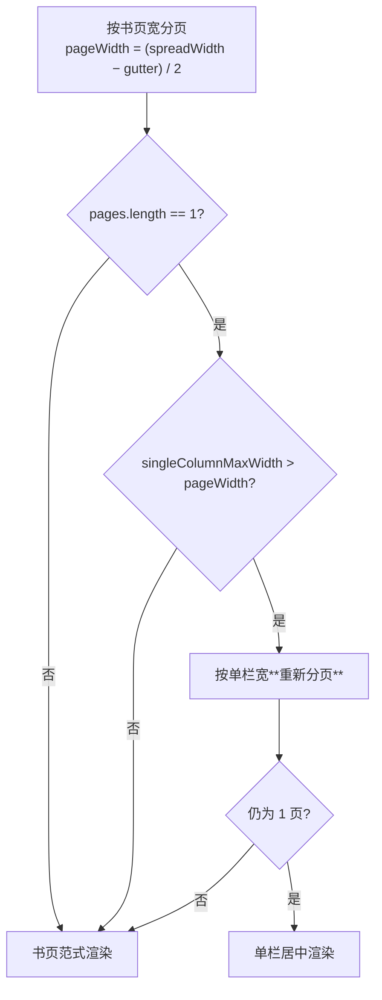
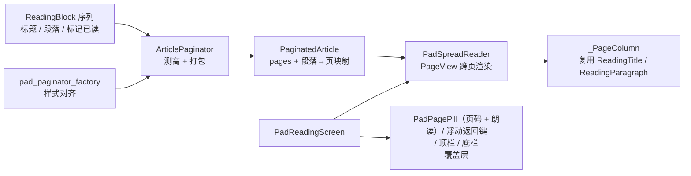
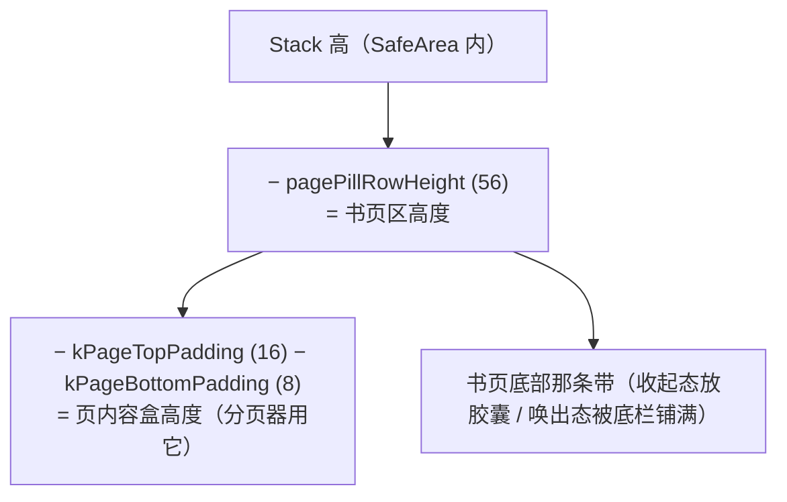
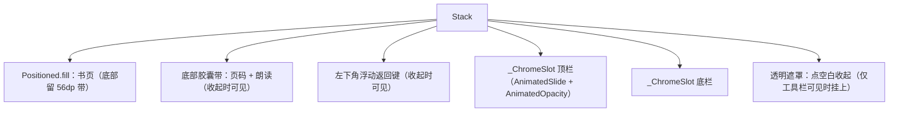
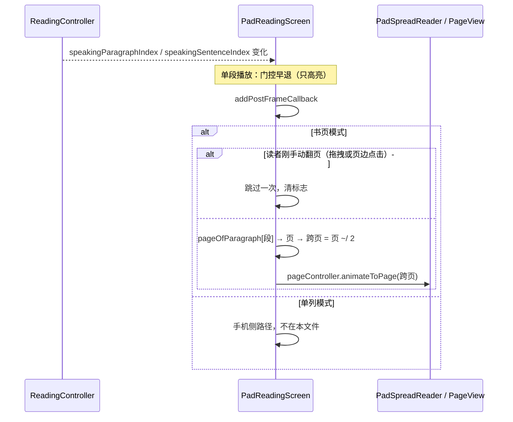
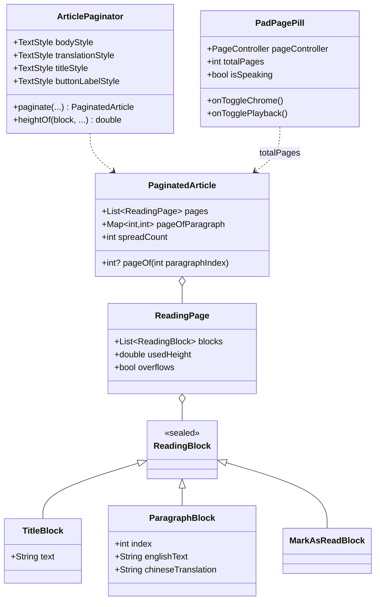

# 书页式阅读（平板横屏沉浸式两屏）

## 主题定位

本文描述平板阅读页（`lib/pad/pad_reading_screen.dart`）的**书页模式**：文章被切成一页页，一次并排显示相邻两页（左页 / 右页），整屏翻页；界面默认只留两样常驻件——左下角的返回键与底部「页码胶囊 + 朗读全文」，其余工具栏按需唤出。

不描述单列滚动阅读（手机走该路径，见 [reading-sentence-highlight.md](reading-sentence-highlight.md)），也不描述界面树如何分派（见 [adaptive-layout.md](adaptive-layout.md)）。

**为什么这个模式只出现在平板**：手机竖屏一行放不下两页；平板固定横屏（本机 1280×800dp）能容纳两栏各约 562dp 的正文——接近纸书阅读宽度。平板方向锁定见 [app-orientation.md](app-orientation.md)。

## 业务功能线

### 沉浸：默认几乎什么都不画（但出口与朗读不能藏）

**要解决的问题**：改造前的平板阅读页把手机阅读页的两条常驻栏（顶栏 + 底部播放条）照搬了过来，合计约 110dp——在 800dp 高的横屏上，这等于每页少放 3~4 行正文。平板横屏最贵的是**竖向空间**，而常驻工具栏把它花在了"随时可见"上。

重设计的取舍：**默认只留一条 56dp 的胶囊带**，上下栏按需唤出。

**2026-09-18 真机实测后的修正**：最初连"出口"和"朗读"都收进了唤出态——返回键只在顶栏里，朗读只在底栏里。实测时读者的反馈是"找不到退出阅读的按钮""没有朗读全文的按钮"：**沉浸不等于把动作藏起来**。现在左下角常驻返回键、胶囊旁常驻「朗读全文」，常驻件的竖向成本仍只有那条 56dp 的胶囊带（返回键落在页码带左端，不占额外行高）。

**2026-09-19 iPad 实测后的修正**：iPadOS 26+ 把应用跑在带「窗口控件」的窗口里（左上角 … 胶囊，画在应用内容之上，`Info.plist` 已设 `UIRequiresFullScreen` 也不生效），原先贴左上角的返回键被系统控件盖住。改法：收起态返回键移到页码带左端（不与系统控件重叠，也不压正文）；唤出态顶栏内容在 iOS 上整体右让 `PadLayout.windowControlsLeftInset`（96dp），返回键与标题一起避开系统控件。Android 无此控件，布局保持原样。

```text
默认（沉浸）:
┌──────────────────────────────────────────────────────────────────┐
│     ┌──────────────────────┬──────────────────────┐             │
│     │ The Future of        │  …continued          │             │
│     │ Remote Work          │                      │             │
│     │ Remote work has      │  Companies that      │             │
│     │ fundamentally…       │  embraced remote…    │             │
│     └──────────────────────┴──────────────────────┘             │
│  ⬤←   ‹ 左右页边 = 翻页热区 ›    ▁ 12 / 345 ⌃ ▁  ▷ 朗读全文 ▁     │
└──────────────────────────────────────────────────────────────────┘
   ⬤← 落在页码带左端（正文已让出的那条带，不切正文标题）

点页码胶囊后（上下栏滑入，正文不位移；浮动返回键淡出，让位给顶栏里的同款）:
┌──────────────────────────────────────────────────────────────────┐
│（iOS 左上让位窗口控件）←  The Future of Remote Work    ✓已读  译文 ▾│
│                      （书页内容，一动不动）                        │
│  12 / 345 页  ▓▓▓▓▓▓░░░░░░  35%   ▶朗读  1.0x  ⌄                  │
└──────────────────────────────────────────────────────────────────┘
```

| 场景 | 行为 |
|------|------|
| 进入平板阅读页 | 第 1 跨页：左页 = 第 1 页（标题 + 开头段落），右页 = 第 2 页；只有返回键与胶囊带 |
| 翻页 | ① 水平拖动（`PageView` 原生手势）② 点击正文列**以外**的左右页边空白区 |
| **退出阅读** | 左下角常驻圆形返回键（收起态）；唤出工具栏时它淡出、由顶栏左端的返回键接替——屏幕上**永远恰好有一个**返回入口 |
| 唤出工具栏 | 点底部页码胶囊；再点胶囊、点底栏的 `⌄`、或点书页空白处收起 |
| 页码 | 胶囊常驻显示 `右页页号 / 总页数`；底栏展开时另显示 `N / M 页` |
| 点击单词 | 查词弹窗（与手机一致）——正文内的点按永远留给查词，页边点击区在正文列之外 |
| 朗读 | 「朗读全文 / 暂停」常驻在胶囊右侧（**不必先唤出底栏**）；语速只在底栏 |
| 译文模式切换 / 模糊段揭示 | 重新分页；**保持当前跨页序号不变**（不跳回第 1 页） |
| 全文朗读跟随 | 句子落在别的页 → 自动翻到该跨页；读者刚手动翻过页 → 跳过一次 |
| 单段播放 | 只高亮，不翻页（与手机一致） |
| 总页数为奇数 | 最后一跨页右页留空（保持书页观感） |
| **整篇只占一页** | 不走书页范式，改排**单栏居中**（见下节）——避免右半屏死区 |
| 点「标记已读」 | 该块排在最后一页页尾（已读后不再产生该块） |

### 短文退化：单栏居中

书页范式隐含一个前提——内容多到需要两页。**整篇一页放得下**时它会退化成「左页有字 + 右半屏空白」，在 1280dp 横屏上那是半屏死区，看起来像渲染坏了。

此时的退化形态是**单栏居中**：

```text
书页范式（内容 ≥ 2 页）          单栏退化（内容 = 1 页）
┌──────────┬──────────┐        ┌────────────────────┐
│ 左页      │ 右页      │        │   ┌────────────┐   │
│ 文字…     │ 文字…     │        │   │ 文字…       │   │
│          │          │        │   │            │   │
└──────────┴──────────┘        │   └────────────┘   │
   两侧页边 = 翻页热区            └────────────────────┘
                                    两侧留白对称
```

**判定与实现**（`PadReadingScreen._buildSpread`）：



**为什么重新分页而不是直接把页拉宽渲染**：直接拉宽会让**测量宽度 ≠ 渲染宽度**，正是本文档「测量必须与渲染同样式」那节踩过的同一类坑（那边错在样式字段，这边错在宽度）。重新分页保证两侧同源。更宽的栏只会放得下更多，所以重排结果必然是 1 页，不必循环。

`PadLayout.singleColumnMaxWidth = 760`：比单页宽（562）宽、又不超过舒适行宽（约 42 字符/行）。上限同时保证超宽屏下不会拉成一条长线。

### 常驻件为什么只有这三样

「页码胶囊 + 朗读全文」并排占掉那条已经让出的 56dp 带，返回圆键浮在左侧页边里（书页在 1280dp 横屏上距屏幕左边 50dp，`44dp` 的圆键**贴最左**才不切进正文标题的第一个字母）。三样都按"读者在沉浸态下会不会突然需要它"筛过：

1. **页码**——你在哪，不用唤出控件就能看到；同时是"上下栏能唤出"的**发现性入口**；
2. **朗读全文**——进入文章后最可能的第一个动作。藏在底栏里时实测没人找到；带文字而非纯图标，因为一个孤零零的 `▶` 说不清读的是全文还是当前段；
3. **返回**——出口。系统返回手势虽然也能退，但界面上看不见的出口等于没有出口。

代价是书页首行左侧多了一个圆键、末行旁边多了一个胶囊按钮，比"绝对全裸"吵一点；换来的是读者不必先学会这套交互就能用。

### 页边点击的安全边界

页边点击区宽度 = `(可用宽 − 书页内容区宽) / 2`。**窄于 44dp 时不启用**（退化为仅横滑翻页），避免误触；正文内点击永远留给查词。箭头用最浅的 hairline 色——既是"这里可以点"的提示，又几乎不干扰阅读。

## 技术实现线

### 文件布局

平板专属的阅读实现在 `lib/pad/reading/`（2026-09-18 从 `lib/ui/reading/pagination/` 迁入——那批文件**只有平板用**，放在 `lib/ui/` 下属历史遗留）：

| 文件 | 职责 |
|------|------|
| `lib/pad/reading/reading_block.dart` | 块模型：`sealed ReadingBlock` + `TitleBlock` / `ParagraphBlock` / `MarkAsReadBlock` |
| `lib/pad/reading/article_paginator.dart` | 分页引擎：`TextPainter` 测高 + 按页高打包 + 段落→页映射 |
| `lib/pad/reading/pad_paginator_factory.dart` | **测量样式对齐渲染样式**的构造器（见下节，正确性关键） |
| `lib/pad/reading/pad_spread_reader.dart` | 书页渲染：`PageView`（一个 item = 一个跨页）+ 页边点击 |
| `lib/pad/reading/pad_reading_chrome.dart` | 沉浸式工具栏：常驻件（页码胶囊 + 朗读入口 + 浮动返回键）+ 唤出态（顶栏 + 底栏） |
| `lib/pad/pad_reading_screen.dart` | 页面装配：书页 + 覆盖层工具栏 + 朗读跟随 + 查词面板 |

**仍然共享**（不迁移，因为复制会出错）：`lib/ui/reading/reading_widgets.dart`（`ReadingTitle` / `ReadingParagraph`）与 `word_spans.dart`。这两处是**度量与渲染同源的正确性关键**——分页器测的就是它们渲染出来的东西，复制一份必然漂移。



### 测量必须与渲染同样式（2026-09-18 修复的溢出 bug）

**这是本主题最容易踩的坑**。`ArticlePaginator` 是离线的（纯 `TextPainter`，没有 `BuildContext`），但同一段文字在书页里的**渲染路径有两条**，二者对 ambient 样式的处理不同：

| 内容 | 渲染器 | 是否并 ambient `DefaultTextStyle` |
|------|--------|----------------------------------|
| 英文正文、文章标题 | 裸 `RichText` | **否** |
| 中文译文、按钮文字 | `Text` | **是**（`inherit: true` 时） |

并进来的字段会改变文字度量。M3 主题给 `bodyMedium` 带了 `letterSpacing: 0.25`，`Text` 把它混进译文样式，而裸 `TextPainter` 看不到——**测量行宽偏窄**，恰好在换行边界的段落会被判成"放得下"，实际渲染多出一行，页底溢出。

**实测证据**（真机文章 + 真机几何，562dp 页宽）：

| 项 | 值 |
|----|----|
| 中文译文（40 字）裸测量 | 1 行，22dp |
| 同一串渲染 | **2 行，44dp** |
| 整页后果 | `BOTTOM OVERFLOWED BY 11 PIXELS` |
| 给测量加上 `letterSpacing: 0.25` | 44dp，2 行 —— **与渲染完全一致** |

**修复**：`buildPadPaginator(ambientTextStyle)` 统一构造分页器，按渲染路径决定是否并 ambient：

```dart
ArticlePaginator buildPadPaginator(TextStyle ambientTextStyle) => ArticlePaginator(
  bodyStyle: AppType.readingBody,                                   // RichText：原样
  titleStyle: AppType.readingTitle,                                 // RichText：原样
  translationStyle: ambientTextStyle.merge(AppType.readingTranslation),  // Text：并上
  buttonLabelStyle: ambientTextStyle.merge(AppType.textTheme.titleSmall!), // Text：并上
);
```

调用方传 `DefaultTextStyle.of(context).style`。**注意必须在 `Scaffold` 内部读**——Scaffold 的 body 外面包着一层 `Material`，它才把 `theme.textTheme.bodyMedium` 设为 ambient；在 `MaterialApp.home` 那一层读到的是 WidgetsApp 的错误样式。

> 一般化：任何"离线测量 + 在线渲染"的组合都要问一句**两侧的样式是否逐字段相同**。部分样式（`TextStyle` 只写 fontSize/height，其余为 null）在渲染侧会被 ambient 补齐，测量侧不会。

### 分页只在段落边界切

**依据**：本 App 文章段落很短（75 篇统计：均 108 字符、最大 441、每篇 3–21 段）。在段落边界分页，最坏只损失一点页尾空白，却省掉了把段落劈成两半带来的三类复杂度：span 切片、译文归属、句子高亮跨页。

### 块高测量

字号与间距取值见 [reading-typography.md](reading-typography.md)（本文只讲怎么测）。

| 块 | 测量构成 |
|----|---------|
| `TitleBlock` | 标题文字高（`RichText` 渲染 → 用 `bodyTextScaler`）+ `kTitleGapBelow`(16) + `kTitleDividerHeight`(1) + `kTitleGapAfterDivider`(24) |
| `ParagraphBlock` | 英文正文高（含段尾两个 `WidgetSpan` 占位：4dp 空隙 + 18×18 内联播放钮）+ `kEnToTranslationGap`(16) + 译文高（非隐藏时）+ `kParagraphGap`(28)；译文隐藏时只有正文高 + `kParagraphGap`(28) |
| `MarkAsReadBlock` | `kMarkAsReadTopGap`(24) + 按钮文字高（`AppButton` 用 `Text` 渲染 → 用 `labelTextScaler`）＋上下各 `kButtonVerticalPadding`(12) |

间距常量与设计 token 绑定（`kTitleGapBelow = AppSpacing.md`、`kEnToTranslationGap = AppReading.enToTranslationGap` 等），**渲染层必须 import 这些常量而不是重打字面量**——两份真源必然漂移。段内 / 段间间距 token 定义在 `core/theme/app_dimens.dart`（手机树与平板树都从这里取，见「阅读排版」一节），因为手机 `_ReadingParagraph` 与书页 `ReadingParagraph` 是两棵树里各自独立的实现。

#### 两个 textScaler（易错点）

同一个段落里，英文正文与译文由**两类不同的渲染器**绘制，对系统字体缩放的响应不同：

| 内容 | 渲染器 | 是否读 `MediaQuery` 字体缩放 | 测量用参数 |
|------|--------|---------------------------|-----------|
| 英文正文、标题 | 裸 `RichText` | **否**（`textScaler` 默认 `TextScaler.noScaling`） | `bodyTextScaler`（调用方传 `noScaling`） |
| 译文、`AppButton` 文字 | `Text` | **是** | `labelTextScaler`（调用方传 `MediaQuery.textScalerOf(context)`） |

传错会让测量与渲染分叉：测量偏小 → 真实内容溢出页底；测量偏大 → 页尾留白过多。**与上面「样式对齐」是同一类错误的两面**（一个管字号缩放，一个管样式字段）。

#### 段落末尾的 WidgetSpan 占位

`TextPainter` 测量含 `WidgetSpan` 的 span 树时**必须**先 `setPlaceholderDimensions([...])`（`Size(4,0)` 与 `Size(18,18)`），否则测量高度少一个图标。

### 打包算法

```
pages = []; current = []; used = 0
for block in blocks:
    h = 测高(block)
    if current 非空 and used + h > pageHeight:  flush()      // 页满换页
    current.add(block); used += h
    if used > pageHeight:                        // 单块自身超过整页
        overflows = true; flush()                // 独占一页，该页允许竖向滚动
flush() if current 非空
if pages 为空: pages = [一个空页]                 // 永不返回 0 页
```

- 单块超过整页高时该页 `overflows = true`，渲染层把它包进 `SingleChildScrollView` 兜底（按现有数据仅 3/75 篇有 >400 字符的段落，属罕见分支，但行为确定）
- `pageOfParagraph` 在打包后一次性建立：段落序号 → 页序号（重复段落序号为 last-wins）

### 复排时机与 memo

分页是纯 CPU 工作（每篇约 10 段），但阅读页**每次句子切换都会重建**，若每次重排会拖慢朗读。故按 memo 键缓存：

```
Object.hash(identityHashCode(paragraphs), title, translationMode, isReadCompleted,
            pageWidth, pageHeight, bodyTextScaler, labelTextScaler)
```

**句子高亮变化不在键里**——高亮只改 `backgroundColor`，不影响文字度量，因此朗读全程只分页一次。译文模式、已读状态、窗口尺寸、字体缩放变化才会重排。

### 几何：书页高度怎么算



**`pagePillRowHeight` 必须等于 `chromeBottomBarHeight`**：底栏是覆盖层，比让出的带更高就会压住页面最后一行——而最后一行正是读者眼睛所在的位置。取齐之后，唤出工具栏**永远不会遮住任何正文**。

顶栏是纯覆盖层（书页不为它让位），它会压住第一页的标题行；这是有意的——顶栏本身就在显示同一个标题，读者不会因此丢失信息。

| 常量 | 值 | 含义 |
|------|----|------|
| `kSpreadGutter` | 56 | 中缝宽（含中心 1px 竖线） |
| `PadLayout.spreadMaxWidth` | 1180 | 书页内容区最大宽（超宽屏居中留白） |
| `kPageTopPadding` / `kPageBottomPadding` | 16 / 8 | 页内上下留白 |
| `PadLayout.pagePillRowHeight` | 56 | 底部让出的带（= 底栏高） |
| `PadLayout.singleColumnMaxWidth` | 760 | 短文单栏居中的栏宽上限 |
| `chromeTopBarHeight` | 56 | 顶栏高（覆盖层） |
| `kEdgeTapMinWidth` | 44 | 页边点击区最小宽 |

**本机代入**：1280dp 屏 − 留白 64 = 1216 → clamp 到 1180；单页宽 = (1180 − 56) / 2 = **562dp**；页内容盒高 = (800 − 56) − 16 − 8 = **720dp**。

### 工具栏的滑入与命中



**收起时必须 `IgnorePointer`**：否则透明但仍在命中区的顶栏/底栏会吃掉书页的点击——那一片正是"点空白收起工具栏"和查词要用的。

**点空白收起不吞查词**：遮罩是 `HitTestBehavior.translucent` 的 `GestureDetector`，而单词的 `TapGestureRecognizer` 在更深处，手势竞技场里深的先胜出——点单词查词，点空白收工具栏。

**滚动不重建书页**：胶囊带自己 `AnimatedBuilder` 监听 `pageController`，滚动每帧只重建带里那几个 `Text` 与按钮——若改为整组件 `setState`，每帧都会重建全部段落，而每个段落的每个单词每帧都会新建一个 `TapGestureRecognizer`（只在 dispose 释放）。

**首次分页要补一帧**：分页发生在 **layout 阶段**（`LayoutBuilder` 的 builder 里），而页码胶囊是 `Stack` 里的兄弟节点，它的 build 早就跑完了——那一次读到的是 `_paginatedCache == null`，渲染成占位空盒。故首次分页后补一个 post-frame `setState`，否则胶囊永远不出现（书页正常，只有胶囊缺失）。

### 朗读自动翻页



「手动翻页」由 `PadSpreadReader.onUserTurn` 上报，**拖拽与页边点击都算**（点击若不登记，读者点一次就会被朗读在数秒内拽回去）；程序化翻页（朗读自己翻的页）不登记，否则会自我抑制。

## 数据模型线



`spreadCount = (pages.length + 1) ~/ 2`（2 页 = 1 跨页，向上取整）。

页码换算 `rightPageNumberOf(spread, totalPages)` 是纯函数：跨页序号 → 右页页号，**四舍五入而非向下取整**——翻页动画中小数代表"正落在哪两跨之间"，读者关心的是"松手会停在哪里"，所以过半即显示目标页，页码因此能在拖动过程中实时跟随手指。

## 错误处理与边界

| 场景 | 行为 |
|------|------|
| 单块超过整页高 | 独占一页并标记 `overflows`，该页渲染为可竖向滚动 |
| 块序列为空 | 产出 **1 个空页**（永不 0 页，避免 `spreadCount` 为 0 时 `PageView` 报错） |
| 总页数为奇数 | 右页渲染空白页，不拉伸左页 |
| 首帧（尚未分页） | 胶囊渲染空占位；首次分页后补一帧出现（见上） |
| 加载中 / 出错 | **不显示任何工具栏**——没有书页可翻，胶囊只会误导 |
| 页边空白 < 44dp | 页边点击不启用，退化为仅横滑翻页 |
| `turnToPageOfParagraph` 目标页不存在 | 查表失败直接返回 |
| `pageController` 无 clients | 直接返回（不 assert） |
| 段落索引重复 | `pageOfParagraph` 为 last-wins（生产数据由 `.indexed` 生成，不会重复） |
| 同跨页内的句子切换 | `animateToPage` 同页为无害 no-op |
| 最后一跨页右页不存在 | 页号封顶在总页数（不显示超出） |

## 测试覆盖

| 层 | 测试文件 | 覆盖点 |
|----|----------|--------|
| 分页引擎 | `test/pad/reading/article_paginator_test.dart` | 页高足够全落一页 / 不足按块换页 / 段落→页映射 / 空列表产出 1 空页 / 超大块独占页且标记 overflows / 译文隐藏更矮 / `spreadCount` 取整 / 标题块含分隔线与间距 / 页宽影响行数 / 两个 textScaler 各自生效（变异测试验证过：任一处接反都会红） |
| **分页契约（真文章）** | `test/pad/reading/pad_pagination_contract_test.dart` | **用真机那篇文章的原文**在真机几何（562×720dp）下逐页渲染：无 RenderFlex 溢出 + 每个块的**渲染高 == 分页测量高**。合成等宽文字的用例永远落在整行上，测不出真实换行边界的度量差异——这个文件就是为 letterSpacing 那个 bug 立的 |
| 书页渲染 | `test/pad/reading/pad_spread_reader_test.dart` | 首跨页只渲染前两页 / 页边点击翻页且**登记为用户翻页** / 页边不吞横滑 / 拖动中页码实时更新且**不重建书页** / 程序化翻页不登记为用户翻页 / 奇数页右页留空 / **单栏退化**（不给宽度走两栏；给宽度只渲染一栏且**两侧留白对称**）/ **分页契约在屏幕上成立**（页被填满时末块底边不越页底、无 RenderFlex 溢出） |
| 沉浸式工具栏 | `test/pad/reading/pad_reading_chrome_test.dart` | 胶囊页号显示与随翻页更新 / 末页封顶 / **点击胶囊唤出工具栏** / **不朗读时常驻「朗读全文」且可播、朗读中原地变「暂停」且可停** / **浮动返回键可点且触摸目标 ≥ 44dp** / 顶栏返回与已读标记 / 底栏页码+百分比+朗读+语速、朗读中变「暂停」并显示句进度 / 收起按钮 / **`pagePillRowHeight == chromeBottomBarHeight`**（底栏不得压住正文末行） |
| 界面树分派 | `test/core/navigation/app_router_test.dart` | 平板走 `PadReadingScreen`、手机走 `ReadingScreen` |
| 手机回归 | `test/ui/reading/reading_screen_test.dart` | 原有 20 条测试**未修改**，作为「pad 改动没碰手机路径」的闸门 |

## 已知缺口

- **真机未验证**：截至 2026-09-18 仅在 Pixel Tablet 模拟器上确认；小米平板真机未上机（书页观感、翻页手感、页边点击热区大小、朗读自动翻页节奏均未在真机确认）。
- 同页内的句子切换不触发翻页（分页粒度使然，非缺陷）
- 单段落高于整页时朗读完全不跟随（该页可滚动，但自动滚动未实现）
- 每跨页固定两页，不随窗口宽度自适应为「单页 + 更宽栏」（短文已由单栏退化处理，见上）
- 顶栏是覆盖层，唤出时会遮住第一页的标题行（顶栏本身显示同一标题，信息不丢失）
