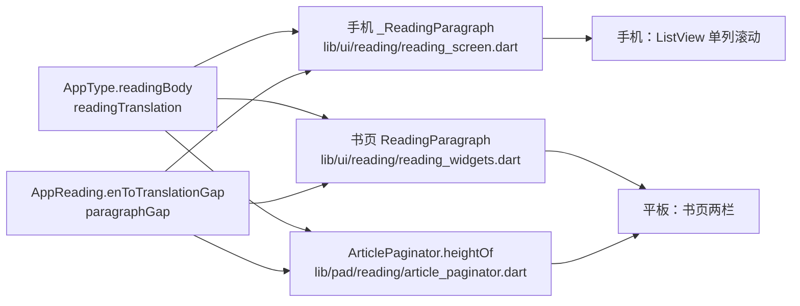

# 阅读排版（正文字号 / 行距 / 段间距）

## 主题定位

本文描述**阅读页正文字排版**：英文正文、中文译文的字号与行高，以及段内（英文→译文）、段间（译文→下一段英文）的间距。这套取值由手机与平板两棵树共用，是「离线测量页高 = 在线渲染」这条不变量的唯一真源。

不描述书页如何分页（见 [reading-spread.md](reading-spread.md)）、不描述句子高亮与滚动（见 [reading-sentence-highlight.md](reading-sentence-highlight.md)）、不描述整页布局与 chrome（见各页自身）。

## 取值

| 样式 / 间距 | 值 | 定义处 |
|---|---|---|
| 英文正文 `AppType.readingBody` | 22sp / 行高 34sp（1.55×）/ `AppColors.ink` | `core/theme/app_type.dart` |
| 中文译文 `AppType.readingTranslation` | 17sp / 行高 25sp（1.47×）/ `AppColors.muted` | `core/theme/app_type.dart` |
| 段内：英文 → 译文 `AppReading.enToTranslationGap` | 16dp | `core/theme/app_dimens.dart` |
| 段间：译文 → 下一段 `AppReading.paragraphGap` | 28dp | `core/theme/app_dimens.dart` |
| 文章标题 `AppType.readingTitle` | 28sp serif / `ink`（`displayMedium` 派生） | `core/theme/app_type.dart` |

### 为什么是这些值（2026-09-19 参考图实测）

取自一款英文阅读 App 的真机截图（1156×2510，按 393dp 逻辑宽折算 ≈ 2.94 图像 px/dp），逐项测量后对齐：

| 项 | 参考图折算 | 本 App |
|----|-----------|--------|
| 英文正文行距 | ≈ 34dp | 34dp |
| 英文 x-height / 行距 | 34 / 101 px = 0.34 | 11.6 / 34 dp = 0.34 |
| 段间距（译文→下段，墨迹到墨迹） | 41.8dp | 41.9dp |
| 中文译文 / 英文正文字号比 | ≈ 0.80 | 17 / 22 = 0.77 |
| 段内间距（英文→译文，墨迹到墨迹） | 38.8dp | 29.3dp |

行距、段间距、字号比例三项与参考图一致。**段内间距是唯一刻意的偏离**：参考图把它做得与段间距几乎一样大（38.8 vs 41.8），本 App 收紧到 16dp——译文紧贴自己的英文段，段落分组靠段间距 28dp 表达，分组比参考图更清楚。若要完全对齐参考图，把 `AppReading.enToTranslationGap` 调到 26 即可（只此一处）。

> 译文颜色用 `muted`(#6C6A64) 而不是 `mutedSoft`(#8E8B82)：17sp 下浅灰的对比度不够。

## 结构线：一套 token，两棵树，一个测量器



- 手机与平板是两棵独立的界面树（见 CLAUDE.md「两棵源码树」），段落 widget 各写各的；**只有数值来自同一份 token**，所以改字号不会两边漂移。
- `ArticlePaginator` 用 `TextPainter` 离线测量页高，测的是**同一批 token**——这与 `reading-spread.md` 里「样式对齐 / textScaler 对齐」是同一类约束，本文的表格是它引用的真源。

## 布局线：段间距在块内，块间无间距

```text
┌─ ParagraphBlock（一个块）─────────────────┐
│ 英文正文 RichText                          │
│   ↕ enToTranslationGap (16)                │
│ 中文译文 Text（TranslationMode.hidden 时为空）│
│   ↕ paragraphGap (28)                      │
└────────────────────────────────────────────┘
   ↕ 0（块间不加间距）
┌─ 下一个 ParagraphBlock ────────────────────┐
```

段间距算在**前一个块的块高里**，块与块之间不加任何间距。理由：分页是按块边界打包的，若把间距放在块外，测量就得知道「本段是否落在页首」才能减掉这段间距——多一个耦合点，且容易与渲染分叉。

`TranslationMode.hidden` 时没有「英文→译文」的空隙，但**段间距照旧保留（28dp）**：段落节奏不随译文模式变化。测量端 `heightOf` 对隐藏模式单独返回 `正文高 + paragraphGap`。

## 错误处理线：改这些值的连锁反应

改字号或间距时，以下位置必须一起动（漏一处就是「测量 ≠ 渲染」，表现为书页溢出页底或页尾留白异常）：

1. `core/theme/app_type.dart` / `core/theme/app_dimens.dart`——真源。
2. `test/core/theme/reading_type_test.dart`——数值断言，故意写死，逼改动显式化。
3. 手机 `_ReadingParagraph` 与书页 `ReadingParagraph` 都只引用 token，不写字面量；确认没有别处 copyWith 出新数值。
4. `lib/pad/reading/article_paginator.dart` 的 `kEnToTranslationGap` / `kParagraphGap` 是 token 的别名，不要改成字面量。
5. 与阅读样式无关的卡片**不要**顺手改成新值：例如平板首页「继续阅读」卡片的正文预览用的是 `textTheme.bodyMedium`（见 `pad_continue_card.dart`），曾经借 `readingTranslation` 一用——字号一涨就会把卡片撑大。

验证：`flutter test test/pad/reading/pad_pagination_contract_test.dart`（真实文章，断言每页渲染高 ≤ 分页高），以及模拟器上双端各截一张图核对观感。
