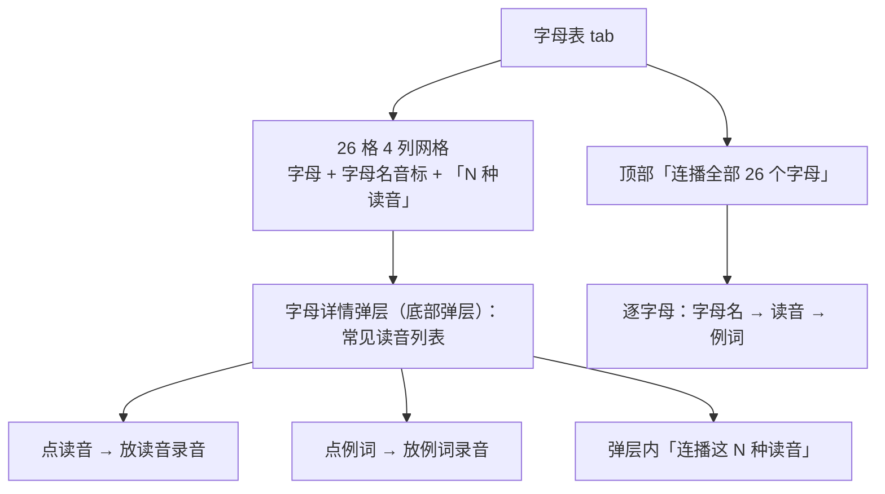
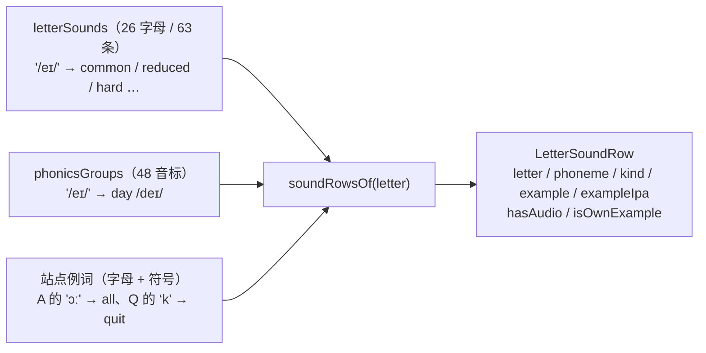
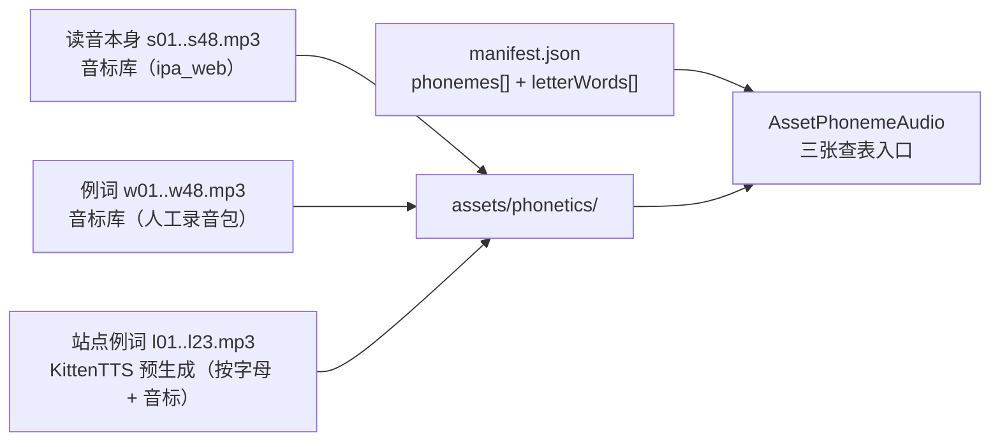
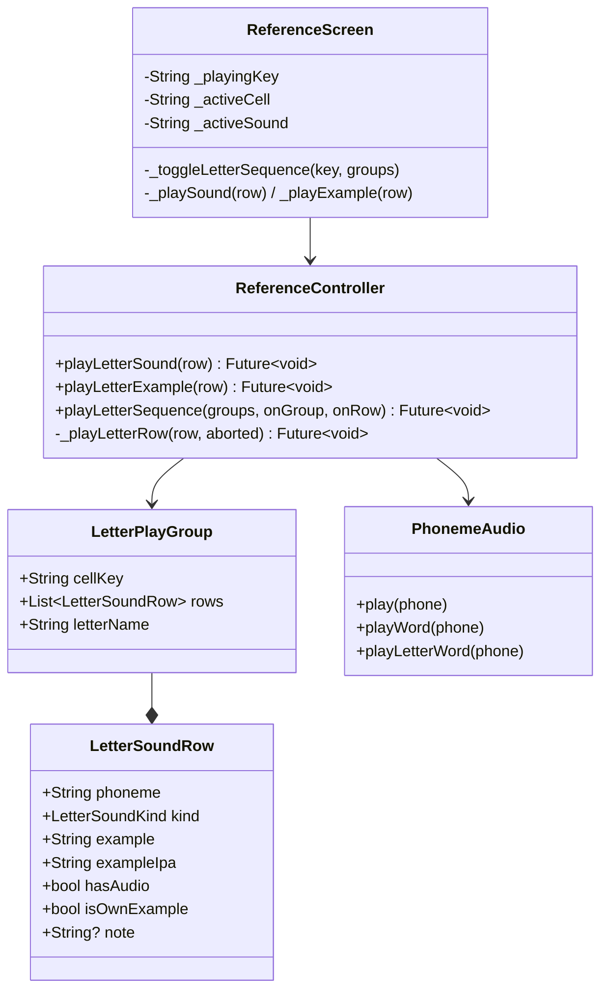
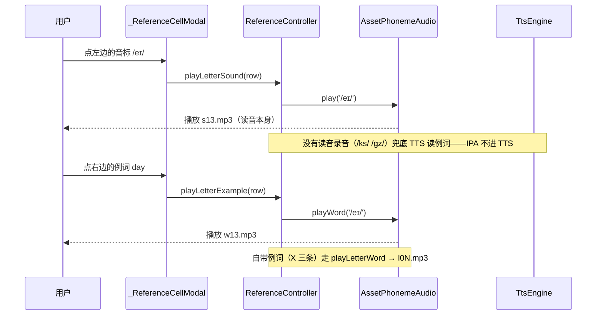
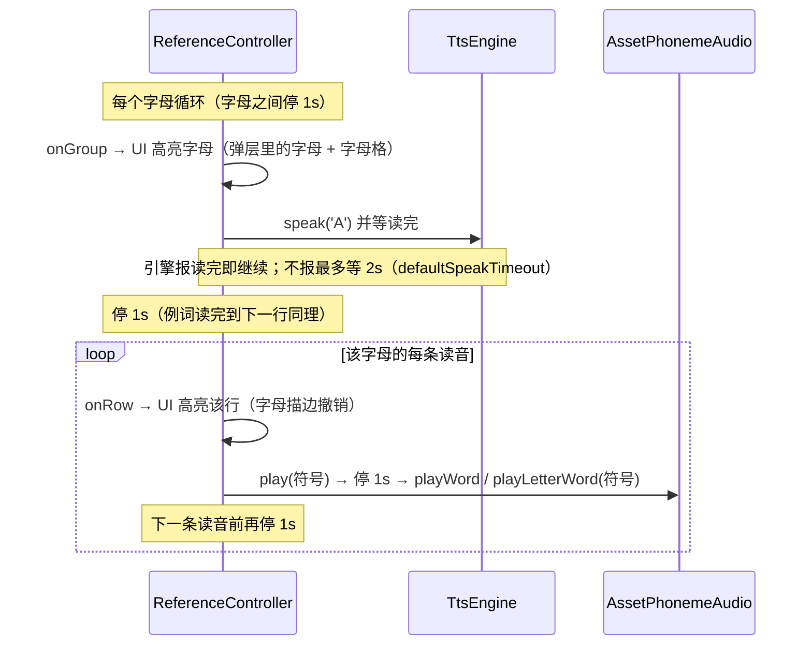
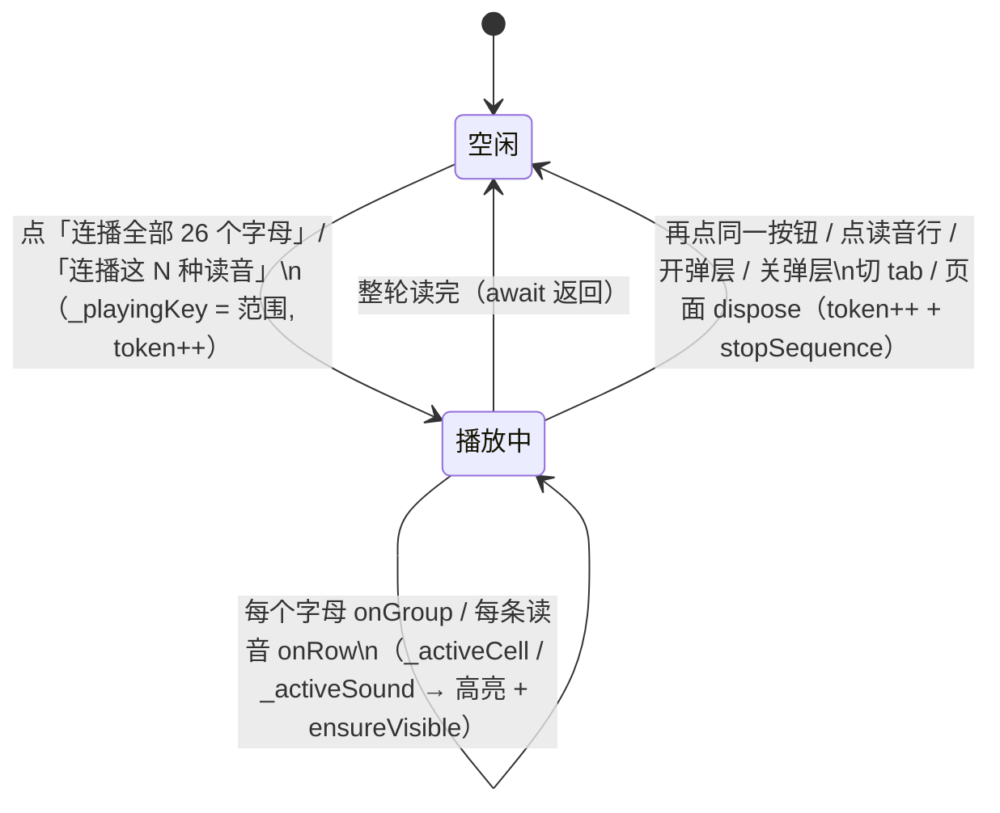

# 字母表（参考页「字母表」tab）

## 主题定位

参考页「字母表」tab 的全部内容：26 个字母格、字母详情弹层（**该字母的常见读音**）、两条连播（整张字母表、单个字母的读音）。

音频素材分两路：读音本身与「例词取自音标库」的那些例词放的就是音标那 48 个随包录音（`assets/phonetics/s*.mp3` / `w*.mp3`），素材来路与转码规格见 [phoneme-audio.md](phoneme-audio.md)；**「自带站点例词」的几条例词是 TTS 预生成的 `l*.mp3`**（见「素材来源」）；连播里的字母名走运行时 TTS，见 [tts-engine.md](tts-engine.md)。

## 业务功能线



**网格**：每格三行——`A a`、字母名音标 `/eɪ/`（点击进弹层）、`5 种读音`（该字母有几种读法）。字母读音种类数从 1（B/F/H…）到 6（O/U）不等。

**弹层**（点字母格打开，底部弹层、内容可滚动）= 顶部一个**字母**（`A a` + 字母名音标，只显示、不可点）+ 小节头 `常见读音 (5)` + ▶/■ 连播按钮 + 读音行列表。字母表的例词（`Apple` / 中文 / 40sp 大字）与「发音」按钮**不在弹层里**（2026-09-22 去掉：这块功能的重点是「这个字母能发哪些音」）。

那个字母是**连播的当前位标**：连播读到字母名时它套一圈珊瑚描边（背后的字母格同时高亮），读到具体读音时高亮转到那一行、字母描边撤销。听单个字母名只有连播这一条路（连播两种范围都以字母名开头）。

**读音行**是这块功能的主角：音标 + 类别徽章 + 例词 + 例词音标，**两个点击区**（与音标格弹窗同款分工）：

| 点击区 | 行为 |
|--------|------|
| 左边音标 | 放**读音本身**的录音；没有录音的读音（X 的 `/ks/` `/gz/`）兜底读例词（IPA 绝不进 TTS） |
| 右边例词 | 放**例词录音**（音标库那套或 TTS 预生成那批）；录音缺了回退 TTS 读例词 |
| 弹层「连播这 N 种读音」 | 读音录音 → 停 1s → 例词录音，逐行往下读 |

- **类别徽章**：`硬音`/`软音`/`弱读`/`组合音`/`少数词` 才挂徽章（长按出解释），最常见的那类（`常见音`）不挂——满屏徽章等于没有徽章。徽章把 C/G 的硬软音规则（`cat` vs `city`、`go` vs `giant`）这类信息直接摆在行上。
- **例词的硬规则：必须含这个字母**。`/eɪ/` 那行的例词就是音标 tab 里 `/eɪ/` 的例词 `day`（day 里有 a）——录音按音标符号给（`w*.mp3`），换个词就没声音，所以能用音标库的词就用。**音标库那个词不含该字母时换站点例词**：2026-09-22 修过一个 bug——A 的 `/ɔː/` 当时用的是音标库的 `door`，可 door 里没有 a，那行就教不了字母 A。同批换掉的还有 C 的 `/k/`（`key` → `cat`）、C 的 `/s/`（`sun` → `city`）、G 的 `/dʒ/`（`jump` → `giant`）、I 的 `/aɪ/`（`my` → `time`）、Q 的 `/k/`（`key` → `quit`）等 **23 条**——它们全部改用站点例词，并**用 App 自带的 KittenTTS 预生成录音**（`l01..l23.mp3`；不用运行时 TTS 是因为连播要精确等一段播完再进下一段，而 TTS 没有播完回调）。这条规则由 `reference_data_test` 守门：每条读音的例词都要包含该字母。
- **同一个音标在不同字母下例词不同**：`/dʒ/` 在 D 是 `educate`、在 G 是 `giant`；`/k/` 在 C 是 `cat`、在 Q 是 `quit`；`/z/` 在 S 是 `is`、在 X 是 `xylophone`。所以 `letterWords` 按**字母 + 音标**索引，不能只按符号。
- **X 的 `/ks/` `/gz/` 是组合音**：两个音连读，录音库里连**读音本身**都没有（也无从拆开拼），这两行徽章标 `组合音`、注记「无单独录音」，点读音兜底读例词；`/z/` 的读音录音照放（音标库里有 `/z/`）。

**连播**（两种范围，同一套状态机）：

- **整张字母表**（tab 顶部按钮）：逐字母「TTS 读字母名 → **读完**停 1s → 逐条读音『读音录音 → 停 1s → 例词录音 → **读完**停 1s』」，**字母与字母之间再停 1s**。26 字母 63 条读音，整轮约 **4.5 分钟**。
- **弹层内「连播这 N 种读音」**：只有一组，读法同上（没有组边界那一拍）。
- **每一拍都等前一段真读完**再算：录音本来就是等播完才返回；字母名是 TTS，走 `_speakAndWait`——引擎报「读完」就往下走，不报最多等 `defaultSpeakTimeout`（2s）放行（见「错误处理与边界」）。「例词读完 → 下一行」那一拍设在行与行之间（`rowIndex > 0` 时先停再读），所以最后一行读完不再空等。
- 播放中当前位标套珊瑚描边高亮：读字母名时是弹层里的字母（+ 背后字母格），读读音时是那一行；整体连播时字母格还会自动滚到可见。再点同一个按钮即停。

**打断规则**（与音标 tab 完全一致，见 [phoneme-audio.md](phoneme-audio.md)「连播状态机」）：掐声（录音 + 字母名 TTS 都掐）、当前行不补读、迟到回调丢弃。触发停止的动作：再点同一按钮、点任意读音行、点任意字母格开弹层、关弹层、切 tab、离开页面。

## 技术实现线

### 数据：字母 → 读音（静态表 + 解析）

静态表 `letterSounds`（`lib/ui/reference/reference_data.dart`）只写**符号 + 类别**，例词不写——例词与例词音标由 `soundRowsOf(letter)` 按符号从 `phonicsGroups` 解析：



- 静态表**自带例词**的行（例词必须含该字母，音标库那个词不含时才自带，共 23 条）→ 用自带的词，`isOwnExample = true`：例词录音走 manifest 的 `letterWords` 段（TTS 预生成那批）。
- 否则例词、例词音标取自音标库 → `isOwnExample = false`（例词录音与 `w*.mp3` 一一对应）。
- `hasAudio`（**读音本身**有没有录音）另算：看符号在不在音标库里——X 的 `/z/` 是 `hasAudio = true` + `isOwnExample = true`（读音有录音、例词是站点的词）。
- 匹配时两侧都过 `normalizePhone`（去斜杠、`ɡ`↔`g`），与录音查表同一套归一化。
- `soundRowsOf` 对不存在的字母**抛 `StateError`**：数据写错要当场炸，不静默给空表。

**为什么从 `phonicsGroups` 解析而不是另抄一份例词**：抄一份必然漂移（音标 tab 换例词、录音包换词，字母表还留着旧词）；解析则「同一个音只有一个例词」是结构性保证，且那份例词与 `w*.mp3` 例词录音一一对应（由 `reference_data_test` 守门）。

### 素材来源：三条链路



第三条链路（`l*.mp3`）的生成步骤——换/加「自带例词」的读音行时按这个跑：

1. 在 `reference_data.dart` 的 `letterSounds` 里把该行写成自带例词（`example:` / `exampleIpa:`）。
2. `flutter test integration_test/generate_letter_words_test.dart -d <device>`：在设备上用 App 自带的 KittenTTS（micro 模型 + bella 音色，与参考页同嗓子）逐词合成，落到设备外部文件目录，**并停 30s 等 pull**（集成测试一结束应用就被卸载，外部目录随之消失，所以要边跑边拉）：

   ```bash
   adb pull /sdcard/Android/data/com.ak.contexta/files/letter_words /tmp/letter_words
   ```

3. 转 mp3 并落进 assets（设备上只出 wav：kittentts 不带 mp3 编码器，MP3 编码要 GPL/LGPL 的代码）：

   ```bash
   lame --quiet -b 64 -m m /tmp/letter_words/l01.wav assets/phonetics/l01.mp3
   ```

4. 把 `/tmp/letter_words/manifest-fragment.json` 的内容并进 `manifest.json` 的 `letterWords` 段。
5. `flutter test test/ui/reference/reference_data_test.dart`：守门「自带例词的行必须在 manifest 里有条目、词对得上、文件存在且非空」。

`impl/server/tool/import-phonetics-audio.ts` 的 `--phonemes-from` 与 `--zip` 两个模式都会**原样带过 `letterWords` 段**（换音标包不该把这批丢掉）。

### 播放链路



`PhonemeAudio` 三个入口对应三张表：`play` = 读音本身（`phonemes[].file`）、`playWord` = 音标库例词（`phonemes[].wordFile`）、`playLetterWord(letter, phone)` = 字母读音行的站点例词（`letterWords[].file`）。**后两者不能合并**——同一个音标在不同字母下例词不同（`/dʒ/`：D 是 `educate`、G 是 `giant`），而且音标库那套本身也可能与字母读音行不同（`/z/`：音标库 `zoo`、X 行 `xylophone`）。

`letterSounds` →（`soundRowsOf`）→ `LetterSoundRow` →（`allLetterPlayGroups` / `letterPlayGroupOf`）→ `LetterPlayGroup`（`cellKey` 是网格格子标识 `'A a'`，`letterName` 取首字符给 TTS）。

单个点击区（点读音 / 点例词各一条独立路径，互不牵连）：



连播里一行是两段连读（整张字母表连播在每格开头还多一段 TTS 字母名）：



**「读完」是怎么知道的**：录音天然等播完（`AssetPhonemeAudio` 等 `onPlayerComplete`，超时 5s 兜底）；TTS 走 [tts-engine.md](tts-engine.md) 的 `setOnSpeakingFinished` 回调 + 2s 超时兜底——`_speakAndWait` 等回调，而不是「发出去就数拍子」。这条替换掉了早先「TTS 没有回调、靠固定间隔硬错开」的做法（那时 `W` 这种多音节字母名会和后面的读音叠上）。

### 连播状态机



`_playingKey` 的取值区分四条来源：`_allLettersKey`（整张字母表）、`_letterSeqKey(letter)`（弹层内单个字母）、音标 tab 的 `_allPhonicsKey` 与分组名。页面状态三个字段各管一段：`_playingKey` 决定按钮显示「连播」还是「停止」、`_activeCell` 是高亮的格子、`_activeSound` 是高亮的读音行。

## 数据模型线

无数据库实体。静态数据全在 `lib/ui/reference/reference_data.dart`：

| 数据 | 内容 |
|------|------|
| `LetterSoundKind` | 类别枚举，带中文标签与一句解释（徽章文案 + 长按提示） |
| `letterSounds` | 26 字母 / 63 条：符号 + 类别（+ X 三条自带站点例词与音标） |
| `AlphabetItem.soundCount` | 格子上的「N 种读音」 |
| `soundRowsOf(letter)` | 解析成 `LetterSoundRow`（例词来自音标库；音标库的词不含该字母时用静态表里自带的站点例词） |
| `allLetterPlayGroups` / `letterPlayGroupOf(letter)` | 连播分组（格子标识 + 读音行） |

音频资产两份，各有各的对应表：

| 资产 | 内容 | 查表 |
|------|------|------|
| `s01..s48.mp3` / `w01..w48.mp3` | 48 个音标本身 + 48 个音标库例词（随包真人录音） | `manifest.phonemes[]` |
| `l01..l23.mp3` | 站点例词的 TTS 预生成录音（24kHz 单声道 64kbps，共约 310KB） | `manifest.letterWords[]`（`letter` / `phoneme` / `word` / `file`，按**字母 + 音标**索引） |

数据来源是 [english-ipa.netlify.app](https://english-ipa.netlify.app) 的「字母读音」板块（音频同源 [resetsix/english-ipa](https://github.com/resetsix/english-ipa)）——**取「字母 → 读音符号 + 类别」这一层**；例词优先用本 App 音标库那套（站点用的是美式音标 + 另一批例词，而且那些词没有随包录音），**音标库那个词不含该字母时**（共 23 条）换站点例词并预生成录音（见「业务功能线」与「素材来源」）。

## 错误处理与边界

| 场景 | 处理 |
|------|------|
| 读音不在录音库（组合音） | `hasAudio = false`：点读音不白等，直接读例词；行上注记「无单独录音」 |
| 自带例词的录音缺失 | `playLetterWord` 返回 false → 回退 TTS 读例词 |
| 音标库例词录音缺失 | `playWord` 返回 false → 同上回退 TTS |
| 读音录音启动失败 | 不白等那一拍，直接读例词 |
| TTS 引擎不上报「读完」 | `_speakAndWait` 最多等 2s（`defaultSpeakTimeout`）放行，不把整轮卡死 |
| TTS 引擎没就绪 / 拒绝这次朗读 | 直接往下走（连播开头没有字母名，但整轮照常） |
| 字母不在读音表 | `soundRowsOf` 抛 `StateError`（数据错误当场暴露，不静默降级） |
| 读音表与音标库漂移 | `reference_data_test` 直接红（符号覆盖 + 例词一致性 + 组合音白名单三重断言） |
| 自带例词缺 `letterWords` 条目 / 词对不上 / 文件不在 | `reference_data_test` 直接红（跑生成用例补上）；清单里多出来的孤儿条目也会红 |
| 例词不含该字母 | `reference_data_test` 直接红（这是 2026-09-22 A 的 `door` 那个 bug 的守门） |
| 旧版 manifest（没有 `letterWords` 段） | 解析返回空表 → 那几行回退 TTS，页面不崩 |
| 连播中途停止 | 掐声（录音 + 字母名 TTS）、当前行不补读、迟到回调丢弃 |
| 停止发生在字母名开口前 | 该字母连字母名都不读（`onGroup` 回调后立刻查令牌） |
| 播放中打开弹层 / 关弹层 | 都先 `stopSequence()`，声音不叠着响 |
| 离开页面 | `dispose` 里 `stopSequence()`（控制器引用在 `initState` 取一次，`dispose` 里不能再碰 `ref`） |

## 测试覆盖

| 测试 | 覆盖 |
|------|------|
| `test/ui/reference/reference_data_test.dart` | 26 字母都有读音表且顺序与字母表一致；每条读音要么在音标库里（有录音）要么在组合音白名单（自带例词）；非自带例词的行其例词 / 例词音标与音标库同符号一致；X 三条读音的顺序、例词（box / exam / xylophone）、音标与录音标记；**每条读音的例词都必须含这个字母**（守住 A 的 door 那个 bug）；自带例词在 manifest 有 `letterWords` 条目且词一致、文件存在且非空、清单里没有孤儿；未知字母抛错；连播分组 26 组、字母名取首字符、单字母分组 |
| `test/domain/audio/phoneme_audio_test.dart` | `letterWordClipsFromManifest`：解析、归一化、整段缺失 / 坏 JSON / 缺字段条目 |
| `test/data/audio/asset_phoneme_audio_test.dart` | `playLetterWord` 按字母 + 音标查（同一个 `/z/`：X 是 xylophone、S 是 is、音标库是 zoo，三条互不串）；组合音只有例词录音；字母对不上就返回 false；manifest 缺失时返回 false |
| `test/ui/reference/reference_controller_test.dart` | 点读音只放读音录音（TTS 不发声）；点例词只放例词录音；组合音点读音兜底 TTS 读例词；自带例词走 `playLetterWord`；自带例词 / 音标库例词录音缺失各自回退 TTS；单行点播不受停止影响；连播一行「读音录音 → 停一拍 → 例词录音」；读音没录音不白等；**字母名等它读完才往下走**（引擎报完成立刻继续，不等超时）；引擎不上报完成时按 `speakTimeout` 放行；**例词读完到下一条读音之间停一拍**；字母内连播（字母名 → 逐行，逐行回调）；字母名后那一拍；字母间那一拍且只停一次；空表直接结束；中途停止（掐录音 + 掐 TTS + 当前行不补读）；停止在字母名之前；整张字母表 26 组跑完（读音录音 / 音标库例词 / `letterWords` / TTS 各自的条数对得上） |
| `test/ui/reference/reference_screen_test.dart` | 格子上「N 种读音」；弹层是底部对齐、顶部有字母（不可点）、只有「常见读音」（字母表例词 / 发音按钮都不在）；点读音出声、点例词出声（都不走 TTS）；组合音行徽章 / 注记 / 点读音兜底 TTS / 点例词走预生成录音；弹层内连播（**读字母名时高亮弹层里的字母 + 背后字母格，读到读音时高亮转到行**、停止复位）；关弹层即停；顶部「连播全部 26 个字母」（开播高亮 A 格、停止清除） |
| `integration_test/generate_letter_words_test.dart` | **生成用例**（不是回归测试）：合成自带例词的 wav + manifest 片段，见「素材来源」 |
