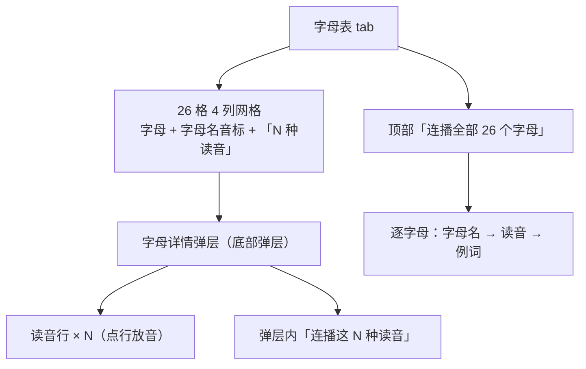
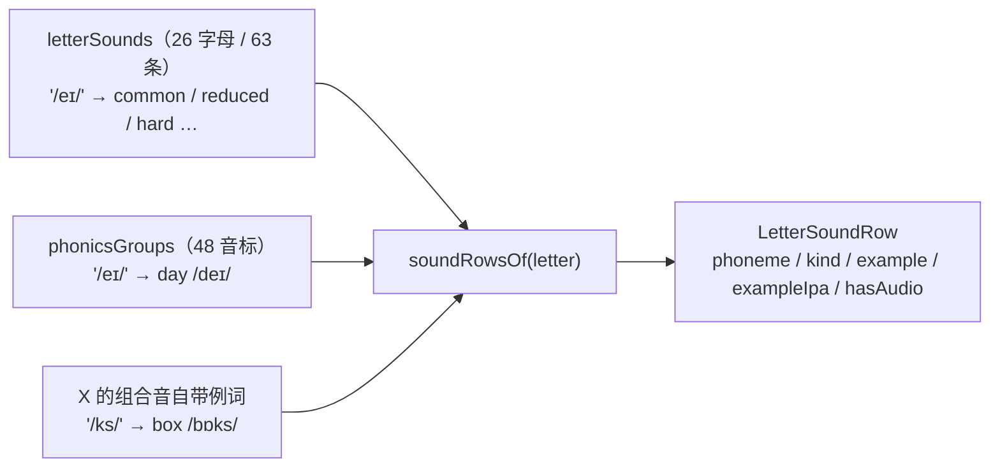
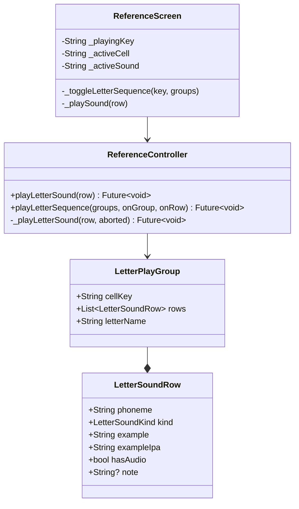
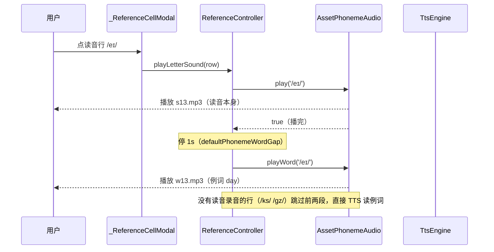
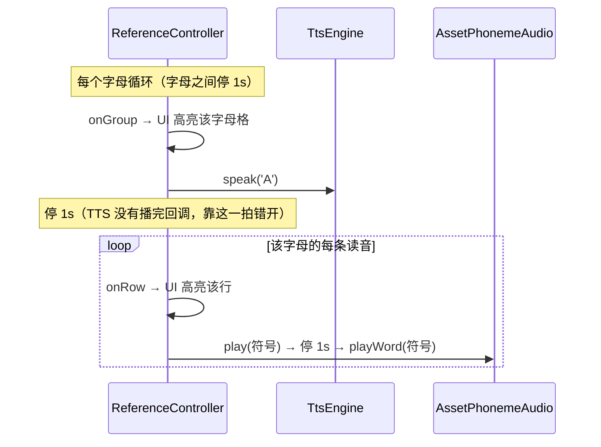
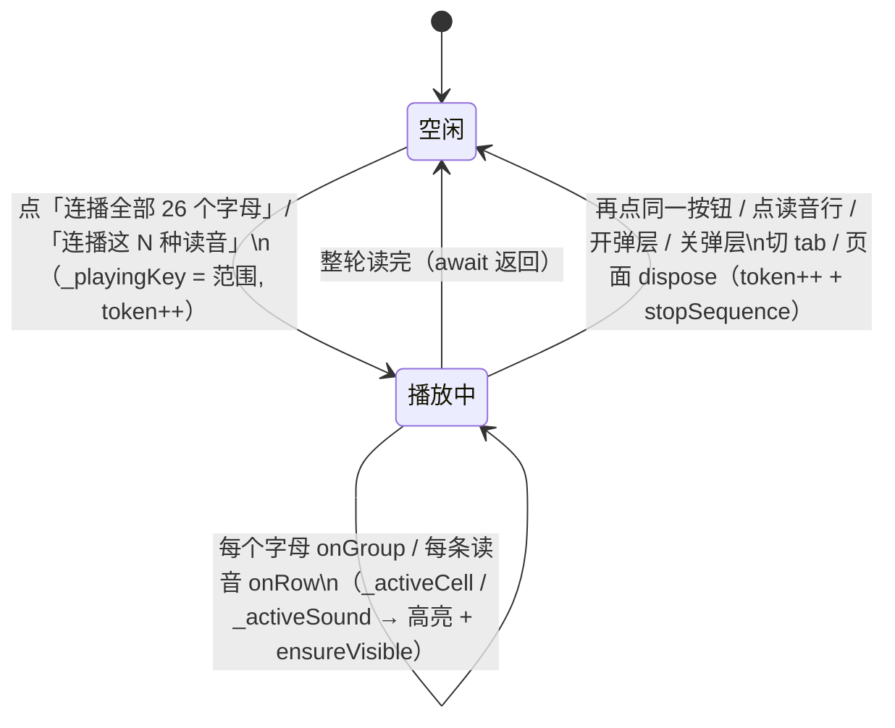

# 字母表（参考页「字母表」tab）

## 主题定位

参考页「字母表」tab 的全部内容：26 个字母格、字母详情弹层（字母名 / 例词 / **该字母的常见读音**）、两条连播（整张字母表、单个字母的读音）。

字母读音**不新增任何音频素材**：读音行放的就是音标那 48 个随包录音（`assets/phonetics/s*.mp3` / 例词 `w*.mp3`），素材来路与转码规格见 [phoneme-audio.md](phoneme-audio.md)；字母名与「组合音例词」走 TTS，见 [tts-engine.md](tts-engine.md)。

## 业务功能线

**网格**：每格三行——`A a`、字母名音标 `/eɪ/`（点击进弹层）、`5 种读音`（该字母有几种读法）。字母读音种类数从 1（B/F/H…）到 6（O/U）不等。

**弹层**（点字母格打开，底部弹层、内容可滚动）自上而下五块：

| 块 | 内容 | 点击行为 |
|----|------|---------|
| ① 字母名 | `A a` 28sp + 注脚音标 `/eɪ/` | TTS 读字母名（`A`） |
| ② 例词 | 例词 40sp 珊瑚 + 例词音标 + 中文 | TTS 读例词（`Apple`） |
| ③ 小节头 | `常见读音 (5)` + ▶/■ 按钮 | 连播这 N 种读音 |
| ④ 读音行 | 音标 + 类别徽章 + 例词 + 例词音标 | 读音录音 → 停 1s → 例词录音 |
| ⑤ 发音 | 珊瑚按钮（钉在弹层底部，不随列表滚走） | 字母名 → 停 1s → 例词（两段 TTS） |

**读音行**是这块功能的主角：它把「这个字母能发哪些音」摊开，每行都能当场听到（点行就是那两段录音）。

- **类别徽章**：`硬音`/`软音`/`弱读`/`组合音`/`少数词` 才挂徽章（长按出解释），最常见的那类（`常见音`）不挂——满屏徽章等于没有徽章。徽章把 C/G 的硬软音规则（`cat` vs `city`、`go` vs `giant`）这类信息直接摆在行上。
- **例词一律来自音标库**：`/eɪ/` 那行的例词就是音标 tab 里 `/eɪ/` 的例词 `day`——因为录音是按音标符号给的（`w*.mp3`），换个词就没声音。代价是个别字母的例词不体现该字母的拼写（C 的 `/s/` 是 `sun` 而不是 `city`、G 的 `/dʒ/` 是 `jump` 而不是 `giant`、Q 的 `/k/` 是 `key`、X 的 `/z/` 是 `zoo`）——这是「例词要能发声」换来的，见「数据模型线」。
- **组合音没有录音**：X 的 `/ks/` `/gz/` 是两个音连读，录音库里没有对应文件（也无从拆开拼），这两行徽章标 `组合音`、注记「无单独录音」，点行只 TTS 读例词（`box` / `exam`）。例词与音标是这两行**唯一自带**的数据。

**「发音」按钮两段 TTS**：字母名与例词分开朗读，中间停一拍（`defaultPhonemeWordGap` = 1s）。早先是拼成一句 `'A. Apple'` 送 TTS（靠句号制造停顿），2026-09-21 改为两段——与音标格「音标录音 → 停一拍 → 例词录音」同款节奏，字母表与音标 tab 听感一致。

**连播**（两种范围，同一套状态机）：

- **整张字母表**（tab 顶部按钮）：逐字母「TTS 读字母名 → 停 1s → 每个读音『录音 → 停 1s → 例词录音』」，**字母与字母之间再停 1s**。26 字母 63 条读音，整轮约 **4-5 分钟**。
- **弹层内「连播这 N 种读音」**：只有一组，读法同上但不读字母名之后那一拍之外的组间停顿（没有组边界）。
- 播放中当前格（整体连播时是字母格、弹层内是读音行）套珊瑚描边高亮，并自动滚到可见；再点同一个按钮即停。

**打断规则**（与音标 tab 完全一致，见 [phoneme-audio.md](phoneme-audio.md)「连播状态机」）：掐声（录音 + 字母名 TTS 都掐）、当前行不补读、迟到回调丢弃。触发停止的动作：再点同一按钮、点任意读音行、点任意字母格开弹层、关弹层、切 tab、离开页面。

## 技术实现线

### 数据：字母 → 读音（静态表 + 解析）

静态表 `letterSounds`（`lib/ui/reference/reference_data.dart`）只写**符号 + 类别**，例词不写——例词与例词音标由 `soundRowsOf(letter)` 按符号从 `phonicsGroups` 解析：

- 音标库里有该符号 → 例词、例词音标取自音标库，`hasAudio = true`（读音与例词都有随包录音）。
- 音标库里没有（只有 X 的 `/ks/` `/gz/`）→ 用静态表自带的例词，`hasAudio = false`（读音无录音、例词走 TTS）。
- 匹配时两侧都过 `normalizePhone`（去斜杠、`ɡ`↔`g`），与录音查表同一套归一化。
- `soundRowsOf` 对不存在的字母**抛 `StateError`**：数据写错要当场炸，不静默给空表。

**为什么从 `phonicsGroups` 解析而不是另抄一份例词**：抄一份必然漂移（音标 tab 换例词、录音包换词，字母表还留着旧词）；解析则「同一个音只有一个例词」是结构性保证，且那份例词与 `w*.mp3` 例词录音一一对应（由 `reference_data_test` 守门）。

### 播放链路

`letterSounds` →（`soundRowsOf`）→ `LetterSoundRow` →（`allLetterPlayGroups` / `letterPlayGroupOf`）→ `LetterPlayGroup`（`cellKey` 是网格格子标识 `'A a'`，`letterName` 取首字符给 TTS）。

整张字母表连播在每格开头多一段 TTS 字母名：

**字母名那一拍的来路**：TTS 没有「播放完成」回调（`TtsEngine.speak` 立刻返回，见 [tts-engine.md](tts-engine.md)），所以字母名与第一个读音之间**靠固定 1s 间隔错开**，而不是等播完。字母名比 1s 还长的（`W` `/ˈdʌbljuː/`）会让两段轻微叠上——已知取舍，换来的是不必给 TTS 加一套回调机制。

### 连播状态机

`_playingKey` 的取值区分四条来源：`_allLettersKey`（整张字母表）、`_letterSeqKey(letter)`（弹层内单个字母）、音标 tab 的 `_allPhonicsKey` 与分组名。页面状态三个字段各管一段：`_playingKey` 决定按钮显示「连播」还是「停止」、`_activeCell` 是高亮的格子、`_activeSound` 是高亮的读音行。

## 数据模型线

无数据库实体。静态数据全在 `lib/ui/reference/reference_data.dart`：

| 数据 | 内容 |
|------|------|
| `LetterSoundKind` | 类别枚举，带中文标签与一句解释（徽章文案 + 长按提示） |
| `letterSounds` | 26 字母 / 63 条：符号 + 类别（+ 组合音自带例词） |
| `AlphabetItem.soundCount` | 格子上的「N 种读音」 |
| `soundRowsOf(letter)` | 解析成 `LetterSoundRow`（例词来自音标库，组合音自带） |
| `allLetterPlayGroups` / `letterPlayGroupOf(letter)` | 连播分组（格子标识 + 读音行） |

数据来源是 [english-ipa.netlify.app](https://english-ipa.netlify.app) 的「字母读音」板块（音频同源 [resetsix/english-ipa](https://github.com/resetsix/english-ipa)）——**只取「字母 → 读音符号 + 类别」这一层**，例词一律换成本 App 音标库那套（站点用的是美式音标 + 另一批例词，搬进来会与全 App 的英式体系打架）。

## 错误处理与边界

| 场景 | 处理 |
|------|------|
| 读音不在录音库（组合音） | `hasAudio = false` → 跳过两段录音、不白等那一拍，直接 TTS 读例词；行上注记「无单独录音」 |
| 例词录音缺失 | 读音录音照放，那一拍之后回退 TTS 读例词 |
| 读音录音启动失败 | 同上：不白等，直接读例词 |
| 字母不在读音表 | `soundRowsOf` 抛 `StateError`（数据错误当场暴露，不静默降级） |
| 读音表与音标库漂移 | `reference_data_test` 直接红（符号覆盖 + 例词一致性 + 组合音白名单三重断言） |
| 连播中途停止 | 掐声（录音 + 字母名 TTS）、当前行不补读、迟到回调丢弃 |
| 停止发生在字母名开口前 | 该字母连字母名都不读（`onGroup` 回调后立刻查令牌） |
| 播放中打开弹层 / 关弹层 | 都先 `stopSequence()`，声音不叠着响 |
| 离开页面 | `dispose` 里 `stopSequence()`（控制器引用在 `initState` 取一次，`dispose` 里不能再碰 `ref`） |

## 测试覆盖

| 测试 | 覆盖 |
|------|------|
| `test/ui/reference/reference_data_test.dart` | 26 字母都有读音表且顺序与字母表一致；每条读音要么在音标库里（有录音）要么在组合音白名单（自带例词）；读音行的例词 / 例词音标与音标库同符号一致；X 三条读音的顺序与类别；未知字母抛错；连播分组 26 组、字母名取首字符、单字母分组 |
| `test/ui/reference/reference_controller_test.dart` | 读音行「读音录音 → 停一拍 → 例词录音」；组合音行不碰录音库、直接 TTS 读例词；例词录音缺失回退 TTS；读音录音没放成不白等；单行点播不受停止影响；字母内连播（字母名 → 逐行，逐行回调）；字母名后那一拍；字母间那一拍且只停一次；空表直接结束；中途停止（掐录音 + 掐 TTS + 当前行不补读）；停止在字母名之前；整张字母表 26 组跑完（有录音的读音条数 = 播放次数）；字母格「发音」两段 TTS 且中间停一拍 |
| `test/ui/reference/reference_screen_test.dart` | 格子上「N 种读音」；弹层是底部对齐 + 读音行内容；点读音行出声（不走 TTS）；组合音行徽章 / 注记 / 只 TTS 读例词；弹层内连播（高亮行、字母名先出声、停止复位）；关弹层即停；顶部「连播全部 26 个字母」（开播高亮 A 格、停止清除） |
