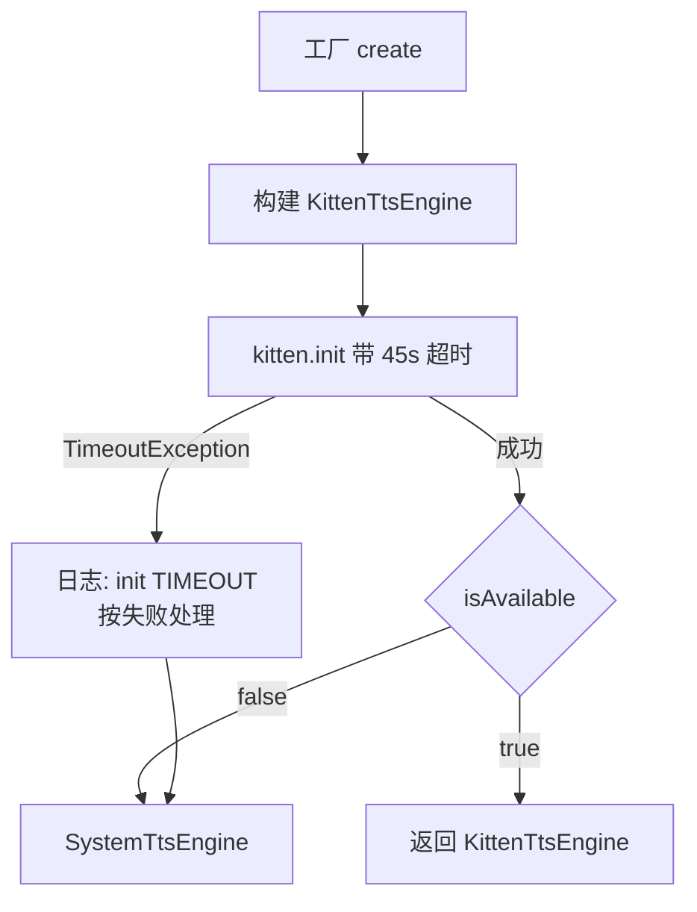
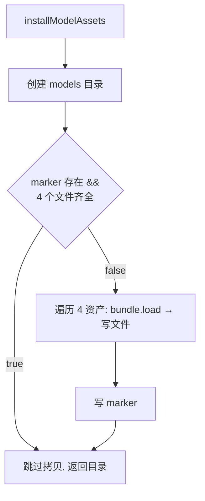

# TTS 引擎与资产安装

## 主题定位

阅读页全文朗读的语音合成引擎链：KittenTTS（本地神经网络 TTS）优先，初始化失败自动回退系统 TTS。本主题覆盖引擎组装、模型/词典资产安装（marker 语义）、init 超时兜底三条线。

## 业务功能线

用户点击朗读后，阅读页控制器（ReadingController）通过 `ttsEngineProvider`（`lib/di/providers.dart`，FutureProvider 懒加载）取得引擎，调用 `speak` / `speakFullArticle` / `speakParagraphs` 发声。用户无感知的是语音由哪条引擎链发声——KittenTTS 可用则用 KittenTTS（本地合成、音质好、不依赖系统引擎），否则静默回退系统 TTS。

朗读质量的两个坑（均已在代码层处理）：

1. **init 挂起**：CEPhonemizer 未传词典路径时，插件会从 `raw.githubusercontent.com` 下载 en_rules/en_list，http 无超时——国内网络下 `KittenTTS.create()` 永久挂起（CPU 0%），朗读链路被阻塞。解决：词典打包进 assets（`assets/kittentts_models/en_rules`、`en_list`，共 ~260KB），create() 显式传 `rulesPath`/`listPath` 直用本地文件，零网络依赖。
2. **音素器静默降级**：词典文件缺失时 `allowRuleBasedFallback` 兜底到纯规则音素器——发音质量明显变差（提交 9fb6c89 注释：「音质略差但可用」）。这就是 2026-08-10 真机「朗读效果变差」的根因：旧 APK 安装留下的 `.installed` marker 让新代码跳过资产拷贝，词典从未拷入。修复后 marker 不再是跳过拷贝的充分条件（见下）。

## 技术实现线

### 引擎组装（TtsEngineFactory）



- `TtsEngineFactory.create()`（`lib/data/tts/tts_engine_factory.dart`）：`kittenInitTimeout = 45s`，超时接住后按失败回退系统 TTS，不阻塞朗读链路。
- KittenTtsEngine 惰性初始化（首次 speak 前触发 `init()`），失败记录 `_failureReason`，`speak` 返回 null。
- 会话层 `KittenTtsPluginSession` 包装插件：WAV 生成 → audioplayers 播放 → 完成/段落回调（段落回调细节见 [reading-paragraph-highlight.md](reading-paragraph-highlight.md)）。

### 资产安装（installModelAssets）

首次 init 时把 4 个资产从 Flutter assets 解压到应用支持目录（Android 上为 `files/kittentts/models/`）：

```
assets/kittentts_models/           →  files/kittentts/models/
  kitten_tts_micro_v0_8.onnx (41MB)   ├── .installed（marker，内容 "1"）
  voices.npz (3MB)                    ├── kitten_tts_micro_v0_8.onnx
  en_rules (161KB)                    ├── voices.npz
  en_list (102KB)                     ├── en_rules
                                      └── en_list
```

**marker 语义（2026-08-10 修复后）**：`.installed` 存在 **且所有期望文件齐全** 才跳过拷贝。marker 存在但文件缺失时必须重新解压。



**为什么不能只看 marker**：词典打包进 assets（9fb6c89）之前安装的旧 marker 会让新代码跳过拷贝，词典缺失 → CEPhonemizer 静默降级为规则音素器 → 音质变差，且无任何报错。修复（2026-08-10）：跳过条件改为 marker + 文件完整性双重校验，未来新增任何资产（新模型、新词典）都会触发重新拷贝。

**测试注入点**：`basePathOverride`（根目录覆盖，绕过 path_provider）+ `bundleOverride`（内存 AssetBundle，绕过 rootBundle）。测试见 `test/data/tts/install_model_assets_test.dart`（全新目录拷贝 / stale marker 补齐 / 文件齐全跳过三用例）。

## 数据模型线

- 资产文件为二进制（onnx 模型、npz 音色、词典文本），无数据库实体。
- 朗读音频缓存见 TtsCacheManager（段落级 WAV，FIFO 50MB，表 `tts_cache`）。

## 错误处理与边界

| 场景 | 处理 |
|------|------|
| KittenTTS init 超时（45s） | 回退系统 TTS，日志记录，不阻塞朗读 |
| KittenTTS init 抛错 | `_failureReason` 记录具体原因，speak 返回 null / 回退系统 TTS |
| 词典文件缺失（旧 marker / 手动删除） | 重新拷贝补齐（marker+文件双重校验）；CEPhonemizer 侧仍有规则音素器兜底 |
| 首读耗时 | 首次 init 需解压 41MB 模型 + 词典，慢 1-2 秒属正常；marker 校验通过后为零拷贝 |

## 测试覆盖

- `test/data/tts/install_model_assets_test.dart`：marker 三语义用例（本次新增）
- `test/data/tts/kitten_tts_engine_test.dart`：init/speak/回调透传/失败路径（fake session）
- `test/data/tts/tts_engine_factory_test.dart`：Kitten 可用 / 失败回退 / 双失败不可用
- `test/data/tts/system_tts_engine_test.dart`、`tts_engine_contract_test.dart`：系统引擎与契约
- 真机验证：2026-08-10 修复后 init 0.7s、词典拷入后音质恢复；2026-08-09 init 挂起修复时验证 7 段全文朗读正常
