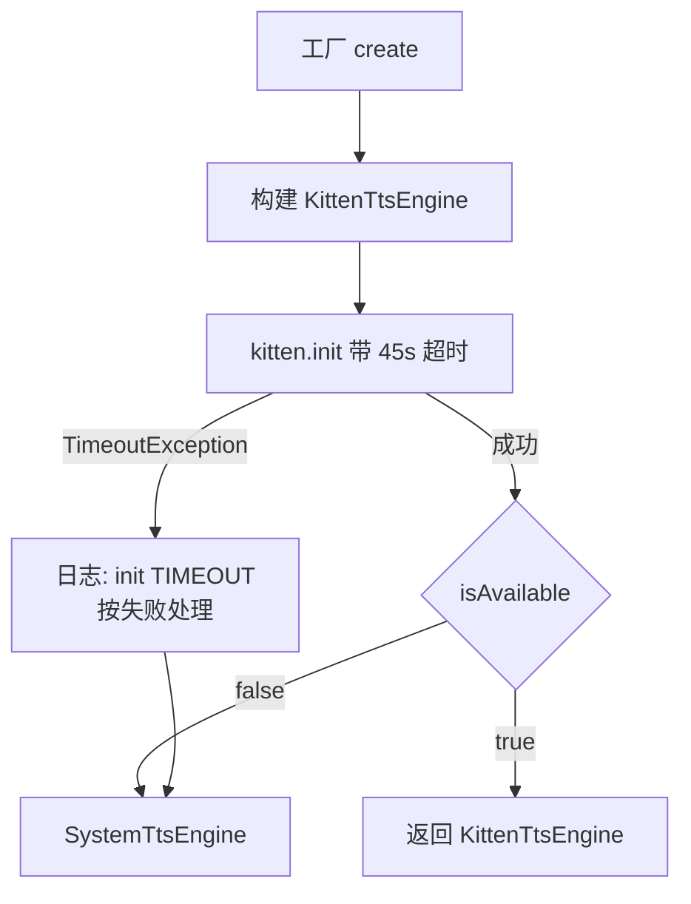
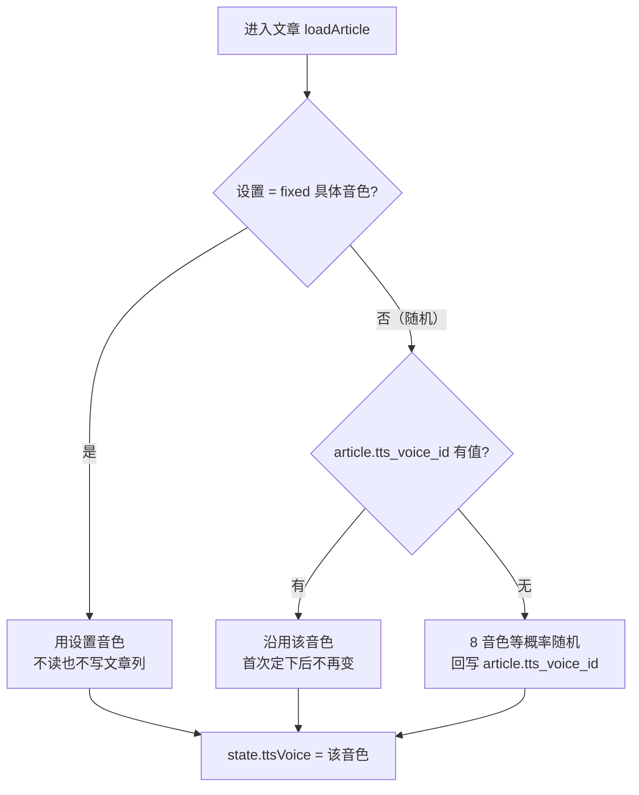
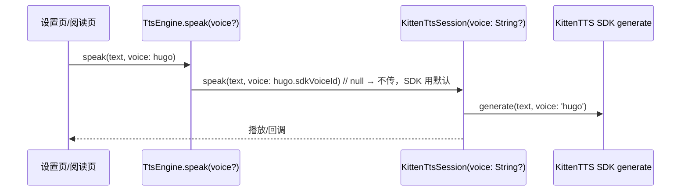
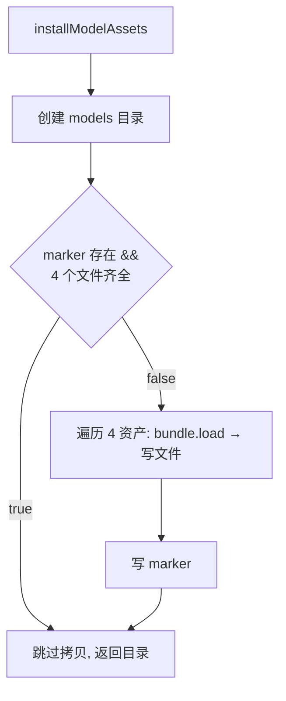

# TTS 引擎与资产安装

## 主题定位

阅读页全文朗读的语音合成引擎链：KittenTTS（本地神经网络 TTS）优先，初始化失败自动回退系统 TTS。本主题覆盖引擎组装、音色选择、模型/词典资产安装（marker 语义）、init 超时兜底四条线。

## 业务功能线

用户点击朗读后，阅读页控制器（ReadingController）通过 `ttsEngineProvider`（`lib/di/providers.dart`，FutureProvider 懒加载）取得引擎，调用 `speak` / `speakFullArticle` / `speakSentences` 发声（朗读单元 = 句子，见 [reading-sentence-highlight.md](reading-sentence-highlight.md)）。用户无感知的是语音由哪条引擎链发声——KittenTTS 可用则用 KittenTTS（本地合成、音质好、不依赖系统引擎），否则静默回退系统 TTS。

**音色选择**：KittenTTS 内置 8 个英语音色（Bella/Jasper/Luna/Bruno/Rosie/Hugo/Kiki/Leo）。设置页音色选择器的**默认项是「随机」**：文章朗读时，每篇文章在进入时随机分配一个音色（8 个等概率，男女不限）并写入 `article.tts_voice_id`，此后这篇一直用它——同一篇文章反复朗读听感一致，不同文章各有各的声音。用户也可在设置页显式选一个具体音色，此时**全站固定**用该音色、不再随机（阅读页忽略文章已分配的音色）。选择持久化到 `user_settings.tts_voice_id`（`'RANDOM'` 或具体音色名）。非文章入口里的**词汇页单词**在「随机」模式下也随机取一个（按会话稳定，见下）；**参考页固定 `bella`**，不跟随该设置（见下条）。系统 TTS 回退时音色不生效（系统引擎没有音色概念），但功能不受影响。

**参考页发音（非文章入口）**：字母格里走 TTS 的只有三处——点字母名大字读字母名、点例词大字读例词、弹窗「发音」按钮读**两段**（字母名 → 停一拍 → 例词，如 `A` 与 `Apple` 分开朗读、中间停 1s）。**音标格与字母读音行不走 TTS**：TTS 读不出 IPA 符号，音标本身与例词都是随包分发的真人录音（例词录音缺失才回退 TTS），两者都支持连播；字母表连播里读字母名仍走 TTS，且因为没有播完回调，靠固定 1s 间隔与后面的读音错开——见 [phoneme-audio.md](phoneme-audio.md) 与 [reference-alphabet.md](reference-alphabet.md)。

**参考页音色固定 `bella`**：`referenceControllerProvider` 不读 `user_settings.tts_voice_id`，构造时写死（`ReferenceController._voice` 默认值）。理由：参考页是「对着表一个个听」的场景，字母表与音标前后切换时音色必须一致，跟着全局设置走会导致每换一格换一个嗓子。设置页换音色对参考页无影响，阅读页/词汇页照旧。

朗读质量的四个坑（均已在代码层处理）：

1. **init 挂起**：CEPhonemizer 未传词典路径时，插件会从 `raw.githubusercontent.com` 下载 en_rules/en_list，http 无超时——国内网络下 `KittenTTS.create()` 永久挂起（CPU 0%），朗读链路被阻塞。解决：词典打包进 assets（`assets/kittentts_models/en_rules`、`en_list`，共 ~260KB），create() 显式传 `rulesPath`/`listPath` 直用本地文件，零网络依赖。
2. **音素器静默降级**：词典文件缺失时 `allowRuleBasedFallback` 兜底到纯规则音素器——发音质量明显变差（提交 9fb6c89 注释：「音质略差但可用」）。这就是 2026-08-10 真机「朗读效果变差」的根因：旧 APK 安装留下的 `.installed` marker 让新代码跳过资产拷贝，词典从未拷入。修复后 marker 不再是跳过拷贝的充分条件（见下）。
3. **首字母大写的词被逐字母拼读**（2026-09-18 iOS 模拟器实测）：标题 "Why the Sky Is Blue" 被读成 "S K Y"，而正文里小写的 sky 正常。原因是插件的音素器对**首字母大写**的词走单独的 capital 词典分支（插件源码 `src/cephonemizer/phonemizer.cpp` 的 `$capital` / `capital_dict_`，见 `phonemizer.cpp:2017`），未命中时退化为逐字母拼读。解决：`KittenTtsEngine` 在**送合成前统一转小写**（`normalizeTtsText`，作用于 `speak`/`speakSentences`/`speakFullArticle`/`pregenerateSentences` 四个入口）——Kokoro/KittenTTS 模型本身以小写文本训练、音素查表前也会 normalise 大小写，故转小写无副作用。只动**送合成**的文本：界面显示、句子高亮、缓存键（段落 + 句序 + 语速 + 音色，不含文本）都不受影响；系统 TTS 不做此转换（平台 TTS 大小写处理正确，转换反而会改变 NASA 一类缩写的读法）。
4. **插件默认存储目录在 iOS 上建不出来**（2026-09-18 模拟器实测）：插件把 `storageDirectory` 默认为 `<appSupport>/KittenTTS`，在 iOS 沙箱里 `Directory.create` 抛 `PathNotFoundException: Creation failed … errno = 2`；该异常被 `allowRuleBasedFallback` 吞掉 → **静默降级为规则音素器**，表现为「朗读能出声但发音奇怪」，且日志里 `[KittenTtsEngine] init SUCCESS` 一切正常。解决两处：`KittenTtsPluginSession.create` 显式传 `storageDirectory: <解压出的模型目录>`（我们自己的目录，创建必然成功）；`allowRuleBasedFallback: false`——词典加载失败时让 KittenTTS **整体不可用**（回退系统 TTS，听感正常），而不是「能出声但发音是错的」。诊断手法：把 `allowRuleBasedFallback` 关掉后 init 会直接报错并暴露真实原因；保持关闭则「init SUCCESS」即等价于「CE 音素器已加载」。
5. **IPA 符号不能直接送 TTS**：参考页音标发音改用随包录音后此坑消失（录音是 mp3，不经过音素器）；送进 TTS 的只剩字母名与「录音缺失时兜底的例词」这类真词。见 [phoneme-audio.md](phoneme-audio.md)。

## 技术实现线

### 引擎组装（TtsEngineFactory）



- `TtsEngineFactory.create()`（`lib/data/tts/tts_engine_factory.dart`）：`kittenInitTimeout = 45s`，超时接住后按失败回退系统 TTS，不阻塞朗读链路。
- KittenTtsEngine 惰性初始化（首次 speak 前触发 `init()`），失败记录 `_failureReason`，`speak` 返回 null。
- 会话层 `KittenTtsPluginSession` 包装插件：WAV 生成 → audioplayers 播放 → 完成/句子回调（句子回调与句子级缓存细节见 [reading-sentence-highlight.md](reading-sentence-highlight.md)）。
- 会话创建时三处显式指向本地资产（`kitten_tts_session.dart`）：`modelFiles`（onnx/voices 不下载）、`phonemizer.rulesPath/listPath`（词典不下载）、`storageDirectory`（不给插件用默认目录，见「朗读质量的三个坑」第 3 条）。

### 系统 TTS（SystemTtsEngine）的平台差异

| 维度 | Android | iOS |
|------|---------|-----|
| 初始化 | 引擎候选链：小米内置 → Google TTS → 系统默认（HyperOS 上默认构造器可能发现不了内置引擎） | 无「引擎包」概念（`getEngines` / `setEngine` 在 iOS 侧无实现），跳过候选链；改做 `setSharedInstance(true)` + `setIosAudioCategory(playback, …)`（否则静音开关连朗读一起静音）+ `isLanguageAvailable('en-US')` 探测 |
| 语速基准 | `TextToSpeech.setSpeechRate`：**1.0 = 正常语速**，显示语速直接透传 | `AVSpeechUtterance.rate`：**0.5 = 正常语速**（`AVSpeechUtteranceDefaultSpeechRate`），1.0 是最大档；显示语速 ×0.5（1.0x→0.5、0.8x→0.4、1.2x→0.6）。不缩放会快约一倍（模拟器实测「太快了」） |
| 音色 | 忽略（无音色概念） | 忽略（无音色概念） |

语速映射在 `SystemTtsSpeedMapper`（`lib/domain/tts/tts_engine.dart`，`isIos` 可注入以便离线单测）；KittenTTS 的语速语义与显示语速一致（0.5–2.0 倍速），不经过该映射。

### 音色选择（TtsVoiceSetting → TtsVoice → 引擎 → SDK）

**两层概念**（随机是设置层的语义，落到发声处必须已解析为具体音色）：

| 层 | 类型 | 取值 | 落库位置 |
|---|---|---|---|
| 设置（用户意图） | `TtsVoiceSetting` | `random`（默认） / `fixed(TtsVoice)` | `user_settings.tts_voice_id`（`'RANDOM'` 哨兵 或 音色 dbValue） |
| 朗读（实际发声） | `TtsVoice` | 8 个具体音色之一 | `article.tts_voice_id`（随机分配结果） |

把「随机」挡在 `TtsVoice` 枚举之外（而非加一个 `TtsVoice.random` 枚举值）是刻意的：`TtsEngine.speak(voice:)` 只接受**具体**音色，随机值漏进 SDK 会被当成未知 voice id——分成两个类型让「发声前必须完成解析」由编译器保证。

**枚举（`lib/domain/model/tts_voice.dart`）**：`TtsVoice` 硬编码 8 个值，与 KittenTTS SDK 内置音色一一对应：

| 枚举值 | dbValue（落库） | label（UI） | 性别 |
|---|---|---|---|
| `bella` / `jasper` / `luna` / `bruno` / `rosie` / `hugo` / `kiki` / `leo` | 大写枚举名（`'BELLA'`…） | 中文·英文（如 `'贝拉 · Bella'`） | `isFemale` 逐值标注 |

`fromDbValue` 对未知值抛 `ArgumentError`（新 APK 遇旧值属 bug，快速暴露）；`tryFromDbValue` 宽松（null / 未知 → null，读 `article.tts_voice_id` 用：未知值按「未分配」重新随机，不让阅读页加载失败）；`pickRandom(random)` 等概率取一个；`sdkVoiceId => name`（小写枚举名 = SDK voice id）。`TtsVoiceSetting.dbValue` 为 `'RANDOM'` 或音色 dbValue，`fromDbValue('RANDOM')` → 随机，未知值抛 `ArgumentError`。

**按文章随机分配（阅读页）**：



- 分配时机是**进入文章**而非首次发声：二者对用户等价（音色只有发声才可闻），进入时分好则全文/段落/查词发音三处天然共用同一音色，播放路径上也不多一次异步等待。
- 随机源 `Random` 由 `ReadingController` 构造注入（测试传固定种子断言分配到具体音色）。
- 文章已分配的音色只被「随机」模式沿用；设置改成固定音色后，阅读页以设置为准（老的分配值留在库里，改回随机时又被沿用）。

**透传链（每调用覆盖）**：`speak`/`speakFullArticle`/`speakSentences`/`pregenerateSentences` 的 `voice` 参数（`TtsVoice?`，null = 引擎默认 bella）沿引擎 → 会话 → SDK 逐层透传，KittenTTS SDK 的 `generate(text, voice: …)` **每次调用显式传 voice**，不依赖 config.defaultVoice——同一会话内切换音色立即生效。



- **SystemTtsEngine 忽略 voice**：系统引擎无音色概念，参数仅接受不消费（契约测试断言兼容）。
- **下发文本统一转小写**：`KittenTtsEngine` 四个入口在调 session 前经 `normalizeTtsText`（`.toLowerCase()`）——规避「首字母大写词逐字母拼读」的插件坑（见「四个坑」第 3 条）。句子单元只改 `text`，`paragraphId` / `sentenceIndex` 原样保留（逐句高亮与缓存键依赖它们）。
- **缓存键 = 段落 + 句子 + 语速 + 音色**：`tts_cache` 由 `voice_id`（Task 2）与 `sentence_index`（句子级朗读）两列参与缓存键——键 `(article_paragraph_id, sentence_index, speed, voice_id)`、文件名 `p_<段id>_s<句序号>_<speed>_<VOICE>.wav`；同段不同句、同句不同音色各自缓存，互不串音不串句。方法签名统一 `voice: TtsVoice voice = TtsVoice.bella`（非空默认），引擎/会话层的 `null` 语义在缓存调用点归一为 `TtsVoice.bella`。
- **当前音色 Provider（`lib/di/providers.dart`）**：`currentTtsVoiceProvider = FutureProvider<TtsVoice>`——**非文章入口专用**（参考页例句 / 词汇页单词；阅读页不走它，见上「按文章随机分配」）。固定音色 → 返回该音色；「随机」→ `TtsVoice.pickRandom(ref.watch(ttsVoiceRandomProvider))`。随机在 FutureProvider 里只算一次且结果被缓存（非 autoDispose），故同一次会话内稳定，不会每次朗读换嗓子；随机源是独立 provider，测试可 override 固定种子。设置页 `updateTtsVoice` 成功后 `ref.invalidate(currentTtsVoiceProvider)` 使缓存失效——FutureProvider 结果缓存后不自动重算，不 invalidate 则参考页/词汇页继续读旧音色。参考/词汇页在 speak 时 `ref.read(currentTtsVoiceProvider).valueOrNull ?? TtsVoice.bella`（**read 而非 watch**：闭包内 watch 会注册依赖，voice 变化触发 StateNotifierProvider 重建 → dispose 后 use-after-dispose，实测崩溃）。
- **设置页**：`_VoicePickerDialog` **9 行单选**——首行「随机」（默认，无试听喇叭，等宽占位对齐）+ 8 个音色（喇叭图标逐个试听，固定例句 `'Hi, this is <EnglishName> speaking.'`，播放中再点即停；关闭弹窗即停掉试听），选择即持久化 + invalidate provider。设置行描述随模式切换（随机 = 「每篇文章随机分配音色，首次朗读后固定」，固定 = 「KittenTTS 朗读时生效」）。

### 资产安装（installModelAssets）

首次 init 时把 4 个资产从 Flutter assets 解压到应用支持目录（Android 上为 `files/kittentts/models/`）：

```
assets/kittentts_models/           →  files/kittentts/models/
  kitten_tts_micro_v0_8.onnx (41MB)   ├── .installed（marker，内容 "1"）
  voices.npz (3MB)                    ├── kitten_tts_micro_v0_8.onnx
  en_rules (161KB)                    ├── voices.npz
  en_list (102KB)                     ├── en_rules
                                      └── en_list
```

**marker 语义（2026-08-10 修复后）**：`.installed` 存在 **且所有期望文件齐全** 才跳过拷贝。marker 存在但文件缺失时必须重新解压。



**为什么不能只看 marker**：词典打包进 assets（9fb6c89）之前安装的旧 marker 会让新代码跳过拷贝，词典缺失 → CEPhonemizer 静默降级为规则音素器 → 音质变差，且无任何报错。修复（2026-08-10）：跳过条件改为 marker + 文件完整性双重校验，未来新增任何资产（新模型、新词典）都会触发重新拷贝。

**测试注入点**：`basePathOverride`（根目录覆盖，绕过 path_provider）+ `bundleOverride`（内存 AssetBundle，绕过 rootBundle）。测试见 `test/data/tts/install_model_assets_test.dart`（全新目录拷贝 / stale marker 补齐 / 文件齐全跳过三用例）。

## 数据模型线

- 资产文件为二进制（onnx 模型、npz 音色、词典文本），无数据库实体。
- 朗读音频缓存见 TtsCacheManager（**句子级** WAV，FIFO 50MB，表 `tts_cache`，缓存键含 `sentence_index` 与 `voice_id` 维度——见上文「缓存键 = 段落 + 句子 + 语速 + 音色」）。
- 音色设置持久化在 `user_settings.tts_voice_id`（`TEXT NOT NULL`）：`'RANDOM'`（默认，随机）或音色 dbValue（大写枚举名）。开发期补列路径的 DEFAULT 也是 `'RANDOM'`（见 [database-schema.md](database-schema.md) 打开自愈一节）；已有库里的旧值（如 `'BELLA'`）**不迁移**——它是有效的固定音色，用户可在设置页切回「随机」。
- 每篇文章的音色持久化在 `article.tts_voice_id`（`TEXT NULL`，音色 dbValue；NULL = 尚未分配）。只由本地的随机分配写入（`ArticleDao.setTtsVoice`），服务端内容同步（`updateSyncedArticle` 只改 title/orderIndex/contentCategory）不触碰该列，重新同步不会重置音色。

## 错误处理与边界

| 场景 | 处理 |
|------|------|
| KittenTTS init 超时（45s） | 回退系统 TTS，日志记录，不阻塞朗读 |
| KittenTTS init 抛错 | `_failureReason` 记录具体原因，speak 返回 null / 回退系统 TTS |
| 词典文件缺失（旧 marker / 手动删除） | 重新拷贝补齐（marker+文件双重校验）；`allowRuleBasedFallback: false` 使词典加载失败时 KittenTTS 整体不可用 → 回退系统 TTS（**不再**用规则音素器兜底发音） |
| iOS 上插件默认存储目录创建失败 | 不会发生——`storageDirectory` 显式指向应用自己解压的模型目录（坑 3） |
| 文本含首字母大写词（标题、句首、专有名词） | 送合成前统一转小写，避免被逐字母拼读（"Sky" → "S K Y"） |
| 音色参数为 null / 未知值 | 引擎/会话层归一到默认 bella（`TtsVoice.bella`），朗读不中断 |
| `article.tts_voice_id` 存了未知值 | `TtsVoice.tryFromDbValue` 返回 null → 按「未分配」重新随机并回写（不让阅读页加载失败） |
| 无 user_settings 行 / 无 `tts_voice_id` 值 | 按「随机」处理（`UserSettings.ttsVoice` 缺省即 `TtsVoiceSetting.random()`） |
| `tts_voice_id` 读到未知 dbValue | `fromDbValue` 抛 `ArgumentError`（上游 provider 层兜底 bella，见 currentTtsVoiceProvider） |
| 系统 TTS 回退 | voice 被忽略（系统引擎无音色概念），其余功能不受影响 |
| 首读耗时 | 首次 init 需解压 41MB 模型 + 词典，慢 1-2 秒属正常；marker 校验通过后为零拷贝 |

## 测试覆盖

- `test/data/tts/install_model_assets_test.dart`：marker 三语义用例（本次新增）
- `test/data/tts/kitten_tts_engine_test.dart`：init/speak/回调透传/失败路径（fake session）+ 送合成前转小写（四个入口；只改文本、位置原样）
- `test/data/tts/tts_engine_factory_test.dart`：Kitten 可用 / 失败回退 / 双失败不可用
- `test/data/tts/system_tts_engine_test.dart`、`tts_engine_contract_test.dart`：系统引擎与契约（含忽略 voice；iOS 分支：跳过候选链 + 共享音频会话；两平台语速映射 1.0x→1.0 / 1.0x→0.5）
- `test/domain/model/tts_voice_test.dart`：枚举 dbValue/label/性别/`fromDbValue` 异常（SDK 交叉验证 8/8）+ `pickRandom`（只产出内置音色、男女都抽得到）+ `tryFromDbValue` 宽松解析 + `TtsVoiceSetting` 的 dbValue/label/相等性
- `test/di/current_tts_voice_provider_test.dart`：固定音色直读、缺省（随机）按注入种子随机
- `test/ui/reading/reading_controller_test.dart`「朗读音色（按文章随机 / 固定）」：随机分配并落库、已有音色沿用不重写、再次进入不变（换随机源也一样）、固定音色不写库且以设置为准、分配结果随朗读下发给引擎
- `test/data/local/daos/article_daos_test.dart`：`setTtsVoice` 写库 / 只影响目标文章 / 服务端同步不覆盖
- `test/ui/settings/settings_controller_test.dart` / `settings_screen_test.dart`：音色选择持久化 + 试听/停播 + provider invalidate
- 阅读页/参考页/词汇页测试：voice 透传到 engine（fake 断言 lastVoice）
- `test/ui/reference/reference_data_test.dart`：字母名取首字符、例词完整音标齐全（26 字母 + 48 音标）；音标录音部分见 [phoneme-audio.md](phoneme-audio.md)，字母读音部分见 [reference-alphabet.md](reference-alphabet.md)
- `test/ui/reference/reference_controller_test.dart`：字母格「发音」两段 TTS 且中间停一拍（`['A', 'Apple']`，不是 `'A. Apple'`）；连播里字母名先出声、停止时 TTS 也掐
- `test/ui/reference/reference_screen_test.dart`：弹窗排版（例词 40sp 珊瑚主角、符号位 28sp ink）、拼写行渲染、发音按钮（字母格两段 TTS；音标格走录音，见 [phoneme-audio.md](phoneme-audio.md)）
- 真机验证：2026-08-10 修复后 init 0.7s、词典拷入后音质恢复；2026-08-09 init 挂起修复时验证 7 段全文朗读正常
