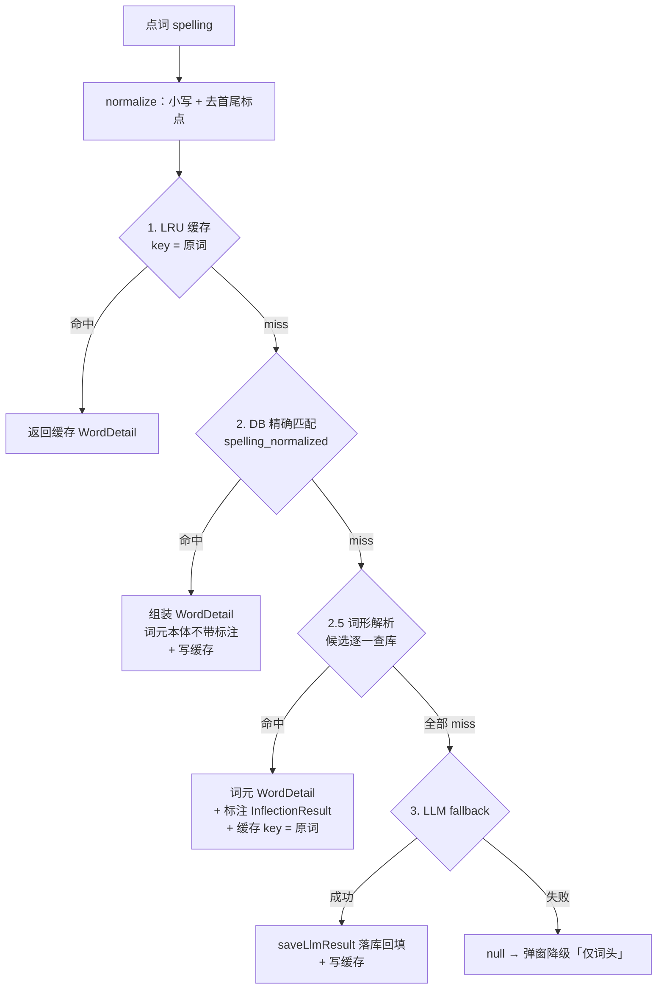

# 查词链路与词形解析

## 主题定位

阅读页点词 → 查词弹窗展示的完整数据链路：**4 层查词链**（LRU 缓存 → 本地 DB 精确匹配 → 词形解析（2.5 层）→ LLM fallback）。本主题覆盖查词链路的组装与并发、词形解析层的组件与规则、标注语义、防误判机制、LRU 缓存形态，以及正确性实测结论。

**为什么需要词形解析层**：词库词集来自 oewn（见 [import_words.md](import_words.md)），其 `forms` 表只含**不规则变化**（`children`、`went`、`better` 是独立词条）；规则词形（`homes`、`boxes`、`played`、`bigger`）不在库，点选必然精确 miss。若不解析，每次都会走 LLM fallback——慢且费 token。运行时词形解析把「点 `homes`」还原到库内词条 `home`（ETL 侧扩充词形是明确排除的方案）。

## 业务功能线

用户在阅读页点词，查词弹窗经历 loading → 回填词条详情。按命中路径不同，弹窗展示有差异：

| 命中路径 | 词头 | 标注行 | 音标 / 义项 / 生词本 |
|---|---|---|---|
| LRU / DB 精确命中（`home`） | 词条 `spellingDisplay` | 无 | 词条自身 |
| 词形解析命中（`homes`） | **原词 `homes`**（不再替换为词元） | 新增一行 muted 小字：`homes 是 home 的复数形式` | 词元 `home` 的音标与义项；加生词本存词元 id（home），复习页显示标准词元 |
| LLM fallback | 不变（原有降级「仅词头」语义保持） | 无 | — |

**发音**：读词头原词（`playWordPronunciation` 用弹窗当前 `word`，零改动）——`homes` 按文章语境发音，不读词元 `home`。

## 技术实现线

### 查词链（4 层）

入口 `WordRepositoryImpl.lookupWord`（`lib/data/repository/word_repository_impl.dart`），`_lookupSemaphore`（permits = 3）限制并发查词数，超出排队等待。`findLocal`（手动加词入口）复用**同一解析链**（无 LLM 段），两处行为一致。

- **LRU**：手动实现（`_LruCache`），容量 50，访问序淘汰最旧；key 统一为 normalize 后的原词。
- **DB 精确**：`word` + `word_sense` + `example_sentence` 三表组装 `WordDetail`（见 [database-schema.md](database-schema.md) 表结构），并查询生词本状态。
- **LLM fallback**：外部注入回调 → `saveLlmResult` 落库回填 → 写缓存；失败返回 null，弹窗走既有降级。
- **并发**：信号量（`_Semaphore`）permits = 3，对照 Kotlin `Semaphore(3)`；解析层在信号量作用域内执行。

### 词形解析层组件（2.5 层）

`lib/domain/inflection/inflection_resolver.dart`——纯函数规则引擎，无 IO、无第三方依赖：

| 组件 | 职责 |
|---|---|
| `InflectionResolver`（abstract interface） | `resolveCandidates(spelling) → List<InflectionCandidate>` |
| `RuleInflectionResolver` | 规则实现：后缀剥离 + 拼写还原，每条规则生成多个候选，由调用方按序查库命中第一个 |
| `InflectionCandidate { lemma, type }` | 候选词元 + 变化类型 |
| `InflectionType` | `sForm` / `pastTense` / `presentParticiple` / `comparative` / `superlative` |
| `_exceptions`（例外表） | 规则无法还原的高频拉丁/外来复数，硬编码 47 条纯数据映射（实测驱动） |
| `_sExceptionWords`（早退词表） | 本身是词元的例外词，入口早退不解析（11 个） |

**规则覆盖**（入口小写兜底句首词 `Homes→home`，长度下限 ≥3 作用于输入拼写）：

| 变化类型 | 规则与示例 |
|---|---|
| 复数 / 三单 -s | 去 s：homes→home、plays→play |
| 复数 -es | 去 es / +e 还原 / 双写还原：boxes→box、caches→cache、quizzes→quiz |
| 复数 -ies | 去 ies 还原 y / 去 s / -nies→-ney：cities→city、movies→movie、monies→money |
| 复数 -ves | 还原 f/fe / 去 s / -vis：halves→half、wives→wife、pelves→pelvis |
| 希腊 -is→-es | base+is 候选：analyses→analysis、crises→crisis、bases→basis（base 候选先行命中） |
| 拉丁 -ex/-ix→-ices | stem+ex/ix 候选：indices→index、matrices→matrix |
| 拉丁 -nx→-nges | g→x 替换：larynges→larynx |
| -men→-man | 复合词守卫（词长 ≥5 且词干 ≥2）：airmen→airman；men/women 特例守卫外直接生成 |
| 过去式 -ed | 去 ed / 双写还原 / +e / -ck→-c：played→play、stopped→stop、iced→ice、panicked→panic |
| 过去式 -ied | 去 d（-ie 词族先行）/ ied→y / 去 ed：died→die、studied→study、alibied→alibi |
| 现在分词 -ing | ying→ie 先行 / 去 ing / 双写还原 / +e / →y / -ck→-c：dying→die、going→go、running→run、making→make、crying→cry、panicking→panic |
| 比较级 -er/-ier | 去 er / 双写 / +e / ier→y：larger→large、bigger→big、happier→happy |
| 最高级 -est/-iest | 去 est / 双写 / +e / iest→y：nicest→nice、biggest→big、happiest→happy |
| 例外表 | children→child、data→datum、phenomena→phenomenon、cacti→cactus、chapeaux→chapeau、staves→staff 等 47 条（拉丁 2 变格 -um→-a / 1 变格 -a→-ae / -us→-i、法语 -eau→-eaux、核心不规则复数） |

候选允许含噪声（如 `changes→changx`、`speciman`）——**无害**，仓储层查库存在性会过滤，全部 miss 才落 LLM。

### 标注语义（sForm 按 POS 区分）

`sForm` 同时覆盖名词复数与动词第三人称单数（后缀规则相同），区分依赖**词元义项词性**——标注文案在仓储层 `_inflectionNote` 生成（组装完词条后）：

| 引擎类型 | 词元义项词性 | 文案 |
|---|---|---|
| sForm | 仅名词 | `homes 是 home 的复数形式` |
| sForm | 仅动词 | `cries 是 cry 的第三人称单数形式` |
| sForm | 名词 + 动词都有 | `plays 是 play 的复数形式 / 第三人称单数` |
| pastTense | — | `played 是 play 的过去式/过去分词` |
| presentParticiple | — | `going 是 go 的现在分词` |
| comparative / superlative | — | `bigger 是 big 的比较级` / `biggest 是 big 的最高级` |

**词性首段匹配**：`partOfSpeech.split('.').first` 取首段（`'n.'/'n'` → 名词；`'v.'/'vi.'/'vt.'/'v'` → 动词）。`adv.`（含 v）、`pron.`（含 n）、`det./pron.`、`r.`（WordNet 副词）等不以 n/v 开头，不会误判。

### 防误判机制（六层）

1. **精确匹配先行**——`news`、`bus`、`was` 等库内词直接命中，到不了解析器
2. **候选必须真实存在于 DB**——仓储层逐候选 `getByNormalized`，`has→[ha]` 因 ha 不在库而不解析
3. **规则词尾例外**——`-ss`/`-us`/`-is`/`-as` 结尾不去 s（bus、gas、his、analysis 保护）
4. **入口早退词表**（`_sExceptionWords`）——本身是词元的 11 个词不解析：mass noun `news`；单复数同形拉丁借词 `series`/`species`；comparative 的 er 分支误判源 `her`/`per`（→h/he/p）；`always`；-men 孪生真词黑名单 `carmen`/`germen`/`somen`/`humen`/`yumen`（其 -man 孪生 german/soman/human/yuman/carman 是库内不同真词，查库滤除失效，只能显式早退）
5. **长度与复合词守卫**——长度下限 ≥3（保护 `a`）；`-men→-man` 要求词长 ≥5 且词干 ≥2（挡 `omen→oman`、`amen→aman`，Oman 国名在库）
6. **例外表**——规则无法还原的拉丁/外来复数直接给出词元（放在候选最前）

### 数据流与缓存

- 命中时：`_resolveInflection` 返回第一个查库命中的 `(WordRow, candidate)` → `_buildWordDetail` 构建词条 → `copyWith(inflection: InflectionResult(lemma, type, note))` → **缓存 key = 原词**（第二次查零 IO，命中返回同一实例）
- 词元本体（DB 精确命中）**不带** inflection 标注——标注只描述「原词是词元的什么变化」

## 数据模型线

- `WordDetail` 新增可选字段 `inflection: InflectionResult?`；`copyWith` 仅支持 `inflection` 参数（该标注仅展示用途，不参与业务逻辑）
- `InflectionResult { lemma, type, note }`——note 即 UI 展示的标注文案
- `WordSheetData.inflectionNote: String?`——查词弹窗数据模型承载，null 不渲染标注行
- **无新增表、无数据库迁移**（asset 库与真机库结构不变）

## 正确性实测（还原率）

手写规则正确性用数据实测（`test/domain/inflection/accuracy_probe_test.dart`），不靠拍脑袋：

- **语料**：stardict.db `exchange` 字段（变形标注，如 `homes` 行 `1:s3/0:home`）抽取 `(词形, 词元, 类型)` 对——仅测试期使用，不引入运行时依赖；过滤规则：全字母词、排除小写后以 ss/us/is/as 结尾的条目（库内为地名/人名噪声）
- **指标**：还原率 = 解析器候选命中（lemma 与 type 均匹配）对数 / 总对数；阈值 ≥95%
- **实测结论：99.4%**（语料 134,764 对，miss 838）。miss 构成：pastTense 556（`ate→eat`、`arose→arise` 等不规则动词——库内独立词条，精确命中先行覆盖，无害）、sForm 255（`Agneaux`、`bassi` 等生僻外来复数）、presentParticiple 26、superlative 1（`furthest→far`）。规则与例外表到此定稿

## 错误处理与边界

| 场景 | 处理 |
|------|------|
| 全部候选 miss | 走 LLM fallback（现有链路不变）；LLM 失败 → 既有「仅词头」降级不变 |
| 解析器输入边界 | 纯函数无 IO 不 throw；空串 / 超长词 / 单字符返回空候选 |
| 早退词 / 例外词 | 入口早退不解析 → 精确匹配或 LLM 兜底（如 `somen` 等罕见词走 LLM） |
| 解析命中但词元义项为空 | 返回词条（无义项时弹窗仅词头），与库内词条行为一致 |
| 并发超限 | 信号量排队等待（permits = 3），不拒绝不丢弃 |

## 测试覆盖

- `test/domain/inflection/inflection_resolver_test.dart`：表驱动 80+ 正向用例（各规则族）+ 反例（-ss/-us/-is/-as 例外、早退词表、单字符）+ `-men→-man` 守卫专组（omen/amen 词长守卫、孪生真词早退）
- `test/domain/inflection/accuracy_probe_test.dart`：stardict exchange 语料还原率 ≥95%（实测 99.4%），低于阈值失败并打印 TOP 失败样本供人工判读
- `test/data/repository/repositories_test.dart`（WordRepository 词形解析组）：homes 解析命中不触发 LLM + 标注正确；plays 名词+动词标注并列；cries 仅动词标注三单；解析命中进 LRU（key=原词，第二次 identical）；全部候选 miss 走 LLM；findLocal 行为一致；词元本体不带标注；adv./pron. 词性不误判回归
- `test/domain/model/models_test.dart`：`WordDetail.inflection` 默认 null、copyWith 设置与保留
- UI 层无专项测试（数据路径全覆盖；UI 仅为「词头 = 原词 + 标注行」两行改动，由既有查词弹窗测试回归）
