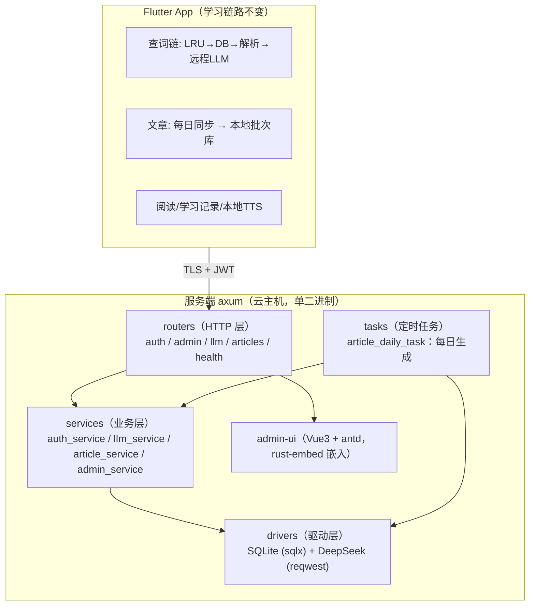
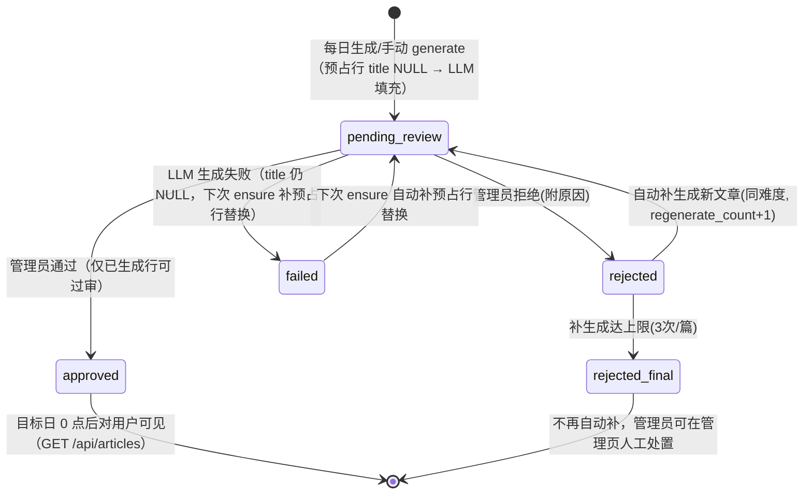

# Contexta Server 架构

> 主题文档：服务端（`impl/server/`）整体架构——分层、模块职责、文章管道状态机、统一 envelope 与 error_code。按实际实现描述（任务 T1-T14 后的最终状态）。

## 1. 系统总览

Contexta Server 是 Contexta 英语学习 App 的 Rust 服务端：DeepSeek API key 只存在于服务端；查词兜底与手动加词（LLM 领域端点）服务端化；**文章生成管道整体移服务端**（每日定时生成 + 管理员审核 + App 每日同步），App 本地数据库退化为服务端前的缓存层。



- **技术栈**：axum 0.8 + tokio + sqlx 0.9（SQLite，WAL + foreign_keys ON）+ reqwest（DeepSeek）+ jsonwebtoken（HS256）+ argon2（admin 密码）
- **分层纪律**：`handler → services → drivers` 单向依赖，后台任务走 `tasks/` 模块（进程内定时器，无需外部 cron）
- **单二进制部署**：admin-ui 构建产物（`admin-ui/dist/`）经 rust-embed 编译进二进制，`cargo build --release` 产出唯一 `server` 可执行文件

## 2. 目录结构与模块职责

```
impl/server/
  src/
    main.rs                    # 启动：配置 → 连库 → 迁移 → seed admin → 路由 → 每日任务 → 优雅监听
    lib.rs                     # 库目标：AppState（pool + cfg）+ build_router / make_router
    config.rs                  # 环境变量配置加载（含 JWT_SECRET>=32 硬校验）
    response.rs                # 统一 envelope（ApiResult / ApiErrorBody）+ AppError → HTTP 映射
    db.rs                      # SQLite 连接池（WAL/FK）+ 001 幂等迁移 + seed_admin（argon2）
    extractors.rs              # AuthUser（App JWT + 封禁 + 会话校验）/ AdminAuth（role: admin）
    jwt.rs                     # App token 30 天 / Admin token 12 小时；iat == issued_at 精确校验
    static.rs                  # 管理页静态资源（rust-embed 嵌入 admin-ui/dist/）
    drivers/
      deepseek.rs              # DeepSeek HTTP 客户端 + call_with_retry（重试/退避/预算）
    llm/
      parser.rs                # XML 解析（WordLookup / ArticleDraft，容错兜底对齐 Dart 版）
    prompts.rs + prompts/*.txt # prompt 模板（include_str! 编译进二进制）
    routers/                   # HTTP 层：health / auth / admin / llm / articles（见 §3）
    services/                  # 业务层：auth / llm（含配额/缓存）/ article（状态机）/ admin
    tasks/
      article_daily_task.rs    # 每日生成任务（启动补漏 + 定时循环，见 §5.1）
  tests/                       # 集成测试（内存 SQLite + httpmock mock DeepSeek）
  admin-ui/                    # Vue3 + antd 管理页（dist 随二进制发布）
  deploy/                      # contexta-server.service + config.yaml.example
  docs/                        # 本目录（架构 / 部署运维）
  tool/
    db_version                 # 0 = 服务端从未发布生产
    migrations/001-init.sql    # 0→1 init（开发期活版本，全部 IF NOT EXISTS 幂等）
```

| 模块 | 职责要点 |
|---|---|
| `config.rs` | 全部配置走环境变量（无 config.yaml 读取路径；`deploy/config.yaml.example` 是部署时的 env 对照清单）。`JWT_SECRET`（≥32 字符）与 `DEEPSEEK_API_KEY` 缺失即启动失败 |
| `response.rs` | 成功 `{code:0, data}`；失败 `{code, message, error_code}`，HTTP 状态码表达错误类别（见 §6 错误语义） |
| `jwt.rs` | App token 30 天（`APP_TOKEN_TTL_SECS`），admin token **12 小时**（`ADMIN_TOKEN_TTL_SECS`，缩短暴露窗口）。App token 的 `iat` 与会话行 `issued_at`（毫秒）**精确相等**——重登刷新 issued_at 即令旧 token 失效 |
| `extractors.rs` | `AuthUser`：校验 JWT → 先封禁后会话（被封禁得 403 BANNED 而非 401 EVICTED）→ `iat == issued_at` 精确匹配，行不存在（登出/被挤掉）或落后一律 401 EVICTED。`AdminAuth`：校验 admin JWT + `role == "admin"` |
| `drivers/deepseek.rs` | `call_with_retry`：共 4 次尝试；429 用 Retry-After（clamp 0..30s），其余可恢复错误指数退避 `2s × 2^(n-1)` 封顶 10s；总时长受 `LLM_TIMEOUT_SECS` 预算约束（退避等待也计入） |
| `llm/parser.rs` | 解析 DeepSeek XML 响应为 `WordLookup` / `ArticleDraft`；容错兜底（非法根标签/缺失字段/多义项）与 Dart 版逐用例对齐 |
| `services/llm_service.rs` | 查词链：normalize 小写 → 缓存命中直返（TTL 30 天、上限 5000 条，超限删最旧）→ 配额检查（真实 LLM 调用计数）→ DeepSeek → 解析 → 写缓存 → 记 usage_log。文章内容生成复用同一驱动 |
| `services/article_service.rs` | 文章生成/审核状态机、每日预算、预占行模式（见 §5） |
| `services/auth_service.rs` | 免密直登（预留 `code` 字段）：phone + deviceId → 自动注册 → 会话表挤掉至多 2 个活跃会话（按 issued_at 最旧让位）→ 签发 token |
| `tasks/article_daily_task.rs` | 启动补漏（今天+明天）+ 每日定时生成循环（见 §5.1） |

## 3. 端点清单（以 routers 为准）

### 应用端（App JWT 保护，`AuthUser`）

| 方法 | 路径 | 说明 |
|---|---|---|
| POST | `/api/auth/login` | 手机号直登（`{phone, deviceId, code?}`）→ `{token, expires_at}`；自动注册、2 设备挤掉 |
| POST | `/api/auth/logout` | 删除会话行 |
| GET | `/api/auth/me` | 返回 `{phone}` |
| POST | `/api/llm/word-lookup` | `{word}` → WordDetail JSON（查词兜底） |
| GET | `/api/articles/today` | 当天全部已过审文章（Local 时区当天） |
| GET | `/api/articles?date=YYYY-MM-DD` | 指定日期（无 date 默认今日）；**非法日期 → 200 空结果**（不 400） |

### 管理员（admin JWT 保护，`AdminAuth`）

| 方法 | 路径 | 说明 |
|---|---|---|
| POST | `/api/admin/login` | username + password（argon2）→ `{token}` |
| GET | `/api/admin/users` | 用户列表（含每人今日查词次数） |
| POST | `/api/admin/users/{phone}/ban` | 封禁（附 reason） |
| POST | `/api/admin/users/{phone}/unban` | 解封 |
| PUT | `/api/admin/users/{phone}/quota` | 查词配额覆盖（null 清覆盖回落全局默认） |
| GET | `/api/admin/usage` | 今日用量汇总（按 phone × endpoint 聚合 token） |
| GET | `/api/admin/articles` | 文章列表（date/status 可选过滤，白名单列 + 全绑参） |
| GET | `/api/admin/articles/{id}` | 文章详情（段落已拆分英文/中文） |
| POST | `/api/admin/articles/{id}/approve` | 审核通过（仅已生成行可过审） |
| POST | `/api/admin/articles/{id}/reject` | 审核拒绝（附原因；内部触发补生成，达上限 → rejected_final） |
| POST | `/api/admin/articles/generate` | 手动补生成 `{date}`（严格零填充 ISO 校验，非法 → 400 BAD_PARAM） |

### 无鉴权

| 方法 | 路径 | 说明 |
|---|---|---|
| GET | `/api/health` | `{status: "ok"}` |
| GET | `/admin`、`/admin/{*path}` | 管理页 SPA（静态资源回退 index.html） |

## 4. 数据模型（SQLite，7 张表）

`tool/migrations/001-init.sql`（0→1 init，开发期活版本，结构变更并入不递增版本；服务端未发布，`tool/db_version` = 0）：

- **长期实体**：`users`（phone PK，status/banned_reason/quota_word_daily）；`admin_user`（username PK，argon2 哈希）；`article`（id PK，target_date/difficulty/content_category/order_index/title/status/reject_reason/regenerate_count/tokens；索引 `(target_date, difficulty, status)`、`(status)`）
- **关系实体**：`device_sessions`（phone + device_id，UNIQUE(phone, device_id)，issued_at/last_active_at）
- **流水账/缓存**：`usage_log`（phone 可空=任务侧，endpoint: word_lookup/article_generate，token/latency；索引 `(phone, created_at)`、`(created_at)`）；`word_lookup_cache`（word PK，result_json，created_at）
- **段落表**：`article_paragraph`（article_id FK CASCADE，order_index，text；UNIQUE(article_id, order_index)）——段落以 **`英文|||中文` 单列**存储（1NF 考量，下发时拆分，不存第二列）

迁移由 `db::migrate` 执行：按 `;` 切分 001-init.sql 逐条执行（全部 `IF NOT EXISTS` 幂等，空库/遗留库重复执行均安全）+ `schema_migration_log` 记一条 0→1。连接池 `max_connections = 5`、WAL、`foreign_keys = true`。

## 5. 文章管道

### 5.1 每日生成任务（tasks）

- **启动补漏**：`spawn_daily_task` 先 `run_startup_fill`——生成今天 + 明天各 15 篇（3 难度 × 5 篇；今天/明天由同一次 `Local::now()` 推导，消除跨午夜窗口非相邻日期）。失败只记日志，不阻止 serve
- **每日循环**：等待到 `DAILY_GENERATE_HOUR`（默认 3）点**整点后 1 分钟（03:01，避开整点边界）**触发，生成明天并顺带补今天（幂等、补漏成本为零）。DeepSeekClient 每轮经工厂构造（构造失败记 error + sleep 1h 重试，任务不永久停摆）；单次生成失败只记日志，循环继续
- **时区**：全部用 `Local`（服务器本地时区）——部署要求 `Asia/Shanghai`

### 5.2 预占行模式（生成，T8 审查重构）

生成 = 短事务预留 → 锁外 LLM 填充，写锁不跨 LLM 调用（LLM 单篇最长 90s，持锁会整批阻塞所有写入方）：

1. **阶段 1（BEGIN IMMEDIATE 短事务，毫秒级）**：每难度统计非终结行（pending_review/approved），缺失槽位 INSERT 预占行（title NULL、status=pending_review、regenerate_count 定值）→ COMMIT。并发 ensure 的先到者 COMMIT 后，后到者计数看到预占行即跳过——幂等成立
2. **阶段 2（无锁）**：逐行填充 `pending_review AND title IS NULL` 的预占行（LLM → 条件 UPDATE title/tokens + 段落 INSERT 短事务）；单篇失败标记 `failed`（title 仍 NULL）并继续其余行，下次 ensure 自动补预占行替换——单篇失败不回滚整批
- **每日预算**：当日（本地语义零点起）`article` 行数 ≥ `ARTICLE_BUDGET_DAILY`（默认 100）→ 400 QUOTA_EXCEEDED，防补生成循环烧钱。预占行即消耗预算（预留时校验）
- **幂等**：同一 (target_date, difficulty) 非终结行数已达 5 则跳过；已填充/已终结/不存在的行生成时幂等跳过
- **题材轮换**：难度→分类映射（LOW: DAILY_CONVERSATION/SCENE_DESCRIPTION/SIMPLE_STORY；MEDIUM: NEWS/EXPOSITORY/ARGUMENTATIVE/PERSONAL_ESSAY；HIGH: ACADEMIC_EXCERPT/DEBATE_SPEECH/LEGAL_DOCUMENT/ART_CRITICISM/CLASSIC_NOVEL_EXCERPT），以 target_date 的 epoch 天数（`num_days_from_ce`）为种子轮转，相邻两天同 order 不碰撞；补生成以 `order + regen + 1` 轮换到下一分类

### 5.3 审核状态机



- **守卫**：仅 `pending_review AND title IS NOT NULL`（已生成行）可 approve/reject——预占/生成中/失败行（title NULL）返回 404，杜绝「approved + 空标题」与误拒浪费补生成
- **并发安全**：reject 在同一短事务内完成「旧行 → rejected + 未达上限时 INSERT 补生成预占行（regenerate_count = 父行 +1）」；并发双 reject 的 UPDATE 条件不命中（affected=0）→ 不建补生成行
- **降级决策**：补生成填充失败不上抛——拒绝语义在事务内已完成，客户端重试会撞 404；新行保持 failed 由下次 ensure 自愈替换
- **审核时限**：文章前一天生成，管理员白天审核；目标日 0 点起已过审文章对用户可见，未审完的难度当天缺文章（用户读历史，不阻塞阅读）

### 5.4 下发语义

- 仅 `approved` 可见，排序 `ORDER BY difficulty, order_index`——**difficulty 为字典序**（ASCII 排序：HIGH < LOW < MEDIUM），App 端按自然难度序（LOW/MEDIUM/HIGH）自行整理
- 段落 JSON 契约：`[{order_index, english_text, chinese_translation}]` 嵌套对象（路由层组装，service 内部保持 `(order, en, zh)` 元组形态）
- 需 JWT（防匿名批量爬取）；与用户查词配额无关（文章是全局池）

## 6. 统一 envelope 与错误语义

### 6.1 envelope 格式

- 成功：HTTP 200，`{"code": 0, "data": ...}`
- 失败：`{"code": <HTTP 状态码或业务码>, "message": "...", "error_code": "<细分错误码>"}`

### 6.2 error_code 表（App 端映射回现有异常类型）

| HTTP | body `code` | `error_code` | 触发场景 | App 端行为 |
|---|---|---|---|---|
| 400 | 400 | `BAD_PARAM` | 参数错误（空 word、非法 generate 日期、登录缺 phone/deviceId） | 参数错误提示 |
| 400 | 40001 | `QUOTA_EXCEEDED` | 查词每日配额超限 / 文章日预算超限 | 提示配额 |
| 401 | 401 | `TOKEN_EXPIRED` | 未带/无效/过期 token；admin 用户名或密码错误（不区分，防枚举） | 重新登录 |
| 401 | 401 | `EVICTED` | 会话被挤掉/登出（`iat != issued_at`） | 提示已在其他设备登录 |
| 403 | 403 | `BANNED` | 账号被封禁 | 提示账号被封禁 |
| 404 | 404 | `NOT_FOUND` | 资源不存在 / 不可过审行（title NULL）/ 重复审核 | 资源不存在 |
| 500 | 500 | `LLM_FATAL` | DeepSeek 不可恢复错误 | → 现有 `LlmFatalException` |
| 500 | 500 | `PIPELINE_BLOCKING` | 管道阻塞：响应不可解析、缓存损坏、prompt 模板缺失 | → 现有异常 |
| 500 | 500 | `INTERNAL` | 未预期内部错误（记 error 日志） | 内部错误 |
| 502 | 502 | `LLM_RECOVERABLE_EXHAUSTED` | 可恢复错误重试 4 次仍失败 | → 现有 `LlmRecoverableExhaustedException` |
| 504 | 504 | `LLM_TIMEOUT` | 总预算超时 | → 现有 `LlmTimeoutException` |

### 6.3 成本控制

1. **查词缓存**：同词跨用户共享（小写 normalize），命中不调 LLM、不扣配额；TTL 30 天、上限 5000 条（超限删最旧）
2. **用户查词配额**：全局默认 200 次/天（`WORD_QUOTA_DAILY`），按用户可覆盖（admin 接口）；只计真实 LLM 调用（usage_log 计数）
3. **文章日预算**：100 篇/天（`ARTICLE_BUDGET_DAILY`）
4. **用量账本**：`usage_log` 记每次调用（查词 + 文章生成）的 token 数与延迟，管理页按单价换算成本

## 7. 时区语义（部署关键约束）

`services::today_start_millis`（今日零点毫秒）与每日任务全部基于 **`chrono::Local`（服务器本地时区）**——查词配额日界、文章日预算、用量统计、`/api/articles/today` 的"今天"均为同一口径。部署时必须 `timedatectl set-timezone Asia/Shanghai`，否则配额日界与任务触发时刻偏移。

## 8. 认证与账号体系

- **应用端**：phone = 账号，免密直登（beta 简化，预留 `code` 字段升级验证码）；`device_sessions` 为权威状态（非 JWT 黑名单）——每 phone 最多 2 个活跃会话，登录时按 `issued_at` 最旧挤掉；`issued_at` 按 phone 全局单调（MAX+1，防时钟回拨/同毫秒并发）
- **管理员**：独立 `admin_user` 表（argon2）+ 独立登录端点 → admin JWT（claim `role: admin`），`/api/admin/*` 在 extractor 层校验 role；admin token TTL **12 小时**（App token 30 天）
- **封禁**：extractor 层先查封禁再查会话——被封禁账号得 403 BANNED
