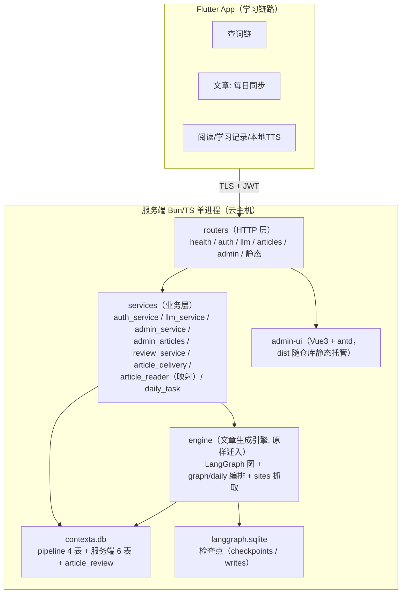
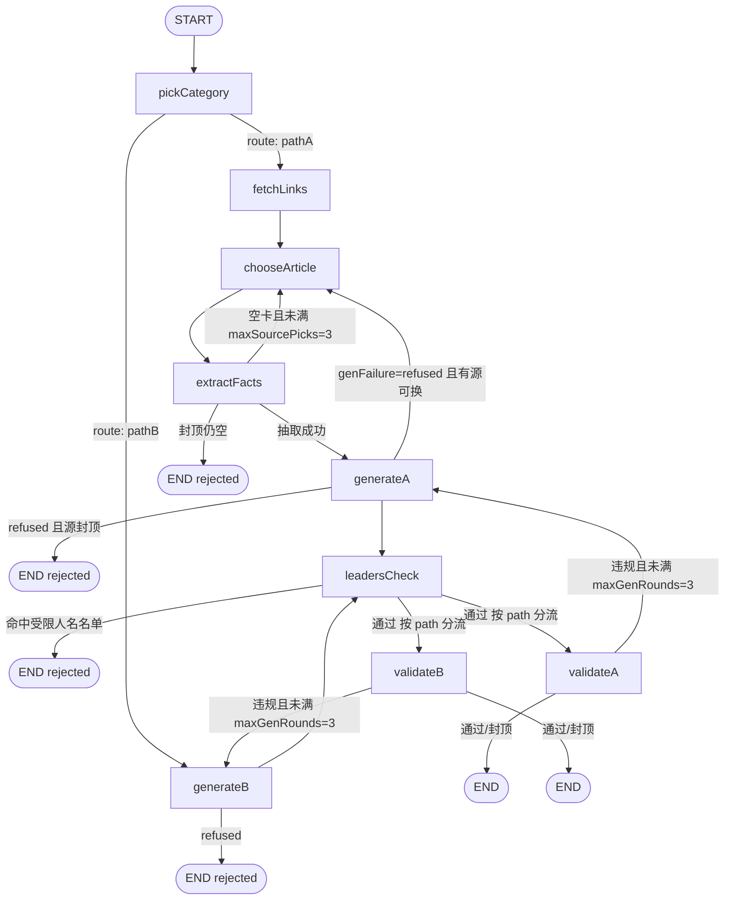
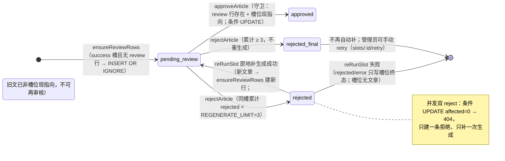
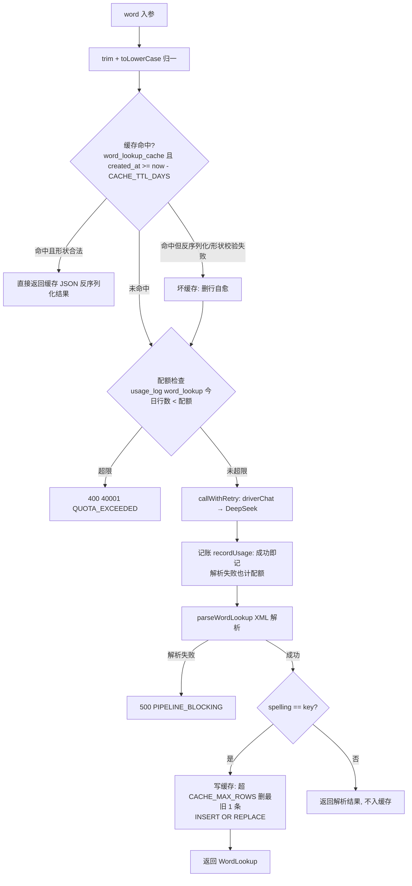

# Contexta Server 架构

> 主题文档：服务端（`impl/server/`）整体架构——Bun/TS 单进程、分层与依赖纪律、文章生成引擎（LangGraph）、文章数据流（生成 → 审核 → 下发）、查词网关、认证、统一 envelope 与 error_code、每日任务、时区纪律。按当前实现描述（Rust → TS 迁移完成后的最终状态）；已废弃/遗留组件（Rust `*.rs`、`deploy/config.yaml.example`、`tool/migrations/001-init.sql`）仅在相关章节注明状态，不作为现行设计。

## 1. 系统总览

Contexta Server 是 Contexta 英语学习 App 的服务端：LLM API key 只存在于服务端；提供查词兜底（含配额/缓存/用量账本）、**每日文章生成管道整体迁入服务端**（LangGraph 图 + 管理员审核 + App 每日同步），App 本地数据库退化为服务端前的缓存层。



- **技术栈**：Bun（运行时）+ Hono 4（HTTP 框架）+ `bun:sqlite`（业务库与检查点库，WAL）+ jsonwebtoken（HS256）+ zod（配置/协议校验）+ LangChain/LangGraph（`@langchain/core`、`@langchain/langgraph`、`@langchain/langgraph-checkpoint`、`@langchain/openai`）+ turndown（正文 HTML → Markdown）。无编译步骤：TS 直接由 Bun 执行，`tsc --noEmit` 仅作类型校验。
- **单进程**：HTTP 服务与后台任务（每日生成循环）同进程；进程退出即任务结束，无外部 cron。
- **双数据库**：
  - `contexta.db`（`DB_PATH`）：引擎 4 表（`article_batches`/`articles`/`article_paragraphs`/`batch_slots`）+ 服务端 6 表（`users`/`admin_user`/`device_sessions`/`usage_log`/`word_lookup_cache`/`article_delivery`）+ `article_review`。与旧 Rust 结构唯一差异：**`articles` 不再有 `embedding` 列**（pipeline 本地向量检索未迁移）。
  - `langgraph.sqlite`（`CHECKPOINT_PATH`）：LangGraph 检查点独立存储（`checkpoints`/`writes` 两表），与业务库无关——用于进程崩溃/网络故障后的断点续跑。
- **引擎迁入差异**：pipeline 原样迁入（Rust 时期的 fetch 改 Bun.WebView、sqlx 改 bun:sqlite、axum 改 Hono），运行期唯一差异 = embedding 列移除。

## 2. 目录结构与分层纪律

```
impl/server/
  src/
    main.ts                    # 组装：配置+时区硬闸 → 建库建表 → seed admin → 日志初始化 → 路由 → serve → 每日窗口任务 → 优雅退出
    config.ts                  # 服务端配置（zod）：PORT/双 JWT 密钥/配额/缓存/每日生成窗口/LLM 端点字段
    db.ts                      # 服务端表 DDL（幂等）+ seedAdminIfNeeded + verifyAdminPassword
    auth.ts                    # AuthUser / AdminAuth 认证提取器（封禁/会话/角色校验）
    middleware/
      require_auth.ts          # 登录保护中间件：requireAppAuth / requireAdminAuth（认证结果入上下文）
      request_logger.ts        # 请求访问日志：app/web 通道分流（身份从上下文读，自身不认证）
    jwt.ts                     # App/Admin 双密钥签发与验证；App token 30 天 / Admin 12 小时；iat == issued_at 毫秒精确
    time.ts                    # todayStartMillis（配置时区当地零点）
    response.ts                # 统一 envelope：ApiError/ok/errorBody + attachErrorHandler
    routers/                   # HTTP 层（每路由文件自带 attachErrorHandler）
    services/                  # 业务层（见 §2 表）
    llm/                       # 查词网关侧：retry.ts（callWithRetry/driverChat）、prompt.ts、lookup_parser.ts
    engine/                    # 文章生成引擎（整体迁入，见 §4.1）
    tasks/                     # 遗留 Rust 定时任务（.rs，已被 services/daily_task.ts 取代）
  admin-ui/                    # Vue3 + antd 管理页（dist 随仓库提交，服务端静态托管）
  deploy/                      # contexta-server.service（Bun 版）；config.yaml.example 已废弃
  docs/                        # 本目录（架构 / 部署运维）
  tool/                        # import-data.ts（数据导入）、db_version（=0，从未发布生产）、migrations/（遗留）
  tests/                       # bun test 集成/单元测试（顶层 *.test.ts + tests/engine/*.test.ts
```

| 模块 | 职责要点 |
|---|---|
| `config.ts` | `loadServerConfig`（服务端）+ `engine/config.ts` 的 `loadConfig`（引擎）从同一份环境变量读取（`.env` 由 Bun 自动加载）；**双 JWT 密钥**：`JWT_SECRET`（App 端签发/验证）与 `ADMIN_JWT_SECRET`（Admin 端），均 <32 字符、`LLM_API_KEY` 缺失、`TIMEZONE` 非法即启动失败 |
| `db.ts` | `ensureServerSchema` 幂等建服务端表（逐条 `CREATE TABLE IF NOT EXISTS`）；`seedAdminIfNeeded`（argon2id 哈希，仅在无该 username 行时插入，不覆盖既有密码）；`verifyAdminPassword` |
| `auth.ts` | `resolveAuthUser`：JWT 校验 → **先封禁后会话**（被封禁得 403 BANNED 而非 401 EVICTED）→ `iat == issued_at` 毫秒精确匹配，行不存在（登出/被挤掉）或落后一律 401 EVICTED。`resolveAdminAuth`：JWT + `role == "admin"`。二者为认证提取器，调用方是 middleware（非 handler） |
| `middleware/require_auth.ts` | 登录保护中间件：`requireAppAuth`（App 接口，`appUser` 写上下文）/ `requireAdminAuth`（`/api/admin/*`，login 公开放行，`adminUser` 写上下文）；认证失败抛原 ApiError（401 TOKEN_EXPIRED/EVICTED、403 BANNED），经子路由 attachErrorHandler 统一响应 |
| `middleware/request_logger.ts` | 请求访问日志：挂主 app 首位覆盖所有请求；身份从上下文读取（appUser 打码手机号 / adminUser `admin:名` / anon），自身不认证不读库；`/admin*` 与 `/api/admin/*` → web 通道（admin-*.log，stdout 品红），其余 → app 通道（app-*.log，stdout 青色） |
| `jwt.ts` | **双密钥**：App token 用 `appJwtSecret`（JWT_SECRET 签发/验证），admin token 用 `adminJwtSecret`——两端令牌互不通用（交叉使用验签失败 401 TOKEN_EXPIRED）。App token 30 天（`APP_TOKEN_TTL_SECS`），admin token **12 小时**（`ADMIN_TOKEN_TTL_SECS`）。App token 的 `iat` 为**毫秒**（`authService.login` 落库的实际 `issued_at`），jsonwebtoken 原样透传无舍入——秒粒度无法区分同秒内两次重登 |
| `response.ts` | `ApiError(status, code, errorCode)` + 各类工厂（badRequest/quotaExceeded/unauthorized/banned/notFound/llmFatal/llmRecoverableExhausted/llmTimeout/pipelineBlocking/internal）；`attachErrorHandler` 挂到每个子路由（子路由错误就地消化，顶层 onError 只兜 main 侧） |
| `services/auth_service.ts` | 免密直登：自动注册 → 封禁检查 → 会话行 `issued_at` 全局单调（`MAX(issued_at)+1` 与墙钟取大，防时钟回拨，单条 INSERT…SELECT 原子）→ 挤掉保留最新 2 条 → token 的 iat 取落库 `issued_at` |
| `services/llm_service.ts` | 查词网关：缓存 → 配额 → LLM → 解析 → 记账 → 写缓存（见 §5） |
| `services/admin_service.ts` | 管理侧：admin 登录 / 用户列表（含今日查词次数）/ 封禁解封 / 配额覆盖 / 今日用量汇总 |
| `services/admin_articles.ts` | 管理端文章读取与编辑：文章列表（分页/排序/状态过滤/统计）、文章详情（含槽位历史）、审核期内容编辑（`PUT /api/admin/articles/:id`） |
| `services/article_delivery.ts` | **投放**：`deliverArticles`——同日冻结 / id 游标 / 未读补位 / 配额截断 / 投放记账（见 §4.3） |
| `services/article_reader.ts` | **投放映射**：`toArticleForApp` 单篇文章 → App 契约字段（snake_case 精确；order_index/regenerate_count 派生；source_url 绝不下发），选文逻辑见 article_delivery（§4.3） |
| `services/review_service.ts` | 审核状态机：`ensureReviewRows` / `approveArticle` / `rejectArticle` / `reRunSlot` / `retrySlot`（见 §4.2） |
| `services/daily_task.ts` | 每日任务编排：窗口触发（`DAILY_GENERATE_WINDOW`）+ 当天三态判定 + 单步失败仅记日志（见 §8） |
| `engine/` | 文章生成引擎（见 §4.1），对外入口：`generateArticle`、`generateDailyArticles`、`retryFailedSlots` |

### 2.1 依赖纪律

- **单向分层**：`routers → services → engine`。router 只做参数提取/组包；**鉴权由 middleware 前置拦截**（require_auth 挂各路由工厂内，认证结果经上下文供 handler 读取）；service 承载业务语义；engine 只负责"生成一篇文章/一天文章"。
- **业务库读写边界**：引擎侧库读写只允许 `engine/db.ts`（batch_slots/articles/article_paragraphs 的 select/insert/update）；服务端表读写只允许 `src/db.ts` 与各 services（users/device_sessions/usage_log/word_lookup_cache/article_review）。其余模块拿到的是 `Database` 连接但不得直接散布 SQL（models 集中在两处）。
- **引擎"纯编排"纪律**：LangGraph 图节点（`graph/nodes.ts`）是 `state → 部分 state 更新` 的纯函数，依赖（LLM、站点映射、随机数、URL 去重集合）经闭包注入；图上不碰业务库。持久化只发生在编排层（`graph/daily.ts` 的 `persistSlot`）与跨模块的 `review_service.reRunSlot`——生成结果三态（success/rejected/error）返回后由编排方决定落库形态。检查点库（langgraph.sqlite）由 `BunSqliteCheckpointer` 独占，业务代码不读它（replay/retry 工具除外）。
- **测试 seam**：`llm_service.wordLookup(db, cfg, chat, ...)` 的 `chat`、`review_service` 的 `gen`、`DailyTask` 的全部分支（genDaily/retryFailed/reRun/ensure/now/sleep）均可注入假实现——生产用引擎真实现，测试不真调 LLM。

## 3. 数据模型（contexta.db，引擎 4 表 + 服务端 6 表 + article_review）

建表由启动时 `ensureSchema(db)`（引擎）+ `ensureServerSchema(db)`（服务端）幂等执行（全部 `CREATE TABLE IF NOT EXISTS` / `CREATE INDEX IF NOT EXISTS`；**代码无 ALTER TABLE**——新结构对新建库生效，存量库演进见 config-and-deploy §5.2）。引擎索引随 `DROP TABLE` 语义处理（删除重建日库时），服务端索引随建表重建。`tool/migrations/001-init.sql` 为 Rust 时期遗留（结构已并入上述两个 ensure 函数，不再执行）；`tool/db_version` = 0（从未发布生产）。

### 3.1 引擎 4 表（pipeline 原样，`articles` 无 embedding 列）

| 表 | 关键列 | 约束/索引 |
|---|---|---|
| `article_batches` | id PK、run_date **UNIQUE**、total_slots、completed_slots、failed_slots、status CHECK(`running`/`completed`/`completed_with_failures`/`failed`)、started_at、finished_at | 一天一批；收口后 status 不再为 running |
| `articles` | id PK、batch_id FK、run_date、difficulty（LOW/MEDIUM/HIGH）、category（11 类）、path CHECK(`A`/`B`)、source_url 可空、title_en、title_zh、paragraph_count、markdown_path、thread_id、created_at | 索引 `(source_url)`、`(created_at)`、`(batch_id)`；**无 embedding 列** |
| `article_paragraphs` | id PK、article_id FK、paragraph_index（0 基）、text_en、text_zh | UNIQUE(article_id, paragraph_index) |
| `batch_slots` | id PK、batch_id FK、run_date、slot_index、difficulty、thread_id、status CHECK(`pending`/`success`/`rejected`/`error`)、attempts（图内实际生成轮数）、article_id FK 可空、updated_at | UNIQUE(batch_id, slot_index)；索引 `(run_date)`；**槽位 = 文章占位**：每天 3 难度 × 5 篇 = 15 槽 |

### 3.2 服务端 6 表 + article_review

| 表 | 关键列 | 约束/索引 |
|---|---|---|
| `users` | phone **PK**、status（normal/banned）、banned_reason、quota_word_daily（null=全局默认）、quota_article_daily（null=全局默认 `DEFAULT_ARTICLE_QUOTA_DAILY=5`）、created_at、updated_at | 长期实体；时间戳 Unix millis INTEGER |
| `admin_user` | username **PK**、password_hash（argon2id）、created_at、updated_at | — |
| `device_sessions` | id PK、phone、device_id、issued_at、last_active_at | UNIQUE(phone, device_id)；索引 `(phone)` |
| `usage_log` | id PK、phone（可空=服务端任务侧）、endpoint（word_lookup/…）、prompt_tokens、completion_tokens、latency_ms、created_at | 索引 `(phone, created_at)`、`(created_at)`；流水账 |
| `word_lookup_cache` | word **PK**、result_json、created_at | 跨用户共享缓存 |
| `article_delivery` | id PK、phone、device_id、difficulty、article_id FK articles、delivery_date（yyyy-MM-dd TEXT）、created_at | UNIQUE(phone, article_id)——同一 phone（含重装换 device_id / 多设备）**永不重复投同一篇**（学习者是"人"，不读相同文章）；索引 `(phone, difficulty, delivery_date)`（同日冻结查询）；流水账（投放账本） |
| `article_review` | id PK、article_id **UNIQUE** FK articles、slot_id FK batch_slots、status CHECK(`pending_review`/`approved`/`rejected`/`rejected_final`)、reject_reason、reviewed_by、reviewed_at、created_at、updated_at | 索引 `(slot_id)`；**审核行挂在文章上**，一篇文章至多一行（重生成产生新文章 → 新行，旧行保留为历史） |

### 3.3 langgraph.sqlite（检查点）

`checkpoints`（thread_id、checkpoint_ns、checkpoint_id、checkpoint_type、checkpoint BLOB、metadata_type、metadata BLOB、parent_checkpoint_id；PK(thread_id, checkpoint_ns, checkpoint_id)）+ `writes`（thread_id、checkpoint_ns、checkpoint_id、task_id、idx、channel、value_type、value BLOB；PK 五列）。每个 superstep 落一条，恢复时按 `(thread_id, checkpoint_ns)` 取最新 checkpoint + pendingWrites 重建状态。`BunSqliteCheckpointer` 为 Bun 原生实现（官方 sqlite checkpointer 依赖 better-sqlite3，Bun 兼容 shim 缺 `pragma` API，实测不可用）。支持 `deleteThreadsByDate(runDate)`（`daily-<date>-%` 前缀，新旧格式一并命中，供 delete-daily 清理）。

## 4. 文章数据流

### 4.1 生成：每日任务 → generateDailyArticles → 槽位/文章/段落

**每日计划**：`DEFAULT_DAILY_PLAN` = LOW 5 / MEDIUM 5 / HIGH 5，共 15 槽/天；`plan` 可注入调整（0 = 该难度不生成），展开序 LOW → MEDIUM → HIGH，slot 0 起。

**`generateDailyArticles`（`engine/graph/daily.ts`）幂等语义**——同一天重复调用：

1. 批次已**收口**（status ≠ running）→ 不重跑、不调 LLM，从库重建结果直接返回；
2. 批次**存在但 running**（中断/收口前崩溃）→ 修复：只补跑该批已有的 pending 槽位（终态槽位不重复生成，不掺入今日计划）；
3. 批次**不存在** → `createBatchAndSlots` 单事务原子创建批次 + 全部槽位行；
4. 执行：`runPool(槽位任务, SLOT_CONCURRENCY=5)` 并发——每槽 `generateArticle`（见下）→ `persistSlot`（success：写 `output/md` 到 `OUTPUT_DIR` → `insertArticleWithParagraphs` 事务入库 → 槽位 success + attempts 写回；rejected/error：只写槽位终态）→ 全部结束 `finalizeBatch`（全 success → completed，否则 completed_with_failures + 计数 + finished_at）。单槽异常不拖垮整批（rejected 兜底补成 error 落库）。

**引擎生成图（`engine/graph/`，LangGraph 单篇文章）**：



- **pickCategory**（无 LLM）：按难度从类别池均匀随机（`rng` 注入）：LOW=daily_conversation/scene_description/simple_story；MEDIUM=news/expository/argumentative/personal_essay；HIGH=academic_abstract/debate_speech/legal_document/art_criticism。
- **path 判定**（`resolvePath`）：类别在 `sites.config.ts` 配置了 ≥1 个权威站点 → A（有来源支撑），否则 B（模型知识）。当前配置：chinadaily + tencent 覆盖 `news`/`expository`，其余 9 类走 B。
- **A 链**：`fetchLinks`（随机洗牌本站点抓列表：Bun.WebView 打开首页 → 等待 JS 懒加载列表 → 锚点快照 → 站点规则抽取 `ArticleLink[]`；新鲜度过滤 = 近 5 天已用 URL + 本轮共享 `usedUrls` 去重；标题含受限人名直接出局）→ `chooseArticle`（随机选篇 → 抓正文 HTML → 清洗 → turndown 转 Markdown（截断 12000 字符）→ 正文含受限人名则跳过换篇；命中即从候选列表移出）→ `extractFacts`（LLM 结构化抽取 FactSheet：who/what/when/where/why/how/keyNumbers/keyNames；全空 = 源不适配 → 回 chooseArticle 换篇，封顶 3 次 → rejected）→ `generateA`。
- **B 链**：直接 `generateB`（模型知识生成，prompt 含"基于可靠常识、虚构需标明、禁用受限人名"）。
- **generate（A/B 共用实现）**：结构化输出 `GenerateResult` 判别联合——`{"type":"article", titleEn, titleZh, paragraphs:[{en,zh}]}` 或 `{"type":"cannot_write"}`（模型判主题违规/缺依据 → 业务拒答，A 回边换源、B 短路）。其余失败（空白/结构畸形/技术错误）→ error 终态，不做自动重试（手动重试见 replay）。prompt 注入：素材（pathA 的来源标题/URL/正文/事实卡）+ 上轮违规反馈（lastViolations）+ 近 5 天成功文章标题（避免雷同选题）。
- **leadersCheck**（无 LLM，A/B 共用）：文章标题/段落中英全文子串匹配 `const/coreLeaders.ts` 受限人名名单，命中即整篇 rejected（设计：名单为硬限制，不回边重试）。
- **validate（A/B 共用实现）**：pathA = 红线判官（带来源全文 + 事实卡 + 当前日期做归因）+ 事实一致性判官（文章事实不得超出来源范围，含"未使用来源"检测）；pathB = 从严红线判官（无来源可核对，凭据类内容从严）。违规 → 记录 violations 并回 generate 带反馈重写，封顶 3 轮（含首试）→ rejected。
- **瞬时故障**：节点级 retryPolicy maxAttempts=3 兜底（网络抖动/5xx）；持续失败由 `generateArticle` 统一收为 outcome=error，不抛出。
- **断点续跑**：`generateArticle` 接受 `threadId`——同 threadId 重复调用 = 从 langgraph.sqlite 恢复续跑（已完成的节点不重跑，fetch/LLM 调用不浪费）；缺省自动生成 `manual-<date>-<ts>`。

**三态结果**（`ArticleResult`）：`success`（含 GeneratedArticle：runDate/difficulty/category/path/sourceUrl?/factSheet?/titleEn/titleZh/paragraphs）/ `rejected`（reason，业务性拒绝：名单命中/源不适配/校验封顶/模型拒答）/ `error`（message，技术失败：网络、欠费、站点全挂、结构不合规）。**引擎承诺三态返回不抛**（checkpoint 路径不可用的构造异常除外，调用方兜底）。

### 4.2 审核：ensureReviewRows / approve / reject / reRunSlot

审核行（`article_review`）与引擎槽位（`batch_slots`）职责分离：槽位记"生成成败"（pending/success/rejected/error），审核行记"管理处置"（pending_review/approved/rejected/rejected_final）。重生成 = 槽位换指向新文章（新 article_id），旧文章审核行保留为历史（history）。



- **ensureReviewRows(db)**：`INSERT OR IGNORE INTO article_review (article_id, slot_id) SELECT s.article_id, s.id FROM batch_slots s WHERE s.status='success' AND s.article_id IS NOT NULL AND NOT EXISTS (...)`——为所有 success 槽位且无 review 行的文章补 pending_review（article_id UNIQUE 幂等，重跑不新增）。每日任务收尾与 `POST /api/admin/articles/generate` 后调用；引擎生成不建。
- **approveArticle(db, articleId, admin)**：守卫 = 有 review 行 **并且** 该文章是 review.slot_id 所指向槽位的**当前**文章（重生成后旧文不再是当前文章，不可再审核）→ 条件 UPDATE `pending_review → approved`（reviewed_by/reviewed_at=datetime('now')）；守卫不满足或 affected=0（重复审核）→ 404 NOT_FOUND。
- **rejectArticle(ctx, articleId, reason, admin)**：同守卫；先数同槽累计 rejected 行数 n（不含本次），`n >= REGENERATE_LIMIT`（默认 3）→ 写 `rejected_final`（不重生成）；否则写 `rejected` 并 **await `reRunSlot(ctx, slot, n+1)`** 原地补生成（同步等待——管理端在响应里看到补生成结果）。并发双 reject：条件 UPDATE affected=0 → 404，只建一条拒绝、只补一次。补生成本身失败不上抛（拒绝语义已在事务内完成），新行保持失败槽位由每日任务 retry 自愈。
- **reRunSlot(ctx, slotRow, genSeq)**：槽位级进程锁（`slotLocks`，同槽 reRun 串行；键 = batch_slots.id）；threadId = `daily-<runDate>-<slotIndex>-r<genSeq>`；去重上下文与引擎 daily 一致（`listRecentArticles(db, runDate, 5, 60)` → recentTitles + recentUsedUrls）；调 `generateArticle` → success：写 md → `insertArticleWithParagraphs` → `writeSlotResult(success)` → `ensureReviewRows`（新文补 pending_review）；rejected/error：只写槽位终态；finally `finalizeBatch`。checkpoint 不可用的构造异常兜底按 error 落槽位终态（拒绝语义已完成，抛给管理端会被误读为"拒绝失败"）。
- **retrySlot(ctx, slotRow)**：error/rejected 槽位（无文章）的重跑入口——`reRunSlot(ctx, slotRow, Date.now())`（genSeq=唯一时间戳：引擎同 threadId 已有终态 checkpoint 时按断点契约返回旧结果，恒定 genSeq=1 会令"重复点重试"静默 no-op）。
- **文章列表**（管理端 `GET /api/admin/articles`）：文章视角分页列表——每行 = `articles` 一行（含被补生成替换的旧文）。参数：`start_date`/`end_date`（按 `run_date`，缺省当天，`start > end` → 400）、`status`（`pending_review`/`approved`/`rejected`——rejected **聚合** `rejected_final`；缺省全部）、`page`（1 起）/`page_size`（15/30/45，缺省 15）、`sort_by`/`sort_dir`（白名单：`run_date`/`slot_index`/`created_at`/`difficulty`/`category`/`status`/`paragraph_count`/`id`，非法值 → 400；默认 `run_date DESC, slot_index ASC, id DESC`）。行：`{id, run_date, difficulty, category, title_en, title_zh, source_url, paragraph_count, created_at(生成时间 UTC), slot_id, slot_index, is_current(是否任一槽位现指向——旧文 false，审核守卫同规), review{id, status, reject_reason, reviewed_by, reviewed_at} | null}`。响应：`{items, total, stats{total, pending_review, approved, rejected}}`——`stats` 口径 = 时间段内全量（**不含** status 筛选，管理端统计条据此展示并可点击筛选）。旧槽位视图（每槽行）已废弃：无 review 行的异常文章经 LEFT JOIN 兜 null（slot 信息缺失）。
- **文章详情**（`GET /api/admin/articles/:id`）：articles 全行 + 段落（order_index 1 起）+ review 行 + 所属槽位 + **history**（同槽全部 review 行倒序——槽位时间线数据源，旧列表行不再携带 history）。槽位以 review.slot_id 为准（旧文被补生成换指后仍归属其槽位）；无 review 行回退 batch_slots.article_id。
- **审核期内容编辑**（`PUT /api/admin/articles/:id`）：守卫 = 有 review 行 + status=pending_review + 文章是槽位现指向；校验 title 非空、段落 ≥1、每段 en/zh 至少一个非空；单事务 UPDATE title_en（+paragraph_count）→ DELETE 旧段落 → 按请求序重插（paragraph_index 0 基）。title_zh 不动。
- **手动补生成**（`POST /api/admin/articles/generate {date}`）：严格 ISO 校验（`2026-2-30`、`2026-13-01` 等 → 400 BAD_PARAM，回格式化全等判定）→ 引擎 `generateDailyArticles` → `ensureReviewRows` 收口（引擎不建审核行）。

### 4.3 投放（delivery）：冻结 / 游标 / 未读补位 + App 契约映射

`deliverArticles(db, {phone, deviceId, difficulty, count, nowMs, timeZone})`（`GET /api/articles/delivery?difficulty=LOW|MEDIUM|HIGH&count=3`，需 App JWT；旧 `GET /api/articles/today` / `GET /api/articles?date=` 已删除）。**账户(phone)×难度**独立游标与账本；同日冻结按账号（任意设备）语义——学习者学的是"人"，同一天换设备读到同一批。

**参数**：`difficulty` 必填（LOW/MEDIUM/HIGH，非法 → 400 BAD_PARAM）；`count` 必填（≥1 整数，缺失/非整/<1 → 400 BAD_PARAM）。

**配额**：`count` 与 `users.quota_article_daily`（null → `DEFAULT_ARTICLE_QUOTA_DAILY=5`）取 min——**超配额不报错**，服务端静默截断（App 无需感知配额值）；`quota_article_daily` 为 0/负时按 0 截断（当日该难度无交付），服务端 `Math.max(quota, 0)` 行为。

**响应**：`{code:0, data:{delivery_date, articles:[ArticleForApp...]}}`；`delivery_date` = 配置时区"今天"（`localDate(timeZone, now)`），App 本地批次键（generatedOn）取此值。

**投放算法（单事务：冻结检查 + 选文 + 记账同快照，并发同日双请求由 SQLite 写锁串行化，后到者命中冻结返回首者结果）**：

1. **同日冻结**：`article_delivery` 中已有 `(phone, difficulty, delivery_date=今天)` 交付 → 原样返回该批（order_index = 账本 id 顺序），**不推进游标、不新增记账**——同日第二次调用（含 08:00 生成窗口前后跨越）拿同一批；
2. **游标**：`delivered` = 该 phone×难度已投全部 article_id 集合；`cursor = max(delivered)`（无则 0）；
3. **新文章池**：`id > cursor` 的已过审文章按 **id DESC 最新优先** 取 count 篇——"新到旧"阅读顺序；
4. **未读补位**：仍不足 → 从从未交付过的文章按 **id ASC 最早优先** 补足（跳过已投/已选，**永不重复已读**）；仍不足 → 返回剩余（可为空）；
5. **记账**：仅**非空交付**写入账本（`device_id` 记录**当天首次交付**的设备——同日重复/换设备返回冻结集、不新增记录，不参与冻结/游标/已读逻辑）；**空交付不记账** → 同日（如 08:00 生成窗口后）再次调用可投到新文章。`UNIQUE(phone, article_id)` 保护：正常路径补位已排除全部已交付，插入冲突 = 算法 bug，用普通 INSERT 大声失败（不静默 OR IGNORE）。

**已过审谓词**（与旧 `?date=` 端点同）：`batch_slots.status='success' AND article_review.status='approved'` 且文章为槽位现指向——writeSlotResult 的 `article_id = COALESCE(?, article_id)` 从不清空，reRun 失败会残留旧 approved 文章，**只投 success 槽位的最新文章**。

**8 点前语义**：投放池 = 截至调用时刻已过审文章（含前一日窗口生成的篇章）。App 在每日 08:00 生成窗口（默认 08:00-08:15）**前**同步 → 拿到当时最新过审文章并因**同日冻结**锁定为当日批次；窗口内新生成的文章 id 更大，进入后续交付（最早次日新投，或经未读补位）——即"窗口前同步 = 当日批次取窗口前文章，同日窗口后再次同步不升级"。空交付因不记账不受此限（窗口后再次调用即可命中新文章）。

**不变式**：参数化查询（无注入面）；无匹配行 → 200 空数组（空交付，非 404）。

**App 契约字段**（键名精确 snake_case，App DTO 按此解析）：

```jsonc
{
  "id": 123,
  "target_date": "2026-08-28",          // = articles.run_date（生成日；批次 generatedOn 取 delivery_date，非此值）
  "difficulty": "MEDIUM",
  "content_category": "news",
  "order_index": 3,                      // 派生：交付内序号 1..N（非全局槽位序）
  "title": "…",
  "status": "SUCCESS",                   // 恒为 SUCCESS（只投 approved，无需透传真实状态）
  "regenerate_count": 2,                 // 派生：该槽位 article_review 累计 rejected 行数
  "paragraphs": [                        // order_index 1 起（存储层 paragraph_index 0 基 +1）
    { "order_index": 1, "english_text": "…", "chinese_translation": "…" }
  ]
}
```

- `source_url` 属服务端内部审计字段，**绝不下发**（App 契约不含——"事实源不展示给用户"由不加字段保证，管理端可见）。
- 文章为全局共享池（同难度文章同池）；**各账号独立游标/账本**（同池文章，各人进度不同）；下发需 JWT（防匿名批量爬取），与用户查词配额无关。

## 5. 查词网关链（`POST /api/llm/word-lookup`）

`llmService.wordLookup(db, cfg, chat, phone, word, timeZone)`，链路（与旧 Rust 语义逐条对齐）：



- **缓存**：跨用户共享（同词同结果）；TTL `CACHE_TTL_DAYS`（默认 30 天）、容量 `CACHE_MAX_ROWS`（默认 5000，超限删最旧 1 条）；命中不调 LLM、不扣配额。缓存 JSON 需形状校验（`spelling: string` + `senses: array`，对齐 Rust serde 严格反序列化）——损坏/形状不符的缓存删行自愈、继续走 LLM，不会把畸形对象返回给 App。
- **配额**：`users.quota_word_daily`（可空 → 全局默认 `WORD_QUOTA_DAILY=200`）；计数 = `usage_log` 中 `endpoint='word_lookup'` 且 `created_at >= 今日零点` 的行数（与用量报表同一口径）。只计真实 LLM 调用。
- **LLM 调用**（`callWithRetry` + `driverChat`，`src/llm/retry.ts`）：OpenAI 兼容 `POST {base}/chat/completions`，404 回退 `/v1/chat/completions`；`LLM_TIMEOUT_SECS`（默认 90s）为硬预算——共 4 次尝试，每次尝试以剩余预算截断（Promise.race 超时），退避等待也计入预算。错误分类：400/401/403 → fatal；429 → recoverable（Retry-After clamp 0..30s）；5xx/其余 → recoverable（指数退避 2s×2^(n-1) 封顶 10s）；发送层失败（网络/超时/DNS/TLS）→ timeout。第 4 次仍失败：timeout → 504 LLM_TIMEOUT，recoverable → 502 LLM_RECOVERABLE_EXHAUSTED，fatal → 500 LLM_FATAL。可选出站代理 `PROXY_URL`（Bun fetch proxy 选项）。
- **记账**：LLM 调用成功即记（无论解析/写缓存结果如何）——堵住"易触发解析失败的词无限烧钱"的绕过口；记账失败仅降级告警（磁盘满/写繁忙时不得把成功查词变 500）。
- **写缓存守卫**：仅当 `parsed.spelling.toLowerCase() === key` 才写——LLM 输出变体/屈折时不入缓存，否则请求词 key 会向全用户共享缓存写入错误词条。
- **解析**：`parseWordLookup`（`src/llm/lookup_parser.ts`，XML 容错解析）：`<spelling>`/`<phonetic>`/`<sense>`/`<example>`（en/zh），无 `<spelling>` 时用首个成对根标签兜底（仅接受单词/词组形态）；**1-3 个 sense、每 sense 0-2 个 example 是 prompt 指令**（`src/llm/prompt.ts` 的 system 提示），parser 不强制封顶——按实际出现次数全量解析；字段映射为 App JSON 契约（`senses[].part_of_speech/chinese_meaning/english_definition/examples[].sentence_en/sentence_zh/is_primary`，order_index 1 起）。prompt 内嵌（`src/llm/prompt.ts`，对齐 001-init.sql 种子原文；TS 无 prompt 表——管理端不可编辑）。
- **查词 LLM 端点复用**：与文章生成共用同一 `LLM_API_KEY`/`LLM_BASE_URL`/`LLM_MODEL`；文章引擎走 `@langchain/openai` ChatOpenAI（jsonMode 结构化输出, maxTokens=64000——deepseek 思考模型 reasoning_content 消耗输出预算，缺省上限过小会吃光预算导致解析失败），查词走轻量 `driverChat`（无 LangChain）。

## 6. 认证与账号体系

- **应用端**：phone = 账号，免密直登（beta 简化，保留 `code` 字段预留升级验证码）。`device_sessions` 为权威状态（非 JWT 黑名单）：每 phone 至多 **2 个**活跃会话（登录按 issued_at 最新的 2 条保留，旧会话被挤掉）；`issued_at` 按 phone 全局单调（`MAX(issued_at)+1` 与墙钟取大，防时钟回拨/同毫秒并发），token 的 `iat` = 实际落库的 `issued_at`（毫秒）——**重登即令旧 token 失效**（`resolveAuthUser` 精确比对 `iat == issued_at`，不等 → 401 EVICTED）。
- **管理员**：独立 `admin_user` 表（argon2id）+ `POST /api/admin/login` → admin JWT（claim `role: admin`，TTL **12 小时**——App token 30 天）；`/api/admin/*` 在提取器层校验 role（非 admin → 401 TOKEN_EXPIRED，不区分用户名或密码错误——防枚举）。
- **封禁**：`resolveAuthUser` 先查封禁再查会话——被封禁账号得 **403 BANNED**（而非 401 EVICTED）；login 同样封禁检查先于会话（被封禁账号登录也得 403 BANNED）。
- **seed**：`ADMIN_INIT_PASSWORD` 设置时启动 seed `admin`（无该 username 行才插入，重复调用不覆盖既有密码）；seed 后可移出 .env。

## 7. 统一 envelope 与 error_code 表

- 成功：HTTP 200，`{"code": 0, "data": ...}`
- 失败：`{"code": <HTTP 状态码或业务码>, "message": "...", "error_code": "<细分错误码>"}`
- 实现：`ApiError(status, code, errorCode)`；各子路由 `attachErrorHandler`——handler 内 throw ApiError → 对应 status + errorBody；`SyntaxError`（畸形 JSON body）→ 400 BAD_PARAM；其余异常 → 500 INTERNAL（记 error 日志）。

| HTTP | body `code` | `error_code` | 触发场景 | 说明 |
|---|---|---|---|---|
| 400 | 400 | `BAD_PARAM` | 空 word、登录缺 phone/device_id、非法 generate 日期、delivery 参数非法（difficulty/count）、编辑校验失败、畸形 JSON body | |
| 400 | 40001 | `QUOTA_EXCEEDED` | 查词每日配额超限 | App 提示配额 |
| 401 | 401 | `TOKEN_EXPIRED` | 未带/无效/过期 token；admin 用户名或密码错误（不区分，防枚举）；admin role 不符 | 重新登录 |
| 401 | 401 | `EVICTED` | 会话被挤掉/登出（`iat != issued_at`） | 提示已在其他设备登录 |
| 403 | 403 | `BANNED` | 账号被封禁（先封禁后会话；login 同） | 提示账号被封禁 |
| 404 | 404 | `NOT_FOUND` | 资源不存在 / 不可过审行（守卫不满足/重复审核）/ 不可编辑文章 / 槽位不存在 | |
| 500 | 500 | `LLM_FATAL` | LLM 不可恢复错误（400/401/403） | |
| 500 | 500 | `PIPELINE_BLOCKING` | 管道阻塞：查词响应不可解析（XML 解析失败） | |
| 500 | 500 | `INTERNAL` | 未预期内部错误（记 error 日志） | |
| 502 | 502 | `LLM_RECOVERABLE_EXHAUSTED` | 可恢复错误重试 4 次仍失败 | |
| 504 | 504 | `LLM_TIMEOUT` | 总预算超时（含退避等待计入） | |

**成本控制**：查词缓存（跨用户共享，命中不花钱不扣配额）→ 用户配额（`WORD_QUOTA_DAILY` 全局默认，可 per-user 覆盖；只计真实 LLM 调用）→ 用量账本（`usage_log` 记每次调用 token/延迟，管理页按单价换算）。

## 8. 每日任务（`services/daily_task.ts`）

`main.ts` 启动后 `new DailyTask(ctx).start()`（单个后台 void promise，进程退出即结束；**启动不生成任何文章**）：

- **loop（每日窗口循环）**：无限循环——
  1. 不在窗口内（`isInDailyWindow` 为 false：未到/已过）→ `nextTriggerWaitMs` 睡到**下一窗口开始**（未到→今天窗口开始；**已过→明天窗口开始 = 当天错过，不补不重试**）；
  2. 进入窗口（`DAILY_GENERATE_WINDOW`，默认 `08:00-08:15`，配置时区当日 `[start, end]` 闭区间）→ **三态判定当天**（日期 = 触发时刻当天 `localDate`）：
     - 批次**已收口**（`isDailyBatchFinished`：`article_batches.status != 'running'`，含 completed_with_failures/failed）→ **跳过**（不再触碰，error 槽位留人工）；
     - **没执行过**（无批次行）或**执行中**（status='running'，含中断未收口）→ `runFill(当天)`；
  3. 处理完成 → 清理 7 天前旧日志（`cleanupOldLogs`）→ `nextTriggerWaitMs` 睡到**明日**窗口开始（今日窗口已开启，必然落到明天——避免窗口内立即重复触发）。
- **runFill(date)** 四步（单步失败仅记日志，不中断后续）：

  1. `generateDailyArticles({runDate})` —— 引擎幂等生成（新批次 / 只补 running 批次的 pending / 已收口直接返回）；
  2. `retryFailedSlots({runDate})` —— pending 槽位经 checkpointer 分派：无终态 → **resume**（同 thread_id 续跑）；有终态（崩溃间隙：图跑完但没落库）→ **sync**（终态同步回 DB，不重跑）；error/rejected 不处理；
  3. **error 槽位每槽一次补跑**：`retrySlot`（thread = `daily-<date>-<slot>-r<Date.now()>`，唯一 genSeq 避免命中"同 threadId 终态 checkpoint 复用"契约；与审核重生成共用槽位级进程锁）；补跑仍失败留 error，err 不抛；
  4. `ensureReviewRows` —— 补齐 success 槽位的待审行。

- **并发安全**：槽位级进程锁（`review_service` `slotLocks`）保证同槽 error 补跑与审核重生成串行；引擎侧 `usedUrls` 集合在单轮 run 内共享，拦截并行槽位重复抓取同一来源。
- **手动补生成**：`POST /api/admin/articles/generate`（严格 ISO 校验）走同一 `generateDailyArticles` + `ensureReviewRows`；错过的日期 / 收口批次的 error 槽位均可手动处置。
- **日志**：`[daily-task]` 编排行与引擎 `log()` 同走 `logs/daily-<日期>.log`（7 天轮转，只进文件不进 stdout）；服务侧日志见 `services/server_log.ts`——通用日志 `logs/server-<日期>.log`（+stdout），请求访问日志按面分流 `logs/app-<日期>.log`（手机端）/ `logs/admin-<日期>.log`（管理端），stdout 中 app 青色 / admin 品红。

## 9. 时区纪律（部署关键约束）

- **唯一口径**：所有日期语义（"今天"、日志时间戳、日志文件名、查词配额日界、文章日界）以 `TIMEZONE`（IANA 名，如 `Asia/Shanghai`）为准，统一经 `engine/utils/time.ts` 的 `localDate`/`localTimestamp`/`localFileStamp` + `src/time.ts` 的 `todayStartMillis` 取数——不用 UTC 时刻，避免跨日边界漂移。
- **硬闸**：`assertSystemTimezone`（`engine/config.ts`）——启动时校验配置 `TIMEZONE` 与系统当前时区（`Intl.DateTimeFormat().resolvedOptions().timeZone`）**必须一致**，不一致直接 `process.exit(1)` 拒绝运行（不悄悄偏移）。部署必须 `timedatectl set-timezone Asia/Shanghai` 且 .env `TIMEZONE=Asia/Shanghai`。
- **窗口判定**：`isInDailyWindow` / `nextTriggerWaitMs` 用系统本地 Date 构造（`todayStartMillis + startMin*60000` 起步）——时区硬闸保证系统时区 = 配置时区，本地构造即配置时区时刻；日志文件名/行时间戳同口径。

## 10. 端点清单（以 routers 为准）

### 应用端（App JWT，`resolveAuthUser`）

| 方法 | 路径 | 说明 |
|---|---|---|
| POST | `/api/auth/login` | `{phone, device_id, code?}` → `{token, expires_at}`；自动注册、2 设备挤掉 |
| POST | `/api/auth/logout` | 删除会话行（body `{device_id?}`） |
| GET | `/api/auth/me` | `{phone}` |
| POST | `/api/llm/word-lookup` | `{word}` → WordDetail（查词兜底，§5 链路） |
| GET | `/api/articles/delivery?difficulty=LOW\|MEDIUM\|HIGH&count=3` | 文章投放（同日冻结 / 游标 / 未读补位 / 配额截断 / 记账；见 §4.3） |

### 管理员（admin JWT，`resolveAdminAuth`）

| 方法 | 路径 | 说明 |
|---|---|---|
| POST | `/api/admin/login` | `{username, password}`（argon2id）→ `{token}` |
| GET | `/api/admin/users` | 用户列表（含每人今日查词次数 `today_word_lookups`） |
| POST | `/api/admin/users/:phone/ban` | 封禁（body `{reason?}`） |
| POST | `/api/admin/users/:phone/unban` | 解封 |
| PUT | `/api/admin/users/:phone/quota` | 查词配额覆盖（`{word_daily}`，null 清覆盖回落全局默认） |
| GET | `/api/admin/usage` | 今日用量汇总（按 `(phone, endpoint)` 聚合次数/token） |
| GET | `/api/admin/articles` | 槽位审核视图（`?date=&status=`，缺省今日） |
| GET | `/api/admin/articles/:id` | 文章详情（全行列 + 段落 order_index 1 起 + review + 所属槽位；含 `source_url`） |
| PUT | `/api/admin/articles/:id` | 审核期编辑（`{title, paragraphs:[{english_text, chinese_translation}]}`；守卫见 §4.2） |
| POST | `/api/admin/articles/:id/approve` | 审核通过（守卫 + 条件 UPDATE） |
| POST | `/api/admin/articles/:id/reject` | 审核拒绝（`{reason?}`；未达上限 → 同步 await 补生成） |
| POST | `/api/admin/slots/:id/retry` | 槽位重跑（error/rejected 槽位；`retrySlot`） |
| POST | `/api/admin/articles/generate` | 手动补生成 `{date}`（严格 ISO 校验，非法 400） |

### 无鉴权

| 方法 | 路径 | 说明 |
|---|---|---|
| GET | `/api/health` | `{status: "ok"}`（探活） |
| GET | `/admin`、`/admin/{*path}` | 管理页 SPA（`admin-ui/dist` 静态托管 + 回退 index.html；dist 缺失时 200 占位文案） |
| GET | `/` | 302 重定向 → `/admin` |
